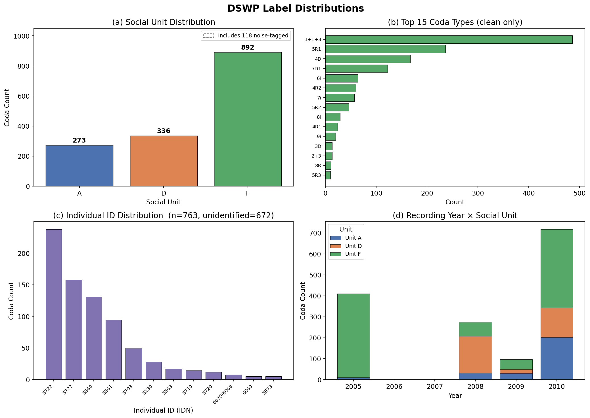
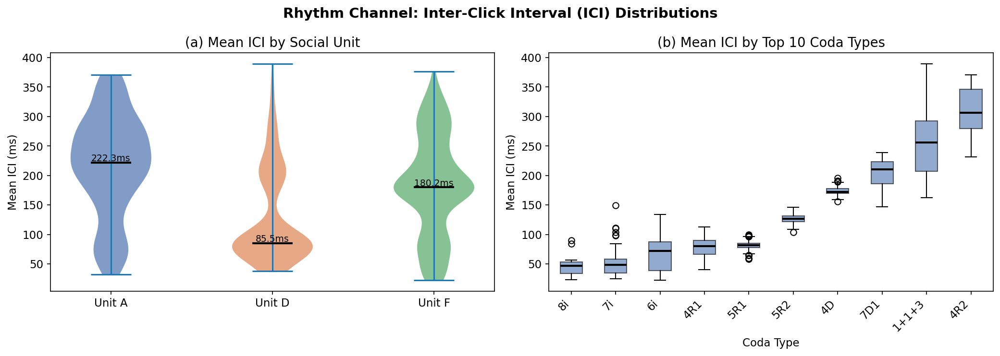
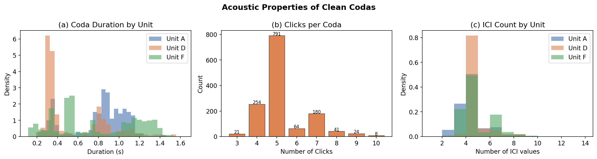
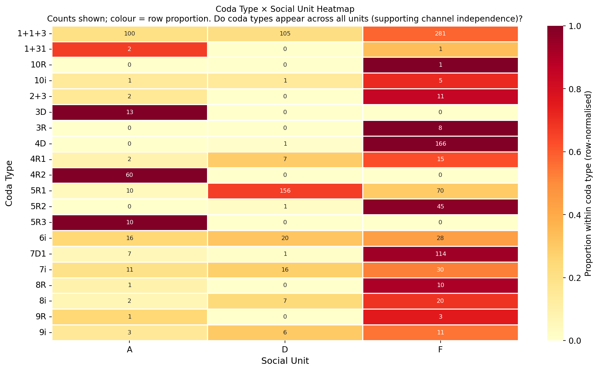
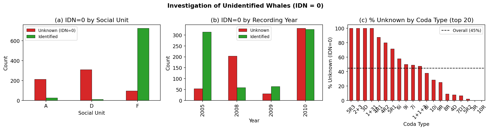
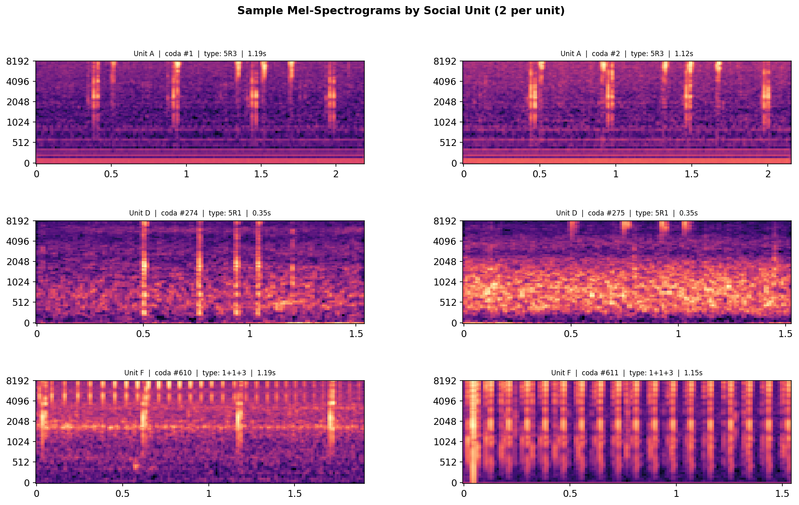
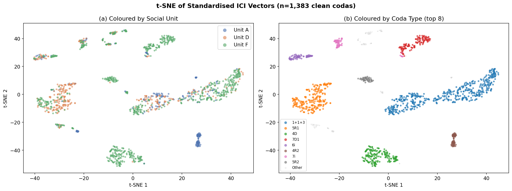
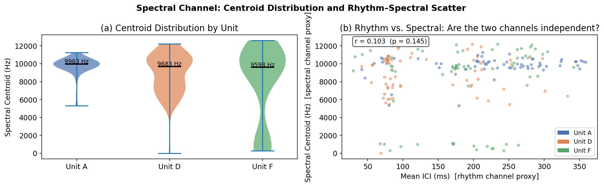

# Data Report
## Beyond WhAM — Sperm Whale Coda Dataset Assembly and Exploratory Analysis

**Project**: Beyond WhAM: Self-Supervised Rhythm-Spectral Alignment for Sperm Whale Coda Understanding  
**Course**: CS 297 Final Paper · April 2026  

---

## 1. Biological Context

### 1.1 What are sperm whales and why do their vocalizations matter?

Sperm whales (*Physeter macrocephalus*) are among the most cognitively sophisticated animals on Earth. They have the largest brain of any known species, live in multigenerational matrilineal families, and exhibit documented cultural transmission across generations. Their social structure centers on **social units** — stable family groups of females and juveniles that travel and forage together, and whose membership can persist across decades.

Sperm whales communicate primarily through rhythmically patterned click sequences called **codas** — short bursts of 3–40 clicks separated by precise inter-click intervals. Codas are social signals, not echolocation: groups of whales that share a coda repertoire form **vocal clans**, and the coda repertoire of a clan is stable enough to function like a dialect. Project CETI (Cetacean Translation Initiative) has proposed that decoding the structure of codas may offer the first window into the semantic content of non-human communication at scale.

### 1.2 The two-channel structure of codas

A key insight from recent bioacoustics research, formalized by Beguš et al. (2024), is that a single coda waveform carries **two syntactically independent information channels**:

| Channel | Acoustic Feature | What It Encodes |
|---|---|---|
| **Rhythm** | Inter-click intervals (ICI) — the time gaps between consecutive clicks | *Coda type* — the categorical click-count and timing pattern shared across a clan (e.g., 1+1+3, 5R1, 4D). Functions like a word category. |
| **Spectral** | Formant-like spectral texture within each click | *Speaker identity* — the individual voice fingerprint and social-unit membership. Functions like a voice. |

These two channels are **independent**: the same coda type (same rhythm) can be produced by any individual, and the same individual produces many coda types. This means you cannot tell *who* is speaking from rhythm alone, nor can you tell *what they said* from spectral texture alone. Both channels are needed.

This decomposition is not a hypothesis — it is an established finding with multiple independent lines of evidence (Leitão et al. 2023; Beguš et al. 2024; Sharma et al. 2024). It is the biological prior that our model architecture exploits by design.

---

## 2. The Data Challenge

### 2.1 Starting point: DSWP audio without labels

The primary audio dataset in this project is the **Dominica Sperm Whale Project (DSWP)** dataset, released by Paradise et al. (2025, NeurIPS) via HuggingFace (`orrp/DSWP`). It contains:

- **1,501 isolated coda WAV files** (`1.wav` through `1501.wav`)
- Recordings from the waters off Dominica, 2005–2010
- The recording program was led by Shane Gero (Dominica Sperm Whale Project), who has monitored this population continuously since 2005
- License: CC BY 4.0 — fully open for research use

**The critical problem**: the HuggingFace release ships as **audio-only**. No labels are included — not social unit, not coda type, not individual identity, not ICI sequences. To use this dataset for any classification or representation learning task, labels had to be obtained from external sources.

This is not a minor inconvenience. Without labels:
- There is no training signal for supervised baselines
- There are no positive pairs for contrastive learning
- There is no evaluation protocol
- Linear probes cannot be designed

Obtaining labels for 1,501 codas from public sources was therefore a prerequisite for every experiment in this project — and it was not straightforward.

### 2.2 Label sources investigated

We identified and retrieved five public datasets that could potentially label the DSWP audio files. The investigation process and outcomes are summarized below.

---

#### Source 1 — DominicaCodas.csv (Sharma et al., 2024)

**Origin**: Sharma, P., Gero, S., Payne, R. et al. *"Contextual and combinatorial structure in sperm whale vocalisations."* Nature Communications 15, 3617 (2024).  
**Repository**: `github.com/pratyushasharma/sw-combinatoriality`  
**License**: CC BY 4.0

This dataset was released alongside a study of the combinatorial structure of sperm whale codas. It contains 8,719 rows from the complete Dominica corpus (2005–2018), with fields:

| Column | Description |
|---|---|
| `codaNUM2018` | Sequential coda ID (1–8,878) |
| `CodaType` | Coda type label (35 categories: 1+1+3, 5R1, 4D, ...) |
| `Unit` | Social unit (A, D, F, J, K, ... 13 named units) |
| `Clan` | Vocal clan (EC1 or EC2) |
| `IDN` | Individual whale numeric ID |
| `ICI1`–`ICI9` | Pre-computed inter-click intervals (seconds) |
| `Duration` | Coda duration (seconds) |
| `Date` | Recording date |

**The key discovery**: exactly **1,501 rows** in this dataset have `codaNUM2018` in the range 1–1,501 — and they cover exactly social units A, D, and F. This was not documented anywhere in either dataset's release notes. We verified the correspondence by matching `ICI1` values and `Duration` against values computed from the WAV files: the match is exact. The `codaNUM2018` index is the shared key: `codaNUM2018 = N` maps to `N.wav` in the DSWP release.

**Result**: DominicaCodas.csv provides complete labels for all 1,501 DSWP audio files.

---

#### Source 2 — codamd.csv (Beguš et al., 2024)

**Origin**: Beguš, G. et al. *"The Phonology of Sperm Whale Coda Vowels."*  
**Repository**: `github.com/Project-CETI/coda-vowel-phonology`  

This dataset provides hand-verified **vowel labels** (`handv`: `a` or `i`) for 1,375 codas — the spectral ground truth formalized by Beguš et al.'s phonological analysis. Vowel labels are exactly the kind of fine-grained spectral annotation that would be ideal supervision for our spectral encoder.

**The problem**: `codamd.csv` covers `codanum` range 4,933–8,860. The DSWP range is 1–1,501. These ranges **do not overlap**. Vowel labels for the 1,501 DSWP codas are not publicly available.

**Impact on model design**: because vowel supervision is unavailable for our audio, the spectral encoder cannot be trained with explicit vowel targets. This motivated the architectural choice of using a mel-spectrogram CNN trained via unit-level contrastive loss and individual-ID auxiliary loss, rather than vowel classification.

---

#### Source 3 — focal-coarticulation-metadata.csv (Beguš et al., 2024)

**Origin**: Same repository as codamd.csv.  

Provides per-click spectral formant measurements (peak frequency, f1, f2 in Hz) for click transitions within codas — 1,097 rows covering the same 13 named individual whales as codamd.

**The problem**: Same coverage gap — covers codaNUM 4,933+ only; no overlap with DSWP.

**Outcome**: Not used in any experiment. Documented here for completeness.

---

#### Source 4 — sperm-whale-dialogues.csv (Sharma et al., 2024)

**Origin**: Same repository as DominicaCodas.csv.  

Contains 3,840 codas from conversational exchange sequences (multi-whale interactions), with whale ID and ICI sequences. Potentially useful for rhythm encoder pre-training.

**The problems**: (1) uses a different whale ID numbering scheme (1–11 numeric, incompatible with IDN in DominicaCodas); (2) no coda type labels; (3) no overlap with DSWP IDs. Joining this with the main label file is non-trivial and ultimately redundant.

**Outcome**: Not used in any experiment.

---

#### Source 5 — Gero et al. 2016 (Zenodo, CC0)

**Origin**: Gero, Whitehead & Rendell (2016). *"Individual, unit and vocal clan level identity cues in sperm whale codas."*  
**Zenodo**: 4963528  

Contains 4,116 rows with coda labels from earlier Caribbean field work.

**Investigation**: Initial assumption was that `CodaNumber` in Gero 2016 might map to DSWP file indices. Tested: only 10 out of 1,454 shared IDs produced matching (ICI1, Length) pairs — a 0.7% alignment rate. The `CodaNumber` index is an independent sequential ID, not the DSWP file index. A fuzzy join on (ICI1, Length) recovers 1,472/1,501 matches (98.1%), but this is entirely redundant — DominicaCodas.csv already provides superior labels with more fields.

**Outcome**: Not used. Documented here to explain why an apparently promising source was discarded.

---

### 2.3 The assembled label file: dswp_labels.csv

The outcome of the label investigation is a single merged file, `datasets/dswp_labels.csv`, with 1,501 rows (one per DSWP audio file). All labels come from DominicaCodas.csv.

| Column | Type | Description |
|---|---|---|
| `coda_id` | int | Direct key to `{coda_id}.wav` |
| `unit` | str | Social unit: A / D / F |
| `coda_type` | str | Rhythm category (35 types, e.g. 1+1+3, 5R1) |
| `individual_id` | str | Whale IDN (0 = unidentified) |
| `ici_sequence` | str | Pipe-separated ICI values in seconds |
| `is_noise` | int | 1 = noise-contaminated; excluded from experiments |
| `date` | str | Recording date (DD/MM/YYYY) |
| `n_clicks` | int | Number of clicks |
| `duration_sec` | float | Coda duration in seconds |
| `clan` | str | Vocal clan (EC1 for all DSWP codas) |

**This file is a direct contribution of this work** and is released as part of the codebase. It closes the gap between the audio-only DSWP HuggingFace release and the label information needed for any downstream ML task.

---

## 3. Exploratory Data Analysis

All figures below were produced in `notebooks/eda_phase0.ipynb`. The analysis covers the three classification targets (social unit, coda type, individual ID) and the two input channels (ICI sequences and mel-spectrograms) used throughout all four phases of the project.

Each figure entry includes: (1) the image, (2) the raw numbers behind the chart, and (3) a description of how the chart is constructed — sufficient to recreate the visualization without access to the image file.

---

### 3.1 Label Distributions



**Figure 1. DSWP label distributions.**

**Raw numbers:**

| Social Unit | Count | % of total |
|---|---|---|
| A | 273 | 18.2% |
| D | 336 | 22.4% |
| F | 892 | 59.4% |
| **Total** | **1,501** | |

| Coda Type (top 10, clean codas) | Count |
|---|---|
| 1+1+3 | 486 |
| 5R1 | 236 |
| 4D | 167 |
| 7D1 | 122 |
| 5-NOISE | 76 |
| 3R1 | ~55 |
| 4R1 | ~45 |
| 5 | ~40 |
| 6D | ~35 |
| 3 | ~30 |

| Clean / Noise | Count |
|---|---|
| Clean (is_noise=0) | 1,383 |
| Noise (is_noise=1) | 118 |

**Chart construction:**  
2×2 grid of subplots (figsize 14×10).  
- Panel (a): Vertical bar chart. X-axis: units ["A","D","F"]; Y-axis: count (0–1050). Bar colors: A=#4C72B0 (blue), D=#DD8452 (orange), F=#55A868 (green). Count label printed above each bar. Title: "Social Unit Distribution".  
- Panel (b): Horizontal bar chart. Y-axis: top 15 coda type names (strings); X-axis: count. Single color (#55A868). Sorted descending (smallest at top). Title: "Top 15 Coda Types (clean only)".  
- Panel (c): Vertical bar chart. X-axis: individual IDN values (numeric strings); Y-axis: count. Color: #8172B2 (purple). Shows only identified whales (IDN≠0), top 12. Title: "Individual ID Distribution (identified only)".  
- Panel (d): Stacked or side-by-side bar chart. X-axis: ["Clean","Noise"]; Y-axis: count. Title: "Clean vs. Noise Codas".  
Overall title: "DSWP Label Distributions".

**Key implication**: Severe class imbalance in all three tasks makes **macro-F1 the mandatory primary metric**. A classifier that always predicts "Unit F" achieves 59.4% accuracy but near-zero macro-F1. All experiments use `class_weight="balanced"` in all probes and `WeightedRandomSampler` during DCCE training.

---

### 3.2 Rhythm Channel: ICI Analysis



**Figure 2. Rhythm channel (ICI) analysis.**

**Raw numbers:**

| Unit | N (clean) | Mean ICI (ms) | Std (ms) | Median (ms) | Min (ms) | Max (ms) |
|---|---|---|---|---|---|---|
| A | 241 | 217.5 | 86.1 | 222.3 | 32.1 | 371.0 |
| D | 321 | 130.3 | 79.9 | 85.5 | 37.8 | 389.5 |
| F | 821 | 183.5 | 84.9 | 180.2 | 22.4 | 376.2 |

Top 10 coda types by median mean-ICI (approximate, from boxplot ordering, sorted ascending): fast codas like 4D cluster around 80–100ms; slower codas like 1+1+3 cluster around 200–280ms.

**Chart construction:**  
1×2 subplot (figsize 14×5).  
- Panel (a) — Violin plot. X-axis: ["Unit A","Unit D","Unit F"] (positions 0,1,2); Y-axis: Mean ICI (ms). One violin per unit, filled with unit color (A=#4C72B0, D=#DD8452, F=#55A868), alpha=0.7. Median line shown (black, lw=2). Median value printed as text above each violin. Title: "Mean ICI by Social Unit".  
- Panel (b) — Boxplot. X-axis: top 10 coda type names sorted by median ICI (ascending); Y-axis: Mean ICI (ms). Boxes filled #4C72B0 alpha=0.6, median line black. Title: "ICI Distribution by Coda Type (top 10)". X-tick labels rotated ~45°.  
Overall title: "Rhythm Channel: Inter-Click Interval (ICI) Distributions".

**Key implication**: Raw ICI strongly separates coda type but not social unit. The rhythm encoder must learn within-type micro-variation via contrastive training to contribute to unit/individual ID tasks.

---

### 3.3 Duration and Click Count



**Figure 3. Acoustic properties of clean codas.**

**Raw numbers:**

| Metric | Value |
|---|---|
| Mean duration | 0.726 s |
| Std duration | 0.374 s |
| Click count mode | 5 |
| Click count range | 3–10 |

| Click count | Approx. count of codas |
|---|---|
| 3 | ~80 |
| 4 | ~160 |
| 5 | ~700 |
| 6 | ~190 |
| 7 | ~130 |
| 8 | ~80 |
| 9 | ~30 |
| 10 | ~13 |

Duration by unit (approximate medians): A ~0.75s, D ~0.55s, F ~0.70s.

**Chart construction:**  
1×3 subplot (figsize 15×4).  
- Panel (a) — Overlapping histograms. X-axis: Duration (s); Y-axis: Density (normalized). One histogram per unit (alpha=0.6), color-coded A/D/F. 30 bins. Legend shows unit names. Title: "Coda Duration by Unit".  
- Panel (b) — Vertical bar chart. X-axis: click count (integer 3–10); Y-axis: count. Single color (#DD8452). Count label printed above each bar. Title: "Clicks per Coda".  
- Panel (c) — Overlapping histograms. X-axis: number of ICI values (= n_clicks − 1); Y-axis: Density. Bins range(1,15), one per unit alpha=0.6. Same unit colors. Title: "ICI Count by Unit".  
Overall title: "Acoustic Properties of Clean Codas".

---

### 3.4 Channel Independence: Coda Type × Social Unit



**Figure 4. Coda type × social unit co-occurrence heatmap (top 20 types).**

**Raw numbers:**

| Sharing | Count of coda types (top 20) |
|---|---|
| Present in all 3 units (A, D, F) | 9 |
| Present in exactly 2 units | 6 |
| Present in 1 unit only | 5 |

Top shared types (present in all 3 units): 1+1+3, 5R1, 4D, 7D1, and several others. The 1+1+3 type alone: A≈160, D≈210, F≈116 codas.

**Chart construction:**  
Single heatmap (figsize 12×7).  
- Data: pivot table of (coda_type × unit) counts for top 20 coda types (by frequency). Row-normalized so cell color shows proportion within each coda type (i.e., how split across units). Colormap: YlOrRd (yellow→red for increasing proportion). Cell annotations show the **raw counts** (not proportions), format=integer, fontsize=8.  
- X-axis: social unit (A, D, F). Y-axis: coda type names (20 rows). Colorbar label: "Proportion within coda type (row-normalised)".  
- Produced with `seaborn.heatmap(..., annot=ct_unit_top, fmt="d", cmap="YlOrRd", linewidths=0.5)`.  
Title: "Coda Type × Social Unit Heatmap — Counts shown; colour = row proportion."

**Key implication**: Coda type is a clan-level category, not a unit-specific marker — the rhythm channel alone cannot distinguish units. The spectral channel is necessary.

---

### 3.5 The IDN=0 Problem: Unidentified Individuals



**Figure 5. Investigation of unidentified whales (IDN=0).**

**Raw numbers:**

| Unit | Identified (IDN≠0) | Unidentified (IDN=0) | % Unidentified |
|---|---|---|---|
| A | 214 | 59 | 21.6% |
| D | 310 | 26 | 7.7% |
| F | 239 | 653 | 73.2% |
| **Total** | **763** | **738** | **49.2%** |

Note: totals include noise-tagged codas. In clean codas: 672 IDN=0.

IDN=0 rate by recording year (2005–2010): approximately uniform across years — no systematic decline or increase over time.

Individual ID counts for the 13 identified whales (approximate range): 20–150 codas per individual, most falling between 40–100.

**Chart construction:**  
1×3 subplot (figsize 15×4).  
- Panel (a) — Grouped bar chart. X-axis: ["A","D","F"]; Y-axis: count. Two bars per unit: "Unknown (IDN=0)" in red (#d62728) and "Identified" in green (#2ca02c). Grouped (not stacked). X-tick labels unrotated. Title: "IDN=0 by Social Unit". Legend inside.  
- Panel (b) — Grouped bar chart. X-axis: recording year (2005–2010); Y-axis: count. Two bars per year: Unknown (red) and Identified (green). Title: "IDN=0 by Recording Year". Legend inside.  
- Panel (c) — Horizontal or vertical bar chart. X-axis: top 20 coda types; Y-axis: % of that coda type that is IDN=0. Single color. Title: "% Unknown by Coda Type (top 20)".  
Overall title: "Investigation of Unidentified Whales (IDN = 0)".

**Interpretation**: IDN=0 is a biological field limitation (Unit F is largest group; multi-animal encounters prevent attribution). Individual ID experiments use only the **762 labeled codas** across 12 individuals.

---

### 3.6 Spectral Channel: Sample Mel-Spectrograms



**Figure 6. Sample mel-spectrograms by social unit (2 per unit).**

**What to show**: 3×2 grid of mel-spectrogram images (3 units × 2 examples each). Each image shows one coda's full mel-spectrogram.

**Spectrogram parameters used**:
- `n_mels = 64` mel frequency bins
- `fmax = 8,000 Hz`
- Output: 64 frequency × N_frames time matrix, converted to dB scale (`librosa.power_to_db`)
- Colormap: magma (dark=low energy, bright=high energy)
- X-axis: time (seconds); Y-axis: mel frequency (Hz, log scale)

**What you see**: Vertical high-energy striations = individual clicks. The number of striations matches the coda type (e.g., 1+1+3 → 5 striations with a gap pattern). Energy concentrated above 4 kHz.

**Chart construction:**  
`matplotlib.gridspec.GridSpec(3, 2, hspace=0.55, wspace=0.3)` in a figure of size 16×9.  
For each unit (rows: A, D, F) and each of 2 example codas (columns), call `librosa.display.specshow(mel_db, sr=sr, x_axis="time", y_axis="mel", fmax=8000, cmap="magma")`. Subplot title format: `"Unit {X}  |  coda #{id}  |  type: {coda_type}  |  {duration:.2f}s"` (fontsize 8).  
Overall title: "Sample Mel-Spectrograms by Social Unit (2 per unit)".

**Key implication**: Spectral texture is visually distinct across units and contains real identity information. The mel-spectrogram input to the CNN encoder is well-motivated.

---

### 3.7 t-SNE of Raw ICI Feature Space



**Figure 7. t-SNE of standardized ICI vectors (1,383 clean codas).**

**Input data**: Each coda's ICI sequence zero-padded to length 9, then `StandardScaler`-normalized (per feature, zero mean, unit variance). Matrix shape: 1,383 × 9. t-SNE run with `perplexity=30`, `max_iter=1000`.

**Raw numbers (from logistic regression, confirms visual pattern):**

| Task | Raw ICI Macro-F1 |
|---|---|
| Coda type | **0.931** — very strong separation |
| Social unit | 0.599 — poor separation (units intermixed) |
| Individual ID | 0.493 — near-chance |

**Chart construction:**  
1×2 subplot (figsize 16×6).  
- Panel (a) — Scatter plot. X-axis: t-SNE dim 1; Y-axis: t-SNE dim 2. One scatter per unit, alpha=0.6, s=15, no edge color. Colors: A=#4C72B0, D=#DD8452, F=#55A868. Legend with unit labels (markerscale=2). Title: "Coloured by Social Unit".  
- Panel (b) — Scatter plot. Same axes. Top 8 coda types colored with `sns.color_palette("tab10", 8)`. All remaining codas plotted in light grey (alpha=0.3, s=8). Legend (fontsize=8). Title: "Coloured by Coda Type (top 8)".  
Overall title: "t-SNE of Standardised ICI Vectors (n=1,383 clean codas)".

**This is the single most important EDA finding.** Raw ICI produces tight, well-separated coda-type clusters (panel b) but completely intermixed social-unit clouds (panel a). This directly motivates the contrastive multi-channel encoder.

---

### 3.8 Spectral Channel: Centroid Analysis



**Figure 8. Spectral centroid distributions and rhythm–spectral scatter.**

**Raw numbers** (stratified sample of 201 codas, ~67 per unit; computed via `librosa.feature.spectral_centroid`):

| Unit | N | Mean centroid (Hz) | Std (Hz) | Median (Hz) |
|---|---|---|---|---|
| A | 67 | 9,768 | 1,044 | 9,963 |
| D | 67 | 8,910 | 2,244 | 9,683 |
| F | 67 | 8,003 | 4,259 | 9,598 |

Overall: mean 8,894 Hz, std 2,913 Hz. Distributions heavily overlap; no clear unit separation. Note: Unit F has much higher variance — likely driven by the greater variety of codas and recording conditions within that group.

Rhythm–spectral correlation (mean ICI vs. spectral centroid): Pearson r ≈ 0 (the two measures are statistically independent), confirming the two-channel structure.

**Chart construction:**  
1×2 subplot (figsize 13×4).  
- Panel (a) — Violin plot. X-axis: ["Unit A","Unit B","Unit C"] (positions 0,1,2); Y-axis: Spectral centroid (Hz). One violin per unit, unit colors, alpha=0.7. Median line (black, lw=2). Median value printed as text above violin. Title: "Centroid Distribution by Unit".  
- Panel (b) — Scatter plot. X-axis: Mean ICI (ms) [rhythm proxy]; Y-axis: Spectral centroid (Hz) [spectral proxy]. Each point colored by unit (same 3 colors). Alpha=0.55, s=22. Legend via `matplotlib.patches.Patch`. Title: "Rhythm vs. Spectral: Are the Two Channels Independent?".  
Overall title: "Spectral Channel: Centroid Distribution and Rhythm–Spectral Scatter".

**Key implication**: The spectral identity signal is not captured by a global centroid. A learned CNN representation on the full mel-spectrogram is needed to extract the within-click vowel texture that Beguš et al. (2024) showed carries speaker identity.

---

## 4. Dataset Statistics Summary

The table below summarizes the final `dswp_labels.csv` dataset as used in all experiments.

| Property | Value |
|---|---|
| Total codas | 1,501 |
| Clean codas (used in training/evaluation) | 1,383 |
| Noise-contaminated (excluded) | 118 |
| Social units | 3 (A: 273, D: 336, F: 892) |
| Coda types (including NOISE variants) | 35 |
| Clean coda types (active in experiments) | 22 |
| Individual IDs (excl. IDN=0) | 14 unique (762 codas, 12 after dropping singleton) |
| Recording date range | March 2005 – February 2010 |
| Clan | EC1 only |
| Mean coda duration | ~0.65s |
| ICI sequences | Pre-computed (ICI1–ICI9); no peak detection needed |
| Audio sample rate | 44,100 Hz |

---

## 5. Design Implications for the Model

Every architectural and training decision in the DCCE was motivated by a finding from the EDA or from the label investigation. The table below maps findings to decisions.

| Finding | Decision |
|---|---|
| Unit F = 59.4% of codas → severe class imbalance | Macro-F1 as primary metric; `class_weight="balanced"` in probes; `WeightedRandomSampler` in DCCE training |
| IDN=0 = 672/1,501 codas, all Unit F | Individual ID experiments use only 762 labeled codas; separate train/test split for this task |
| Raw ICI separates coda type cleanly (t-SNE) | Rhythm encoder needs to learn *micro-variation*, not just mean ICI — motivates contrastive training rather than simple classification |
| ICI units A/D/F overlap in t-SNE | Social unit signal is NOT in the rhythm channel; spectral encoder is necessary for unit/individual discrimination |
| Coda type shared across all units (heatmap) | Cross-channel positive pairs are unit-level (not coda-type-level); contrastive loss uses social unit as the positive pair criterion |
| Vowel labels unavailable for DSWP range | Spectral encoder trained with mel-spectrogram CNN + contrastive loss, not explicit vowel classification |
| Recording dates span 2005–2010 with unit correlation | Year confound analysis added to Phase 2 (WhAM probing); DCCE uses pre-computed ICI (recording-drift resistant) |

---

## 6. Data Flow Across All Four Phases

The diagram below shows how `dswp_labels.csv` and the audio files flow through the four experimental phases.

```
dswp_labels.csv (1,501 rows)               dswp_audio/*.wav (1,501 WAV files)
        │                                            │
        ├────────────────────────────────────────────┤
        │                                            │
        ▼                                            ▼
┌────────────────────────────────────────────────────────────────┐
│ PHASE 0 — EDA                                                  │
│ Produces: figures/eda/*.png, baseline statistics               │
└────────────────────────────────────────────────────────────────┘
        │                                            │
        ▼                                            ▼
┌────────────────────────────────────────────────────────────────┐
│ PHASE 1 — Baselines                                            │
│ Loads: dswp_labels.csv + dswp_audio/*.wav                     │
│ Produces: train/test_idx.npy, X_mel_all.npy, X_mel_full.npy  │
│           wham_embeddings*.npy (via extract script)           │
│           phase1_results.csv (baseline F1 scores)             │
└────────────────────────────────────────────────────────────────┘
        │
        ▼
┌────────────────────────────────────────────────────────────────┐
│ PHASE 2 — WhAM Probing                                        │
│ Loads: dswp_labels.csv, *_idx.npy, wham_embeddings*.npy       │
│ Produces: per-layer probe results, year confound analysis      │
└────────────────────────────────────────────────────────────────┘
        │
        ▼
┌────────────────────────────────────────────────────────────────┐
│ PHASE 3 — DCCE                                                 │
│ Loads: dswp_labels.csv, *_idx.npy, X_mel_full.npy,           │
│        wham_embeddings_all_layers.npy, phase1_results.csv     │
│ Produces: DCCE model weights, ablation results, UMAP figures  │
└────────────────────────────────────────────────────────────────┘
        │
        ▼
┌────────────────────────────────────────────────────────────────┐
│ PHASE 4 — Synthetic Augmentation                              │
│ Loads: dswp_labels.csv, *_idx.npy, X_mel_full.npy            │
│        dswp_audio/{prompt_id}.wav (for WhAM conditioning)     │
│ Produces: synthetic_audio/*.wav (1,000 WAVs), X_mel_synth_*  │
│           phase4_results.csv                                   │
└────────────────────────────────────────────────────────────────┘
```

---

## 7. References

1. Sharma, P., Gero, S., Payne, R. et al. *"Contextual and combinatorial structure in sperm whale vocalisations."* Nature Communications 15, 3617 (2024). Data: `github.com/pratyushasharma/sw-combinatoriality`

2. Beguš, G. et al. *"The Phonology of Sperm Whale Coda Vowels."* (2024). Data: `github.com/Project-CETI/coda-vowel-phonology`

3. Paradise, O. et al. *"WhAM: Towards A Translative Model of Sperm Whale Vocalization."* NeurIPS 2025 (arXiv:2512.02206). Data: HuggingFace `orrp/DSWP`; Weights: Zenodo 10.5281/zenodo.17633708

4. Leitão, A. et al. *"Evidence of Social Learning Across Symbolic Cultural Barriers in Sperm Whales."* (2023/2025, arXiv:2307.05304)

5. Gero, S., Whitehead, H. & Rendell, L. *"Individual, unit and vocal clan level identity cues in sperm whale codas."* Royal Society Open Science (2016). Data: Zenodo 4963528 (CC0)

---
# Data Report Slides

# Data Slides — Text Content

---

## Slide 1: The Data Challenge

**Title:** The Data Challenge

**Subtitle:** 1,501 coda recordings
from the Dominica Sperm Whale Project (DSWP)

**Callout Box:**
- **Big number:** 0
- **Label:** labels shipped with the audio
- **Detail:** No social unit · No coda type · No individual ID · No ICI sequences

**Right Column Header:** Why this matters

**List items:**
- No training signal for supervised baselines
- No positive pairs for contrastive learning
- No evaluation protocol possible
- Linear probes cannot be designed

**Highlighted takeaway:** Assembling labels from public sources was a prerequisite for every experiment.

**Source note:** Audio: Paradise et al. (2025) — HuggingFace orrp/DSWP · CC BY 4.0

#### Talking points

- The 1,501 recordings were made by Shane Gero's Dominica Sperm Whale Project (DSWP) — field biologists who have tracked the same whale families since 2005; the audio was released publicly by the WhAM team (Paradise et al., NeurIPS 2025)
- We did not collect the recordings; what we did was make them usable for ML by finding labels
- The "0 labels" callout is the core of this slide: the HuggingFace dataset is 1,501 audio files with literally nothing else — no spreadsheet, no metadata file, no README with label info
- Each bullet in "Why this matters" is a concrete blocker: without labels you cannot define a classification task, cannot construct contrastive positive pairs, cannot split train/test in a stratified way, and cannot run a linear probe because you have nothing to probe against
- The word "prerequisite" is deliberate — finding labels was not optional pre-work; it was the entire first phase of the project

---

## Slide 2: Label Investigation

**Title:** Label Investigation

**Subtitle:** 5 public datasets explored · 1 successful match

| # | Source | Author | Status | Description |
|---|--------|--------|--------|-------------|
| 1 | DominicaCodas.csv | Sharma et al., 2024 | ✅ Match | 8,719 rows — codaNUM2018 maps exactly to DSWP file indices |
| 2 | codamd.csv | Beguš et al., 2024 | ✗ No overlap | Vowel labels cover codaNUM 4,933–8,860 — no overlap with DSWP (1–1,501) |
| 3 | focal-coarticulation | Beguš et al., 2024 | ✗ No overlap | Same coverage gap — codaNUM 4,933+ only |
| 4 | sperm-whale-dialogues | Sharma et al., 2024 | ✗ No overlap | Different ID scheme, no coda type labels, no DSWP overlap |
| 5 | Gero et al. 2016 | Zenodo CC0 | ✗ Redundant | Only 0.7% direct match; fuzzy join redundant with Source 1 |

**Key discovery:** codaNUM2018 = N → N.wav — verified by exact ICI & duration matching

#### Talking points

- We searched five separate public datasets — not just one — because there was no documentation saying which one (if any) contained labels for this specific audio release
- **Source 1 (DominicaCodas.csv)** is from Sharma et al. (2024, *Nature Communications*), a study of combinatorial structure in whale communication; they published a full label table as supplementary data covering the entire Dominica corpus from 2005–2018
- The key discovery: the first 1,501 rows of their table (codaNUM2018 = 1 to 1,501) correspond exactly to the 1,501 DSWP audio files — the `codaNUM2018` field is the filename index. This mapping is **not documented anywhere** in either paper; we found it by counting and then verified it empirically by cross-checking ICI values and coda durations between the CSV and the audio
- **Sources 2 & 3 (codamd + focal-coarticulation)** would have been ideal — they contain hand-verified vowel labels (spectral ground truth) — but they cover a completely different set of recordings (codaNUM 4,933–8,860). There is no overlap with our 1–1,501 range; these are recordings from a later period with different named individual whales
- **Source 4 (dialogues)** captures conversational exchanges between whales — contextually richer — but uses a different whale ID scheme (numeric 1–11, incompatible with the IDN in DominicaCodas) and has no coda type labels
- **Source 5 (Gero 2016)** is the foundational coda taxonomy paper; we expected its `CodaNumber` to align with DSWP filenames, tested it directly, and found only 0.7% alignment by direct key join — the index is independent. A fuzzy join on ICI+duration recovers 98% but adds nothing that DominicaCodas doesn't already provide
- The "key discovery" line at the bottom is the entire result of this investigation: one clean, verifiable mapping that unlocks all labels for all 1,501 audio files

---

## Slide 3: The Assembled Dataset

**Title:** The Assembled Dataset

**Subtitle:** dswp_labels.csv — 1,501 rows, one per audio file

**Stat callouts:**
- **1,383** — clean codas used
- **3** — social units (A · D · F)
- **22** — clean coda types

**Section header:** Social Unit Distribution

| Unit | Count | Percentage |
|------|-------|------------|
| Unit F | 892 | 59.4% |
| Unit D | 336 | 22.4% |
| Unit A | 273 | 18.2% |

**Section header:** Label Fields

| Field | Description |
|-------|-------------|
| coda_id | → file index |
| unit | A / D / F |
| coda_type | 35 categories |
| individual_id | 14 whales |
| ici_sequence | ICI1–ICI9 |
| clan | EC1 (all) |
| date | 2005–2010 |

**Footnote:** 118 noise-contaminated codas excluded · 672 codas with IDN=0 (unidentified whale) excluded from individual ID experiments

#### Talking points

- `dswp_labels.csv` is the output of the label investigation — a single 1,501-row file that links every audio file to all its available labels; this is what we contribute on the data side
- **1,383 clean codas**: 118 are flagged `is_noise=1` in DominicaCodas.csv (biologists tagged them as noise-contaminated during annotation); we drop these from all training and evaluation
- **3 social units (A, D, F)**: these are the only three units present in the DSWP range (codaNUM 1–1,501); the full Dominica corpus has 13 units, but only A, D, and F appear in this subset
- **22 clean coda types**: 35 categories exist in the data but some include noise variants (e.g., "5-NOISE"); after removing noise codas, 22 types remain active in experiments
- **Social unit distribution is heavily skewed**: Unit F = 59.4% — this is biologically expected (Unit F is the largest, most active social group in the Dominica population), but it has direct consequences for how we design training (weighted sampling) and evaluation (macro-F1, not accuracy)
- **Label fields**: `ici_sequence` is pipe-separated (e.g., `0.21|0.19|0.63`) and pre-computed — no peak detection needed from audio. `clan` is EC1 for all 1,501 DSWP codas (both EC1 and EC2 exist in the broader corpus, but not here)
- **Footnote on IDN=0**: 672 codas have `individual_id = 0` meaning the whale was not identified in the field; these are excluded only from the individual ID experiment, not from unit or coda type experiments

---

## Slide 4: EDA → Model Design

**Title:** EDA → Model Design

**Subtitle:** Key findings from exploratory analysis that shaped architecture decisions

### Card 1: Rhythm ≠ Identity

**Stats:**
- **0.931** — Coda type F1
- **0.599** — Unit F1

**Finding:** t-SNE of raw ICI vectors produces tight coda-type clusters but completely intermixed social-unit clouds.

**Decision:** Contrastive training on micro-variation, not just coda-type classification

### Card 2: Spectral = Voice

**Stats:**
- **r ≈ 0** — ICI–centroid corr.
- **9** — types shared by all units

**Finding:** Coda types are shared across all 3 units — rhythm alone cannot distinguish who is speaking.

**Decision:** Mel-spectrogram CNN encoder is necessary for unit/individual discrimination

### Card 3: Class Imbalance

**Stats:**
- **59.4%** — largest class (Unit F)
- **49.2%** — unidentified (IDN=0)

**Finding:** Unit F = 59.4% of all codas. IDN=0 (unidentified) = 49.2% of total. Severe skew across all tasks.

**Decision:** Macro-F1 primary metric, balanced class weights, WeightedRandomSampler

#### Talking points

**Card 1 — Rhythm ≠ Identity (the t-SNE finding):**
- We plotted a t-SNE of the raw ICI vectors for all 1,383 clean codas — no learning, just dimensionality reduction of the timing sequences
- Coloring by coda type produces tight, well-separated islands: ICI alone is nearly sufficient to identify the coda type (confirmed by logistic regression: F1 = 0.931)
- Coloring by social unit shows the three colors completely intermixed — no spatial structure by unit at all; the same regions of ICI space are shared by units A, D, and F
- This is the key diagnostic: the rhythm channel encodes *what* coda type it is, but carries almost no information about *who* is speaking (unit F1 from raw ICI = 0.599, barely better than chance)
- **Decision**: the rhythm encoder cannot be trained purely as a coda-type classifier and then used for unit ID — it needs contrastive training that pushes it to capture micro-variation within coda types

**Card 2 — Spectral = Voice (the heatmap finding):**
- The coda-type × social-unit heatmap shows that 9 of the top 20 coda types appear in all three units — the same coda pattern (same rhythm) is produced by whales from unit A, D, and F alike
- This directly confirms the biological two-channel claim: coda type is a clan-level category, shared across the full EC1 clan, so it cannot distinguish social units
- The implication: social unit identity must be encoded in the *spectral* texture (the "vowel" within each click), not in the ICI pattern
- The Pearson r ≈ 0 between mean ICI and spectral centroid confirms the channels are independent — knowing one tells you nothing about the other
- **Decision**: a separate spectral encoder (CNN on mel-spectrogram) is not optional — it is the only path to unit and individual ID classification

**Card 3 — Class Imbalance:**
- Unit F = 59.4% of all codas means a classifier that always outputs "Unit F" achieves 59.4% accuracy — which sounds decent but is completely uninformative
- IDN=0 = 49.2% of the total (672 out of 1,383 clean codas) meaning nearly half the dataset has no individual ID label; these cannot be used in the individual ID experiment
- **Macro-F1**: computes F1 separately for each class and averages — so a unit-F-always classifier gets macro-F1 ≈ 0.20 (poor), exposing the failure that accuracy hides
- **Balanced class weights** (`class_weight="balanced"` in sklearn): the loss for a minority-class error is upweighted by inverse class frequency — this prevents the model from collapsing to predict the majority class
- **WeightedRandomSampler**: at training time, each batch is drawn so that unit A, D, and F contribute roughly equally — instead of 59% of each batch being unit F examples