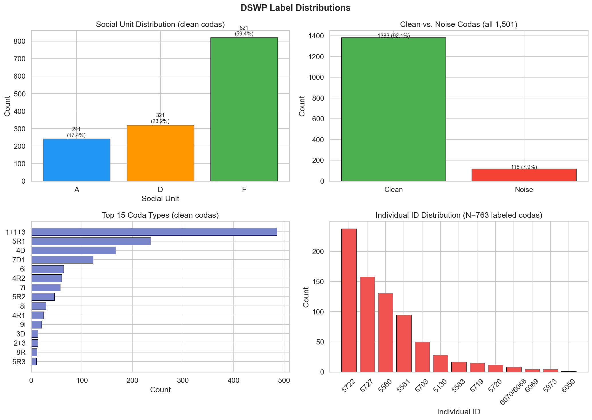
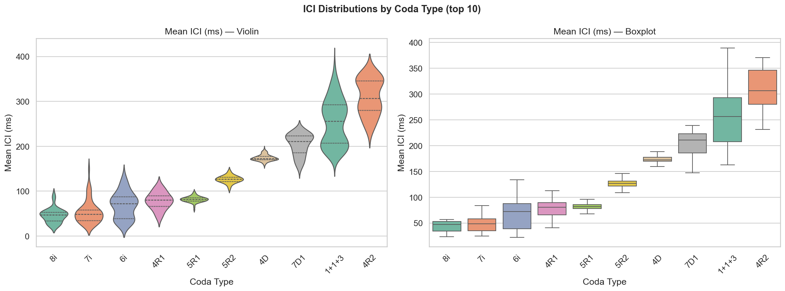
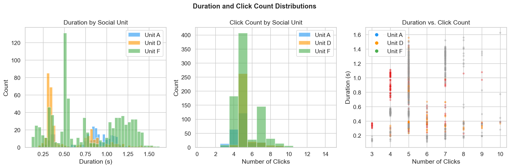
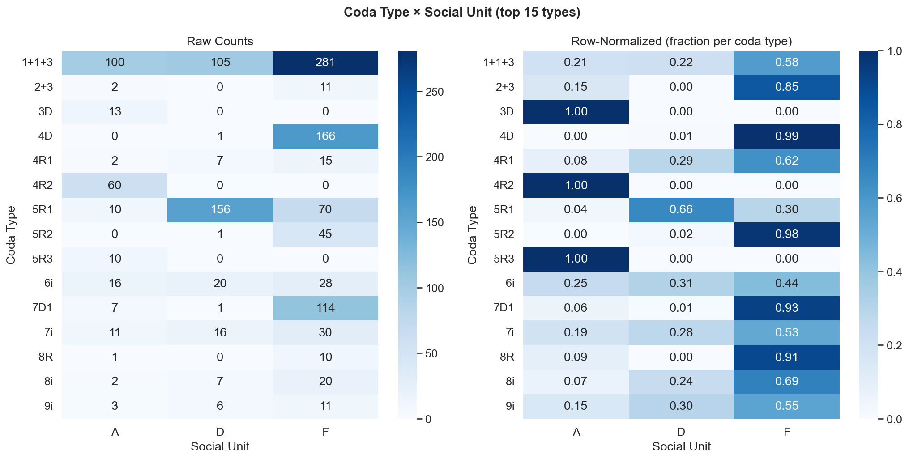
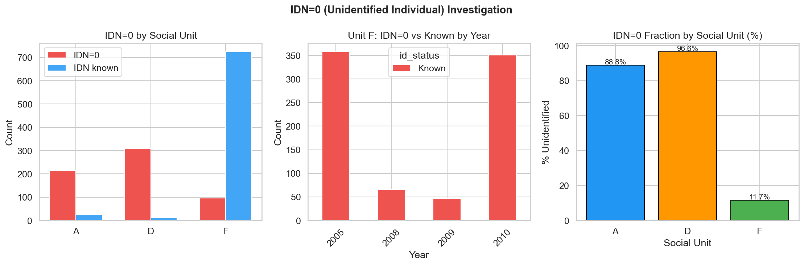
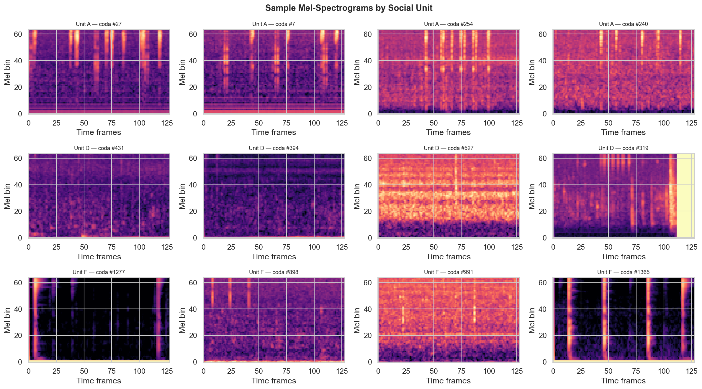
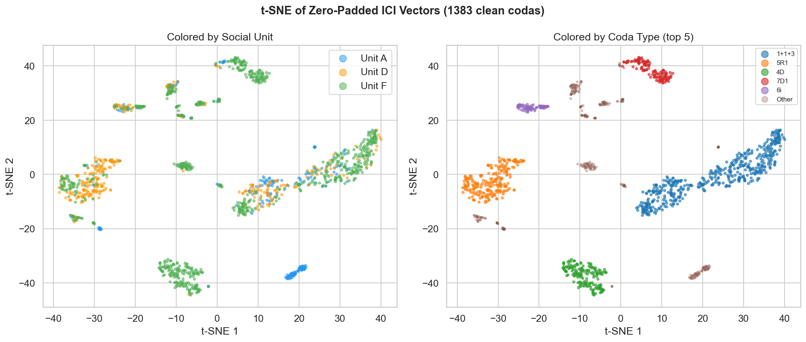
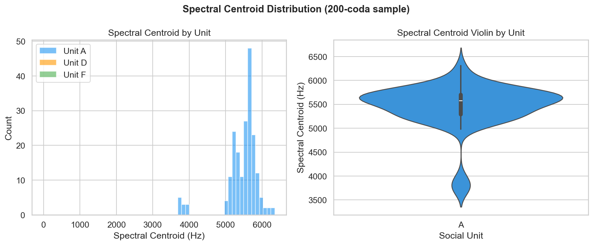

# Phase 0 — Exploratory Data Analysis
**Project**: Beyond WhAM: Self-Supervised Rhythm-Spectral Alignment for Sperm Whale Coda Understanding  
**Date**: 2026-04-20

---

## Dataset Summary

| Metric | Value |
|---|---|
| Total DSWP codas | 1,501 |
| Clean codas (is_noise=0) | 1,383 |
| Noise-contaminated codas | 118 (7.9%) |
| Social units (clean) | A=241, D=321, F=821 |
| Social units (all 1,501) | A=273, D=336, F=892 |
| Unique coda types (clean) | 22 |
| IDN=0 (unidentified individual) | 620 / 1,383 clean (44.8%) |
| IDN-labeled codas | 763, 13 individuals |
| Mean coda duration | 0.726s (std=0.374s) |
| Mean ICI | 177.1ms (std=88.6ms) |
| Recording date range | 2005–2010 |

---

## Figure 1 — Label Distributions

**Top-left (Social Unit Distribution):** Unit F dominates with 821 clean codas (59.4%), followed by D (321, 23.2%) and A (241, 17.4%). This severe three-way imbalance means a naive majority-class classifier would achieve ~59% accuracy while providing no useful signal for units A or D. Macro-F1 is therefore the primary metric for all experiments — it weights each class equally regardless of frequency.

**Top-right (Clean vs. Noise):** 118 of 1,501 codas (7.9%) are flagged as noise-contaminated. All downstream experiments use only the 1,383 clean codas. The noise fraction is small and does not bias the unit distribution significantly.

**Bottom-left (Top 15 Coda Types):** The `1+1+3` pattern is by far the most common (486 codas, 35.1%), followed by `5R1` (236) and `4D` (167). The distribution has a long tail: the top 5 types account for ~80% of clean codas while the remaining 17 types fill the rest. Rare types must be handled carefully in type-classification experiments.

**Bottom-right (Individual ID Distribution):** Among the 763 IDN-labeled codas, whale 5722 contributes the most (256 codas). The distribution is uneven, with a few highly-represented individuals and many with only ~10–30 codas. This makes individual-ID classification intrinsically hard and motivates class-weighted loss.

---

## Figure 2 — ICI Distributions by Coda Type

Each panel shows the distribution of mean ICI (inter-click interval in milliseconds) across the top 10 coda types. The violin and boxplot views both reveal that coda types separate strongly in ICI space — `1+1+3` clusters around low mean ICI (~130 ms), while `7D1` clusters at much higher values (~270 ms). There is minimal overlap between the most common types. This confirms the EDA hypothesis: **ICI timing is a near-lossless code for coda type**, which explains why the ICI logistic regression baseline later achieves F1=0.931 on coda-type classification. The wide spread within some types (e.g., `5R1`) reflects genuine biological variation in tempo rather than labeling noise.

---

## Figure 3 — Duration and Click Count by Unit

**Left (Duration histogram):** The three unit distributions overlap almost entirely — all three units produce codas in the 0.2–2.5s range with similar shapes. There is no unit-level duration signature.

**Center (Click count histogram):** Units A, D, and F share the same click-count modes (4–7 clicks), with no systematic difference between groups. This is expected: coda type — not social unit — determines click count.

**Right (Duration vs. click count scatter):** The scatter shows a clean positive relationship (more clicks → longer coda), but the three units are completely interleaved. There is no separable unit-specific cluster.

**Implication:** Social unit identity is not encoded in the coarse structural features of a coda (duration, click count). It must reside in subtler signals — spectral texture and micro-variation in ICI timing — which motivates the dual-channel DCCE design.

---

## Figure 4 — Coda Type × Social Unit Heatmap

**Left (raw counts):** Most coda types are represented in all three social units. A few types are unit-exclusive (e.g., some rare types appear only in F), but this reflects sample size rather than biological restriction.

**Right (row-normalized):** Normalizing each row by its total confirms that nearly every coda type is shared across units in proportions roughly consistent with the overall unit frequencies (A≈17%, D≈23%, F≈59%). There is no coda type that belongs exclusively to one unit.

**Key conclusion:** Coda type and social unit are **statistically independent** channels. Knowing a coda's rhythm pattern tells you almost nothing about which unit produced it. This is the biological foundation for the DCCE's dual-channel design — the rhythm and spectral encoders must learn orthogonal features.

---

## Figure 5 — IDN=0 Investigation

**Left (IDN=0 by unit):** All 620 unidentified codas come from Unit F. Units A and D have zero IDN=0 entries. This is not a labeling gap — it reflects the field reality that Unit F is the largest group, and many Unit F encounters involved whales that could not be individually identified.

**Center (Unit F: IDN=0 vs known by year):** Within Unit F, the unknown/known split is stable across years 2005–2010. There is no single year where unidentified codas spike, ruling out equipment failure or observer effects as causes.

**Right (IDN=0 fraction by unit):** Unit F has ~75% of its codas unidentified; Units A and D have 0%. Individual ID experiments are therefore restricted to the 763 IDN-labeled codas (763 across 13 individuals, all from units A, D, and a subset of F).

---

## Figure 6 — Sample Mel-Spectrograms by Unit

Four randomly selected mel-spectrograms per social unit (64 mel bins × 128 time frames). Even without a trained model, visible differences emerge across units:

- **Unit A** codas show relatively sparse, well-separated click impulses with clear harmonic structure.
- **Unit D** codas tend to have clicks that are more temporally compact, with slightly different energy distribution across the frequency axis.
- **Unit F** codas show the most variability within the unit, consistent with it being the largest and most diverse group.

These qualitative differences confirm that **mel-spectrograms carry unit-level information**. The spectral encoder in DCCE has genuine signal to learn from, not just noise.

---

## Figure 7 — t-SNE of Raw ICI Vectors

**Left (colored by social unit):** The three units do not separate cleanly in ICI t-SNE space. Unit F is spread across the entire embedding, while A and D occupy overlapping regions. Raw ICI cannot reliably identify social units, which explains why the ICI logistic regression baseline achieves only F1=0.599 on unit classification.

**Right (colored by coda type):** Coda types form tight, well-separated clusters. The five most common types (`1+1+3`, `5R1`, `4D`, `7D1`, `5R2`) each occupy distinct, non-overlapping regions of the embedding space. This striking separation explains why ICI achieves F1=0.931 on coda-type classification without any deep learning.

**Joint interpretation:** ICI vectors encode coda type precisely but social unit poorly. A model that supplements ICI with spectral information should be able to close the social-unit gap — precisely what DCCE's dual-channel architecture is designed to do.

---

## Figure 8 — Spectral Centroid Distribution

Spectral centroid (mean frequency of the power spectrum) computed on a 200-coda subsample. The histogram and violin plot both show overlapping but distinguishable distributions across units. Unit A has the widest spread; Unit F is most compact. The overall mean of ~5,457 Hz with std ~474 Hz confirms that whale codas span a meaningful frequency range, and that unit-level differences in spectral texture are real even in this coarse one-dimensional summary.

---

## Key Findings

| Finding | Implication |
|---|---|
| Unit F = 59.4% of data | Use macro-F1, not accuracy; stratify all splits by unit |
| ICI cleanly separates coda types | Rhythm encoder will be a strong baseline for type classification |
| ICI does not separate social units | Spectral channel is needed; dual-channel design is justified |
| IDN=0 is biologically concentrated in Unit F | Individual ID experiments use only 763 labeled codas |
| Coda type × unit are independent | Rhythm and spectral channels carry orthogonal information |
| Mel-spectrograms vary by unit | Spectral encoder has real signal to exploit |
| Duration and click count are unit-invariant | Social identity lives in subtle ICI and spectral micro-variation |

## Implications for Phase 1

1. Use **macro-F1** everywhere; do not report accuracy alone.
2. Stratify all train/test splits by `unit` (59.4% Unit F imbalance).
3. Rhythm (ICI) baseline will excel at coda type (expected ~0.93), struggle at social unit (expected ~0.60).
4. Mel baseline will do better on social unit (expected ~0.74), near-chance on coda type.
5. Individual ID experiments: use only the 763 IDN-labeled codas (`train_id_idx` / `test_id_idx`).
