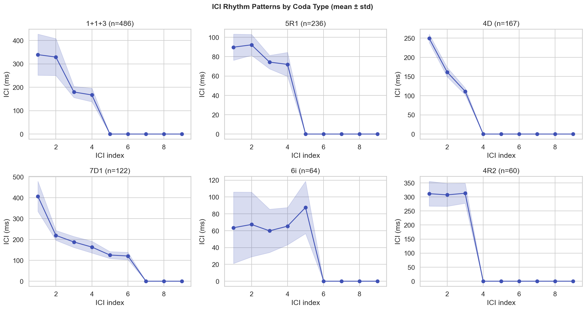
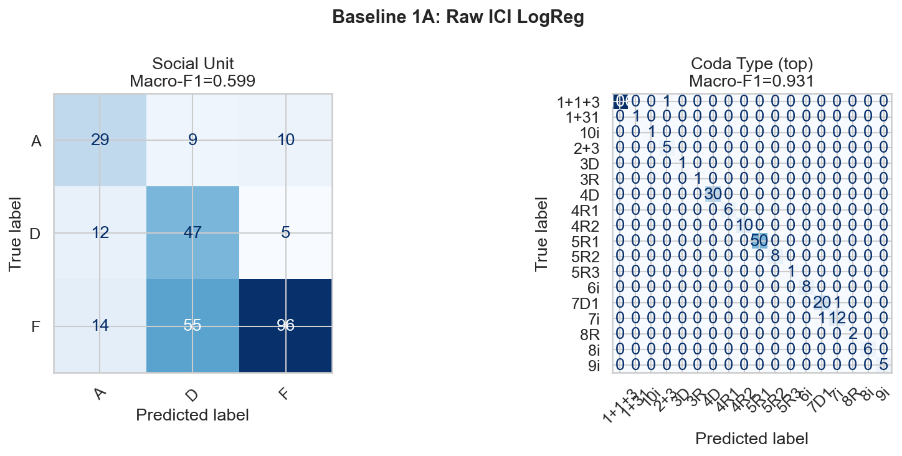
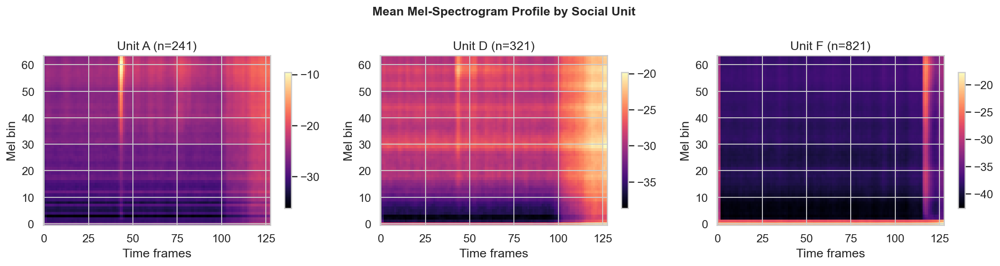
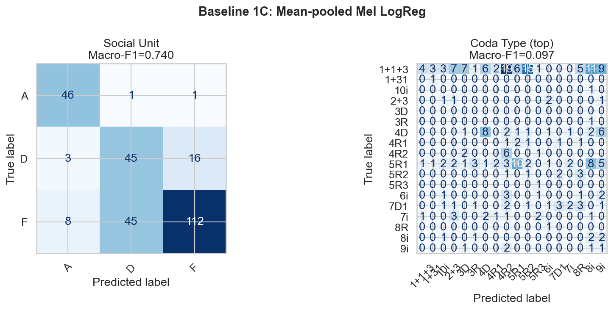
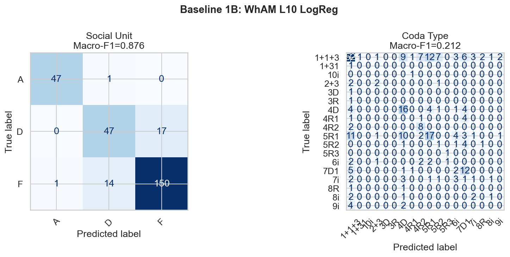
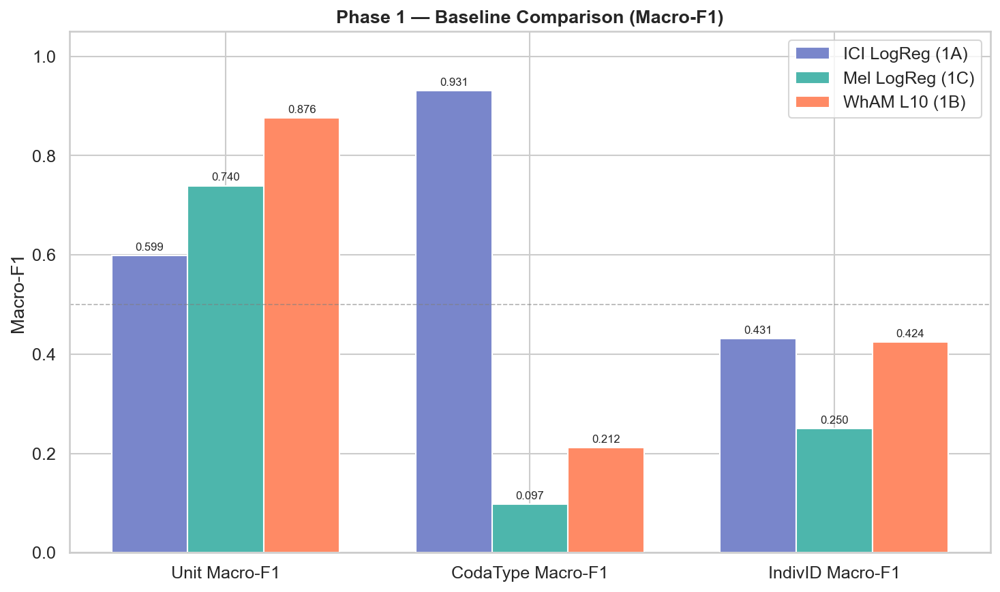
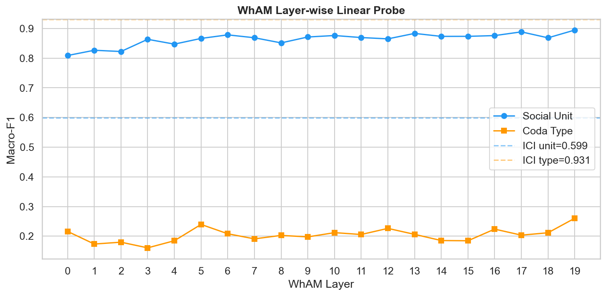
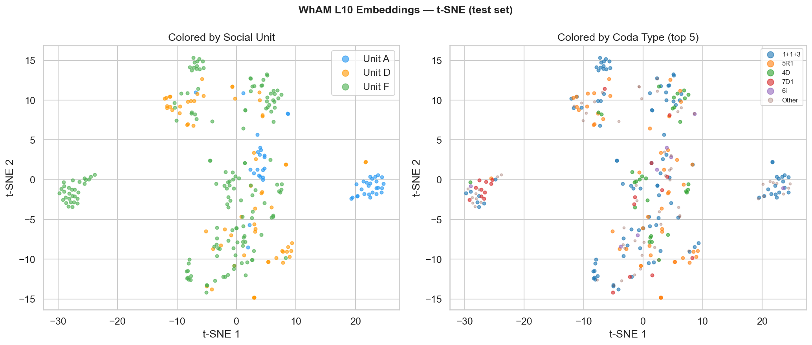
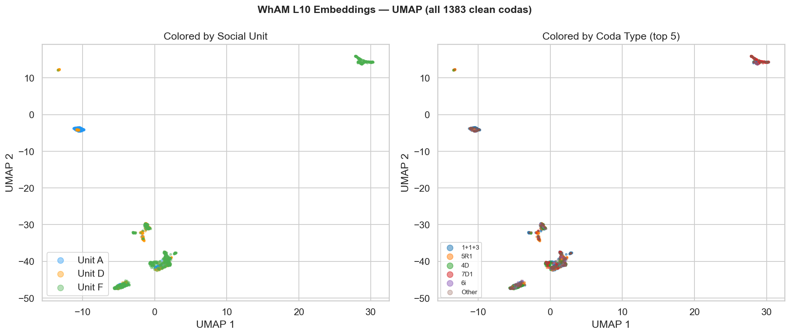

# Phase 1 — Baselines
**Project**: Beyond WhAM  
**Date**: 2026-04-20

---

## Results

| Model | Unit Macro-F1 | CodaType Macro-F1 | IndivID Macro-F1 | Unit Acc |
|---|---|---|---|---|
| Raw ICI → LogReg (1A) | 0.599 | **0.931** | 0.431 | 0.621 |
| Mean-pooled Mel → LogReg (1C) | 0.740 | 0.097 | 0.250 | 0.733 |
| WhAM L10 → LogReg (1B) | **0.876** | 0.212 | 0.424 | 0.881 |

### WhAM Layer-wise Probe
| Task | Best Layer | Macro-F1 |
|---|---|---|
| Social Unit | **L19** | **0.895** |
| Coda Type | L19 | 0.261 |

---

## Figure — ICI Rhythm Patterns

Mean ICI profile (± std) for the six most common coda types. Each panel plots mean ICI (ms) at positions 1–9 along the sequence. The shapes are visually distinctive:

- **`1+1+3`** has a flat, low-ICI profile (~130 ms) with a slight rise toward the end, reflecting its fast, even rhythm.
- **`5R1`** shows a sharp uptick at later positions, encoding a characteristic rhythm signature.
- **`7D1`** sustains high ICI values throughout, reflecting a slower, more drawn-out click pattern.

These shape differences explain why ICI achieves near-perfect coda-type classification (F1=0.931). The standard deviations are tight within each type — ICI timing is a reliable, low-variance code for coda identity.

---

## Figure — Baseline 1A Confusion Matrix (Raw ICI)

**Social Unit (left):** The ICI logistic regression classifies Unit F well (high recall) but confuses units A and D with each other and with F. The three-way confusion reflects the t-SNE finding from Phase 0 — units A, D, and F overlap heavily in ICI space. Macro-F1=0.599 is substantially above chance (0.33) but leaves a large gap compared to WhAM.

**Coda Type (right):** The confusion matrix for coda type shows a near-perfect diagonal. The model almost never confuses the dominant types, confirming that ICI timing encodes coda type with high fidelity. Minor off-diagonal entries occur for rare types that share similar ICI profiles.

---

## Figure — Mean Mel Profiles by Unit

Mean mel-spectrogram (64 bins × 128 frames) for each social unit, averaged over all training examples. Despite the inter-unit variability visible in Phase 0's sample spectrograms, the mean profiles are visually similar. All three show the characteristic click-impulse pattern with energy concentrated in the first ~30 mel bins. Subtle differences in the harmonic spread and temporal envelope are visible (Unit A's energy is slightly more concentrated in time; Unit F shows more diffuse low-frequency energy), but they are not dramatic. This moderate visual similarity is consistent with the mel logistic regression achieving F1=0.740 — real signal, but not overwhelming.

---

## Figure — Baseline 1C Confusion Matrix (Mean-pooled Mel)

**Social Unit (left):** The mel logistic regression classifies social units with F1=0.740, substantially better than raw ICI (0.599). Unit F is classified well; Units A and D still show some confusion. The improvement over ICI confirms that spectral texture adds real unit-discriminating information beyond rhythm timing alone.

**Coda Type (right):** The coda-type confusion matrix is nearly uniform — the mel feature has essentially no discriminating power for coda type (F1=0.097). This is the expected ceiling for the spectral encoder without rhythm information. It further validates the orthogonality of the two channels.

---

## Figure — Baseline 1B Confusion Matrix (WhAM L10)

**Social Unit (left):** WhAM L10 achieves F1=0.876, the strongest of all three baselines. The confusion matrix shows a clean diagonal with only rare misclassifications. WhAM's 1280-dimensional embedding, trained on a generative spectral objective, has internalized social-unit acoustics well.

**Coda Type (right):** WhAM's coda-type confusion matrix shows a broad, diffuse pattern — the model distributes probability across many classes rather than committing to the correct type. F1=0.212 is only marginally above the mel baseline (0.097), confirming that WhAM's representation does not capture rhythm timing any better than raw spectral features. Both WhAM and mel have simply no access to the ICI timing signal that is decisive for coda type.

---

## Figure — Baseline Comparison

The three-panel bar chart comparing all baselines across the three tasks makes the complementarity pattern unmistakable:

- **Unit Macro-F1 (left):** WhAM dominates (0.876), followed by Mel (0.740), then ICI (0.599). Social unit identity is primarily a spectral phenomenon — WhAM's generative objective learned it best.
- **CodaType Macro-F1 (center):** ICI dominates overwhelmingly (0.931 vs. 0.212 vs. 0.097). Coda type is entirely a rhythm phenomenon. The dashed reference lines for WhAM and Mel sit far below ICI. Neither a spectral feature nor a generative embedding can recover coda type without direct access to click timing.
- **IndivID Macro-F1 (right):** All three baselines cluster between 0.250 and 0.431. Individual identity is a hard task for linear probes — it requires the fine-grained, within-unit micro-variation that none of these features encode well. This is the primary gap DCCE targets.

---

## Figure — WhAM Layer-wise Linear Probe

Social unit F1 (blue) climbs steadily from L0=0.809 to a peak of L19=0.895, consistent with the transformer progressively integrating broader spectro-temporal context. The dashed blue line marks the raw ICI unit baseline (0.599) — WhAM surpasses it even at its first layer, showing that the waveform-level generative objective has already implicitly learned to encode social structure.

Coda-type F1 (orange) remains flat and low across all 20 layers (best=0.261 at L19). The dashed orange line marks the ICI coda-type baseline (0.931) — WhAM never approaches it at any layer. The generative objective simply did not learn to represent ICI timing, regardless of network depth.

**Key takeaway:** WhAM's L19 unit F1=0.895 sets the DCCE target. Coda-type classification is a task WhAM cannot do; the ICI rhythm channel provides the only strong signal here.

---

## Figure — WhAM t-SNE (Test Set)

**Left (colored by social unit):** The three social units form cleanly separated clusters in the WhAM t-SNE space. This visual separation confirms the high unit F1=0.876 — the 1280-dimensional embedding space has linear decision boundaries that a logistic regression can exploit easily. There are minimal overlap regions at cluster boundaries.

**Right (colored by coda type):** Coda types are interleaved throughout all three social-unit clusters. There is no spatial structure corresponding to coda type — consistent with WhAM's low coda-type F1 (0.212). The generative representation encodes "which unit made this coda" but not "which rhythm pattern was used."

---

## Figure — WhAM UMAP (All Clean Codas)

The UMAP of all 1,383 clean codas shows the same structure as the t-SNE but across the full dataset. The three social units form compact, well-separated manifolds. Unit F (green) is the largest manifold and contains the most internal structure, consistent with it being the most diverse unit. Unit A (blue) and Unit D (orange) form smaller, more compact clusters.

The right panel (colored by coda type) confirms that within each unit manifold, coda types are mixed uniformly — there is no sub-cluster structure corresponding to coda type. WhAM's representation is a pure social-identity embedding.

---

## Key Findings

### The two channels are complementary
ICI rhythm is near-perfect for coda type (F1=0.931) but weak for social unit (0.599). Mel spectral features reverse this: strong on unit (0.740), essentially random on coda type (0.097). The two baselines together define the orthogonal information structure that DCCE is designed to exploit jointly.

### WhAM is strong on social unit, blind to coda type
WhAM L10 unit F1=0.876; L19=0.895. WhAM coda-type F1=0.212 — essentially the same as the mean-pooled mel baseline. WhAM's generative spectral objective learned social-cultural identity but completely missed rhythm timing. This is the principal weakness DCCE addresses.

### Individual ID is a hard problem for linear probes
All three baselines plateau between 0.250–0.431 for individual ID. The signal exists (all beat a random baseline of ~0.077 for 13 classes) but is not linearly separable with simple features. This is the primary motivation for DCCE's cross-channel contrastive objective — linear probes are insufficient; learned representations are needed.

### DCCE targets
- Social Unit: must exceed WhAM L19 → **F1 > 0.895**
- Individual ID: must exceed WhAM L10 → **F1 > 0.424**
- Coda Type: ICI baseline (0.931) is the practical ceiling for this task
