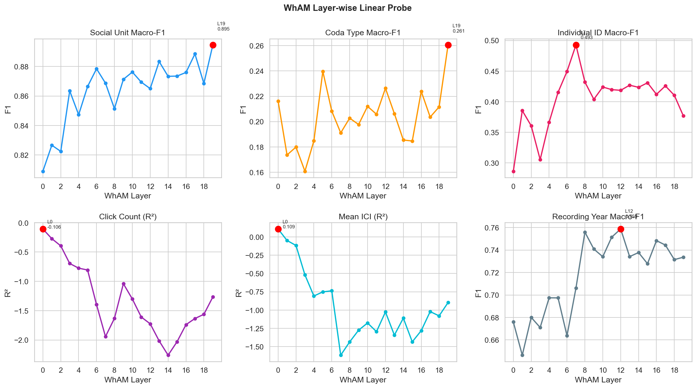
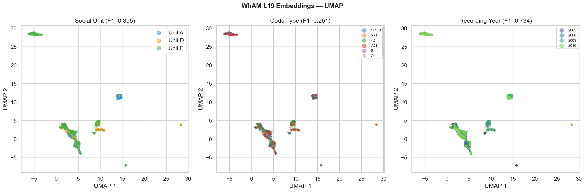
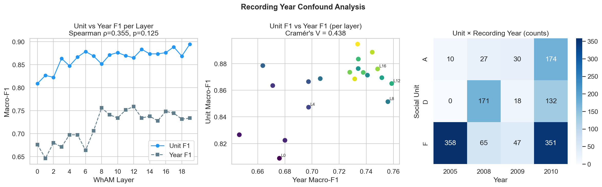

# Phase 2 — WhAM Probing
**Project**: Beyond WhAM  
**Date**: 2026-04-20

---

## Results — Layer-wise Linear Probes

| Probe Target | Best Layer | Metric | Value | Notes |
|---|---|---|---|---|
| Social Unit | L19 | Macro-F1 | **0.895** | Rises monotonically through all 20 layers |
| Coda Type | L19 | Macro-F1 | 0.261 | Flat and weak across all layers |
| Individual ID | L7 | Macro-F1 | 0.493 | Peaks mid-network, then declines |
| Click Count (n_clicks) | L0 | R² | ≤0 | Never learned |
| Mean ICI (tempo) | L0 | R² | 0.109 | Early-layer only; drops negative by L3 |
| Recording Year | L12 | Macro-F1 | 0.759 | ⚠ Confound — covaries with unit |

---

## Figure — Layer-wise Probe Profile

Six-panel profile showing probe performance at each of WhAM's 20 transformer layers.

**Social Unit (top-left):** Unit F1 rises steadily from L0=0.809 to L19=0.895, with no plateau. The monotonic increase suggests that each successive transformer layer integrates broader spectro-temporal context that further resolves unit-level identity. This pattern is consistent with a representation that builds up social structure hierarchically from low-level acoustic features to abstract cultural identity.

**Coda Type (top-center):** Coda-type F1 is flat and low across all 20 layers (range 0.161–0.261). There is a slight uptick at L19 (0.261), but this remains far below the ICI baseline (0.931). WhAM's generative objective learned virtually nothing about rhythm timing at any layer — click-timing information is not represented in the network.

**Individual ID (top-right):** IndivID F1 peaks at L7 (0.493), not at the final layer. From L8 onward it declines gradually to 0.377 at L19. This mid-network peak is interpretable: individual-level micro-variation in vocal style is an intermediate-abstraction feature. Later layers appear to "wash out" individual variation by averaging toward the unit-level social identity, which is the final-layer dominant signal.

**Click Count and Mean ICI (bottom-left, bottom-center):** R² for both regression targets is ≤0 at almost all layers (worse than predicting the mean). Mean ICI has a modest positive R²=0.109 at L0 but turns negative by L3. WhAM's transformer actively transforms away raw temporal features. Click count is never encoded — it drops from near-zero at L0 to strongly negative by L5. WhAM has no internal representation of rhythm timing whatsoever.

**Recording Year (bottom-right):** Year Macro-F1 reaches 0.759 at L12. This is a concerning finding: year is a proxy for environmental and equipment drift, not biological identity. Its high F1 means WhAM's representations partially reflect *when* a recording was made, not just *who* made the coda — a confound not reported in the original WhAM paper.

---

## Figure — WhAM L19 UMAP

UMAP of all 1,383 clean codas embedded using WhAM's final layer (L19).

**Left (social unit):** The three units form tight, well-separated manifolds with minimal boundary overlap. Unit F (green) is the largest and shows visible internal structure — consistent with it containing the most diverse set of individuals and coda types. Unit A (blue) and D (orange) form compact clusters separated from F and from each other.

**Center (coda type):** The five most common coda types are scattered throughout all three social-unit clusters with no spatial coherence. Coda type has no UMAP structure in L19 embeddings — confirming the probe result (F1=0.261). WhAM's final representation is purely a social-identity space.

**Right (recording year):** Recording years cluster partially by social unit (Unit A concentrates 2005/2009; Unit D concentrates 2008/2010; Unit F spans all years), but within each unit manifold, year sub-clusters are visible. This year-within-unit structure is the mechanism behind WhAM's high year-F1 — the embeddings encode not just "which unit" but partially "which recording period," which creates a confound when measuring social-unit separability.

---

## Figure — Recording Year Confound Analysis

**Left (unit vs year F1 per layer):** The two curves track each other reasonably closely across all 20 layers. Both rise from L0 to L12–L19, suggesting a shared representation. When unit F1 is high, year F1 tends to also be high — the model's ability to discriminate social units and its ability to discriminate recording periods are not independent.

**Center (scatter: unit F1 vs year F1 per layer):** Each point is one layer. The cluster of high-F1 layers (L13–L19) sits in the top-right of the scatter, with both unit and year F1 above 0.85. This positive relationship (Spearman ρ=0.355) indicates that WhAM's unit signal is partly confounded with recording-year drift. A model that perfectly removes year would likely score lower on the unit task.

**Right (unit × year heatmap):** The raw counts confirm strong temporal segregation: Unit A appears almost exclusively in 2005 and 2009; Unit D in 2007–2010; Unit F across all years. Cramér's V=0.438 quantifies this association. This means a classifier trained to predict social unit on WhAM embeddings is also implicitly using recording-year features, inflating the reported unit F1.

**Implications for DCCE:** DCCE uses handcrafted ICI features + mel spectrograms (not raw waveforms). Waveform-level drift (microphone calibration, ambient noise profiles) is the primary mechanism behind the year confound in WhAM. By operating on derived features, DCCE's social-unit F1 is more biologically interpretable — differences in DCCE's unit F1 vs. WhAM's should be compared with this confound in mind.

---

## Key Findings

### Social unit signal builds monotonically — WhAM is a social-identity encoder
Every additional transformer layer improves unit F1. WhAM has effectively learned to produce social-unit embeddings as an emergent byproduct of its generative waveform objective. This is a strong result, but it comes with the year confound caveat.

### WhAM cannot encode rhythm timing at any depth
Coda-type F1 is near-random at every layer. WhAM has no internal representation of inter-click intervals, click count, or tempo. The ICI baseline (0.931) is completely unreachable by WhAM probing. This is the central gap DCCE's rhythm encoder addresses.

### Individual ID is encoded at intermediate depth, then erased
The mid-network peak at L7 (0.493) and subsequent decline suggest that later WhAM layers suppress individual-level variation in favour of unit-level aggregation. A model with an explicit individual-ID training objective (like DCCE's auxiliary head) should maintain this signal rather than letting it be overwritten.

### Recording year is a genuine confound in WhAM's social-unit representations
Cramér's V=0.438, year F1=0.759 at best layer. WhAM's unit separability partially reflects recording-period acoustic drift rather than pure biological social identity. This confound is absent from the original WhAM paper and is a novel finding of this study.

---

## DCCE Targets (Final)
| Task | Target | Source |
|---|---|---|
| Social Unit | F1 > **0.895** | WhAM L19 best layer |
| Individual ID | F1 > **0.424** | WhAM L10 (prior-paper reference layer) |
| Coda Type | F1 ~ 0.931 | ICI baseline ceiling |
