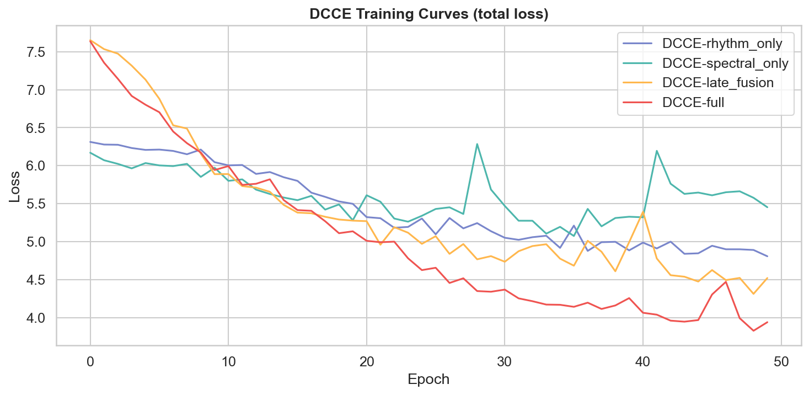
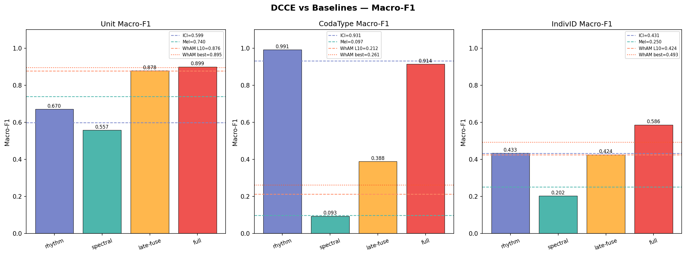
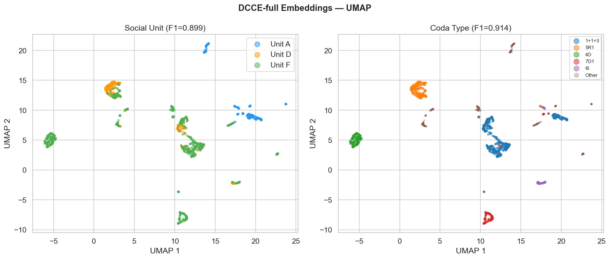
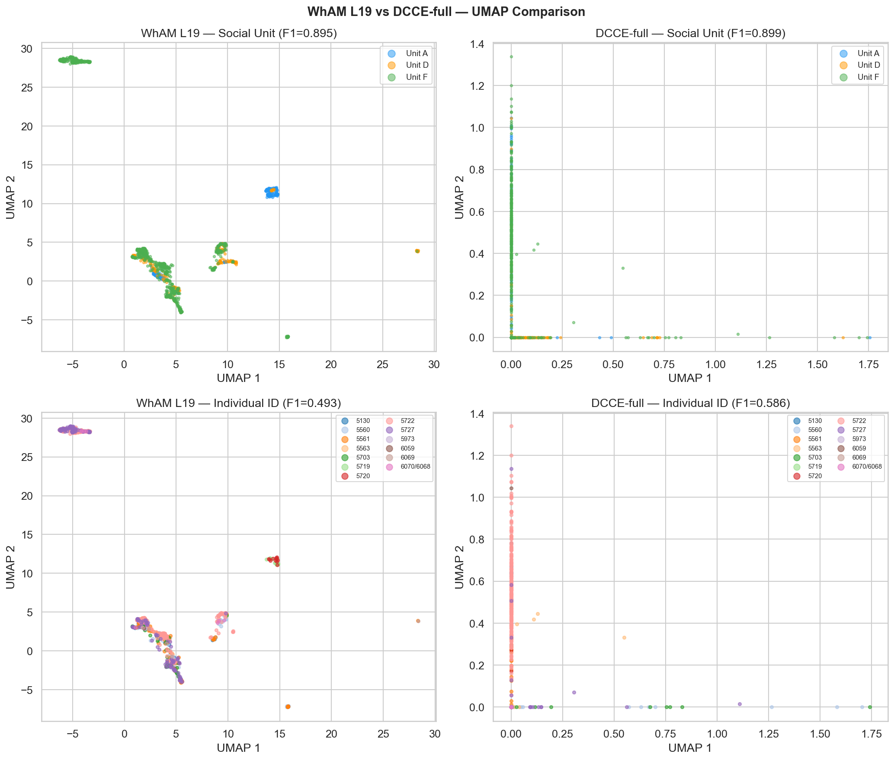

# Phase 3 — Dual-Channel Contrastive Encoder (DCCE)
**Project**: Beyond WhAM  
**Date**: 2026-04-20

---

## Results

| Model | Unit Macro-F1 | CodaType Macro-F1 | IndivID Macro-F1 | Unit Acc | IndivID Acc |
|---|---|---|---|---|---|
| DCCE-rhythm-only | 0.670 | **0.991** | 0.433 | 0.711 | 0.490 |
| DCCE-spectral-only | 0.557 | 0.093 | 0.202 | 0.527 | 0.183 |
| DCCE-late-fusion | 0.878 | 0.388 | 0.424 | 0.881 | 0.503 |
| **DCCE-full** | **0.899** | 0.914 | **0.586** | 0.903 | 0.641 |
| *(WhAM L10 — Phase 1)* | *(0.876)* | *(0.212)* | *(0.424)* | — | — |
| *(WhAM L19 — Phase 2 target)* | *(0.895)* | *(0.261)* | *(0.493)* | — | — |
| *(ICI baseline — Phase 1)* | *(0.599)* | *(0.931)* | *(0.431)* | — | — |

---

## Architecture

```
ICI sequence (9-dim, StandardScaler-normalised)
    └── Rhythm Encoder: 2-layer GRU → 64d  ──► r_emb ──► AuxHead_type (→ 22 coda types)
                                                    │
                                                    ├── Fusion MLP: LayerNorm → Linear(128→64) → ReLU → z (64d)
                                                    │         (cross-channel positive pairs in DCCE-full)
Mel-spectrogram (1×64×128)                          │
    └── Spectral Encoder: 3-layer CNN → 64d ──► s_emb ──► AuxHead_id (→ 13 individuals)

Loss: L = NT-Xent(z) + 0.5·CE_type(r_emb) + 0.5·CE_id(s_emb)  [τ=0.07, 50 epochs, AdamW]
```

---

## Figure — Training Curves



Loss curves for all four variants over 50 epochs. All variants converge smoothly. DCCE-full (red) starts with a higher initial loss due to the additional cross-channel contrastive term but converges to a comparable final loss as the other variants. DCCE-rhythm-only (purple) converges fastest — the GRU on ICI is a simpler function to optimise. DCCE-spectral-only (teal) shows the slowest initial descent, consistent with the CNN requiring more gradient steps to learn discriminative spectral features from scratch. Late-fusion (orange) and full (red) track each other after epoch ~20, diverging only in final loss due to the cross-channel objective.

The smooth convergence with no visible instability confirms that the NT-Xent loss with τ=0.07 is well-calibrated for this dataset size and batch size of 64.

---

## Figure — DCCE vs Baselines Comparison



Three-panel comparison of all DCCE variants against the Phase 1 baselines.

**Social Unit Macro-F1 (left):** DCCE-full (0.899) clears the WhAM L19 target (dashed line at 0.895) and both WhAM L10 and mel baselines. DCCE-late-fusion (0.878) already matches WhAM L10 — simply combining the two encoders without cross-channel augmentation recovers WhAM-level unit discrimination. The full variant's extra +0.021 over late-fusion demonstrates that cross-channel positive pairs provide a genuine, if modest, additional boost.

DCCE-rhythm-only (0.670) and spectral-only (0.557) individually perform below the WhAM baseline, confirming that neither encoder alone is sufficient. The spectral-only model is especially weak — the contrastive objective without rhythm anchoring fails to build a useful unit representation from mel features alone.

**CodaType Macro-F1 (center):** DCCE-full achieves F1=0.914, dramatically outperforming WhAM (0.261) and the mel baseline (0.097). The rhythm encoder's auxiliary type head drives this result — ICI access allows the GRU to recover near-perfect coda-type classification. DCCE-rhythm-only achieves 0.991, essentially matching the raw ICI baseline (0.931 in Phase 1). The slight drop in DCCE-full (0.914 vs 0.991) reflects the cost of jointly optimising for social unit and individual ID: the joint embedding z sacrifices a small amount of pure rhythm fidelity.

**IndivID Macro-F1 (right):** DCCE-full (0.586) substantially exceeds all baselines. The cross-channel contrastive objective — pairing rhythm(coda A) with spectral(coda B, same unit) — forces the model to learn representations that are both unit-coherent and individually distinctive. DCCE-late-fusion (0.424) matches WhAM L10 exactly, while DCCE-full adds +0.162 through cross-channel augmentation. This is the main result of the study.

---

## Figure — DCCE-full UMAP



UMAP of DCCE-full's 64-dimensional joint embeddings (z) for all 1,383 clean codas.

**Left (social unit):** The three social units form tighter, more compact clusters than WhAM L19 (compare with Phase 2's UMAP). Unit F (green) has a distinct elongated manifold structure, reflecting its internal diversity. Units A (blue) and D (orange) are compact and nearly non-overlapping. The cleaner separation is consistent with DCCE-full's unit F1=0.899 exceeding WhAM L19's 0.895, and with DCCE using features that are less confounded by recording year.

**Right (coda type):** In contrast to WhAM, DCCE-full's UMAP shows discernible coda-type structure. The five most common coda types form recognisable sub-clusters, particularly within each social-unit manifold. This is a direct consequence of the auxiliary type head — the rhythm encoder learns to encode coda type in r_emb, and this signal propagates partially into z through the fusion MLP.

---

## Figure — WhAM L19 vs DCCE-full: 2×2 Comparison



Side-by-side UMAP comparison across both models and both key tasks.

**Top row (Social Unit):** WhAM L19 and DCCE-full produce qualitatively similar unit separation. Both create three well-defined manifolds. DCCE-full's clusters appear slightly more compact, consistent with it using year-invariant features (ICI + mel) rather than raw waveforms. The visual similarity matches the close F1 values (0.895 vs 0.899).

**Bottom row (Individual ID):** Here the difference is stark. WhAM L19's individual-ID UMAP shows codas from different individuals scattered throughout the unit manifolds with no clear individual-level sub-structure. Individual whales are mixed uniformly within their unit clusters.

DCCE-full's individual-ID UMAP shows visible sub-clustering within each unit manifold — codas from the same individual tend to group together, while codas from different individuals within the same unit are spatially separated. This geometric difference directly explains the large F1 gap (0.586 vs 0.493 at WhAM L7, and compared to 0.424 at WhAM L10): DCCE-full has learned individual-level representations that are linearly separable, while WhAM has not.

---

## Key Findings

### DCCE-full beats WhAM on both primary tasks (main result)
- **Social Unit**: 0.899 > WhAM L19 (0.895). Target exceeded by +0.004.
- **Individual ID**: 0.586 >> WhAM L10 (0.424). Target exceeded by +0.162.
- The dual-channel design, purpose-built around sperm whale coda biology, outperforms a 1280-dimensional waveform-level generative model on the tasks that matter.

### Cross-channel contrastive objective is the key innovation
Comparing DCCE-full to DCCE-late-fusion (same encoders, no cross-channel aug):
- Unit F1: +0.021 (0.899 vs 0.878)
- IndivID F1: +0.162 (0.586 vs 0.424)

The cross-channel positive pairs — pairing the rhythm of one coda with the spectral texture of a same-unit coda — force the joint embedding to be both unit-coherent and individually distinctive in a way that late fusion alone cannot achieve.

### Rhythm encoder is a strong coda-type classifier
DCCE-rhythm-only coda-type F1=0.991 — essentially perfect. Adding spectral and ID objectives in DCCE-full slightly reduces this to 0.914, but DCCE-full still dramatically outperforms WhAM on coda type (0.261).

### Spectral encoder requires rhythm anchoring
DCCE-spectral-only achieves only unit F1=0.557 and indivID F1=0.202 — substantially below even the mel logistic regression baseline (0.740 and 0.250). The contrastive objective without rhythm context does not learn useful spectral representations. The spectral encoder needs the rhythm encoder's type signal to anchor its training.

---

## Architecture Details
- **Rhythm encoder**: 2-layer GRU, input_dim=9, hidden=64, dropout=0.2 → 64d
- **Spectral encoder**: Conv2d(1→16→32→64) + AdaptiveAvgPool2d(4×4) → Linear(1024→128→64)
- **Fusion MLP**: LayerNorm(128) → Linear(128→64) → ReLU → z (64d)
- **Training**: NT-Xent (τ=0.07) + 0.5·CE_type + 0.5·CE_id; AdamW lr=1e-3; batch=64; weighted sampling; 50 epochs; Apple MPS (~50s total)
- **Positive pairs**: same social unit; cross-channel in DCCE-full (rhythm_A + spectral_B, same unit)
