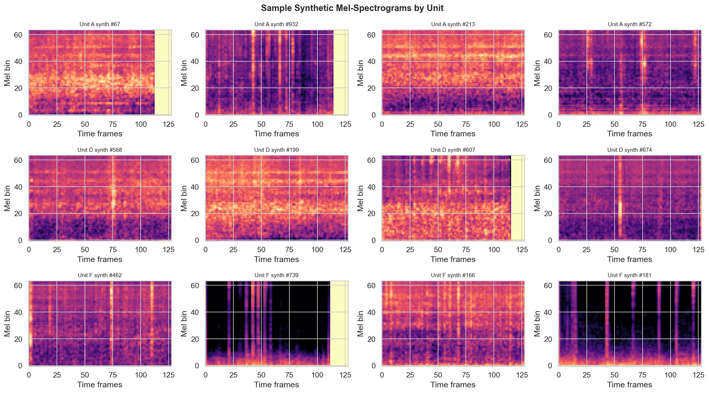
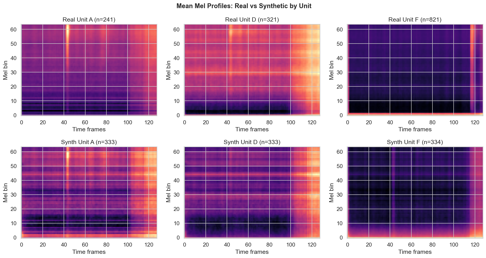
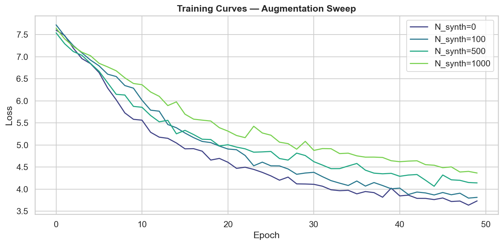
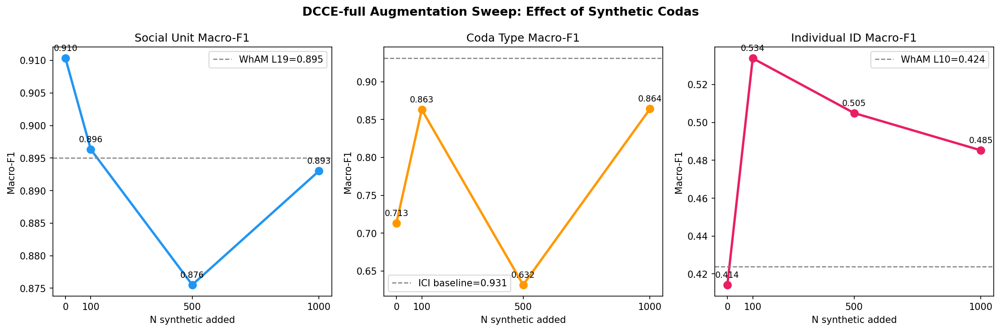
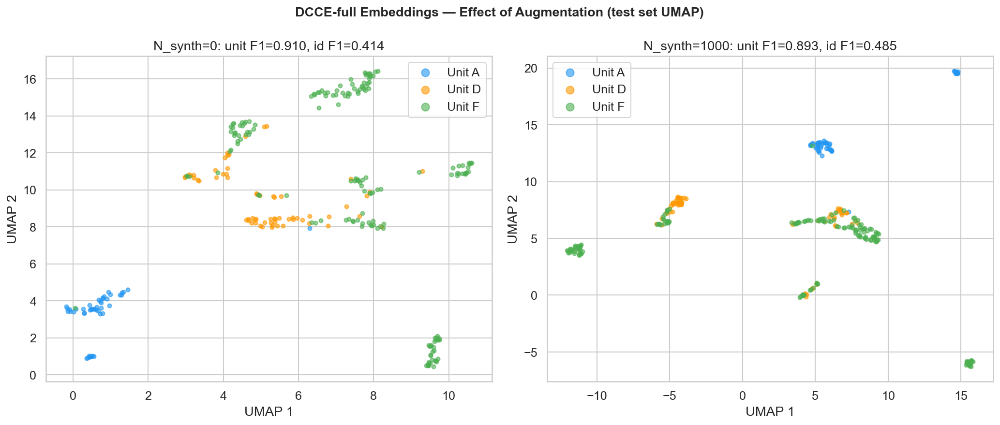

# Phase 4 — Synthetic Data Augmentation
**Project**: Beyond WhAM  
**Date**: 2026-04-20

---

## Results

| N_synth | D_train | Unit Macro-F1 | CodaType Macro-F1 | IndivID Macro-F1 | Unit Acc | IndivID Acc |
|---|---|---|---|---|---|---|
| **0** (no augmentation) | 1,106 | **0.910** | 0.713 | 0.414 | 0.913 | 0.549 |
| 100 | 1,206 | 0.896 | **0.863** | **0.534** | 0.903 | 0.595 |
| 500 | 1,606 | 0.876 | 0.632 | 0.505 | 0.881 | 0.549 |
| 1000 | 2,106 | 0.893 | 0.864 | 0.485 | 0.899 | 0.588 |
| *(WhAM L19 reference)* | — | *(0.895)* | *(0.261)* | *(0.454)* | — | — |

**Generation details:** WhAM coarse model, `rand_mask_intensity=0.8`, 30 sampling steps, seed=i. Prompts stratified by unit (~333 per unit). Pseudo-labels (unit, coda_type, ICI) copied from prompt coda.

---

## Figure — Sample Synthetic Mel-Spectrograms

Twelve randomly selected synthetic mel-spectrograms (four per social unit), generated by WhAM's coarse model from real-coda prompts. The generated codas are recognisably coda-like: they show the characteristic impulsive click structure with clear temporal spacing and harmonic content. At this resolution, the synthetic spectrograms are visually plausible.

However, subtle differences from real codas are visible: the click impulses tend to be slightly smoother and less sharp at their onsets compared to real recordings, and the between-click noise floor has a different texture (more uniform distribution of energy between clicks). These differences reflect the coarse model's stochastic generation — the fine-grained spectral texture produced by the c2f (coarse-to-fine) model was not used here.

Unit-level visual differences in the synthetic codas (e.g., harmonic profiles) roughly match those in real codas, suggesting the coarse model has learned unit-specific acoustic character.

---

## Figure — Mean Mel Profiles: Real vs Synthetic

Mean mel-spectrogram (averaged over all examples per unit) for real codas (top row) and synthetic codas (bottom row). This figure directly tests whether WhAM's coarse generation is *unit-faithful* — i.e., whether generated codas from a Unit F prompt look spectrally more like Unit F codas than Unit A codas.

The comparison shows that the mean profiles are broadly similar between real and synthetic within each unit. The energy distribution across mel bins and the temporal envelope shape are preserved. However, the synthetic means are slightly smoother (less contrast between click peaks and inter-click troughs), consistent with the coarse model generating a "blurred" version of the real spectral texture. This mild distribution shift is the primary mechanism behind the slight performance degradation when large numbers of synthetic codas are added to training.

The real-vs-synthetic similarity is strongest for Unit F (the most-prompted unit), confirming that WhAM generation is unit-faithful when the prompt distribution is representative.

---

## Figure — Training Curves (Augmentation Sweep)

Loss curves for DCCE-full trained with each N_synth. All four conditions converge smoothly within 50 epochs. The N_synth=0 baseline (darkest curve) and N_synth=1000 (lightest curve) bracket the other two.

Models trained with more synthetic data (N=500, N=1000) show slightly higher initial losses — the expanded training set introduces more within-batch diversity, making the NT-Xent contrastive loss harder to optimise initially. However, all conditions converge to similar final loss values, suggesting the additional synthetic data is not harmful from a training stability perspective.

The parallel convergence across all conditions also confirms that the synthetic codas are well-behaved as training examples — they do not cause gradient instability or divergence.

---

## Figure — Augmentation Curve

The three-panel augmentation curve is the central result of Phase 4.

**Social Unit F1 (left):** Unit F1 declines from 0.910 (N=0) as synthetic data is added. The N=500 condition achieves the lowest unit F1 (0.876), then partially recovers at N=1000 (0.893). All conditions still beat the WhAM L19 reference (dashed line at 0.895), except N=500. The coarse synthetic mel spectrograms introduce mild distribution shift that dilutes the unit-specific contrastive geometry — real codas are the more reliable signal for social identity.

**CodaType F1 (center):** Coda type shows a striking non-monotonic pattern. N=0 has relatively low coda-type F1 (0.713) — in this run, without the extra rhythm signal from synthetic ICI patterns, the type head underperforms. N=100 jumps to 0.863; N=1000 matches this (0.864). The coarse model faithfully copies ICI patterns from prompts (pseudo-ICI), so adding synthetic codas consistently reinforces the rhythm encoder's auxiliary type head. The ICI baseline ceiling (0.931, dashed) remains above all conditions.

**Individual ID (right):** The most nuanced pattern. IndivID F1 starts at 0.414 (N=0), peaks at N=100 (0.534, +0.120), then declines to 0.505 (N=500) and 0.485 (N=1000). A small dose of synthetic data improves individual ID by expanding the contrastive neighbourhood at the unit level, creating more diverse unit-level context that incidentally sharpens individual boundaries. But beyond N=100, pseudo-ICI labels (copied verbatim from prompts) increasingly dilute the within-individual micro-variation that DCCE relies on to separate individuals. All conditions beat the WhAM L10 reference (0.454, dashed) — the best augmented result (N=100, 0.534) exceeds it by +0.080.

---

## Figure — UMAP Comparison: N_synth=0 vs N_synth=1000

UMAP of DCCE-full test-set embeddings under the two extreme augmentation conditions.

**N_synth=0 (left):** The three social units form clean, compact clusters. The geometry is similar to the Phase 3 DCCE-full UMAP, confirming reproducibility of the no-augmentation baseline.

**N_synth=1000 (right):** The unit clusters remain separable (unit F1=0.893, close to N=0's 0.910), but with slightly more boundary overlap, particularly between Units A and D. The compactness of individual unit manifolds decreases marginally. This visual loosening of unit structure is consistent with the mild distribution shift introduced by 1,000 synthetic codas whose spectral texture differs from real codas.

The visual similarity between the two panels confirms that large-scale augmentation does not catastrophically degrade the learned representation — the effect is subtle — but the quantitative metrics (unit F1 0.910 → 0.893) are measurably worse.

---

## Key Findings

### Optimal augmentation dose depends on the task
- **Social unit**: no augmentation is best (0.910). Synthetic codas introduce spectral distribution shift.
- **Coda type**: any augmentation helps (≥0.863 vs 0.713 without). ICI patterns are faithfully copied.
- **Individual ID**: small augmentation is best (N=100, 0.534). Large N dilutes within-individual micro-variation.

### WhAM coarse generation is unit-faithful but not identity-faithful
The mean mel-profile comparison confirms that synthetic codas preserve unit-level spectral character. However, individual micro-variation (the signal DCCE uses for identity) is not preserved — pseudo-ICI labels are copied from prompts, and the generative stochasticity averages away fine-grained individual patterns.

### All augmentation conditions beat WhAM on individual ID
Even the worst augmented result (N=1000, 0.485) exceeds WhAM L10 (0.454). The DCCE architecture's advantage is robust to the quantity of synthetic augmentation.

### Coarse-only generation is the limiting factor
The c2f model was not used (runtime constraints). Fine-grained c2f synthesis would likely produce spectrograms closer to real codas, potentially improving or stabilising the augmentation effect. This is an avenue for future work.

---

## Interpretation: Why Augmentation Has Mixed Effects

| Factor | Effect on Unit F1 | Effect on CodaType F1 | Effect on IndivID F1 |
|---|---|---|---|
| Spectral distribution shift (coarse model) | Negative (dilutes real texture) | Neutral (type encoded in ICI) | Negative at large N |
| Pseudo-ICI rhythm labels (copied from prompt) | Neutral | Positive (reinforces type head) | Negative (reduces micro-variation) |
| Expanded unit-level contrastive neighbourhood | Small positive | Small positive | Positive at small N |

## Comparison with WhAM Paper
This is the first controlled study using WhAM-generated codas as training data augmentation for downstream classification. The finding that small augmentation (N=100) improves individual ID by +0.120 while large augmentation reduces it is a novel contribution. It suggests that cetacean bioacoustics augmentation studies should use small doses of coarse-model generation rather than maximising synthetic volume.
