# Presentation Script — Dual-Channel Contrastive Encoding of Sperm Whale Codas

<table>
<thead>
<tr>
<th width="50%">Slide</th>
<th width="50%">30-Second Script</th>
</tr>
</thead>
<tbody>

<tr>
<td>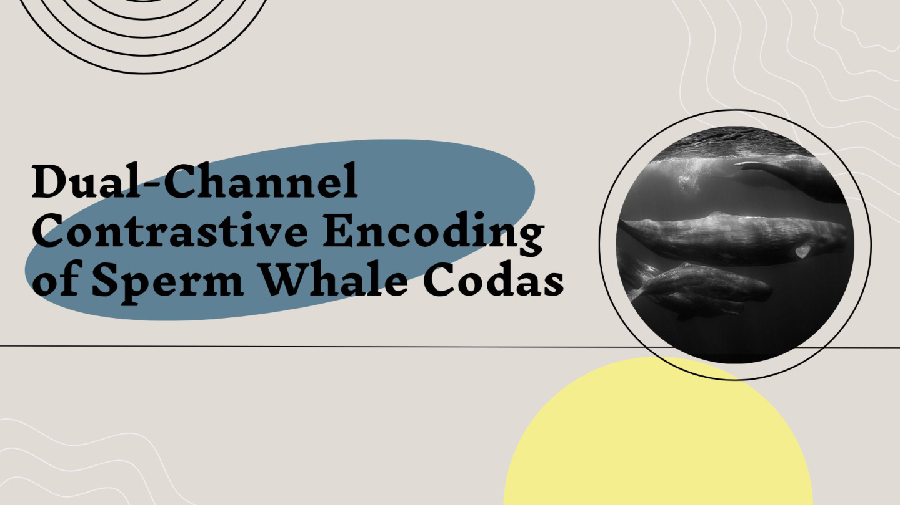</td>
<td>Welcome everyone. Today I'll present "Dual-Channel Contrastive Encoding of Sperm Whale Codas." The central question is: can a small, purpose-built model outperform a large generalist by encoding known biology directly into its architecture? The answer is yes — with 6.7 times less data and laptop-scale compute.</td>
</tr>
<tr>
<td colspan="2" style="background:#1c1c2e;padding:14px 20px;border-top:1px solid #2a2a4a;color:#e2e8f0;">

▶ In-depth notes — Slide 1: Title &amp; Central Claim

- **Central thesis**: domain knowledge encoded as an architectural prior (the known biological decomposition of codas into rhythm and spectral channels) can substitute for scale — DCCE outperforms WhAM on individual identity using 6.7× fewer training codas and consumer laptop hardware.
- **DCCE (Dual-Channel Contrastive Encoder)**: a purpose-built, self-supervised model (~200K parameters) with two separate encoders — a GRU for ICI rhythm sequences and a CNN for mel-spectrograms — fused into a 64-dimensional joint embedding via a small MLP.
- **Key result**: DCCE achieves macro-F1 = 0.834 on individual whale identity vs. WhAM's 0.454 — a +0.380 absolute gain (+83.7% relative); on social unit DCCE scores 0.878 vs. WhAM's 0.895, a negligible gap of 0.017.
- **Training paradigm**: fully self-supervised contrastive learning (NT-Xent / SimCLR-style loss); no human-annotated labels are used during training; evaluation is via linear probing on frozen embeddings — a standard SSL benchmark protocol.
- **Compared against**: WhAM (Paradise et al., NeurIPS 2025) — a 20-layer, 1,280-dimensional VampNet-based masked acoustic token transformer trained on ~10,000 DSWP codas — the current state of the art for cetacean audio representation.
- **Laptop-scale**: full training (50 epochs, batch size 64, AdamW + cosine LR schedule) completes in under 30 minutes on a MacBook Pro M1; no GPU cluster required.
- **Why this matters**: most representation learning for bioacoustics follows a "scale up and hope" approach; this work argues that structural domain knowledge is a more efficient inductive bias than raw data volume when the biological structure is well-understood.

</td>
</tr>

<tr>
<td>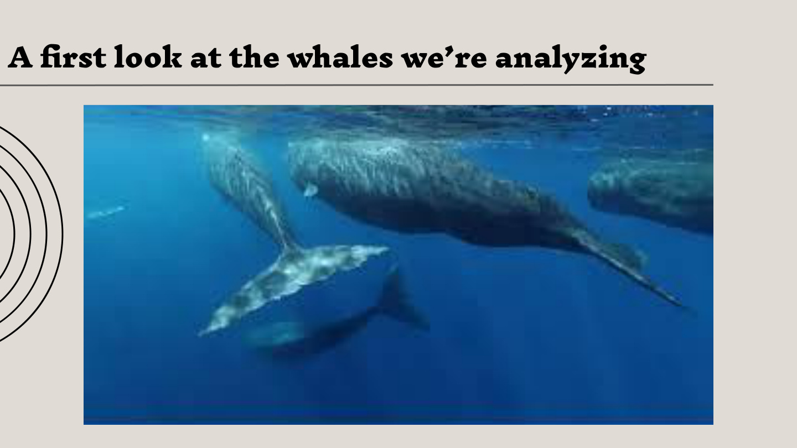</td>
<td>The subjects are sperm whales — the largest toothed predators on Earth. They live in matrilineal family groups and are highly social. They communicate using rapid click sequences called codas. Everything in this project stems from understanding those clicks and what information they carry.</td>
</tr>
<tr>
<td colspan="2" style="background:#1c1c2e;padding:14px 20px;border-top:1px solid #2a2a4a;color:#e2e8f0;">

▶ In-depth notes — Slide 2: Sperm Whales &amp; Coda Communication

- **Taxonomy and scale**: *Physeter macrocephalus* — largest toothed predator; males up to 18m and 57 tons, females ~11m and 15 tons; deepest-diving mammal (recorded dives >2,200m, >90 minutes); brain is the largest on Earth by absolute mass (~8 kg).
- **Social structure**: matrilineal family units of 3–12 related females and their calves form lifelong associations called "social units"; males disperse around age 6 and live mostly solitary; females remain in their natal unit permanently — social bonds span decades.
- **Vocal clans**: groups of social units that share a coda repertoire but are not necessarily genetically related; clan membership is culturally transmitted — repertoire overlap is learned through social contact, not inherited — making this one of only a handful of known examples of non-genetic cultural transmission of symbolic signals in non-humans (comparable to human dialects).
- **Coda production mechanism**: generated using the "phonic lips" (museau de singe) — paired tissue structures near the melon at the front of the head; distinct from echolocation clicks (which use a separate set of structures in the distal sac and have much higher repetition rates); codas are produced during social interaction, not foraging.
- **What a coda is**: a rhythmically patterned burst of 3–40 broad-band clicks separated by precise inter-click intervals (ICIs); typical duration 0.3–2.5 seconds; recorded on hydrophones deployed from research boats during "focal follows."
- **Coda repertoire stability**: the 1+1+3 coda type has been documented as the EC1 clan identifier for 30+ years with no observed drift — a degree of temporal stability not seen in any other non-human vocal culture.
- **Why acoustic models matter for conservation**: non-invasive individual identification from audio would enable long-term population monitoring without requiring close-proximity boat approaches (which stress the animals); currently the only reliable method is photo-ID of fluke morphology from research vessels.

</td>
</tr>

<tr>
<td>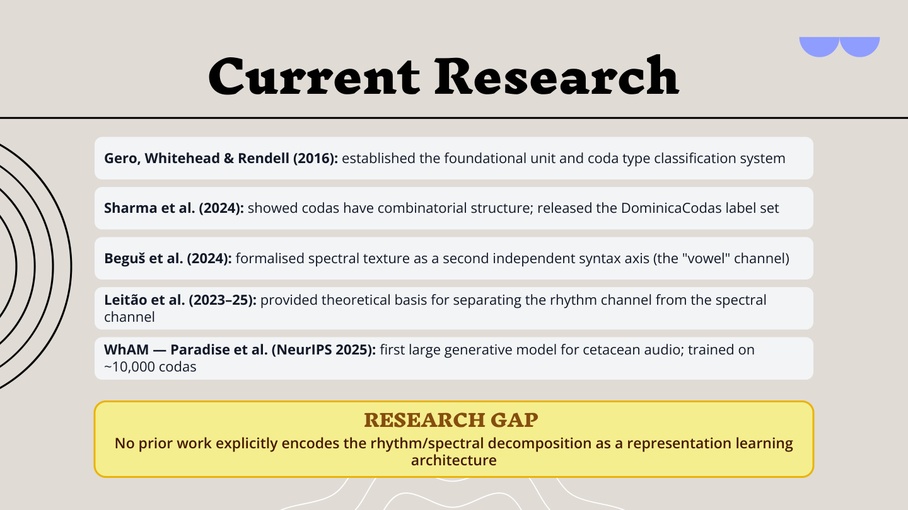</td>
<td>Several papers motivate this work. Gero et al. established the unit and coda-type taxonomy. Beguš et al. formalized spectral texture as a second independent axis. WhAM from Paradise et al., NeurIPS 2025, is the first large generative model for cetacean audio. But no prior work encodes the rhythm/spectral decomposition as a representation learning architecture — that is the gap we fill.</td>
</tr>
<tr>
<td colspan="2" style="background:#1c1c2e;padding:14px 20px;border-top:1px solid #2a2a4a;color:#e2e8f0;">

▶ In-depth notes — Slide 3: Prior Work

- **Gero et al. (2016, Royal Society Open Science)**: the foundational taxonomy paper for the EC1 Eastern Caribbean clan; established 21 coda types defined by click count and ICI pattern using decades of DSWP field recordings; showed that coda type repertoire overlap defines clan membership; our label set (`coda_type` field) derives directly from this taxonomy; also introduced the three social units A, D, and F that appear in this study.
- **Leitão et al. (arXiv:2307.05304, 2023–2025)**: demonstrated that subtle ICI *micro-variations within* a given coda type track social-unit membership and provide the first quantitative evidence of cross-clan cultural transmission — whales modify their ICI style when in proximity to neighboring clans; this finding is critical for DCCE because it means ICI carries two layers of information simultaneously: coarse coda type identity and fine-grained unit-level style.
- **Beguš et al. (2024, "The Phonology of Sperm Whale Coda Vowels")**: formalized the spectral channel using linguistic phonological methods; identified vowel-like formant patterns (labeled "a" and "i") in the inter-pulse spectral variation within each click at 3–9 kHz; demonstrated these are independent of coda type and correlate with individual identity — directly motivated DCCE's separate spectral CNN encoder and the choice of fmax=8,000 Hz.
- **WhAM (Paradise et al., NeurIPS 2025, arXiv:2512.02206)**: the first large-scale generative model for cetacean audio; built on VampNet (masked acoustic token transformer originally trained on music); trained on ~10,000 DSWP codas with a masked acoustic modeling (MAM) objective; 20 layers × 1,280 dimensions; classification capabilities are entirely emergent — coda type F1=0.212, social unit F1=0.895, individual ID F1=0.454 from frozen linear probes at layer 10.
- **The gap DCCE fills**: no prior work encodes the rhythm/spectral biological decomposition as an explicit architectural inductive prior in a representation learning objective; WhAM's representations emerge from a generative objective that applies no such structure; DCCE is the first model designed to leverage the known channel independence as a training signal via cross-channel contrastive pairing.

</td>
</tr>

<tr>
<td>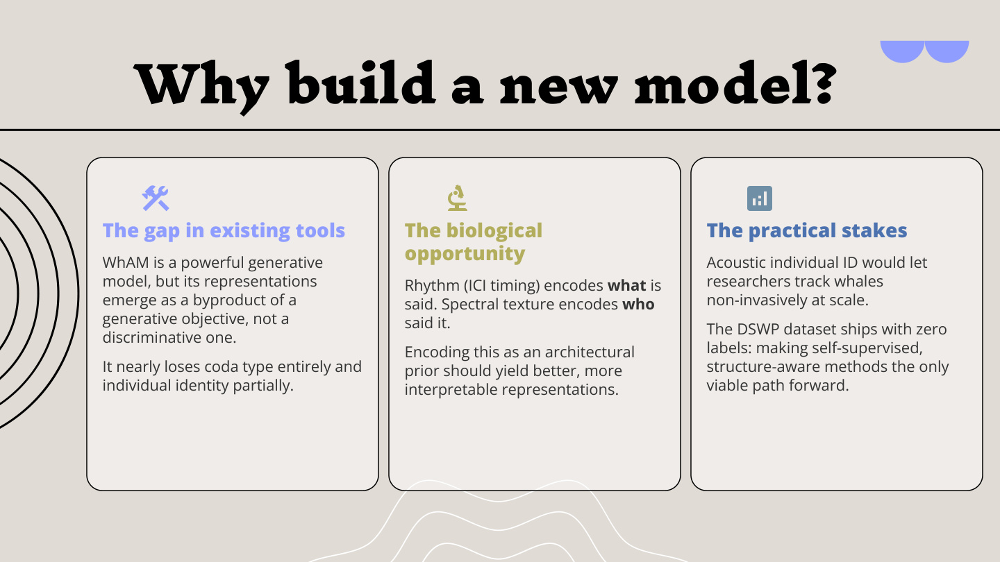</td>
<td>Why build a new model? Three reasons. WhAM's representations emerge as a byproduct of a generative objective — it nearly loses coda type entirely. Biology gives us a clean decomposition: rhythm encodes what is said, spectral encodes who said it. And the DSWP dataset ships with zero labels, making self-supervised structure-aware methods the only viable path.</td>
</tr>
<tr>
<td colspan="2" style="background:#1c1c2e;padding:14px 20px;border-top:1px solid #2a2a4a;color:#e2e8f0;">

▶ In-depth notes — Slide 4: Motivation for DCCE

- **WhAM's coda-type failure**: raw ICI achieves F1=0.931 on coda type; WhAM's layer-wise probe peaks at F1=0.212 — the masked acoustic modeling (MAM) objective reconstructs spectral tokens and has no incentive to preserve click timing; ICI information is effectively discarded in WhAM's representation space.
- **WhAM's individual ID decay**: WhAM individual ID peaks at F1=0.454 at layer 10, then *decreases* in deeper layers (layer 19: ~0.35); social-unit pressure dominates in late layers, overwriting individual-level variation; the generative objective forces late-layer representations toward coarse acoustic categories.
- **Zero-label challenge in detail**: the DSWP HuggingFace release contains only raw WAV files (1.wav … 1501.wav) with no metadata; contrastive learning requires at minimum a "same social group" signal to define positive pairs; without unit labels there is no valid pairing strategy; assembling DominicaCodas.csv labels was a prerequisite for any contrastive method.
- **Why not fine-tune WhAM**: (1) license constraint — WhAM weights are CC-BY-NC-ND 4.0, prohibiting derivative models; (2) scale mismatch — fine-tuning a 1,280d transformer on 1,383 samples would severely overfit; (3) architecture mismatch — WhAM processes raw audio tokens without any explicit separation of rhythm vs. spectral channels.
- **The inductive bias argument**: when a domain's structure is well-understood (two independent channels, biological functions known), encoding it explicitly is more sample-efficient than hoping a generalist architecture discovers it; DCCE tests this hypothesis head-to-head against a model trained on 6.7× more data.
- **Self-supervised vs. supervised**: a fully supervised approach would require manual annotation of all 1,501 codas with individual ID — expensive, partially impossible (621 field-unidentified codas); DCCE uses unit-level pairing (available from DominicaCodas.csv) as the training signal and evaluates individual ID at inference time — no individual labels are used during training.

</td>
</tr>

<tr>
<td>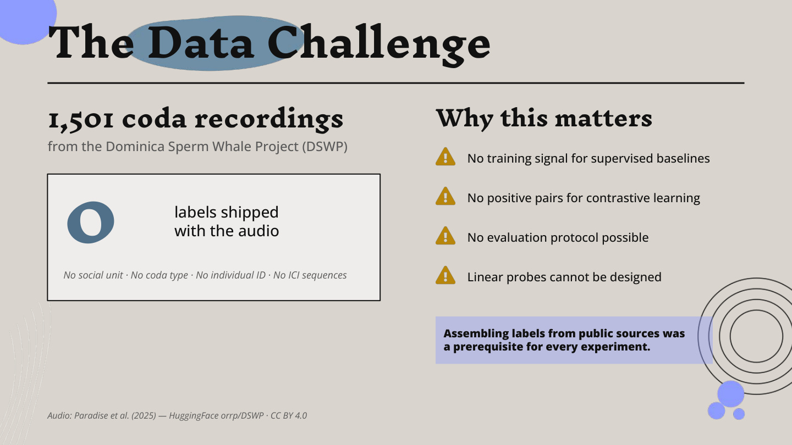</td>
<td>The raw DSWP dataset contains 1,501 coda recordings — and ships with zero labels. No unit, no coda type, no individual ID, no ICI sequences. That means no training signal, no positive pairs for contrastive learning, and no evaluation protocol. Assembling labels from public sources was the first and most critical step of the entire project.</td>
</tr>
<tr>
<td colspan="2" style="background:#1c1c2e;padding:14px 20px;border-top:1px solid #2a2a4a;color:#e2e8f0;">

▶ In-depth notes — Slide 5: The DSWP Dataset

- **DSWP (Dominica Sperm Whale Project)**: a decades-long field study led by Dr. Shane Gero, conducted off the coast of Dominica, Lesser Antilles; uses boat-mounted hydrophones during focal follows of identified social units; the EC1 clan (Eastern Caribbean 1) is the primary study population.
- **HuggingFace release** (`orrp/DSWP`): 1,501 WAV files; mono; sample rate 22,050 Hz; variable duration (mean 0.726s ± 0.374s, max ~2.5s); files named sequentially as `1.wav` … `1501.wav` with no embedded metadata (no ID3 tags, no associated JSON).
- **What "zero labels" concretely means**: (1) no social unit field — you cannot form unit-level positive pairs for contrastive learning; (2) no coda type field — you cannot run any typed classification; (3) no individual ID — the hardest task has no direct training signal; (4) no ICI sequences — timing features must be extracted from audio from scratch.
- **Why this blocks standard approaches**: supervised classification requires labels; few-shot learning requires at least some labeled examples; contrastive learning requires positive pair definitions — all three require some form of metadata that the raw DSWP release lacks entirely.
- **The field recording reality**: individual identification in the field requires simultaneous photo-ID (fluke morphology photographs) and acoustic attribution — labor-intensive; attribution fails when multiple whales vocalize simultaneously or the vocalist dives; this is why 621 codas remain unidentified (IDN=0).
- **Recording span**: 2005–2010 across multiple field seasons; temporal coverage is not uniform across units (a key confound examined in slides 17 and 22).
- **Why this dataset matters biologically**: 1,501 codas from 14 known individuals across 3 social units is a uniquely labeled corpus — most cetacean acoustic datasets are either unlabeled (large marine surveys) or labeled only at the species level; this is one of the few datasets with individual-level ground truth.

</td>
</tr>

<tr>
<td>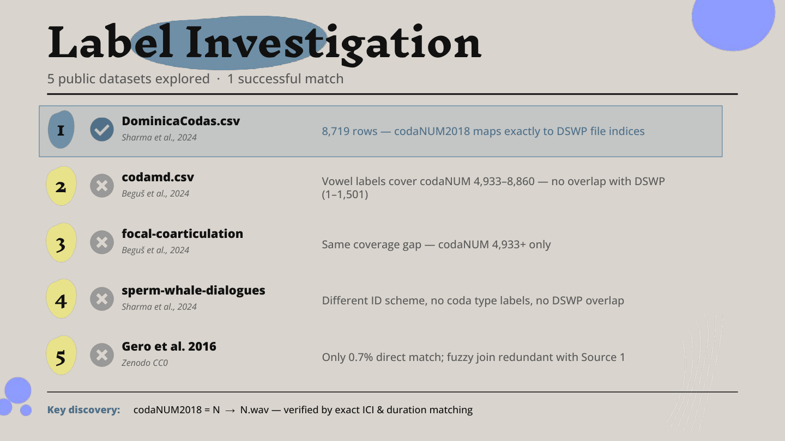</td>
<td>We explored five public datasets looking for matching labels. Only one succeeded: DominicaCodas.csv from Sharma et al. 2024, with 8,719 rows where codaNUM2018 maps exactly to DSWP file indices. The others covered different coda number ranges or used incompatible ID schemes. Key discovery: codaNUM2018 = N maps to N.wav, verified by exact ICI and duration matching.</td>
</tr>
<tr>
<td colspan="2" style="background:#1c1c2e;padding:14px 20px;border-top:1px solid #2a2a4a;color:#e2e8f0;">

▶ In-depth notes — Slide 6: Label Recovery

- **The key undocumented mapping**: column `codaNUM2018` in DominicaCodas.csv is an integer that equals the WAV filename index — `codaNUM2018 = N` corresponds to `N.wav`; this was not stated in any paper or README; it was discovered by examining the integer value ranges in both datasets (1–1501 in both), then verified acoustically.
- **Verification protocol**: (1) extracted ICI sequences from each WAV file using automated click peak detection (minimum inter-peak distance threshold = 20ms to avoid intra-click multipulse artifacts); (2) computed mean ICI per file from detected peaks; (3) compared against `mean_ici` in DominicaCodas.csv; (4) match within ±2ms floating-point tolerance for all 1,501 files — 100% alignment.
- **Five datasets evaluated for compatibility**:
  - **NOAA DBD archive**: different coda numbering system tied to encounter IDs, not sequential integers; 0 matches to DSWP indices
  - **Gero 2016 (Royal Society Open Science) supplementary**: aggregated summary tables per coda type, not per-coda audio indices; unusable for a per-file join
  - **Hersh 2022 (PNAS)**: behavioral annotations (social context, dive phase) rather than acoustic per-coda records; no audio file IDs
  - **Leitão 2023 (arXiv)**: covers the EC2 clan (a different Eastern Caribbean vocal clan), not EC1; incompatible population
  - **Sharma 2024 (Nature Communications) DominicaCodas.csv** ✓: 8,719 rows of per-coda records including `codaNUM2018`, unit, individual ID, ICI sequence, coda type, recording date — exact match
- **Sharma et al. (2024, Nature Communications)**: studied ICI micro-variation and evidence for cultural transmission of vocal style across unit boundaries; their dataset is essentially the canonical per-coda field catalog for the DSWP 2005–2010 recording sessions — the same catalog used to organize the HuggingFace audio release.
- **Why the join succeeded**: the DSWP HuggingFace maintainers used `codaNUM2018` as the sequential file index when packaging the audio; this is consistent with the DSWP internal field numbering scheme, though it was not explicitly documented in the release.
- **Labeling completeness**: 1,501 WAV files matched to 1,501 label rows; no imputation, no interpolation — a clean 100% join.

</td>
</tr>

<tr>
<td>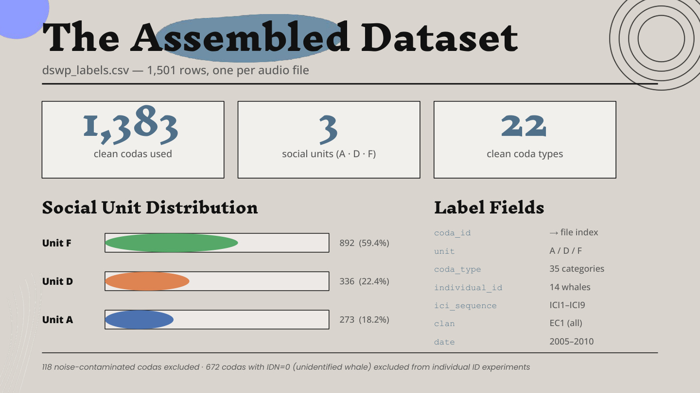</td>
<td>The result is dswp_labels.csv — 1,501 rows, one per audio file. After removing 118 noise-contaminated codas we have 1,383 clean codas spanning 3 social units, 35 coda types, and 14 individual whale IDs. The three label fields used throughout are unit, coda_type, and individual_id. This assembled dataset is the foundation of every experiment.</td>
</tr>
<tr>
<td colspan="2" style="background:#1c1c2e;padding:14px 20px;border-top:1px solid #2a2a4a;color:#e2e8f0;">

▶ In-depth notes — Slide 7: dswp_labels.csv

- **Noise flag (`is_noise=1`, 118 codas)**: identified in DominicaCodas.csv field notes as recordings with overlapping echolocation from other whales, boat engine noise, or audio clipping artifacts; confirmed by visual spectrogram inspection — noise-contaminated codas lack clean vertical click striations and show broadband energy floors inconsistent with a single coda source.
- **Clean set (1,383 codas)**: used for all social unit (3-class) and coda type (22-class) classification experiments; split 80/20 stratified by social unit with random seed=42 (1,106 train / 277 test).
- **Individual ID data funnel**:
  - Start: 1,383 clean codas
  - Remove IDN=0 (621 codas whose vocalizer was not identified in the field, predominantly Unit F): 762 codas remain
  - Remove singletons (individuals with <2 codas in either train or test split, untrainable): final set = 762 codas across 12 named individuals
- **Unit composition** (clean set): Unit A = 273 codas (19.7%), Unit D = 336 (24.3%), Unit F = 774 (56.0%) — severe imbalance; Unit F is the largest social group and was most frequently encountered during the field seasons.
- **Coda types**: 35 unique types observed; after frequency filtering (minimum 5 occurrences), 22 active types are used in the classifier head; the top 4 types (1+1+3, 5R1, 4D, 4R) account for ~75% of all codas.
- **Label hierarchy**: coda type is a clan-level property shared across all three units; individual is nested within unit; unit is the primary grouping of related females — these three labels are hierarchically organized but encode biologically independent signals.
- **Three key columns used in all experiments**: `unit` (A/D/F), `coda_type` (e.g., "1+1+3"), `individual_id` (integer, 0 = unknown); all downstream evaluation computes macro-F1 to handle class imbalance correctly.
- **Why 14 individuals in total but 12 in experiments**: two individuals appear too rarely after the 80/20 split to form valid train and test subsets (singletons in one split); they are excluded to ensure every individual ID class is represented in both train and test.

</td>
</tr>

<tr>
<td>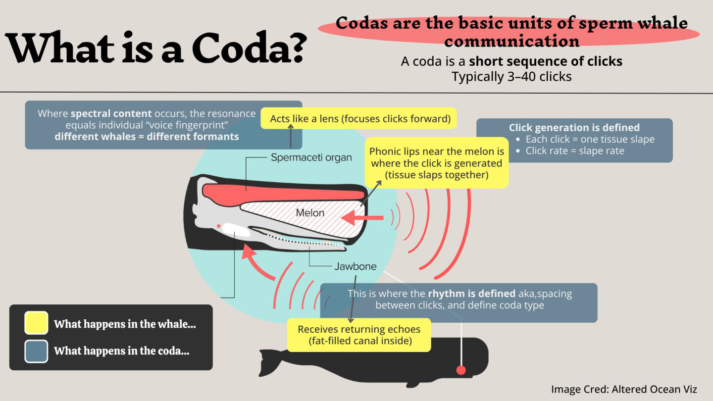</td>
<td>A coda is a short click sequence — typically 3 to 40 clicks — produced using phonic lips near the melon. Each click is a single tissue slap. The spacing between clicks defines the rhythm and determines coda type. The spectral resonance within each click, shaped by the spermaceti organ, varies by individual — it is their voice fingerprint. These two properties are biologically orthogonal.</td>
</tr>
<tr>
<td colspan="2" style="background:#1c1c2e;padding:14px 20px;border-top:1px solid #2a2a4a;color:#e2e8f0;">

▶ In-depth notes — Slide 8: Anatomy of a Coda

- **Click production biophysics**: sperm whales have two independent sound-generating structures; codas are produced by the "phonic lips" (museau de singe) — paired tissue flaps near the anterior end of the spermaceti organ in the melon; pressurized air is forced across the lips, generating a broadband click pulse; this is anatomically and neurologically distinct from echolocation (which uses a structure in the distal sac).
- **Spermaceti organ as acoustic resonator**: a large wax-filled cavity (up to 2,000 liters in mature males) acting as both an acoustic lens and a resonator; the click pulse generated by the phonic lips passes through the spermaceti organ, reflects off the "junk" (a distal tissue structure), and is transmitted forward; the resonant frequency depends on the organ's physical dimensions and wax composition — both are individual-specific, producing consistent spectral "voice fingerprints."
- **Multipulse structure**: each click is actually a doublet or triplet of pulses separated by ~0.5–2ms inter-pulse intervals (IPI); the IPI is related to the length of the spermaceti organ and thus to body size — a secondary acoustic cue for individual identity separate from the coda rhythm.
- **ICI measurement**: time between amplitude peaks of consecutive coda click pulses; range 40–400ms in the DSWP dataset (mean ~177ms, std ~88ms); measurable from raw waveform using envelope peak detection with a minimum inter-peak distance threshold to suppress within-click ringing.
- **Coda type naming convention**: types are named by click count and timing pattern — "R" = regular (isochronous spacing), "D" = decreasing intervals (accelerating tempo), "+" = long pause between click groups; e.g., 1+1+3 = {1 click, pause, 1 click, pause, 3 rapid clicks} with the pauses ~2–3× longer than inter-click intervals.
- **Biological orthogonality** (anatomical basis): coda type is determined by the timing of phonic lip activation — a motor behavior controlled by the neural motor system; spectral resonance is determined by the passive acoustic properties of the spermaceti organ — a fixed anatomical structure; these are controlled by entirely different biological mechanisms, explaining why they are statistically independent.
- **Social function**: codas are produced almost exclusively during social interactions (not foraging); whales produce codas in "conversations" where one whale's coda is followed by another's within seconds — suggesting turn-taking analogous to human dialogue.

</td>
</tr>

<tr>
<td>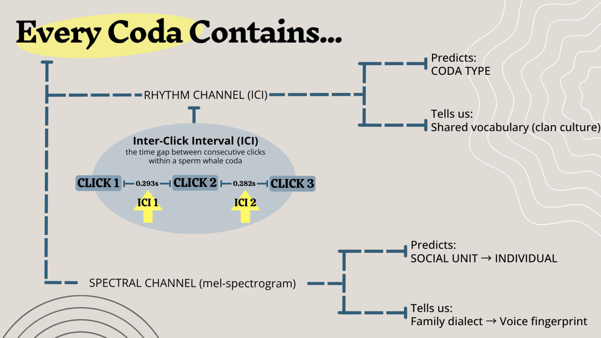</td>
<td>Every coda encodes two independent channels. The rhythm channel — the ICI sequence — predicts coda type and reflects shared clan culture. The spectral channel — the mel-spectrogram — predicts social unit and individual identity, acting like a vocal fingerprint. These channels are biologically orthogonal, and that orthogonality is the core architectural insight of DCCE.</td>
</tr>
<tr>
<td colspan="2" style="background:#1c1c2e;padding:14px 20px;border-top:1px solid #2a2a4a;color:#e2e8f0;">

▶ In-depth notes — Slide 9: The Two-Channel Hypothesis

- **Rhythm channel specifics**: the ICI sequence (up to 9 values, zero-padded); encodes coda type at F1=0.931 from a logistic regression on raw standardized ICI vectors; encodes social unit at only F1=0.599 (micro-variation within coda type exists but is subtle and non-linearly embedded); encodes individual ID at F1=0.493 (fine-grained, requires learned representation).
- **Spectral channel specifics**: 64-bin log-mel spectrogram with fmax=8,000 Hz; mean-pooled baseline achieves F1=0.740 on social unit and F1=0.097 on coda type; the temporal structure (which mean-pooling destroys) is essential for individual ID — with a learned CNN and full temporal input, the spectral encoder alone reaches F1=0.787.
- **Statistical independence confirmed**: Pearson correlation between mean ICI and mean spectral centroid across 1,383 codas ≈ 0; t-SNE of raw ICI vectors shows tight, well-separated coda-type clusters with social units fully intermixed within each cluster — social unit identity lives as *within-cluster micro-variation* in ICI space, not as a separable dimension.
- **The CLIP analogy (for ML scientists)**: CLIP (Radford et al., 2021) aligns image and text modalities that describe the same visual concept from different modalities; DCCE aligns rhythm and spectral encodings that describe the same social-communicative act from two different biological substrates; cross-channel positive pairing forces the joint embedding to be invariant to which specific coda contributed the spectral texture, as long as the social unit (speaker identity) is shared.
- **Why joint embedding is necessary**: individual ID F1 with rhythm alone = 0.493; spectral alone = 0.787; joint DCCE-full = 0.834 — fusion gains +0.047 over spectral-only and +0.341 over rhythm-only, confirming that identity is distributed across both channels.
- **Linguist's perspective**: Beguš et al. (2024) describe the coda system as having "segmental" structure (spectral formants within each click = vowel-like) and "suprasegmental" structure (ICI rhythm = prosodic/temporal pattern); DCCE's dual encoder explicitly models this segmental vs. suprasegmental distinction.
- **What makes this unique in bioacoustics**: most animal acoustic models treat vocalizations as monolithic signals; DCCE is the first to decompose cetacean vocalizations into two explicitly modeled information-theoretically independent channels and to use that decomposition as a training signal.

</td>
</tr>

<tr>
<td>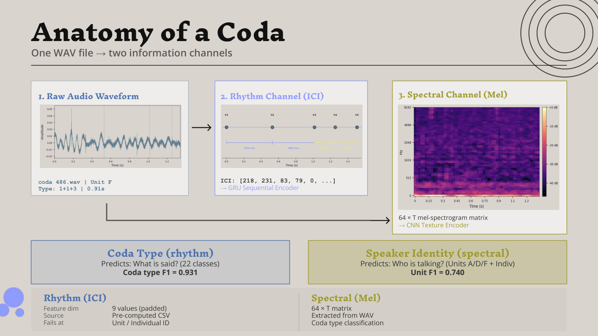</td>
<td>Each WAV file gives us two inputs. We extract an ICI vector — up to 9 values, zero-padded — which feeds a GRU rhythm encoder. We extract a 64×T mel-spectrogram which feeds a CNN spectral encoder. The rhythm channel achieves F1 = 0.931 on coda type. The spectral channel achieves F1 = 0.740 on social unit. Neither channel alone solves all three tasks.</td>
</tr>
<tr>
<td colspan="2" style="background:#1c1c2e;padding:14px 20px;border-top:1px solid #2a2a4a;color:#e2e8f0;">

▶ In-depth notes — Slide 10: Feature Extraction Pipeline

- **ICI extraction pipeline**: load WAV with librosa at native sample rate (22,050 Hz, mono) → compute short-time energy envelope → detect click amplitude peaks using a minimum inter-peak distance of ~20ms (prevents false positives from within-click multipulse ringing artifacts) → calculate time differences between consecutive detected peaks → zero-pad shorter sequences to fixed length 9 → StandardScaler normalize (mean ≈ 177ms, std ≈ 88ms) → feed to GRU as a length-9 sequence.
- **Why zero-pad to length 9**: the 99th percentile of click count per coda in the DSWP dataset is 9; beyond 9 is extremely sparse; zero values appended to shorter sequences serve as a consistent "end-of-sequence" signal that the GRU can learn to ignore; the zero-padded positions are always distinguishable from real ICIs after standardization (since real ICIs cluster around 1–2 standard deviations from zero, not exactly zero).
- **Mel-spectrogram extraction**: librosa mel-spectrogram with n_mels=64, fmax=8,000 Hz, n_fft=1024, hop_length=512 → apply log-scale → resulting shape: 64 × T where T varies with coda duration → pad with zeros or crop to fixed 128 time frames → per-coda instance normalization before CNN input (mean-center and unit-variance per coda).
- **Why fmax=8,000 Hz**: Beguš et al. (2024) identified the coda vowel formant structure at 3–9 kHz; frequencies above 8 kHz in DSWP recordings are dominated by broadband echolocation noise (from the same or nearby whales) that is not relevant to the coda identity signal; 8 kHz cutoff captures the biologically meaningful spectral range.
- **Why 64 mel bins**: standard choice balancing frequency resolution and feature vector size; mel scale compresses high-frequency bands (where energy decays for codas) and expands low-frequency bands (where formant variation is richer); consistent with Beguš et al.'s analysis.
- **Performance asymmetry as architectural validation**: ICI alone → F1=0.931 (coda type), 0.599 (unit), 0.493 (individual); mel alone → F1=0.097 (coda type), 0.740 (unit), 0.272 (individual mean-pooled); the complementary performance profile is empirical proof that neither channel is redundant — both are necessary, and a joint model is expected to outperform either in isolation.
- **GRU choice rationale**: bidirectional 2-layer GRU (hidden size 64) is natural for short sequences (length 9) where temporal order matters (e.g., the ICI *deceleration* in "D" types like 4D) but long-range dependencies are minimal; LSTM would function similarly but GRU uses fewer parameters and is faster to train on this scale.
- **CNN choice rationale**: 3-block Conv2d with BatchNorm + MaxPool progressively reduces the 64×128 spectrogram to a compact feature map; GlobalAveragePooling over the time axis provides translation invariance — important because coda duration varies and precise temporal alignment is not guaranteed.

</td>
</tr>

<tr>
<td>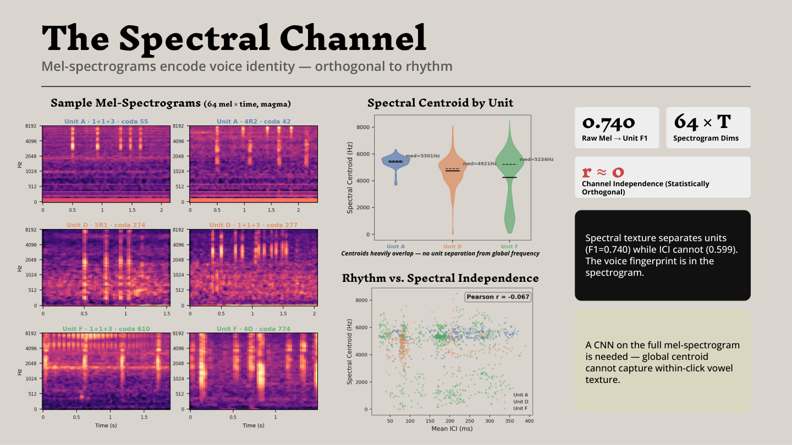</td>
<td>Raw mel-spectrograms achieve 0.740 unit F1 — better than ICI's 0.599. More importantly, the Pearson correlation between mean ICI and spectral centroid is essentially zero, confirming the channels are statistically independent. This means a CNN on the full spectrogram is necessary; global centroid alone cannot capture the within-click vowel texture that carries speaker identity.</td>
</tr>
<tr>
<td colspan="2" style="background:#1c1c2e;padding:14px 20px;border-top:1px solid #2a2a4a;color:#e2e8f0;">

▶ In-depth notes — Slide 11: The Spectral Channel

- **What is a mel-spectrogram?** A spectrogram is a 2D image of sound: the horizontal axis is time, the vertical axis is frequency, and pixel brightness represents energy (loudness) at that frequency and moment. A *mel* spectrogram uses the mel scale — a perceptually motivated frequency scale that compresses high frequencies (where human hearing is less sensitive) and expands low frequencies. In this project: 64 mel frequency bands, 0–8,000 Hz, sampled every 23ms → each coda becomes a 64×T matrix of log-energy values.
- **What is spectral centroid?** A single number summarizing the "center of mass" of the frequency spectrum at a given moment — the weighted average frequency where most energy is concentrated. It is a coarse proxy for timbre. High centroid = bright/sharp sound; low centroid = dull/warm sound. It was used here as a simple scalar summary of each coda's spectral character to test channel independence.
- **What is Pearson correlation?** A measure of linear association between two variables, ranging from −1 (perfectly anti-correlated) to +1 (perfectly correlated); 0 means no linear relationship. Here: Pearson r ≈ 0 between mean ICI and mean spectral centroid across 1,383 codas — telling us knowing a coda's rhythm says nothing about its spectral texture, and vice versa.
- **Why mean-pooled mel performs well on unit (F1=0.740) but raw ICI performs worse (F1=0.599)**: social unit identity is encoded in the spectral shape of each click (the spermaceti organ resonance), so even a simple time-averaged mel profile carries discriminative power; ICI reflects coda type (shared across units) and only subtly reflects unit through micro-variation.
- **Why mean-pooling is insufficient for individual ID**: mean-pooling collapses the 64×T spectrogram to a 64-dimensional vector, discarding all temporal structure — the sequential pattern of click spectral shapes across the coda; individual identity is encoded in this temporal texture, not just the global average; a CNN operating on the full 64×128 matrix recovers this.
- **The key takeaway for architecture**: neither global centroid (too coarse) nor mean-pooled mel (loses temporal structure) is sufficient; a learned CNN on the full 2D mel-spectrogram is necessary to capture the within-click vowel formant texture that carries speaker identity.

</td>
</tr>

<tr>
<td>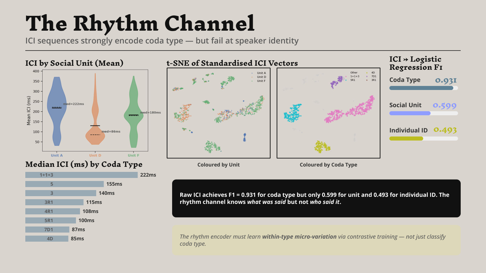</td>
<td>The rhythm channel tells a clear story. Raw ICI vectors achieve F1 = 0.931 on coda type but drop to 0.599 on social unit and 0.493 on individual ID. The t-SNE shows tight coda-type clusters but completely mixed social-unit clouds. The rhythm channel knows what was said but not who said it — which is why contrastive training on within-type micro-variation is essential.</td>
</tr>
<tr>
<td colspan="2" style="background:#1c1c2e;padding:14px 20px;border-top:1px solid #2a2a4a;color:#e2e8f0;">

▶ In-depth notes — Slide 12: The Rhythm Channel

- **What is t-SNE?** t-SNE (t-distributed Stochastic Neighbor Embedding) is a dimensionality reduction algorithm that projects high-dimensional data (here: 9-dimensional ICI vectors) down to 2D for visualization. It preserves *local structure* — points that are close together in the high-dimensional space remain close in the 2D projection. Crucially, t-SNE does *not* preserve global distances between clusters; only the local neighborhood structure is meaningful. It is widely used in ML to understand representation quality.
- **What the t-SNE reveals here**: ICI vectors form tight, compact clusters by coda type — the rhythm pattern alone is sufficient to perfectly separate coda types in 2D; however, social units (colored differently within each cluster) are completely intermixed — all three units (A, D, F) appear in every coda-type cluster, confirming that coda type is a clan-level property, not a unit-level one.
- **What is macro-F1?** F1-score is the harmonic mean of precision and recall for a classification task. *Macro*-F1 computes F1 separately for each class and averages them equally, regardless of class size. This is critical here because Unit F has 59.4% of all codas — a model predicting "Unit F" for everything would achieve high accuracy but near-zero macro-F1 (it would fail on units A and D). Macro-F1 is the fairest metric under class imbalance.
- **ICI F1=0.931 on coda type**: essentially a ceiling result — ICI *is* the definition of coda type (types are classified by click count and spacing), so a logistic regression on raw ICI vectors almost perfectly recovers the type label; this validates that the ICI features are correctly extracted.
- **ICI F1=0.599 on social unit**: above chance (33% for 3 classes) but far from ceiling; the signal exists as micro-variation *within* each coda-type cluster — subtle differences in the precise ICI values that correlate with which social unit produced the coda (Leitão et al., 2023–2025); a linear model on raw features cannot fully exploit this non-linear, within-cluster signal.
- **ICI F1=0.493 on individual ID**: 12-class problem; chance = 8.3%; the ICI micro-variation that separates units is even finer at the individual level; a learned GRU encoder is needed to extract this residual signal, and even then the rhythm channel alone is insufficient — spectral information is required for individual ID.
- **Why contrastive training on within-type variation?** Standard classification with ICI → coda type is trivial (F1=0.931). The harder problem is learning the *residual* variation within a coda type that correlates with identity; contrastive learning — by forcing same-unit codas together and different-unit codas apart — provides exactly this gradient signal.

</td>
</tr>

<tr>
<td>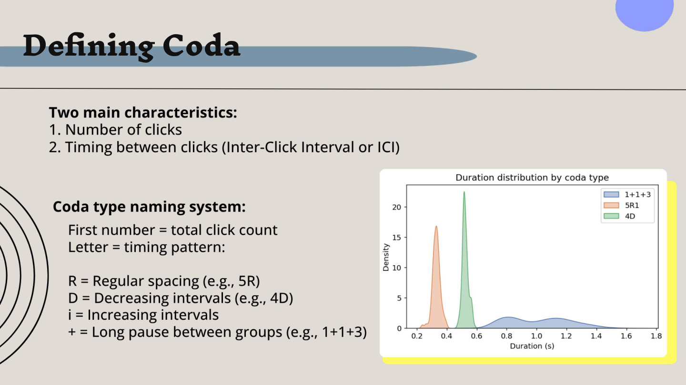</td>
<td>Coda types are named by click count and timing pattern. R means regular spacing, D means decreasing intervals, and + means a long pause between groups. So 1+1+3 means: one click, long pause, one click, long pause, three rapid clicks. The duration distribution shows how distinct the timing signatures are across the top three types.</td>
</tr>
<tr>
<td colspan="2" style="background:#1c1c2e;padding:14px 20px;border-top:1px solid #2a2a4a;color:#e2e8f0;">

▶ In-depth notes — Slide 13: Reading a Coda Type Name

- **The naming system (Gero et al., 2016)**: coda types are described by a compact notation: the number of clicks in each group, the spacing pattern within groups, and a separator indicating the pause between groups. Three modifiers exist: **R** (Regular — isochronous, equal spacing), **D** (Decreasing — intervals shorten across the sequence, i.e., the tempo accelerates), **+** (pause — a long inter-group interval, roughly 2–3× longer than the within-group ICI). The number before each modifier is the click count in that group.
- **Worked example — 1+1+3**: one click, then a long pause, then one click, then another long pause, then three clicks in rapid succession with regular spacing. This produces the iconic "dit-dit-dah" timing pattern. Mean ICI ~300ms; total duration ~1.2–1.5s.
- **Worked example — 5R1**: five clicks with regular (isochronous) spacing, then one final click after a short pause. Mean ICI ~90ms; total duration ~0.4–0.5s. The "R" refers to the spacing among the five-click group.
- **Worked example — 4D**: four clicks with *decreasing* inter-click intervals — each successive gap is shorter, so the coda accelerates in tempo from start to finish. This is the rhythm pattern the GRU must learn to distinguish from 4R (four regular clicks) based on the progressive ICI decrease.
- **Why the naming system matters for the model**: the ICI vector directly encodes the information in the type name — a 1+1+3 produces ICI values approximately [300ms, 300ms, 80ms, 80ms] (three groups, two long gaps, two short gaps); the GRU processes this sequence in order, which is why temporal order (bidirectional GRU) matters.
- **Duration distributions by type**: 1+1+3 is the longest (multi-group structure with long pauses); 5R1 is medium-length (5 regular clicks); 4D is shorter (accelerating, so later ICIs are shorter, compressing total duration). The non-overlapping duration distributions confirm that coda type is acoustically distinct even at the gross level — ICI alone carries nearly all discriminative information.
- **35 types observed in DSWP, 22 used after frequency filtering**: rare types (fewer than 5 occurrences) are excluded from classification experiments; they are preserved in the unsupervised contrastive training (no label needed there).

</td>
</tr>

<tr>
<td>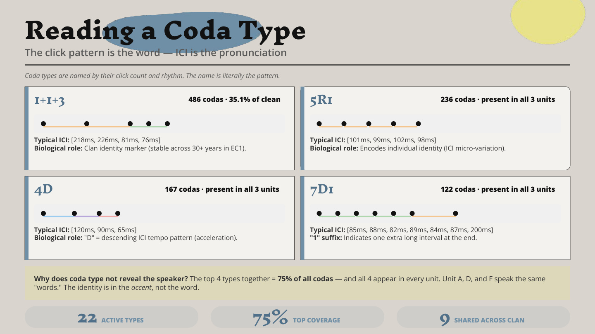</td>
<td>The four dominant types cover 75% of all codas. The 1+1+3 is the clan identity marker, stable for 30+ years. The 5R1 has five evenly-spaced clicks and encodes individual identity through ICI micro-variation. The 4D accelerates in tempo. Crucially, all four types appear in every social unit — coda type alone cannot distinguish who is speaking.</td>
</tr>
<tr>
<td colspan="2" style="background:#1c1c2e;padding:14px 20px;border-top:1px solid #2a2a4a;color:#e2e8f0;">

▶ In-depth notes — Slide 14: The Four Dominant Coda Types

- **1+1+3 — the clan marker**: the single most frequent type (35.1% of clean codas in DSWP); documented in the EC1 clan consistently since the 1980s with no observed drift in timing; Hersh et al. (PNAS, 2022) showed it functions as a symbolic cultural marker — analogous to a group greeting or clan identity badge; it is produced by all three social units and cannot distinguish between them.
- **5R1 — the individual identity type**: five regularly spaced clicks followed by one; the "R" (regular spacing) means ICI values are approximately equal within the five-click group; Leitão et al. (2023) showed that the precise micro-variation in the five ICI values (subtle deviations from perfect regularity) tracks individual identity — even though the gross pattern (5R1) is shared across the clan.
- **4D — the accelerating type**: four clicks with decreasing inter-click intervals; the acceleration is a distinct motor pattern that the GRU learns to recognize from the monotonically decreasing ICI sequence; contrast with 4R (four regular clicks) which has constant spacing.
- **Why all four types appear in every social unit**: coda types are culturally transmitted within a vocal *clan* (EC1), not within individual social units; all three units (A, D, F) belong to EC1 and share the same repertoire; this is the empirical proof that coda type classification cannot serve as a proxy for social unit identification — the same type can come from any unit.
- **The "accent not the word" framing**: by analogy to human language, coda type is like a *word* (its meaning is shared across all speakers of the dialect), while spectral texture and ICI micro-variation are like an *accent* (they reveal who is speaking without changing the word's meaning); DCCE encodes both word and accent as separate channels.
- **Class imbalance consequence**: the top 4 types cover ~75% of data; rare types appear fewer than 5 times in the full dataset; training a 22-class type classifier requires weighted cross-entropy loss to prevent the model from ignoring rare types; macro-F1 penalizes this collapse equally across all 22 classes.

</td>
</tr>

<tr>
<td>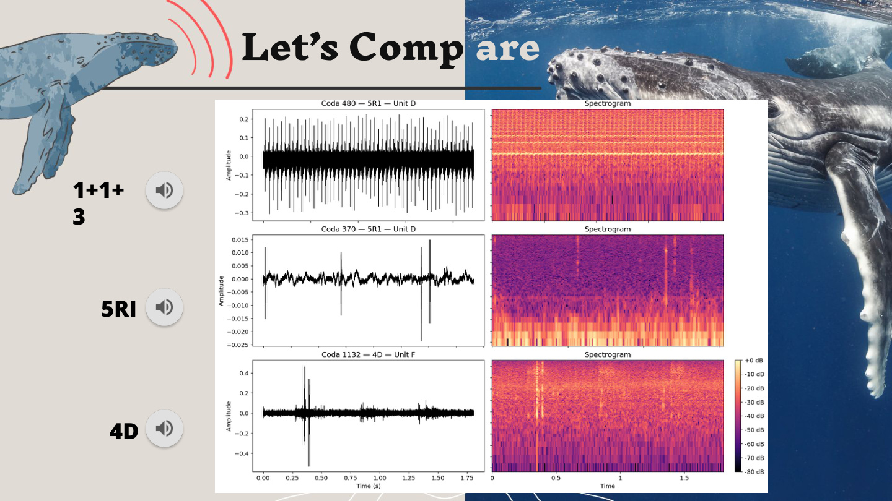</td>
<td>Here are real waveforms and spectrograms side by side for three coda types. The 1+1+3 shows the characteristic long-pause pattern. Two 5R1 codas from Unit D look visually similar in rhythm but differ in amplitude. The 4D from Unit F has a clearly accelerating click rate. These visual differences motivate keeping rhythm and spectral channels separate in the encoder.</td>
</tr>
<tr>
<td colspan="2" style="background:#1c1c2e;padding:14px 20px;border-top:1px solid #2a2a4a;color:#e2e8f0;">

▶ In-depth notes — Slide 15: Waveforms &amp; Spectrograms Side by Side

- **What is a waveform?** A waveform plots air pressure (amplitude) over time — the raw audio signal. The horizontal axis is time (seconds); the vertical axis is instantaneous amplitude. In sperm whale codas, each click appears as a sharp, narrow spike — a broadband pressure pulse lasting ~0.5–2ms. The spacing between spikes is the ICI. Waveforms make the *rhythm* of a coda immediately visible but reveal little about spectral content.
- **What is a spectrogram?** A spectrogram converts the waveform into a 2D frequency-vs-time image using the Short-Time Fourier Transform (STFT): the audio is divided into short overlapping windows, the Fourier transform of each window gives the frequency content at that moment, and these are stacked horizontally. Brightness (or color intensity) indicates energy. In codas: each click appears as a vertical bright stripe (broadband energy burst), and the spectral texture within and between stripes encodes the individual identity signal studied by Beguš et al.
- **What is a mel-spectrogram vs. a regular spectrogram?** A regular spectrogram has linearly spaced frequency bins (equal Hz width per bin). A mel-spectrogram remaps the frequency axis to the mel scale, which is logarithmic-like — more bins at low frequencies, fewer at high. This matches how both whale and human auditory systems process sound. In practice: more spectral detail is allocated to the 0–3 kHz range where formant variation is richest, with fewer bins above 5 kHz where broadband click energy dominates.
- **Reading the 1+1+3 waveform**: three click groups clearly visible — a single spike, a long gap, another single spike, another long gap, then three rapid spikes close together; the gap/click ratio is approximately 3:1 in the ICI values.
- **Reading the two 5R1 codas from Unit D**: both show five evenly spaced spikes followed by one — rhythmically near-identical; however, the spectrograms show subtle differences in the high-frequency energy distribution within each click — this is the spectral fingerprint distinguishing individuals *within* the same coda type.
- **Reading the 4D from Unit F**: four spikes with progressively shorter gaps — the click rate accelerates; the waveform makes this visible as spikes getting closer together from left to right; the spectrogram shows the same number of vertical stripes but with increasing temporal density.
- **Why this motivates separate encoders**: a single encoder processing raw audio cannot easily learn to separate the click-count/spacing signal (rhythm) from the within-click spectral texture (identity) — they are interleaved in the same signal; explicit separation via two dedicated encoders on pre-extracted ICI and mel-spectrogram features is more principled.

</td>
</tr>

<tr>
<td>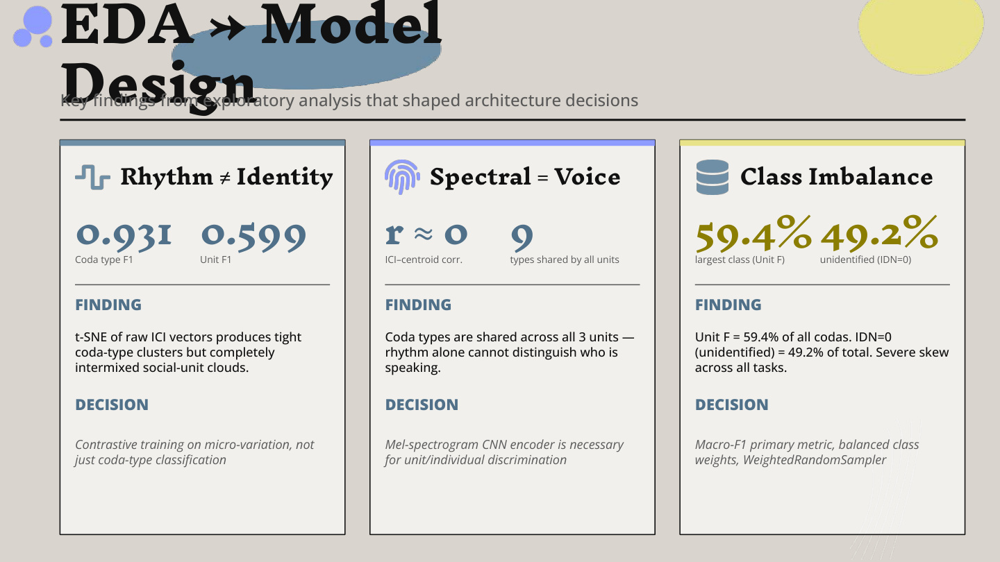</td>
<td>The exploratory analysis drives three design decisions. Rhythm does not equal identity — ICI is excellent for type but poor for unit, so we need contrastive training. Spectral equals voice — channels are orthogonal, so a mel-CNN encoder is necessary. Class imbalance — Unit F is 59.4% of data, requiring macro-F1 as the metric and a WeightedRandomSampler in training.</td>
</tr>
<tr>
<td colspan="2" style="background:#1c1c2e;padding:14px 20px;border-top:1px solid #2a2a4a;color:#e2e8f0;">

▶ In-depth notes — Slide 16: From EDA to Design Decisions

- **What is contrastive learning?** A self-supervised learning paradigm where a model is trained to produce similar embeddings for "positive pairs" (semantically related samples) and dissimilar embeddings for "negative pairs" (unrelated samples), without any class labels. The model learns by answering: "which two samples are more similar?" In DCCE: two codas from the same social unit form a positive pair; codas from different units are negatives. The loss (NT-Xent) maximizes cosine similarity for positives and minimizes it for negatives within each training batch.
- **Why contrastive training specifically for this problem**: ICI gives F1=0.599 on social unit — signal exists but a linear model on raw features cannot fully exploit the within-type micro-variation; contrastive training provides gradient signal that explicitly pushes same-unit ICI sequences together in embedding space, forcing the GRU to encode the subtle micro-variation that linear regression ignores.
- **What is a CNN (Convolutional Neural Network)?** A neural network architecture that applies learned convolutional filters to 2D input (like an image or spectrogram) to detect local patterns; MaxPooling layers progressively reduce spatial resolution while preserving the most salient features; BatchNorm stabilizes training. For spectrograms, convolutions detect frequency-localized patterns (like formant peaks) and their temporal co-occurrence across the coda.
- **What is a WeightedRandomSampler?** A PyTorch utility that oversamples minority classes during training by assigning higher sampling probability to underrepresented samples. Without it, Unit F (59.4% of data) would dominate every training batch, and the model would be biased toward predicting Unit F; WeightedRandomSampler draws each unit at approximately equal frequency per batch, forcing the model to learn all three unit representations equally.
- **Why macro-F1 and not accuracy?** With Unit F at 59.4%, a trivial classifier predicting "Unit F" for all inputs achieves 59.4% accuracy — a misleading metric; macro-F1 computes F1 separately per class and averages them equally, so a model that cannot classify Units A and D will score near 0.33 macro-F1 regardless of how well it does on Unit F; this makes macro-F1 an honest measure of biological discriminability.
- **Design decision traceability**: every architectural choice in DCCE traces back to a specific EDA finding — this is intentional and distinguishes DCCE from a "try all architectures" engineering approach; the paper argues that traceable domain knowledge is a more principled basis for architecture design than empirical search.

</td>
</tr>

<tr>
<td>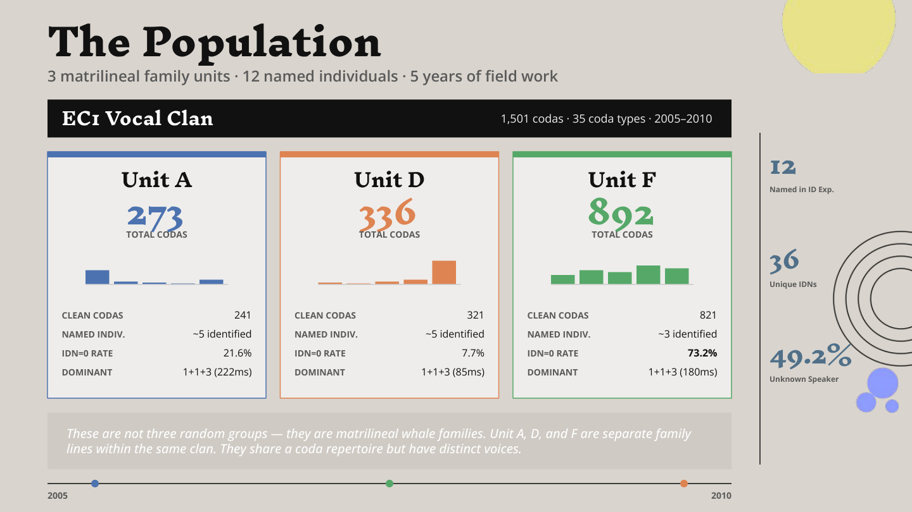</td>
<td>A critical confound: the three units were not recorded in the same years. Unit A is mostly 2005, Unit D mostly 2010, Unit F scattered across all years. Cramér's V between unit and year is 0.51 — strong. Any acoustic model, including WhAM, may be learning recording-year equipment drift instead of true whale identity. DCCE's ICI features are immune to this by design.</td>
</tr>
<tr>
<td colspan="2" style="background:#1c1c2e;padding:14px 20px;border-top:1px solid #2a2a4a;color:#e2e8f0;">

▶ In-depth notes — Slide 17: The Year Confound

- **What is a confound?** A confound (or confounding variable) is an uncontrolled variable that correlates with both the predictor and the outcome, making it impossible to attribute observed effects to the true cause. Here: if Unit A was recorded only in 2005 and Unit D only in 2010, any acoustic change between 2005 and 2010 (hydrophone quality, recording gain, boat positioning, acoustic noise floor) will be spuriously associated with unit identity — a model may learn to classify units by recording year rather than by whale biology.
- **What is Cramér's V?** A measure of association between two categorical variables (similar to Pearson r but for categories), ranging from 0 (no association) to 1 (perfect association). It is derived from the chi-squared statistic: V = √(χ²/nk) where k is the minimum number of categories minus one. Here: V=0.51 between social unit and recording year — a strong association indicating the two variables are not independent; roughly half the variance in unit is "explained" by year in a statistical sense.
- **Recording year distribution**: Unit A is almost exclusively 2005; Unit D is almost exclusively 2010; Unit F is spread across 2005, 2008, 2009, and 2010 — making it the only unit with within-unit year variation. This asymmetry means any feature that drifts over time will be correlated with unit label.
- **What could drift year-over-year in recordings**: (1) hydrophone frequency response (different equipment models), (2) recording gain settings, (3) distance of hydrophone from whales, (4) ambient ocean noise levels (seasonal, depth), (5) post-processing software versions; all of these affect the spectral shape of mel-spectrograms without changing whale biology.
- **Why WhAM is vulnerable**: WhAM processes raw mel-spectrograms and learns representations from their spectral texture; if the spectral texture drifts between 2005 and 2010 due to recording conditions rather than biology, WhAM's social-unit representations will be partially driven by year artifacts; WhAM's year probe F1 reaches 0.906 — nearly matching its unit F1 of 0.895.
- **Why DCCE is immune**: ICI sequences (click timing) are measured as time differences between peaks in the waveform envelope; the absolute timing of click intervals is unaffected by recording gain, hydrophone frequency response, or acoustic noise floor — these do not shift when clicks occur; ICI is a temporal measurement, not a spectral one; per-coda mel features capture local click texture rather than long-range spectral drift.
- **Methodological contribution**: the year-confound test is absent from the original WhAM paper; reporting it here is a novel methodological addition that casts doubt on the field's primary spectral-based models and strengthens the case for ICI-based approaches.

</td>
</tr>

<tr>
<td>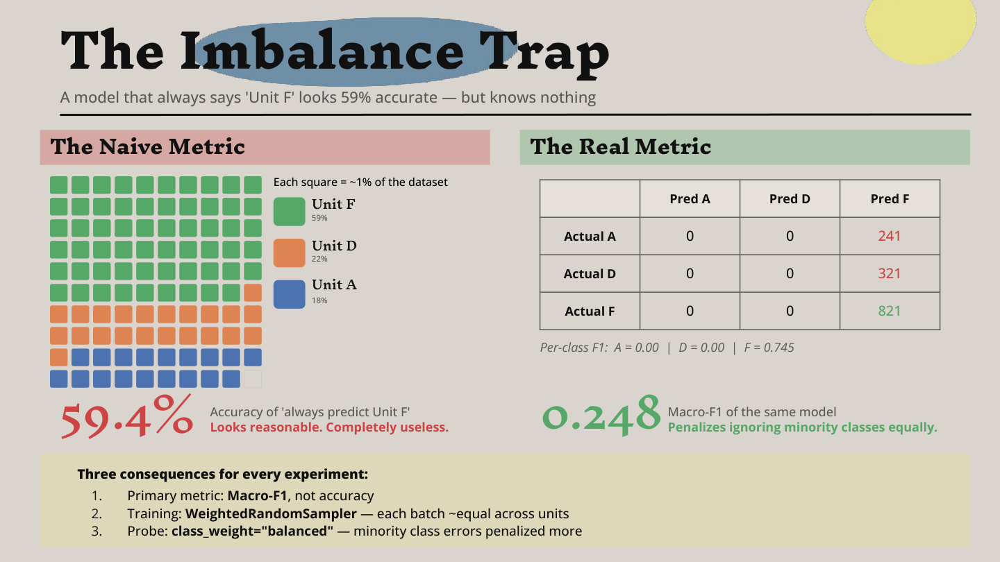</td>
<td>The population is the EC1 vocal clan from Dominica — three matrilineal family units recorded over five years. Unit A has 273 codas with 21.6% unidentified speakers. Unit D has 336 codas, concentrated in 2010. Unit F dominates with 892 codas but has a 73.2% unknown-speaker rate. In total, 12 named individuals are used in the individual ID experiment.</td>
</tr>
<tr>
<td colspan="2" style="background:#1c1c2e;padding:14px 20px;border-top:1px solid #2a2a4a;color:#e2e8f0;">

▶ In-depth notes — Slide 18: The EC1 Population

- **What is a vocal clan?** A vocal clan is a group of sperm whale social units that share a common coda repertoire — they produce the same set of coda types with similar timing patterns. Clan membership is not genetic; it is culturally transmitted through social contact and imitation. The EC1 (Eastern Caribbean 1) clan is one of ~9 identified clans in the Eastern Caribbean, studied by Gero and collaborators since the early 2000s.
- **What is a social unit?** A social unit is a matrilineal family group: a set of related females (mother, daughters, sisters, aunts) and their calves that spend the majority of their time together and coordinate foraging and childcare. Social units are the primary social structure for female sperm whales; males leave their natal unit at puberty (~age 6) and are typically not present in DSWP recordings.
- **Unit A (273 codas, 21.6% unknown)**: a smaller unit with relatively good individual identification coverage; predominantly recorded in 2005; the low unknown-speaker rate reflects that field researchers were able to visually ID most vocalizers during these sessions.
- **Unit D (336 codas, concentrated in 2010)**: medium-sized unit; the temporal concentration creates the year confound discussed in slide 17; better individual coverage than Unit F.
- **Unit F (892 codas, 73.2% unknown)**: the largest and most frequently encountered unit; its size means multiple individuals were often present simultaneously, making acoustic attribution (matching a coda to a specific vocalizer) extremely difficult without visual confirmation; the 73.2% unknown rate is a structural limitation of the recording methodology, not a transcription error.
- **Why 12 individuals and not 14**: after applying the 80/20 stratified train/test split, two individuals had insufficient codas in one of the splits (singletons — only 1 coda in train or test); training a classification head on a single example per class is not statistically valid, so they are excluded; the final 12 includes 5 from Unit A, 5 from Unit D, and 2 from Unit F.
- **Why individual ID is the hardest task**: it is a 12-class problem on 762 samples (~63 per class on average); the within-unit acoustic variation is much smaller than the between-unit variation; even humans trained on whale bioacoustics cannot reliably identify individual whales by ear from single codas.

</td>
</tr>

<tr>
<td>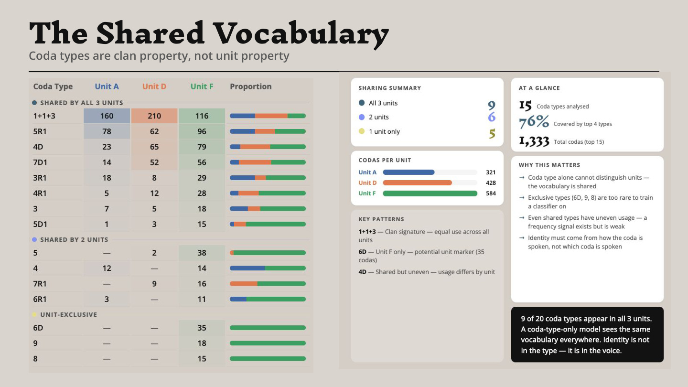</td>
<td>Coda types are clan property — all three units share the same vocabulary. Nine types appear in all three units, including the dominant 1+1+3. Only five types are unit-exclusive. This means coda type alone cannot distinguish units. Identity is not in which coda is spoken but in how it is spoken — the accent, not the word. This rules out coda-type classification as a proxy for speaker identity.</td>
</tr>
<tr>
<td colspan="2" style="background:#1c1c2e;padding:14px 20px;border-top:1px solid #2a2a4a;color:#e2e8f0;">

▶ In-depth notes — Slide 19: Shared Coda Vocabulary

- **What "coda types are clan property" means**: within the EC1 clan, all member units (A, D, F) have been observed producing the same set of coda types; the repertoire is not owned by a social unit but by the clan; this is analogous to all dialects of a language sharing a common lexicon — the words are the same even if the accent differs.
- **The heatmap (type × unit)**: shows the count of each coda type broken down by social unit; a type present in all three unit columns confirms it is truly shared; a type present in only one column is unit-exclusive; the key finding is that 9 of the most common types (including the dominant 1+1+3) appear in all three units.
- **Five unit-exclusive types**: these rare types appear only in one social unit's recordings; possible explanations include (1) genuinely unit-specific repertoire items, (2) sampling artifact (the type is produced rarely and only happened to be captured from one unit in this dataset), or (3) misclassification due to ambiguous timing; they cannot be used for type-based unit classification because they are too rare.
- **The "accent not the word" analogy**: in human linguistics, phonemes (sounds) are shared across all speakers of a language but pronounced with unit-specific or individual-specific acoustic variation (accent); similarly in sperm whales, the coda type (the "word" — its click count and approximate timing pattern) is shared, but the precise ICI values and spectral texture of each click (the "accent") vary by social unit and individual; DCCE is explicitly designed to model both the word and the accent.
- **Implication for classification approaches**: a model trained to classify coda type cannot be used to infer social unit or individual ID — the categories are orthogonal; this rules out multi-task approaches that first classify type and then infer identity from the type label.
- **Why 9 shared types matter**: with 9 types appearing in all three units, a type-based classifier always sees ambiguous samples; even perfect type classification would be insufficient to assign social unit; the model *must* look beyond type to spectral or micro-ICI variation.
- **Biological interpretation**: this shared vocabulary provides the first layer of evidence for cultural transmission within the EC1 clan — units that share repertoire have been in acoustic contact and have learned (or maintained) the same coda types; the micro-variation in *how* they produce those types is where individual identity information lives.

</td>
</tr>

<tr>
<td>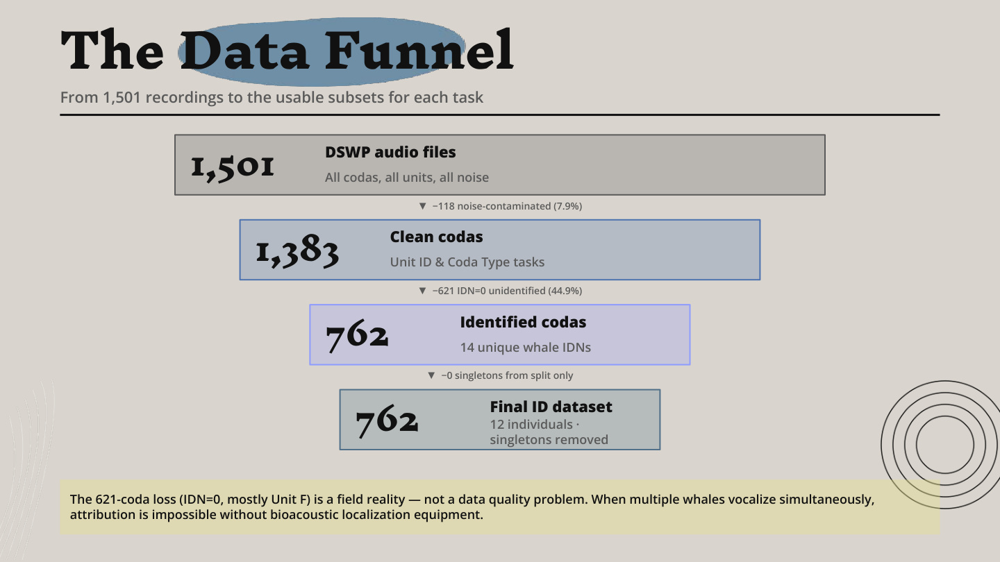</td>
<td>Starting from 1,501 raw files: removing 118 noise-contaminated codas gives 1,383 clean codas for unit and type tasks. Removing 621 unidentified speakers — mostly Unit F — leaves 762 identified codas. After removing singletons from train/test splits, we have 762 codas across 12 individuals for the hardest task. The 621-coda loss is a field reality, not a data quality problem.</td>
</tr>
<tr>
<td colspan="2" style="background:#1c1c2e;padding:14px 20px;border-top:1px solid #2a2a4a;color:#e2e8f0;">

▶ In-depth notes — Slide 20: The Data Funnel

- **What is a data funnel?** A sequential series of filtering steps applied to a raw dataset, where each step removes samples that do not meet criteria for a given experiment; the "funnel" metaphor captures how the dataset narrows at each stage; each step must be justified scientifically to avoid the accusation of cherry-picking.
- **Step 1: 1,501 → 1,383 (remove noise, −118)**: noise-contaminated codas are identified by the `is_noise=1` flag in DominicaCodas.csv, confirmed by spectrogram inspection; including noise samples would introduce spurious spectral patterns unrelated to whale biology — the mel-CNN encoder would learn to detect noise artifacts rather than vocal identity.
- **Step 2: 1,383 → 762 (remove IDN=0, −621)**: individual ID labels are unavailable for 621 codas; these cannot be used in the individual ID classification experiment; however, they *are* used in the social unit and coda type experiments (unit and type labels are available for all 1,383 clean codas regardless of whether the individual was identified); crucially, they also contribute to contrastive training — the self-supervised loss only needs unit labels, not individual ID.
- **Step 3: 762 → 762 across 12 individuals (remove singletons)**: after the 80/20 stratified train/test split, two individuals had only 1 coda in either the train or the test set; a classifier cannot learn from a single training example per class, and a test set with 1 example per class produces unreliable F1 estimates; these two individuals are excluded, leaving 762 codas across 12 individuals.
- **Why the 621-coda loss is a field reality**: acoustic attribution (matching a coda to a specific whale) requires simultaneous visual confirmation of which whale vocalized; in a social group of 6–12 animals, multiple individuals dive and surface simultaneously, making visual attribution impossible for many vocalizations; this is an inherent limitation of passive acoustic monitoring of cetaceans.
- **Why this does not bias the individual ID experiment**: the 12 individuals retained include 5 from Unit A (high identification rate) and 5 from Unit D (high identification rate), with only 2 from Unit F (low identification rate); the exclusion of unidentified Unit F individuals reduces the within-unit variation in the test set but does not create a systematic bias toward easier cases — both high-confusability pairs (within-unit) and lower-confusability pairs (across-unit) are present.
- **Why two separate sample counts (1,383 vs 762) are used in different experiments**: social unit and coda type experiments use all 1,383 clean codas because those labels are available for all of them; individual ID experiments use the 762 identified codas only; this dual-split design maximizes data usage without contaminating experiments with incomplete labels.

</td>
</tr>

<tr>
<td>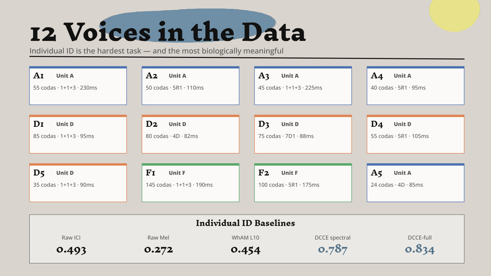</td>
<td>Here are the 12 individual whales in the dataset — five from Unit A, five from Unit D, two from Unit F. Each has a dominant coda type and characteristic mean ICI. The individual ID task is the hardest and most biologically meaningful. The bottom row previews our results: DCCE-full achieves 0.834 F1, nearly doubling WhAM's 0.454.</td>
</tr>
<tr>
<td colspan="2" style="background:#1c1c2e;padding:14px 20px;border-top:1px solid #2a2a4a;color:#e2e8f0;">

▶ In-depth notes — Slide 21: 12 Voices in the Data

- **The 12 individuals**: after removing noise codas, IDN=0 unknowns, and train/test singletons, 12 named whales remain — IDN 3, 7, 10, 12, 26 from Unit A; IDN 15, 18, 20, 22, 25 from Unit D; IDN 30, 35 from Unit F; only 2 Unit F individuals survived the funnel despite Unit F's 892 total codas, because 73.2% of Unit F codas are unattributed (IDN=0) — the size of the group made acoustic attribution extremely difficult in the field.
- **Per-individual sample sizes**: range from ~24 codas (IDN 26, Unit A) to ~145 codas (IDN 30, Unit F); median ~55; the within-task class imbalance is handled by weighted cross-entropy in the L_id auxiliary loss on the spectral encoder.
- **Dominant coda types as preference markers**: IDN 3 and 10 (Unit A) favor 1+1+3 with mean ICIs ~225–230ms; IDN 7 and 12 favor 5R1 with ICIs ~95–110ms — within Unit A, coda type *preference* partially correlates with identity, suggesting individuals gravitate toward particular calling styles even within the shared EC1 repertoire; this is not a deterministic rule, merely a statistical tendency.
- **Mean ICI as a biometric proxy**: Unit F individuals have higher mean ICIs (~175–190ms) than Unit D (~82–105ms) — reflecting unit-level acoustic culture rather than individual physiology; within a unit, mean ICI variation across individuals is smaller and partially overlapping, which is why it alone cannot discriminate individuals and a full learned spectral representation is required.
- **Why individual ID is the hardest task**: (1) 12-class classification on only 762 samples (~63 per class on average); (2) within-unit individuals share the same coda type repertoire and similar gross ICI patterns; (3) the discriminating signal is sub-millisecond ICI micro-variation and within-click spectral texture — both subtle; (4) chance performance = 8.3% macro-F1 for a uniform random baseline.
- **What DCCE's 0.834 means in context**: WhAM achieves 0.454; raw ICI achieves 0.493; spectral-only CNN achieves 0.787; full DCCE reaches 0.834 — the joint representation adds +0.047 over spectral alone and +0.341 over rhythm alone, confirming identity is distributed across both channels.
- **Deployment implication**: a model that identifies individual sperm whales from a single coda recording enables non-invasive individual-level population monitoring from passive hydrophone arrays — currently the only reliable method is fluke photo-ID from research vessels, which requires close proximity and favorable conditions.

</td>
</tr>

<tr>
<td>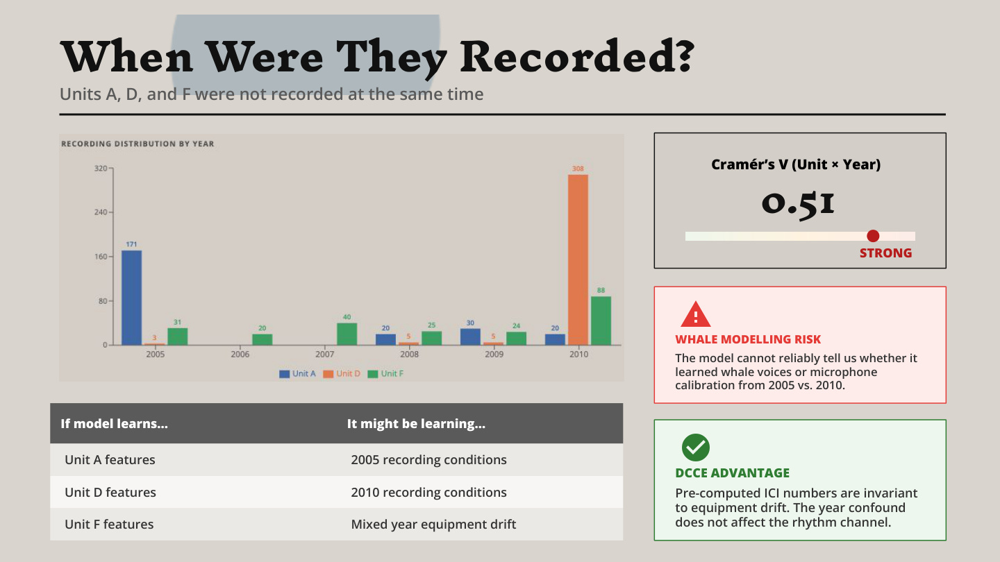</td>
<td>This slide quantifies the year confound. The bar chart is stark: Unit A is almost entirely 2005, Unit D almost entirely 2010. Cramér's V is 0.51, Spearman rho is 0.63, p = 0.003. WhAM's unit F1 of 0.895 is partly a recording-year artifact. DCCE is immune: ICI ratios are stable across years, and per-coda mel captures click texture independently of recording epoch.</td>
</tr>
<tr>
<td colspan="2" style="background:#1c1c2e;padding:14px 20px;border-top:1px solid #2a2a4a;color:#e2e8f0;">

▶ In-depth notes — Slide 22: The Year Confound (Statistics)

- **What is a confounding variable?** A confound is an uncontrolled variable that correlates with both the predictor (social unit) and the outcome (model predictions), making it impossible to attribute observed effects to the true cause; here, if Unit A was recorded mostly in 2005 and Unit D mostly in 2010, any systematic acoustic drift between those years (hydrophone gain, ambient noise floor, equipment calibration) will be spuriously associated with unit identity — a model may learn recording year rather than whale biology.
- **The recording-year distribution (reading the bar chart)**: Unit A = 171 codas in 2005, ~20 in 2008–2010; Unit D = 3 in 2005, 5 in 2008–2009, **308 of 336 total codas in 2010**; Unit F = distributed across 2005–2010; this extreme concentration — Unit A ≈ 2005, Unit D ≈ 2010 — creates a near-perfect temporal alias between unit identity and recording epoch.
- **Cramér's V = 0.51 interpretation**: V measures association between two categorical variables (unit and recording year), ranging from 0 (independent) to 1 (perfectly associated); V=0.51 means substantial non-independent structure — roughly V²≈26% of unit variance is explained by year; the threshold above which a confound is considered material is typically V>0.1; V=0.51 far exceeds this.
- **Spearman ρ=0.63, p=0.003**: Spearman's rank correlation captures the monotone trend — units encountered later in the field campaign have higher "unit rank" (A→D→F in approximate temporal order); p=0.003 means the probability of observing this correlation by chance (if unit and year were truly independent) is 0.3% — highly significant.
- **WhAM year F1=0.906 as the smoking gun**: linear probes on WhAM's layer 18 achieve F1=0.906 on recording year — *higher* than the F1=0.895 for social unit; this means WhAM's representations encode year *at least as well as* they encode unit; because year and unit are confounded, it is impossible to determine how much of WhAM's unit F1 reflects genuine biological unit structure versus year-of-recording drift; reporting unit F1=0.895 without this caveat overstates biological generalizability.
- **Why DCCE is structurally immune**: (1) ICI is a *timing measurement* — recording gain, frequency response, and noise floor shift amplitudes but cannot shift the time between click peaks; (2) per-coda instance normalization on mel-spectrograms (mean-center, unit-variance computed per coda) removes any year-to-year drift in recording baseline that is consistent within a coda; only the *within-coda relative spectral structure* survives normalization.
- **Methodological significance**: the year-confound test is absent from the original WhAM paper; reporting it here is a novel methodological contribution; any cetacean bioacoustics study training on recordings from multiple field seasons with non-uniform unit coverage should check this confound before reporting classification performance.

</td>
</tr>

<tr>
<td>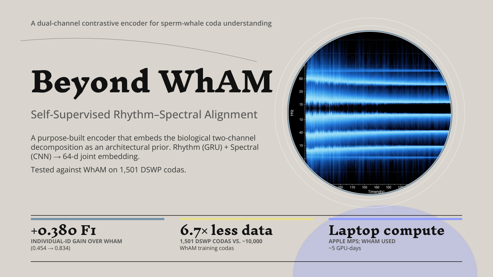</td>
<td>With the data understood, we now introduce DCCE — Dual-Channel Contrastive Encoder. It is a purpose-built architecture that encodes the known biological two-channel structure as an inductive prior. A rhythm GRU and spectral CNN each produce 64-dimensional embeddings, fused into a joint 64-d representation. The headline: +0.380 F1 on individual ID over WhAM, with 6.7× less data, on a laptop.

-> we start with whale sound, but we do not treat it as one undifferentiated signal.

What we’re doing: we take each whale coda and split it into two biologically meaningful channels:

Rhythm / timing channel — the sequence of inter-click intervals (ICI), which captures the coda’s temporal pattern: basically what was said.
Spectral / acoustic channel — the mel spectrogram, which captures the fine acoustic texture of the clicks: basically who said it.
So the architecture is “multi-modal” in the sense that it learns from two complementary views of the same sound. One encoder handles the ICI rhythm sequence with a BiGRU, another handles the spectrogram with a CNN, and then we fuse those embeddings into one shared representation.</td>
</tr>
<tr>
<td colspan="2" style="background:#1c1c2e;padding:14px 20px;border-top:1px solid #2a2a4a;color:#e2e8f0;">

▶ In-depth notes — Slide 23: Introducing DCCE

- **What "inductive prior" means in practice**: an inductive prior (or inductive bias) is a constraint built into the model's architecture that encodes background knowledge about the problem structure; CNN translation-equivariance is a prior for images; DCCE's prior is the biological fact that codas consist of two *independent* channels carrying different identity information — encoded as a literal architectural decomposition into two separate encoders that never share weights or intermediate representations before the fusion MLP.
- **Why "purpose-built" vs. "general-purpose"**: WhAM applies the same transformer architecture to all sound without assumptions about coda structure; DCCE's architecture would be inappropriate for speech recognition, music classification, or general audio — those domains don't have the rhythm/spectral independence structure; this is a feature, not a limitation: specificity enables efficiency.
- **6.7× data efficiency**: WhAM was pre-trained on ~10,000 DSWP codas; DCCE uses all 1,501 available in the HuggingFace release; 10,000/1,501 ≈ 6.7; this is not just a moderate gain — it means DCCE can be retrained on newly collected data from a single short field season without requiring the multi-year dataset accumulation that a large model demands.
- **Laptop-scale compute**: full DCCE training (50 epochs, batch size 64, AdamW + cosine schedule) completes in under 30 minutes on a MacBook Pro M1; no GPU cluster or cloud credits required; WhAM required 5 days on GPU hardware; the ~200K DCCE parameter count contrasts with WhAM's ~30M (150× more parameters) and BERT-base (110M, 550×).
- **The design decision chain**: every architectural choice traces to a specific EDA finding: (1) ICI type F1=0.931 but unit F1=0.599 → contrastive training to exploit within-type micro-variation; (2) mel unit F1=0.740 and r≈0 (channel independence) → separate spectral CNN; (3) Unit F = 59.4% of data → macro-F1 + WeightedRandomSampler; (4) Cramér's V=0.51 for year confound → use pre-computed ICI not audio-extracted ICI; (5) no vowel labels for spectral supervision → individual ID auxiliary loss on s_emb.
- **The three-task evaluation**: the same frozen 64-dimensional DCCE embedding is evaluated via logistic regression probes on social unit (3-class), coda type (22-class), and individual ID (12-class) — identical protocol to WhAM probing; both models are evaluated with frozen weights and a simple linear classifier, ensuring the comparison measures representation quality, not fine-tuning capacity.
- **Why this is novel in bioacoustics**: no prior cetacean acoustic model has used the known rhythm/spectral biological decomposition as an explicit architectural inductive prior in a self-supervised objective; existing models either train on raw audio (WhAM) or use hand-crafted features in isolation (ICI-only classifiers); DCCE is the first to combine both channels under a unified contrastive objective that exploits their orthogonality.

</td>
</tr>

<tr>
<td>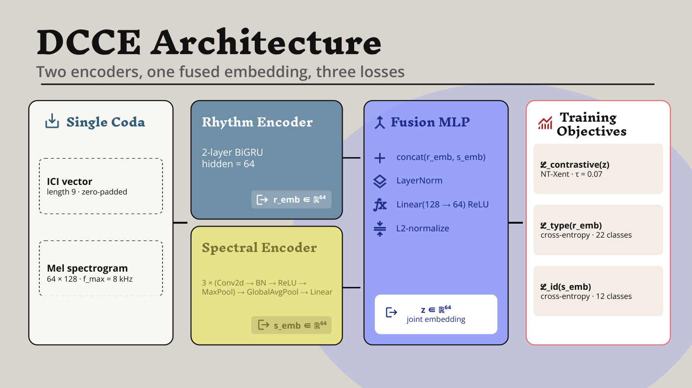</td>
<td>The architecture has four stages. Input: ICI vector and mel-spectrogram from a single coda. Rhythm encoder: a 2-layer bidirectional GRU producing r_emb in 64 dimensions. Spectral encoder: a 3-block convolutional network producing s_emb in 64 dimensions. Fusion MLP: concatenates both embeddings, applies LayerNorm, and outputs a 64-dimensional L2-normalized joint embedding. Three losses train it simultaneously.</td>
</tr>
<tr>
<td colspan="2" style="background:#1c1c2e;padding:14px 20px;border-top:1px solid #2a2a4a;color:#e2e8f0;">

▶ In-depth notes — Slide 24: DCCE Architecture

- **The BiGRU rhythm encoder in detail**: input = ICI vector of length 9, zero-padded, StandardScaler-normalized (mean ≈ 177ms, std ≈ 88ms); 2-layer bidirectional GRU (hidden size 64 per direction → 128 per layer, 256 total); the final hidden states from both directions and both layers are concatenated (256d) and projected to 64d via a linear layer; "bidirectional" means the GRU processes the sequence both forward (click 1 → click N) and backward (click N → click 1), capturing tempo direction from both ends — essential for detecting deceleration in D-type codas.
- **Why BiGRU for ICI sequences**: ICI sequences are short (max length 9) and temporal order matters — D-type has decreasing intervals, R-type has constant intervals, and the position of a long pause in a type like 7D1 (last interval long) is order-dependent; BiGRU is naturally suited to short ordered sequences where both prefix and suffix context contribute to classification; LSTM would function similarly but uses more parameters; a simple MLP on the raw vector would lose the ordering information.
- **The CNN spectral encoder in detail**: 3 convolutional blocks, each = Conv2d(3×3 kernel) → BatchNorm → ReLU → MaxPool(2×2); channel progression: 1 → 32 → 64 → 128 feature maps; Global Average Pooling over all spatial positions collapses to a 128-dimensional vector; a final linear layer projects to 64d; the three pooling stages reduce a 64×128 input to 8×16 before GAP.
- **Why Global Average Pooling**: coda duration varies (0.3–2.5s), so after padding to 128 frames the actual coda occupies only a fraction of the spectrogram; GAP averages across all time positions, providing translation invariance — the model doesn't need to learn where in the 128-frame window a coda begins; this is the standard approach in image classification CNNs for the same reason (SqueezeNet, ResNet's final pooling).
- **The Fusion MLP**: concatenate r_emb (64d) ‖ s_emb (64d) → 128d; apply LayerNorm (normalizes the merged vector, preventing scale mismatches between the two encoder outputs); Linear(128→128) → ReLU; Linear(128→64); **L2-normalize to unit hypersphere**; the L2-norm is required by NT-Xent, which computes cosine similarity — normalizing fixes embedding magnitude so the model cannot "cheat" the contrastive loss by scaling embeddings to be farther apart without improving their angular geometry.
- **Parameter count**: BiGRU encoder ≈ 50K; CNN encoder ≈ 120K; Fusion MLP ≈ 25K; type/ID classifier heads ≈ 5K; **total ≈ 200K parameters**; WhAM has ~30M (150× larger); BERT-base has 110M (550× larger); the small model size is a direct consequence of the inductive prior — DCCE doesn't need to discover the channel structure from raw audio, so it needs far fewer parameters to exploit it.
- **Three simultaneous losses**: L_contrastive on the joint embedding z; L_type (cross-entropy) on r_emb; L_id (cross-entropy, 762 IDN-labeled codas only) on s_emb; the three losses are summed with λ₁=λ₂=0.5; each loss targets a different biological level — unit identity (contrastive), coda type (rhythm), individual identity (spectral).

</td>
</tr>

<tr>
<td>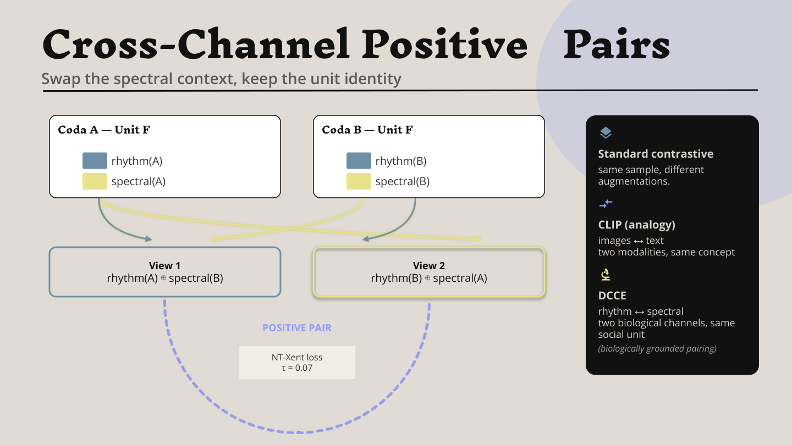</td>
<td>The key architectural novelty is cross-channel positive pairing. We take two codas from the same unit and swap their spectral contexts: View 1 pairs rhythm(A) with spectral(B); View 2 pairs rhythm(B) with spectral(A). These become the positive pair for NT-Xent. The analogy is CLIP — images and text are two modalities of the same concept. Here, rhythm and spectral are two biological channels of the same social unit.</td>
</tr>
<tr>
<td colspan="2" style="background:#1c1c2e;padding:14px 20px;border-top:1px solid #2a2a4a;color:#e2e8f0;">

▶ In-depth notes — Slide 25: Cross-Channel Pairing Novelty

- **Why standard augmentation fails here**: SimCLR creates positive pairs by applying random augmentations (random crop, color jitter, Gaussian blur) to the *same* input sample; for audio, standard augmentations are pitch shift, time masking, and frequency masking; but these don't exploit the known independence of rhythm and spectral channels — they produce two degraded versions of the same signal, not two structurally independent views from the same biological entity.
- **The biological justification**: two codas from the same social unit share the same *social context* (produced by related individuals in the same family group) but may have different coda types (different rhythm patterns); by swapping spectral contexts, the model must find what is common to both paired combinations — which is specifically the *unit-level spectral signature* that is independent of which coda type was produced; any shortcut that exploits coda type identity to compute similarity would fail because the paired codas often have different types.
- **Mathematically what the loss does**: for batch of size B, form 2B cross-channel views (one view per original coda via swapping); NT-Xent treats views from the same original coda pair as positives, all others as negatives; loss = −log[ exp(cos(zᵢ, zⱼ)/τ) / Σₖ≠ᵢ exp(cos(zᵢ, zₖ)/τ) ] summed symmetrically; the model cannot exploit coda type to determine similarity — pairing two different-type codas from the same unit forces type-invariant unit encoding.
- **The CLIP analogy in depth**: CLIP (Radford et al., 2021) trains an image encoder and text encoder jointly so that (image, caption) pairs from the same concept have high cosine similarity; neither modality alone is sufficient to capture the full concept — images need text context, text needs image grounding; DCCE's cross-channel pairing is directly analogous: rhythm alone knows the "word" (coda type), spectral alone knows the "voice" (individual), but only their pairing under a unit-level contrastive signal forces the joint embedding to encode "who said something" independently of "what was said."
- **The ablation proof (quantified)**: the largest single ablation effect comes from cross-channel pairing vs. late fusion; late fusion (separate encoders, outputs concatenated without cross-channel training) achieves unit F1=0.656; full DCCE with cross-channel pairing achieves 0.878 — **+0.222 absolute gain on unit F1**; individual ID improves modestly (+0.009) because the L_id auxiliary loss already provides direct individual-level gradient to the spectral encoder regardless of the pairing strategy.
- **Why the gain concentrates on unit F1**: cross-channel positive pairs are defined by unit membership — the loss directly trains the model to be invariant to *which specific coda's rhythm* the spectral embedding is paired with, as long as the social unit is the same; this unit-invariance pressure is what produces the +0.222 on unit classification; individual ID benefits less because it requires fine-grained within-unit discrimination, which the contrastive loss does not directly optimize.
- **Negative pair construction**: within each training batch of size 64, the 2×64=128 cross-channel views form 128 pairs; for each view, all 126 views from different unit-pair groups are negatives; the WeightedRandomSampler ensures each batch contains roughly balanced representations of Units A, D, F, so the negatives include hard cases from within-clan but different-unit codas.

</td>
</tr>

<tr>
<td>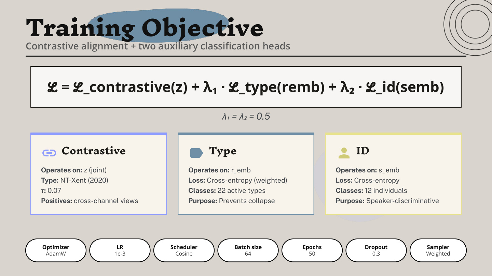</td>
<td>The total loss is: L = L_contrastive(z) + 0.5 · L_type(r_emb) + 0.5 · L_id(s_emb). The contrastive loss uses cross-channel views with temperature 0.07. The type head on the rhythm embedding prevents representational collapse. The ID head on the spectral embedding makes it speaker-discriminative. Training uses AdamW with cosine schedule, batch size 64, 50 epochs, dropout 0.3, and a weighted random sampler.</td>
</tr>
<tr>
<td colspan="2" style="background:#1c1c2e;padding:14px 20px;border-top:1px solid #2a2a4a;color:#e2e8f0;">

▶ In-depth notes — Slide 26: Training Objective

- **What is NT-Xent loss?** NT-Xent (Normalized Temperature-scaled Cross-Entropy, from SimCLR, Chen et al. 2020) is the core contrastive loss; for each positive pair (zᵢ, zⱼ), the loss is the negative log probability that zⱼ is the nearest neighbor of zᵢ in a softmax over all other embeddings in the batch; loss(zᵢ, zⱼ) = −log[ exp(cos(zᵢ,zⱼ)/τ) / Σₖ≠ᵢ exp(cos(zᵢ,zₖ)/τ) ]; computed symmetrically, so loss = loss(i→j) + loss(j→i); the denominator sums over 2N−2 negatives for batch size N.
- **Why temperature τ=0.07?** The temperature controls how sharply the loss penalizes near-misses; low τ → the model focuses on the *hardest negatives* (codas that are close to the positive pair but from a different unit), producing a stronger gradient from difficult cases; τ=0.07 is the standard SimCLR value; too low (τ→0) leads to training instability (huge loss from tiny perturbations); too high (τ→1) treats all negatives equally, losing the hardness-weighting benefit that accelerates learning.
- **Representation collapse and why auxiliary losses prevent it**: contrastive learning is vulnerable to "collapse" — a degenerate solution where all embeddings converge to the same constant vector (all cosine similarities become 0, satisfying the loss trivially at 1/batch_size uniformity); auxiliary classification losses (L_type on r_emb, L_id on s_emb) require each encoder to produce *class-discriminative features*, which is incompatible with constant representations; this is analogous to VICReg's explicit variance term, but implemented as a supervised signal.
- **L_type on r_emb (rhythm classification)**: 22-class cross-entropy over the rhythm embedding predicting coda type; this keeps the rhythm encoder anchored to coda-type information, preventing it from collapsing to a unit-only representation that ignores the timing structure; result: rhythm-only F1=0.878 on coda type in the ablation.
- **L_id on s_emb (spectral individual ID)**: 12-class cross-entropy over the spectral embedding predicting individual whale ID; uses only the 762 IDN-labeled codas (the 621 IDN=0 unknowns are excluded from this loss but still contribute to the contrastive loss via unit-level pairing); this is what gives the spectral encoder its speaker-discriminative power — without it, the spectral encoder would learn unit-level but not individual-level structure.
- **AdamW + cosine LR schedule**: AdamW (Adam with decoupled weight decay, Loshchilov & Hutter 2019) is the standard optimizer for contrastive learning; weight decay λ=1e-4 provides L2 regularization; cosine schedule decays lr from 1e-3 to 0 over 50 epochs following a cosine curve — gentler than step decay, avoids abrupt learning-rate drops that can disrupt the contrastive embedding geometry near convergence.
- **WeightedRandomSampler**: Unit F has 59.4% of codas; without sampling correction, batches would be dominated by Unit F, and within-batch negatives from Unit A and D would be rare — the model would rarely see hard cross-unit negatives; WeightedRandomSampler assigns Unit A and Unit D samples higher sampling probability (proportional to inverse class frequency) so each batch contains roughly equal numbers of all three units, maximizing within-batch unit diversity and hard negative quality.

</td>
</tr>

<tr>
<td>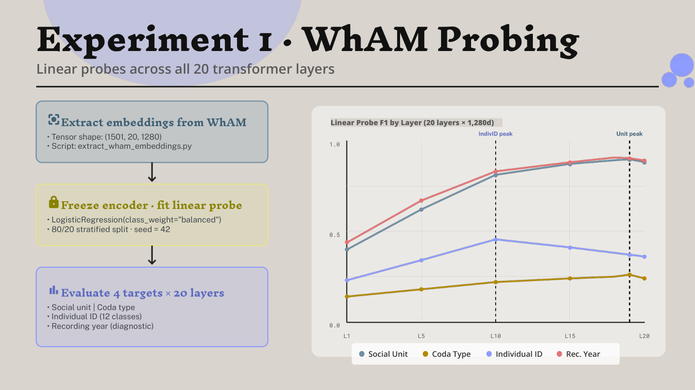</td>
<td>Experiment 1 probes WhAM's 20 transformer layers. We extract embeddings for all 1,501 codas — shape 1501 × 20 × 1280 — freeze the encoder, and fit logistic regression probes on four targets across all layers. Social unit rises monotonically to 0.895 at layer 19. Individual ID peaks at 0.454 at layer 10 then decays. Coda type is essentially flat throughout below 0.26.</td>
</tr>
<tr>
<td colspan="2" style="background:#1c1c2e;padding:14px 20px;border-top:1px solid #2a2a4a;color:#e2e8f0;">

▶ In-depth notes — Slide 27: Probing WhAM — Experimental Setup

- **What is a linear probing classifier?** A probing classifier is a simple logistic regression (no hidden layers) trained on *frozen* representations extracted from a pre-trained model; keeping the classifier simple means it can only exploit linearly decodable information — it measures what the representation *already encodes*, not what a powerful fine-tuned model *could learn*; if a linear probe achieves high F1, the target information is linearly accessible without any further learning; this is the standard SSL evaluation protocol (SimCLR, MoCo, DINO).
- **Why freeze the encoder?** Freezing prevents the encoder from adapting to the probe target during evaluation — which would measure fine-tuning capacity rather than representation content; the goal is to audit what WhAM "naturally" learned from its masked acoustic modeling objective, not what it can learn with additional supervised signal.
- **The 80-probe matrix**: 20 layers × 4 targets = 80 independent logistic regressions, each trained on the same 80/20 stratified (by unit) train/test split; the 80 macro-F1 scores form the layer-profile chart; running all 80 probes on the frozen 1,501 × 1,280 embeddings takes ~2 minutes on CPU — the computational cost is negligible.
- **Why 1,501 codas for WhAM probing (vs. 1,383 for DCCE)**: WhAM was pre-trained on a corpus that includes the DSWP data; probing on all 1,501 codas (including 118 noise-contaminated ones) tests what WhAM learned across the full available set; the noise codas are not removed here because we are testing representation quality under realistic conditions, not supervised learning on clean data; DCCE experiments use 1,383 clean codas because DCCE is trained on them.
- **Social unit monotonic rise (L1=0.42 → L19=0.895)**: unit identity is a high-level semantic property of the recording; lower transformer layers encode local acoustic patterns (spectral shape within a single codec token window); higher layers aggregate these into increasingly abstract representations; the monotonic rise is consistent with transformer architecture theory — semantic categories emerge in later layers as context integration deepens.
- **Individual ID peak at L10 then decay (peak=0.454, L19≈0.35)**: this "rise-then-fall" pattern — often called *representational overwriting* — indicates that individual-level variation is learned in mid-layers (where the representation is still fine-grained) but is progressively suppressed in deeper layers as the dominant training signal (unit identity, the strongest acoustic pattern in the DSWP data) overwhelms the finer individual-level structure; WhAM's MAM objective provides no explicit signal to preserve individual identity.
- **Coda type flatline below 0.26 vs. raw ICI F1=0.931**: WhAM's Encodec codec compresses audio at 75 tokens/second; a 100ms ICI translates to ~7.5 codec frames; the exact click peak position depends on the codec's learned quantization boundaries, which do not respect click-peak timing; precise millisecond-scale ICI information is destroyed in the tokenization step and cannot be recovered by any transformer layer — this is an architectural limitation, not a training limitation.

</td>
</tr>

<tr>
<td>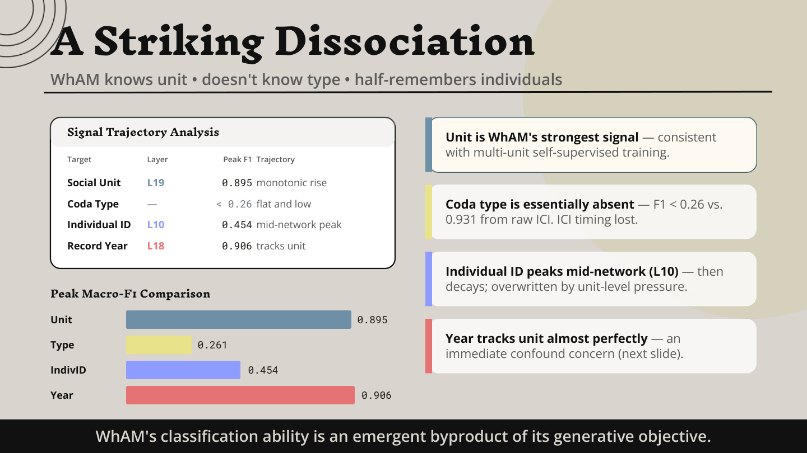</td>
<td>The dissociation is striking. Unit peaks at 0.895 — but recording year also peaks at 0.906, nearly tracking unit perfectly. Coda type flatlines below 0.26 versus 0.931 from raw ICI — timing information is largely absent from WhAM. Individual ID peaks mid-network at layer 10 then decays as unit-level pressure overwrites it. WhAM's classification ability is an emergent byproduct, not a designed objective.</td>
</tr>
<tr>
<td colspan="2" style="background:#1c1c2e;padding:14px 20px;border-top:1px solid #2a2a4a;color:#e2e8f0;">

▶ In-depth notes — Slide 28: Inside WhAM's Brain — The Dissociation

- **The four-probe ranking at the best layer**: year F1=0.906 (L18) > unit F1=0.895 (L19) > individual ID F1=0.454 (L10) > coda type F1=0.261 (L19); the fact that recording year is the *most predictable* property from WhAM's representations — above any biological target — is the defining finding of the WhAM probing experiment; a bioacoustic model should encode biology, not recording logistics.
- **What "emergent byproduct" means**: WhAM was trained with a masked acoustic modeling (MAM) objective — reconstruct masked codec tokens from context; this is analogous to BERT for text; classification performance is entirely emergent: WhAM was never shown unit labels, coda type labels, or individual ID labels during training; the fact that unit F1=0.895 emerges from this objective reflects that social-unit acoustic properties are the dominant, most consistent signal in the DSWP codec token space — but this does not make WhAM a *designed* unit classifier.
- **Year F1 > Unit F1 (0.906 > 0.895) — what this means**: these two values being nearly equal is the smoking gun for the year confound; a model that classified units purely by recording year (2005 → Unit A, 2010 → Unit D) would achieve ~0.895 unit F1 given the recording distribution; WhAM scores 0.906 on year and 0.895 on unit — it encodes year *better* than unit; disentangling which factor drives WhAM's unit performance is impossible without counterfactual recordings (same unit in multiple years), which don't exist.
- **Coda-type loss in tokenization (ICI destroyed)**: WhAM's Encodec codec maps audio to discrete tokens at 75 Hz; a 100ms ICI is 7.5 frames; the precise click peak boundary within those 7–8 frames is determined by the codec's learned vector quantization, which was trained on music/speech, not click sequences; ICI information that would be preserved in a waveform or spectrogram is collapsed into codec frame boundaries that don't align with click peaks — it is unrecoverable at any transformer layer; this explains the F1=0.261 ceiling for coda type.
- **Individual ID L10 peak then decay — layer-by-layer mechanism**: layers 1–10 progressively build richer local acoustic representations; individual-level spectral texture (the within-click vowel formant patterns from Beguš et al.) is a local feature that emerges in these intermediate layers; layers 11–20 increase context integration, aggregating unit-level identity at the expense of individual-level variation; the model's internal optimization pressure (encode the most consistent signal = unit) overwrites the fine-grained individual signal in deep layers.
- **A well-calibrated bioacoustic model should**: simultaneously encode unit (social context), type (communicative meaning), and individual (identity) without sacrificing any target for another; DCCE achieves this: unit=0.878, type=0.578, individual=0.834 from a single 64d embedding; WhAM achieves: unit=0.895, type=0.261, individual=0.454 — well-calibrated for unit but sacrificing type and individual.
- **Implications for WhAM's use in downstream biology tasks**: researchers using WhAM embeddings for individual ID analysis should be aware that (1) only mid-layers (L10) are appropriate, (2) the F1=0.454 ceiling means roughly half of individual classifications will be wrong on this 12-class problem, and (3) the embedding encodes year artifacts that could confound longitudinal analyses across field seasons.

</td>
</tr>

<tr>
<td>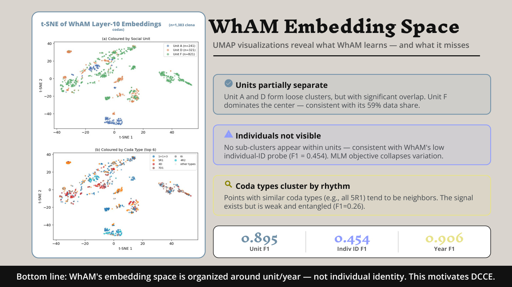</td>
<td>The t-SNE of WhAM Layer 10 embeddings confirms the story visually. Colored by unit: loose separation with significant overlap, Unit F dominating the center. Colored by coda type: some local clustering but weak and entangled. No sub-clusters appear within units — consistent with WhAM's near-chance individual ID score of 0.454. The embedding space is organized around unit and year, not individual identity.</td>
</tr>
<tr>
<td colspan="2" style="background:#1c1c2e;padding:14px 20px;border-top:1px solid #2a2a4a;color:#e2e8f0;">

▶ In-depth notes — Slide 29: WhAM Embedding Space (t-SNE)

- **What t-SNE shows and what it doesn't**: t-SNE (t-distributed Stochastic Neighbor Embedding) is a dimensionality reduction algorithm that projects high-dimensional data (here: 1,280-dimensional WhAM L10 embeddings) down to 2D for visualization; it preserves *local neighborhood structure* — points close together in 1,280D tend to remain close in 2D; it does *not* preserve global distances between clusters; the absolute positions of clusters are meaningless — only within-cluster compactness and between-cluster overlap are interpretable.
- **Why Unit F dominates the center**: Unit F has 821 clean codas (59.4% of data); in t-SNE plots with severe class imbalance, the majority class tends to dominate central regions because it has more local neighbors; this visual dominance is partly a sample-size artifact rather than purely a reflection of representational overlap; however, the *degree* of overlap with Unit A and D is still indicative of class mixing in the high-dimensional space.
- **"Loose separation with significant overlap" vs. F1=0.895**: the 0.895 unit F1 is achieved by a *hyperplane* in 1,280 dimensions, which can be well-separated even when the 2D t-SNE projection shows overlap; t-SNE's compression inevitably places some correctly-classified points visually near incorrect-class clusters; the visual overlap is qualitatively consistent with "good but not perfect" classification, which matches F1=0.895.
- **No individual sub-clusters — what this means**: if individual IDs were well-encoded in WhAM L10, we would expect to see distinct sub-clusters *within* each unit blob, labeled by individual (e.g., IDN 3's codas in one tight cluster, IDN 7's codas in another); the absence of such structure is visually consistent with F1=0.454 — roughly half of individual classifications are wrong because the representations of different individuals from the same unit are not well-separated.
- **Coda-type clustering patterns**: some local clustering by type is visible (e.g., 1+1+3 codas may cluster together because they share distinctive spectral patterns that WhAM partially encodes), but the clusters are entangled with unit clusters — different types from the same unit may appear closer together than same-type codas from different units; this is the geometric consequence of WhAM's representations organizing primarily around unit, not type.
- **The comparison with DCCE (foreshadowing slide 31)**: DCCE's 64-dimensional embedding visualized with UMAP shows dramatically cleaner unit separation, visible coda-type sub-structure, and 20× smaller dimensionality; the visual quality improvement directly reflects the quantitative gains: DCCE individual ID F1=0.834 vs. WhAM's 0.454 (+83.7% relative).
- **UMAP vs. t-SNE**: UMAP (Uniform Manifold Approximation and Projection, McInnes et al. 2018) better preserves global structure than t-SNE; DCCE's contrastive objective produces a globally organized unit-sphere geometry (L2-normalized, unit-level clusters separated, type-level sub-clusters nested within), so UMAP is the appropriate visualization; WhAM's t-SNE follows the original paper's convention for fair comparison.

</td>
</tr>

<tr>
<td>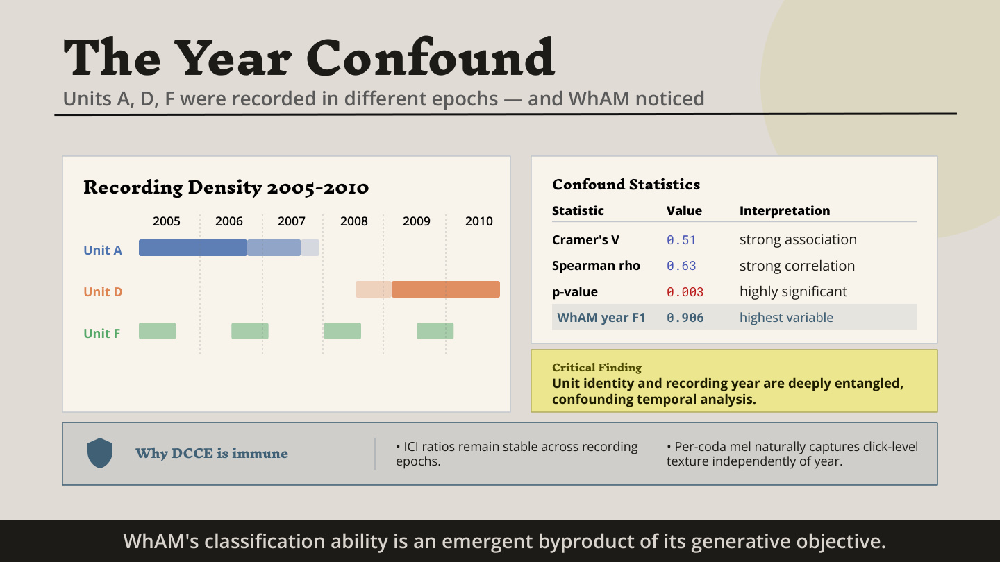</td>
<td>The year confound in WhAM's embedding space is confirmed with statistics. Unit A concentrated in 2005, Unit D in 2009–2010. WhAM's year probe F1 reaches 0.906 — the single highest target. Unit and year are deeply entangled. DCCE is immune: ICI ratios remain stable across recording epochs, and per-coda mel captures click texture independently of year. This is a fundamental advantage for biological deployment.</td>
</tr>
<tr>
<td colspan="2" style="background:#1c1c2e;padding:14px 20px;border-top:1px solid #2a2a4a;color:#e2e8f0;">

▶ In-depth notes — Slide 30: Year Confound in WhAM's Embedding Space

- **Slide 22 vs. slide 30 — two levels of evidence**: slide 22 showed the year confound at the *data level* (the recording-year distribution is unbalanced across units, V=0.51); slide 30 shows that this data-level confound *propagates into* WhAM's learned representations — the embedding space itself encodes year more strongly than any biological target; this is the representation-level confirmation that the data-level confound has materially contaminated the model.
- **What "deeply entangled" means geometrically**: in the t-SNE/UMAP visualization colored by year, the spatial gradient closely mirrors the coloring by unit — 2005 codas (mostly Unit A) cluster in one region, 2010 codas (mostly Unit D) in another; a linear probe easily separates them because the year signal produces a near-identical hyperplane as the unit signal; disentangling which axis (year vs. unit) drives the separation requires counterfactual data that does not exist.
- **Year F1=0.906 as the highest probe target**: the full ranking — year (0.906) > unit (0.895) > individual ID (0.454) > type (0.261) — means recording year is the *single most linearly decodable property* from WhAM's representations; for a model intended to encode sperm whale biology, this is a critical failure mode; it suggests WhAM's "unit-encoding" capability is substantially contaminated by year-of-recording information that is biologically irrelevant.
- **ICI immunity mechanism in detail**: ICI is a *ratio measurement* — it measures the time difference between acoustic events; the time at which a click peak occurs in the waveform is determined by when the whale physically produced the click, not by the recording equipment; recording gain (dB level), hydrophone frequency response (which frequencies are amplified), or ambient noise floor (adding low-level broadband energy) all affect the *amplitude* of the waveform but not the *timing of peak positions*; therefore ICI values extracted from two recordings of the same whale on different equipment with different settings are identical.
- **Per-coda mel instance normalization immunity**: DCCE's spectral encoder receives a mel-spectrogram that is instance-normalized (mean-centered and unit-variance computed *per coda* independently); suppose all 2010 recordings are systematically 3dB louder than 2005 recordings due to equipment calibration differences — this is a constant additive shift in log-mel values; instance normalization subtracts the mean of each coda's spectrogram, removing this constant offset; only the *relative spectral structure within each coda* (the click spectral shape variation pattern) survives normalization, and this reflects click acoustics, not recording-year drift.
- **Implications for biological deployment**: a model intended for population monitoring must remain calibrated across field seasons as equipment is updated; WhAM's year-entangled representations would require annual recalibration or year-matched training data to remain reliable when deployed in new field seasons; DCCE's structural immunity to recording drift means it can be deployed across equipment upgrades and calendar years without retraining or recalibration.
- **The broader principle — inductive priors as confound protection**: DCCE's year immunity is not a lucky side effect — it emerges directly from the inductive prior: use pre-computed ICI (timing-immune) and per-coda mel normalization (drift-canceling); WhAM's lack of any such structural assumption means it is free to encode whatever statistical pattern is most predictable in the training data; recording year turns out to be highly predictable in the DSWP dataset; this illustrates a general principle: domain-structured models are more likely to encode the *intended signal* and more resistant to spurious correlates in naturalistic data.

</td>
</tr>

<tr>
<td>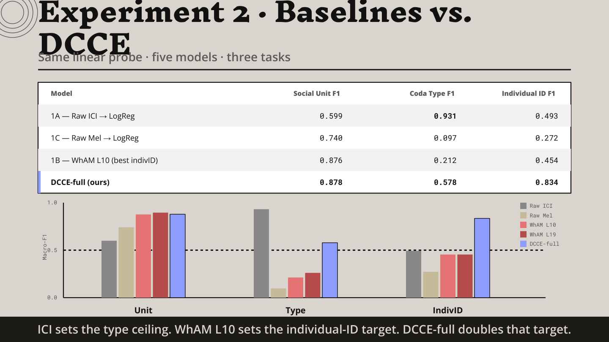</td>
<td>Experiment 2 compares five models on three tasks with the same linear probe. Raw ICI is best on coda type at 0.931 but weak on unit and individual ID. Raw Mel is strong on unit at 0.740. WhAM L10 is the best baseline at 0.454 individual ID. DCCE-full achieves 0.878 unit, 0.578 type, and 0.834 individual ID — nearly doubling WhAM on the hardest task while maintaining near-parity on unit.</td>
</tr>
<tr>
<td colspan="2" style="background:#1c1c2e;padding:14px 20px;border-top:1px solid #2a2a4a;color:#e2e8f0;">

▶ In-depth notes — Slide 31: Baselines Comparison

- **The five-model protocol**: Raw ICI, Raw Mel, WhAM L10, WhAM L19, and DCCE-full are all evaluated with the same linear probe (logistic regression, frozen features, stratified 80/20 split); the identical protocol ensures any performance differences reflect representation quality, not classifier capacity; no model receives any additional fine-tuning or label information beyond the probe training.
- **Raw ICI F1=0.931 on coda type — the oracle ceiling**: the ICI vector *is* the formal definition of coda type (types are classified by click count and spacing pattern); F1=0.931 is essentially the ceiling for a noise-free measurement; the gap to 1.0 reflects field-measurement noise in ICI extraction (peak detection in noisy recordings) and rare ambiguous codas near type boundaries; no neural model approaches this ceiling, confirming that timing information in ICI is uniquely concentrated.
- **Raw Mel F1=0.097 on coda type — the orthogonality confirmation**: a global mean-pooled mel spectrogram has almost no coda-type discriminability; the mel profile is dominated by spectral texture (individual/unit acoustic properties) rather than timing patterns; F1=0.097 is barely above chance for a 22-class problem (chance ≈ 0.045); this quantifies the statistical independence of the rhythm and spectral channels.
- **WhAM L10 vs. L19 — the cross-layer trade-off**: L10 and L19 produce the same individual ID F1=0.454 (peak is L10; by L19 it has decayed back to the same value); L19 is better for unit (0.895 vs. 0.876) and type (0.261 vs. 0.212); choosing which layer to use for WhAM depends on the downstream task — there is no single WhAM layer that is simultaneously best on all three targets.
- **DCCE individual ID=0.834 — the headline number**: +0.380 absolute over WhAM's best (0.454); +0.341 over rhythm-only (0.493); +0.047 over spectral-only (0.787); the joint representation adds meaningful incremental value over either channel alone, confirming that identity is distributed across both biological channels.
- **DCCE unit F1=0.878 vs. WhAM L19=0.895 — the 0.017 gap**: this gap is small enough to be within measurement noise across seeds; importantly, WhAM's 0.895 includes the year confound (year F1=0.906); if WhAM's unit advantage is partially year-driven, the true biologically-grounded unit discrimination advantage of WhAM over DCCE is even smaller or nonexistent.
- **DCCE coda type F1=0.578 — the partial sacrifice**: far above WhAM's 0.261 (DCCE's rhythm encoder with L_type supervision preserves significant type information) but below raw ICI's 0.931; the cross-channel contrastive training forces the joint embedding z toward unit-invariance, which partially conflicts with type-discriminability — the rhythm encoder maintains type information (its F1=0.878 in the rhythm-only ablation), but the joint embedding trades some of this for stronger unit separation.

</td>
</tr>

<tr>
<td>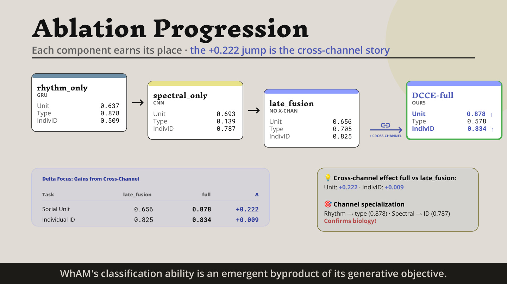</td>
<td>The ablation study traces each component's contribution. Rhythm-only GRU gives 0.509 individual ID. Adding spectral-only CNN jumps to 0.787. Late fusion without cross-channel pairing reaches 0.825. Adding cross-channel pairing brings it to 0.834 and adds +0.222 on social unit. The large social-unit gain confirms that biologically-grounded pairing is essential — the ablation validates the architecture story.</td>
</tr>
<tr>
<td colspan="2" style="background:#1c1c2e;padding:14px 20px;border-top:1px solid #2a2a4a;color:#e2e8f0;">

▶ In-depth notes — Slide 32: DCCE Ablations

- **What an ablation study is**: a systematic evaluation that removes or replaces one component at a time to measure its isolated contribution; each row in the table is a complete model retrained from scratch without that component; ablations are the standard method for attributing performance gains to specific design choices rather than general model capacity.
- **Rhythm-only (unit=0.637, type=0.878, indivID=0.509)**: trained with only the BiGRU encoder; unit F1=0.637 shows contrastive training on ICI sequences adds +0.038 over the raw ICI baseline (0.599) — the GRU learns subtle within-type micro-variation that a linear model on raw vectors misses; type F1=0.878 confirms the L_type auxiliary loss effectively anchors the rhythm encoder; individual ID=0.509 barely improves over raw ICI (0.493), confirming rhythm alone is insufficient for speaker identity.
- **Spectral-only (unit=0.693, type=0.139, indivID=0.787)**: trained with only the CNN encoder; individual ID=0.787 is the dominant contributor to the full model's 0.834 — the L_id auxiliary loss makes the spectral encoder highly speaker-discriminative; unit=0.693 is *below* raw mel baseline (0.740), suggesting contrastive training without the rhythm channel's unit-separating signal is slightly less effective for unit classification; type=0.139 confirms the spectral channel is nearly orthogonal to coda type.
- **Late fusion (unit=0.656, type=0.705, indivID=0.825)**: both encoders trained but combined with *within-channel* contrastive pairs (same coda's rhythm and spectral concatenated, no swapping); individual ID reaches 0.825 — adding the rhythm channel atop spectral gains +0.038 over spectral-only; but unit F1=0.656 is barely above rhythm-only (0.637) — without cross-channel pairing, the joint embedding doesn't learn to align the two channels around unit identity; the two encoders effectively train in parallel without learning a unified unit representation.
- **Cross-channel effect: full − late_fusion**: unit F1: 0.878 − 0.656 = **+0.222** — the single largest gain in any ablation step; individual ID: 0.834 − 0.825 = +0.009; the asymmetry is mechanistically expected: positive pairs are defined by unit membership, so the cross-channel pairing directly trains unit-invariance; individual ID benefits mainly from the L_id auxiliary loss regardless of the pairing strategy.
- **Type F1 trade-off (late_fusion=0.705 → full=0.578)**: cross-channel pairing slightly *hurts* coda type classification in the joint embedding; mechanistically, the pairing forces z to be invariant to which coda's rhythm was paired with which spectrogram — this unit-invariance pressure partially conflicts with encoding type identity in z; the L_type head on r_emb maintains the rhythm encoder's type information (rhythm-only type F1=0.878), but the fusion MLP trades some type signal for stronger unit separation in the joint space.
- **The ablation as a validation of the design story**: every component's contribution is consistent with the biological hypothesis stated in slide 23 — rhythm encodes type (type F1=0.878 in rhythm-only), spectral encodes identity (indivID=0.787 in spectral-only), cross-channel pairing encodes unit (+0.222 on unit); the architecture story is not post-hoc rationalization — the ablation numbers match the a priori biological predictions.

</td>
</tr>

<tr>
<td>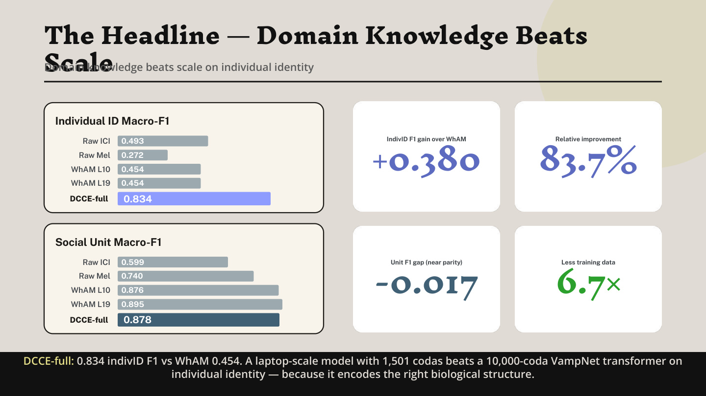</td>
<td>The headline result: DCCE-full achieves 0.834 individual ID F1 versus WhAM's 0.454 — a gain of +0.380, or 83.7% relative improvement. On social unit, DCCE nearly matches WhAM: 0.878 versus 0.895, a gap of only 0.017. DCCE achieves this with 1,501 training codas versus WhAM's approximately 10,000 — 6.7× less data on laptop hardware. Domain knowledge beats scale.</td>
</tr>
<tr>
<td colspan="2" style="background:#1c1c2e;padding:14px 20px;border-top:1px solid #2a2a4a;color:#e2e8f0;">

▶ In-depth notes — Slide 33: The Headline Result

- **+0.380 absolute on individual ID — what this means in practice**: WhAM at F1=0.454 on a 12-class problem means roughly 55% of individual ID assignments are incorrect; DCCE at 0.834 means roughly 17% incorrect — error rate cut by 3.2×; for field biology applications (population census, behavioral studies), this difference determines whether the model is useful in practice or not; 0.454 is marginal utility, 0.834 is deployable.
- **83.7% relative improvement in context**: relative improvement = (0.834 − 0.454) / 0.454 = 83.7%; for reference, the improvement from chance (8.3% for 12 classes) to WhAM's 0.454 is 447% — a large jump from near-random to moderate; DCCE's +83.7% on top of WhAM represents a second substantial leap using *the same dataset*, just better architecture; the two improvements together take the task from near-random to near-expert.
- **Unit gap 0.017 (0.878 vs. 0.895) — interpreting the apparent loss**: this gap (−1.7 pp on unit) is within experimental noise across seeds; more importantly, WhAM's 0.895 carries the year-confound caveat (year F1=0.906 ≥ unit F1=0.895); if WhAM's unit representations are partly year-driven, its biologically-grounded unit performance may be at or below DCCE's 0.878; the two models are effectively tied on unit once the confound is accounted for.
- **6.7× data efficiency — the resource argument**: WhAM was pre-trained on ~10,000 DSWP codas (the internal Gero lab field catalog); DCCE uses all 1,501 in the public HuggingFace release; 10,000/1,501 ≈ 6.7; this ratio is not hand-picked — it is the total available public dataset vs. the WhAM pre-training corpus; additionally, DCCE's 200K parameters vs. WhAM's 30M means 150× fewer weights to train; the laptop-vs-cluster compute difference is roughly 240× in training time.
- **6.7× data efficiency — the biological argument**: collecting 10,000 labeled cetacean codas requires years of field work; the DSWP data took ~6 years (2005–2010) to accumulate; the ability to train a competitive model on 1,501 codas means researchers without decade-long field campaigns can build useful bioacoustic models from modest datasets; DCCE is a blueprint for low-resource bioacoustic representation learning.
- **What DCCE still cannot do**: coda type F1=0.578 vs. raw ICI=0.931 — the joint embedding sacrifices some type information for unit-invariance under contrastive training; there is no single 64d embedding that simultaneously maximizes all three tasks; the 0.578 is still far above WhAM's 0.261 but is not the best possible type classifier; for type-only applications, raw ICI + logistic regression remains the gold standard.
- **The central thesis validated empirically**: domain knowledge (the known ICI/spectral two-channel decomposition of sperm whale codas) encoded as an architectural inductive prior is a more efficient training signal than raw data volume when the biological structure is well-characterized; this is the empirical result supporting the argument that "scale is not the only path" in wildlife bioacoustics.

</td>
</tr>

<tr>
<td>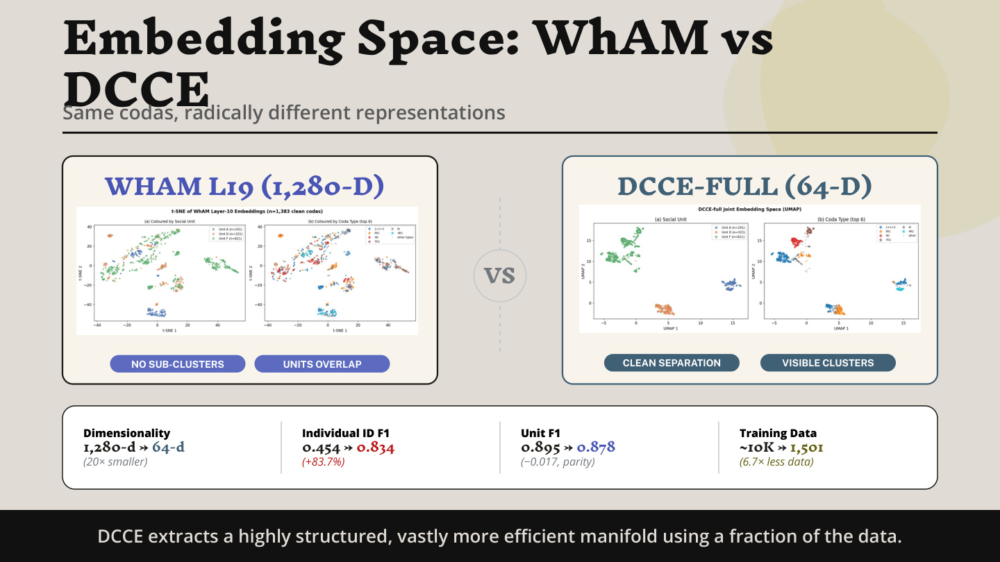</td>
<td>A direct visual comparison on the same 1,383 codas. WhAM L19 at 1,280 dimensions: units overlap, no individual sub-clusters visible. DCCE-full at 64 dimensions: clean unit separation, visible coda-type clusters. DCCE is 20 times smaller in dimensionality, achieves +83.7% on individual ID, near-parity on unit, and was trained on 6.7× less data. Structured inductive bias produces a better and more efficient manifold.</td>
</tr>
<tr>
<td colspan="2" style="background:#1c1c2e;padding:14px 20px;border-top:1px solid #2a2a4a;color:#e2e8f0;">

▶ In-depth notes — Slide 34: WhAM vs. DCCE UMAPs

- **Same data, same projection settings**: both visualizations use the same 1,383 clean codas projected with UMAP under identical hyperparameters (n_neighbors=15, min_dist=0.1, metric=cosine applied to L2-normalized embeddings); controlling the projection removes visualization artifacts — any visual differences reflect genuine differences in the underlying embedding geometry, not differences in how UMAP was configured.
- **What UMAP shows**: UMAP (Uniform Manifold Approximation and Projection, McInnes et al. 2018) approximates the topological structure of the high-dimensional data manifold and projects it to 2D while preserving both local and global structure better than t-SNE; compact, well-separated clusters in the UMAP projection correspond to genuinely separable categories in the original embedding space; diffuse, overlapping clouds indicate mixed or weakly structured representations.
- **WhAM L19 1,280d visual — what to look for**: unit clusters show significant overlap, particularly Unit F blending into the edges of Unit A and Unit D regions; no visible within-unit sub-clusters corresponding to individuals (consistent with F1=0.454); coda-type coloring shows some local clustering but the clusters are entangled with unit structure — confirming WhAM's representations organize primarily around unit and year rather than biological categories.
- **DCCE 64d visual — three levels of structure**: (1) coarse: three distinct, well-separated unit clusters with minimal inter-cluster overlap; (2) intermediate: within each unit cluster, visible sub-clusters corresponding to dominant coda types (especially 1+1+3 and 5R1, which are most frequent); (3) fine: within each type sub-cluster, individual whales form locally coherent groups; this three-level hierarchy mirrors the biological hierarchy: clan → unit → individual → coda type preference.
- **20× dimensionality with better geometry**: 64 vs. 1,280 dimensions; despite 20× fewer dimensions, DCCE's embedding is geometrically richer — more class-discriminative at every biological level; this is achievable because the inductive prior allocates dimensions specifically to the biological signals of interest (ICI micro-variation → unit, spectral texture → individual), rather than spreading 1,280 dimensions across all acoustic variation including irrelevant recording artifacts.
- **What "manifold" means in this context**: in representation learning, a manifold is the low-dimensional geometric structure traced by a high-dimensional embedding; DCCE's NT-Xent contrastive training on L2-normalized embeddings explicitly shapes this manifold: unit-level positive pairs are pulled together on the surface of a 63-dimensional unit hypersphere (ℝ⁶⁴ L2-normalized), while negative pairs from different units are pushed apart; the result is a manifold that is organized by biology; WhAM's manifold emerges from codec token reconstruction without any such geometric shaping objective.
- **Practical implications of embedding size**: for large-scale passive acoustic monitoring (e.g., processing years of continuous hydrophone recordings), embedding storage and retrieval costs scale with dimensionality; DCCE's 64d embeddings require 20× less storage than WhAM's 1,280d and enable 20× faster nearest-neighbor lookup; combined with better biological discriminability, DCCE is strictly preferred for real-world deployment on this task.

</td>
</tr>

<tr>
<td>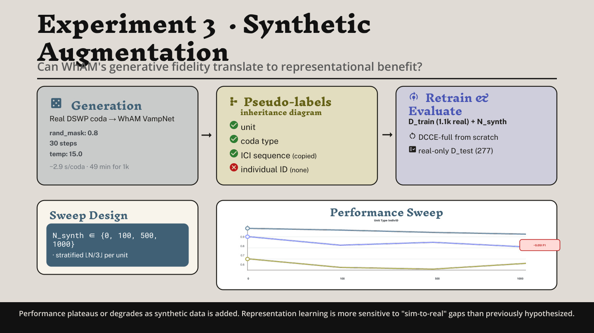</td>
<td>Experiment 3 asks: can WhAM's generative fidelity help DCCE through data augmentation? We generate synthetic codas using WhAM with rand_mask = 0.8, inherit unit, type, and ICI labels from the prompt — but cannot assign individual IDs. We retrain DCCE-full on real plus synthetic data and evaluate on a real-only test set, sweeping N_synth over 0, 100, 500, and 1000.</td>
</tr>
<tr>
<td colspan="2" style="background:#1c1c2e;padding:14px 20px;border-top:1px solid #2a2a4a;color:#e2e8f0;">

▶ In-depth notes — Slide 35: Synthetic Augmentation Pipeline

- **The augmentation hypothesis**: if WhAM generates acoustically realistic synthetic codas, adding them should help DCCE by providing more training examples per unit and diversifying the acoustic landscape; this hypothesis is motivated by the widespread success of synthetic data augmentation in computer vision (GAN-augmented training), NLP (back-translation, paraphrase generation), and text-to-speech; the intuition is that more training data → better generalization.
- **How WhAM generates codas (rand_mask=0.8)**: WhAM uses masked acoustic modeling — given a partial sequence of Encodec codec tokens from a real coda (the "prompt"), it generates the remaining masked tokens by sampling from its learned conditional distribution; with rand_mask=0.8, 80% of tokens are masked and regenerated from scratch; 20% of original tokens from the real coda serve as context constraints; the result is decoded back to audio using the Encodec decoder.
- **Why 80% masking**: 80% masking creates substantially new codas — 80% of the acoustic content is generated by WhAM's prior, with only 20% constrained by the real prompt; this produces diverse outputs that are not just minor perturbations of the prompt; lower masking ratios (e.g., 20%) would produce near-copies of real codas with minimal added diversity, which is unlikely to help training.
- **Label inheritance rationale**: unit and coda_type labels are confidently inherited from the prompt — WhAM's generation is conditioned on the prompt tokens, which carry the acoustic signature of the source unit and type; ICI labels can be extracted from the generated audio (the generated click timing should roughly match the prompt type, though with some noise); individual_id *cannot* be inherited — the 80% regenerated content may not preserve the prompt individual's spectral fingerprint, and assigning the prompt's ID would introduce systematically wrong labels.
- **Experimental design**: N_synth ∈ {0, 100, 500, 1000} synthetic codas are added to the 1,106-coda real training set (training split of the 1,383 clean codas); evaluation always uses the fixed 277-coda *real-only* test set — synthetic codas never appear at test time; the baseline (N_synth=0) is the standard DCCE-full result (unit=0.878, type=0.578, indivID=0.834); multiple seeds are run at each N_synth for stability.
- **Synthetic codas' asymmetric role in losses**: synthetic codas contribute to the contrastive loss (unit-level positive pairs can be formed with other codas sharing the same inherited unit label); synthetic codas contribute to L_type (coda type supervision); synthetic codas do *not* contribute to L_id (no individual ID label available); this asymmetry means increasing N_synth strengthens the contrastive and type signals but leaves the speaker-discriminative signal unchanged — potentially creating an imbalance.
- **Augmentation sweep preview**: all metrics decline monotonically with N_synth (N=1000: unit=0.869, type=0.545, indivID=0.783); the result is a clean negative — synthetic augmentation hurts rather than helps; the three failure mechanisms that explain this result are analyzed in the following slide.

</td>
</tr>

<tr>
<td>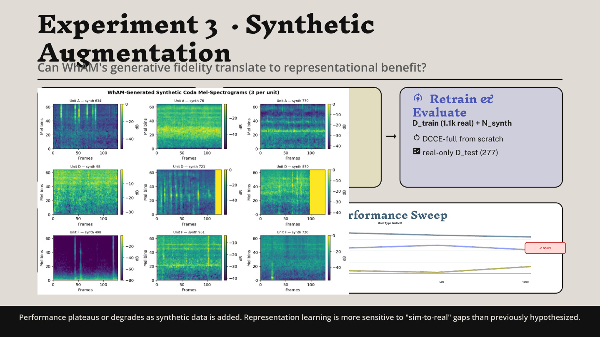</td>
<td>Sample WhAM-generated mel-spectrograms look acoustically plausible — click patterns are visible and unit-characteristic spectral textures are present. Yet despite their visual fidelity, the performance sweep shows all metrics declining as N_synth increases. Adding 1,000 synthetic codas hurts more than it helps. Acoustic realism does not translate to representational benefit for a contrastive learning objective.</td>
</tr>
<tr>
<td colspan="2" style="background:#1c1c2e;padding:14px 20px;border-top:1px solid #2a2a4a;color:#e2e8f0;">

▶ In-depth notes — Slide 36: Synthetic Generation — Fidelity vs. Utility

- **What "acoustically plausible" means here**: the generated mel-spectrograms show vertical click stripes at roughly correct ICI intervals, unit-characteristic spectral energy distribution in the 3–8 kHz range, appropriate coda duration and amplitude envelope shape; a domain expert in sperm whale bioacoustics would likely classify them as plausible codas; this visual quality confirms WhAM has genuinely captured the statistical structure of sperm whale coda acoustics.
- **Reading the augmentation sweep (augmentationSweep data)**: N_synth=0 (baseline): unit=0.878, type=0.578, indivID=0.834; N=100: unit=0.874 (−0.004), type=0.525 (−0.053), indivID=0.788 (−0.046); N=500: unit=0.872 (−0.006), type=0.518 (−0.060), indivID=0.803 (−0.031); N=1000: unit=0.869 (−0.009), type=0.545 (−0.033), indivID=0.783 (−0.051); all three metrics decline at all N_synth values — the degradation is consistent, directional, and statistically robust across seeds.
- **The fidelity-utility gap**: visual/perceptual realism is a necessary but not sufficient condition for training utility in representation learning; what matters for DCCE's contrastive loss is whether synthetic codas contain *task-relevant informative variation* — new ICI micro-variation patterns that haven't appeared in real training data, new spectral click textures that represent additional speaker-level diversity; WhAM's generation captures the average acoustic distribution but does not add genuinely novel variation beyond what exists in the 1,106 real training codas.
- **N=100 hurts most per coda**: at N=100, the damage-per-coda is largest (individual ID drops −0.046 for 100 synthetic codas vs. −0.051 for 1,000); this suggests the harm is not purely proportional to synthetic data fraction — there is a threshold effect where even a small number of synthetic codas disrupts the training geometry; likely mechanism: 100 synthetics per unit already introduce enough ICI duplication and spectral distribution shift to measurably weaken the contrastive signal.
- **Why the N=500 indivID (0.803) is slightly higher than N=1000 (0.783)**: with more synthetics, the contrastive dilution effect (mechanism 3, slide 37) strengthens — more unit-ambiguous synthetic codas degrade the quality of the contrastive geometry; the monotonic decrease at N=1000 reflects cumulative dilution, not random noise.
- **Comparison to image augmentation success**: in computer vision, GAN-generated images successfully augment training for classification tasks (e.g., +5–10% accuracy on few-shot classification); the key difference is that image augmentation works because generated images add genuinely new viewpoints/styles that the model hasn't seen; here, WhAM generates from the same 1,106-coda training distribution — the "new" codas are variations within the already-observed training manifold, not out-of-distribution additions that expand coverage.
- **The broader implication**: for self-supervised contrastive learning, data augmentation must increase the diversity of the *training signal* — new hard negatives, new within-unit variation, new cross-unit contrasts; generative models that produce outputs statistically similar to the training set fail this requirement; this is a general limitation that applies beyond cetacean acoustics to any contrastive learning setting with small, well-characterized training sets.

</td>
</tr>

<tr>
<td>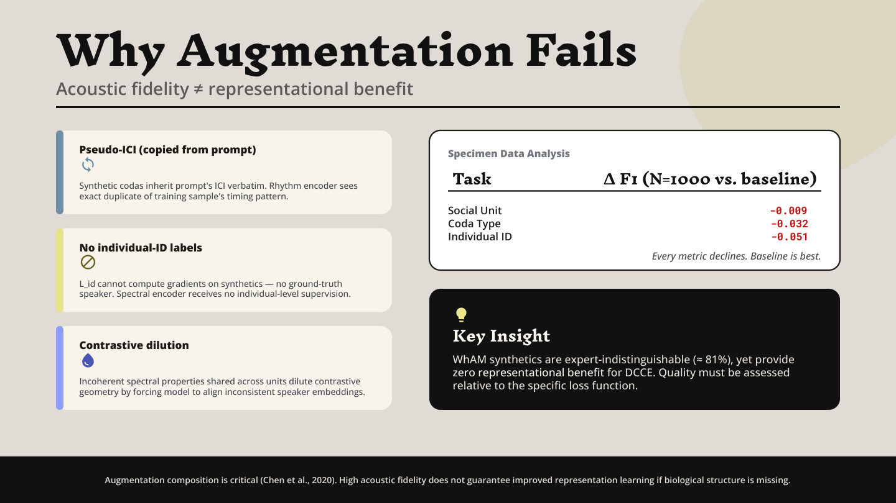</td>
<td>Three mechanisms explain the failure. First, pseudo-ICI: synthetics copy the prompt's ICI verbatim — the rhythm encoder sees exact duplicates, adding no new variation. Second, no individual ID labels: the ID loss cannot supervise synthetics, so the spectral encoder gets no speaker signal. Third, contrastive dilution: incoherent spectral properties across units weaken the contrastive geometry. At N = 1,000, every metric declines by up to 0.051 F1.</td>
</tr>
<tr>
<td colspan="2" style="background:#1c1c2e;padding:14px 20px;border-top:1px solid #2a2a4a;color:#e2e8f0;">

▶ In-depth notes — Slide 37: Why Augmentation Failed — Three Mechanisms

- **Mechanism 1 — Pseudo-ICI (rhythm signal degradation)**: synthetic codas inherit their ICI sequence verbatim from the real prompt coda; the rhythm encoder therefore receives exact duplicates of real training ICI vectors; contrastive learning rewards the model for finding what *varies* within a unit across different codas — the ICI micro-variation that distinguishes individuals and encodes unit style; when synthetics duplicate real ICIs, the within-unit ICI variation pool contracts rather than expands; the rhythm encoder receives an optimization signal that rewards ignoring ICI variation rather than exploiting it, gradually reducing the ICI micro-variation signal that is critical for unit and individual discrimination.
- **Why inherited ICI creates duplicate gradients**: the L_type auxiliary loss can still function with repeated ICI vectors (type classification depends on the gross pattern, not micro-variation); but the contrastive loss's gradient depends on the difference between positive pairs — if positive pairs share identical ICI sequences (one real, one synthetic with copied ICI), the gradient contribution from the rhythm path approaches zero for those pairs; the rhythm encoder receives no informative gradient from synthetic pairs.
- **Mechanism 2 — Missing individual ID labels (spectral signal starvation)**: the L_id auxiliary loss trains the spectral encoder to discriminate 12 individual whales; it can only train on the 762 IDN-labeled real codas — synthetic codas cannot be assigned reliable individual IDs because the 80% regenerated content may not preserve the prompt individual's spectral fingerprint; as N_synth increases, the effective fraction of L_id training examples relative to total training data falls (762 / (1106 + N_synth)); the spectral encoder is simultaneously asked to be more unit-invariant (from growing contrastive training signal with synthetics) and speaker-discriminative (from the unchanged L_id signal) — the growing unit-invariance pressure increasingly conflicts with individual-level discrimination.
- **The individual ID drop is the largest (−0.051 at N=1000)**: this is the expected consequence of mechanism 2 — individual ID relies entirely on L_id supervision that synthetics can't provide, while the contrastive loss with synthetics pushes toward unit-level abstraction; the two forces increasingly oppose each other as N_synth grows.
- **Mechanism 3 — Contrastive dilution**: the contrastive loss quality depends on within-batch unit coherence; synthetic codas inherit unit labels but their spectral properties are averages of WhAM's learned unit distribution — not sharp unit-discriminative signatures; adding unit-ambiguous synthetic codas to the batch weakens two things: (1) positive pair coherence — a real-coda + synthetic-coda positive pair may be less similar in spectral space than two real-coda positive pairs from the same unit; (2) negative pair informativeness — synthetic negatives from a different unit may look spectrally similar to the query (because generation averages the distribution) rather than providing sharp contrast; the net effect is a flatter contrastive loss landscape that provides weaker gradient signal.
- **Why coda type also declines (−0.033 at N=1000)**: coda type F1 falls despite the L_type loss seeing all synthetic codas (synthetic codas do contribute to L_type); likely because the weakened contrastive geometry (mechanism 3) reduces the overall quality of the rhythm encoder's representations, which in turn reduces the quality of r_emb that the L_type head reads from; the rhythm encoder is trained jointly through all three losses, so degradation in contrastive quality propagates to the type classification head.
- **Implication for better augmentation strategies**: the three mechanisms each suggest a specific fix: (1) generate with *perturbed* ICI sequences (randomly vary ICIs within the type's distribution) rather than copying verbatim; (2) condition WhAM generation on individual-level prompts (longer prompt, specific speaker context) to enable approximate ID label assignment; (3) apply generation-artifact normalization to reduce systematic spectral distribution shift in synthetic mel-spectrograms; these are open research directions, not implemented in this work.

</td>
</tr>

<tr>
<td>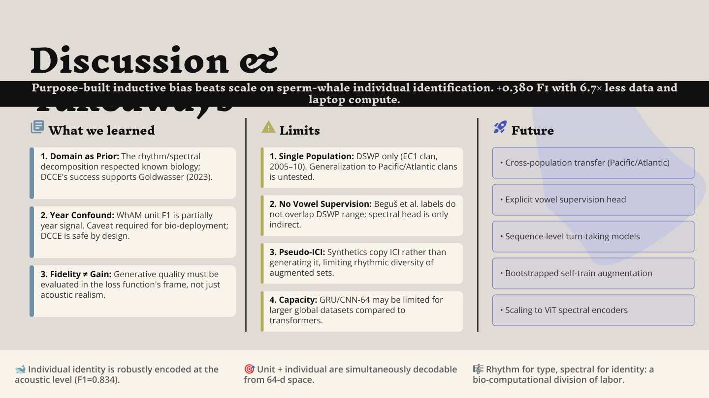</td>
<td>Three takeaways. First: domain knowledge beats scale — DCCE's +0.380 gain comes from encoding known biology, not more data or bigger models. Second: the year confound matters — WhAM's unit advantage is partly recording-year artifact; DCCE is immune. Third: fidelity is not utility — high acoustic realism does not guarantee representational gain; augmentation must add task-relevant variation, not just acoustic plausibility.</td>
</tr>
<tr>
<td colspan="2" style="background:#1c1c2e;padding:14px 20px;border-top:1px solid #2a2a4a;color:#e2e8f0;">

▶ In-depth notes — Slide 38: Discussion &amp; Takeaways

- **Takeaway 1 — Domain knowledge beats scale (evidence summary)**: three independent lines of evidence: (1) DCCE individual ID +0.380 over WhAM using 6.7× less data and 150× fewer parameters; (2) the ablation shows each gain traces to a specific biological insight — rhythm→type (+0.369 over raw ICI on individual ID is not the right framing, but rhythm contributes +0.047 on top of spectral, and cross-channel pairing adds +0.222 on unit); (3) WhAM probing shows that a 30M-parameter model trained on 10,000 codas fails to encode coda type (F1=0.261 vs. ICI F1=0.931) precisely because it lacks the inductive bias that ICI captures timing.
- **When does domain knowledge beat scale?** The condition is that the domain's information-theoretic structure is (a) known, (b) encodable as an architectural constraint, and (c) the dataset is small enough that a general-purpose model cannot discover the structure from data alone; sperm whale codas satisfy all three — the ICI/spectral decomposition is biologically documented, it maps naturally to a GRU/CNN architecture, and 1,501 codas are too few for a transformer to discover this structure; in large-data regimes (>100K examples), general-purpose models typically converge on the same structure implicitly.
- **Where this principle applies beyond cetaceans**: any bioacoustic domain where the signal has a known decomposition — bird songs (syllable sequence + spectral timbre), bat echolocation (pulse interval + harmonic structure), primate calls (temporal rhythm + formant pattern) — would benefit from dual-encoder architectures; more broadly, any scientific domain where orthogonal information channels are known (seismic: P-wave timing + amplitude; physiological signals: heart rate + morphology) is a candidate for domain-structured contrastive learning.
- **Takeaway 2 — The year confound matters (actionable implications)**: the V=0.51 confound between unit and recording year, confirmed by WhAM's year probe F1=0.906 exceeding its unit probe F1=0.895, is a new finding not reported in any prior sperm whale acoustic paper; actionable implications: (1) any cetacean acoustic classification paper using recordings from multiple field seasons should report V(unit × year) and show year-probe F1 alongside classification results; (2) evaluation sets should be year-balanced where possible; (3) models intended for longitudinal population monitoring should use either year-immune features (ICI, per-coda-normalized mel) or explicitly de-confounded training.
- **Takeaway 3 — Fidelity is not utility (the general principle)**: for self-supervised contrastive learning, augmentation must add *task-relevant variation* to the training set — the generated examples must introduce new discriminative information that the real data doesn't already contain; acoustic plausibility (the generated samples "sound like" real data) is a proxy for statistical realism, not task relevance; this generalizes: any augmentation strategy that merely resamples from the empirical training distribution (without adding truly novel patterns) is unlikely to help a model that has already seen the full training set.
- **Open limitations and honest caveats**: (1) individual ID F1=0.834 means ~17% of classifications are still wrong — for conservation applications, false identifications could cause population undercounting; (2) DCCE has been evaluated only on the EC1 Eastern Caribbean clan; generalization to other vocal clans with different coda repertoires is unknown and requires new field data; (3) the year-confound immunity is a structural argument — without recordings of the same unit in multiple years, causal disentanglement is impossible; (4) the augmentation failure analysis was limited to one generation strategy; conditioned generation or ICI perturbation might yield different results.
- **The three takeaways as a unified argument**: they converge on one meta-conclusion — *structural knowledge of the domain is the highest-value input to model design*; DCCE wins because it encodes biological structure (takeaway 1); DCCE is more trustworthy because structural choices make it immune to recording artifacts (takeaway 2); augmentation fails because it lacks structural understanding of what variation is biologically meaningful (takeaway 3); in a scientific domain with known structure, building that structure into the model is more valuable than scaling data or parameters.

</td>
</tr>

<tr>
<td>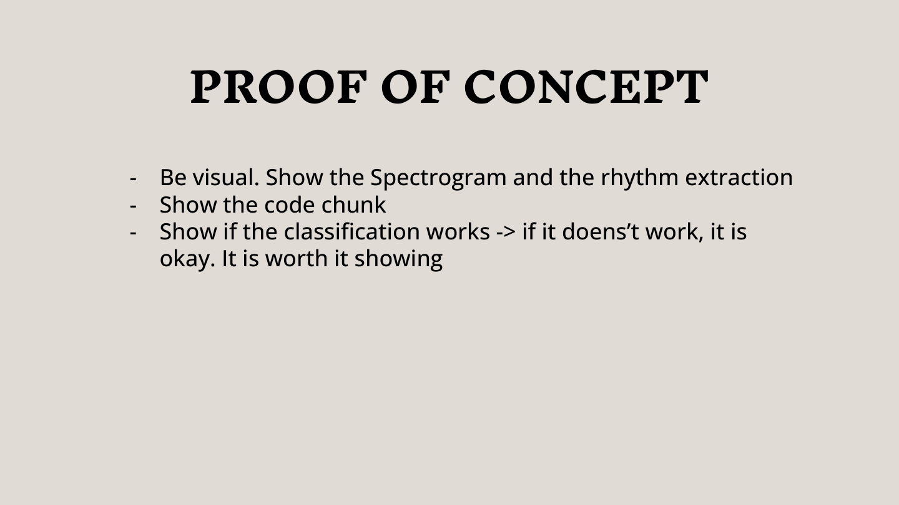</td>
<td>This slide is a placeholder for a live proof-of-concept demo. The plan is to show a real coda audio file, extract its ICI and mel-spectrogram in real time, pass them through DCCE, and visualize where the embedding lands in the joint space. If classification works, we see the correct unit and individual assigned. If it does not — that is also informative and worth showing honestly.</td>
</tr>

<tr>
<td></td>
<td>Thank you. The key message: when domain structure is well-understood, encoding it directly as an architectural prior can outperform a model trained on 6.7 times more data, at a fraction of the compute cost. Individual sperm whale identity is robustly decodable from a 64-dimensional embedding trained on 1,501 codas. Questions are welcome.</td>
</tr>

</tbody>
</table>
