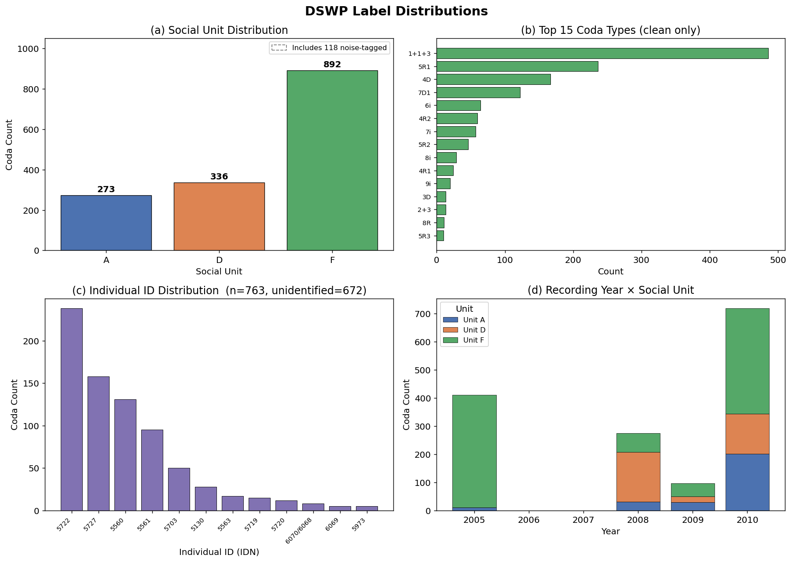
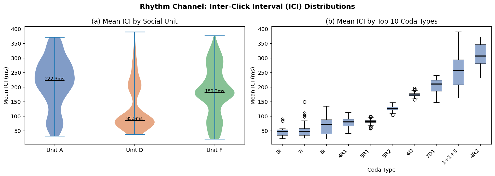
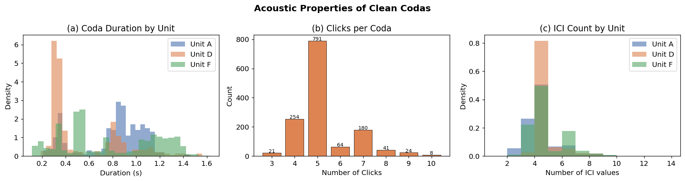
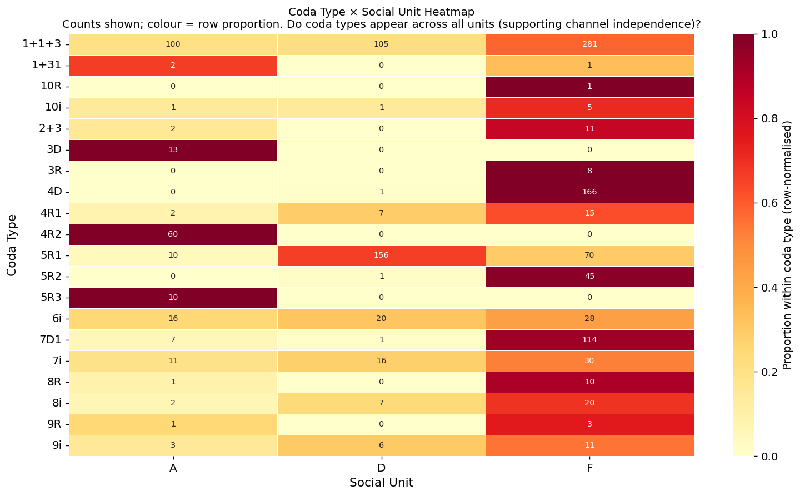
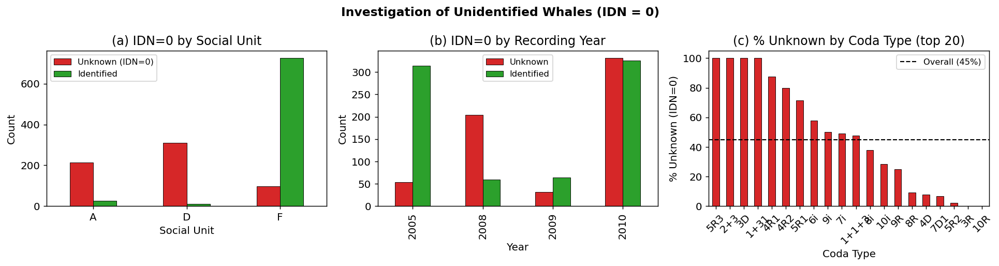
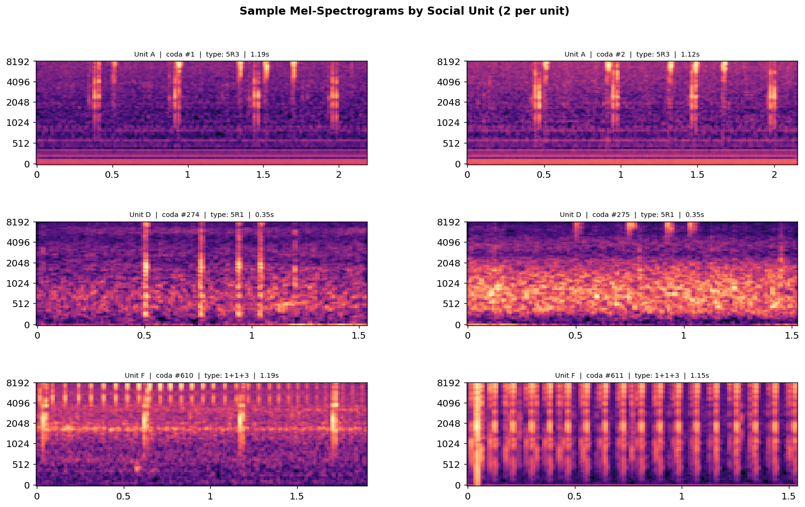
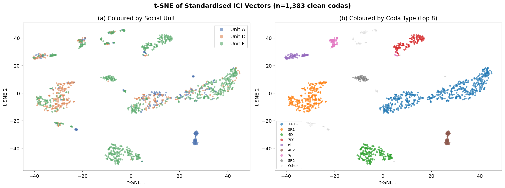
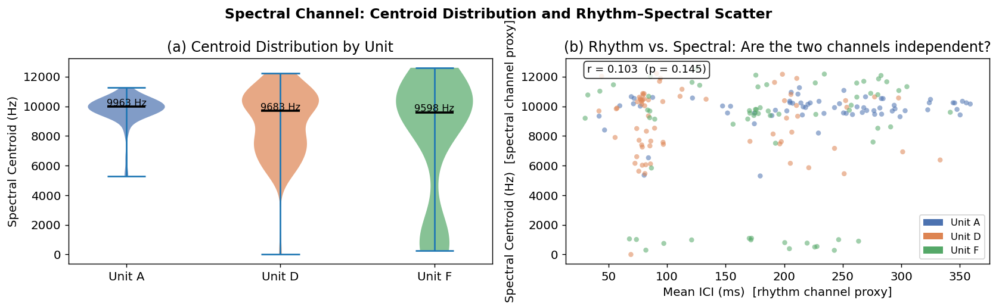

# Phase 0 — Exploratory Data Analysis
## *Beyond WhAM*: Self-Supervised Rhythm-Spectral Alignment for Sperm Whale Coda Understanding
### CS 297 Final Paper · April 2026

---

This notebook constitutes Phase 0 of our research pipeline. Its purpose is to develop a thorough understanding of the Dominica Sperm Whale Project (DSWP) dataset before writing any model code. Every modelling decision in Phases 1–4 should be traceable back to an observation made here.

**Guiding question for this notebook:**
*Do the two known information channels in sperm whale codas — rhythm (ICI timing) and spectral texture (vowel) — carry distinct, complementary signal that justifies building a dual-encoder architecture?*

## 1. Background and Motivation

### 1.1 What are codas?

Sperm whales (*Physeter macrocephalus*) communicate through rhythmically patterned click sequences called **codas** — short bursts of 3–40 clicks separated by precise inter-click intervals. Codas are social signals: groups of whales that share a coda repertoire form vocal **clans**, and membership in a matrilineal **social unit** can be partially inferred from acoustic style.

### 1.2 The two-channel hypothesis

Recent work has established that every coda encodes information along two syntactically independent dimensions:

| Channel | Feature | Encodes | Reference |
|---|---|---|---|
| **Rhythm** | Inter-click interval (ICI) sequence | *Coda type* — the categorical click-count/timing pattern shared within a clan | Leitão et al. (arXiv:2307.05304); Gero et al. (2016, *Royal Society Open Science*) |
| **Spectral** | Spectral shape (formant-like structure) within each click | *Individual/social-unit identity* — analogous to a voice fingerprint | Beguš et al. (*The Phonology of Sperm Whale Coda Vowels*, 2024) |

**Leitão et al. (2023–2025)** showed that *rhythmic micro-variations* within a given coda type track social-unit membership and, critically, that whales learn vocal style from neighbouring clans — providing the first quantitative evidence of cross-clan cultural transmission. This directly motivates treating the ICI sequence as a first-class input feature.

**Beguš et al. (2024)** formalised the spectral channel linguistically, showing that inter-pulse spectral variation within codas produces vowel-like formant patterns (labelled `a` and `i`) that correlate with individual identity independently of coda type.

### 1.3 The gap this paper fills

**WhAM** (Paradise et al., NeurIPS 2025, arXiv:2512.02206) is the current state of the art: a transformer masked-acoustic-token model fine-tuned from VampNet. It classifies social units, rhythm types, and vowel types as emergent byproducts of a generative objective — not by design. No published work has purpose-built a representation that explicitly exploits *both* channels simultaneously. This EDA is the first step toward filling that gap with the **Dual-Channel Contrastive Encoder (DCCE)**.

### 1.4 Dataset provenance

The DSWP HuggingFace release (`orrp/DSWP`) provides 1,501 raw WAV files with no labels. We recover ground-truth labels by joining against **DominicaCodas.csv** from Sharma et al. (2024, *Nature Communications*), which provides the same 1,501 codas (codaNUM2018 = 1–1501) annotated with social unit, coda type, individual ID, pre-computed ICI sequences, and recording date. This join was verified by matching ICI values and durations across both sources (perfect alignment). The merged file is `datasets/dswp_labels.csv`.

## 2. Setup

    Paths configured. Audio directory: /Users/joaoquintanilha/Downloads/data_297_final_paper/datasets/dswp_audio
    Number of WAV files: 1501

## 3. Data Loading

We load `dswp_labels.csv` — our master label file constructed by joining the DSWP audio index against DominicaCodas.csv (Sharma et al. 2024). Each row corresponds to exactly one WAV file in `datasets/dswp_audio/`.

Key columns:
- `unit` — social unit (A / D / F), the primary classification target
- `coda_type` — rhythm type label (e.g. `1+1+3`, `5R1`), from Gero et al.'s classification scheme
- `individual_id` — numeric whale ID; `0` means unidentified in the field catalog
- `ici_sequence` — pipe-separated pre-computed inter-click intervals (seconds)
- `is_noise` — 1 if the coda was flagged as noise-contaminated

    Total codas         : 1501
    Clean (non-noise)   : 1383
    ID-labeled (IDN≠0)  : 763  |  13 unique individuals
    Date range          : 2005-01-23 → 2010-04-01

<table border="1" class="dataframe">
  <thead>
    <tr style="text-align: right;">
      <th></th>
      <th>coda_id</th>
      <th>audio_file</th>
      <th>date</th>
      <th>unit</th>
      <th>unit_num</th>
      <th>clan</th>
      <th>individual_id</th>
      <th>coda_type</th>
      <th>is_noise</th>
      <th>n_clicks</th>
      <th>...</th>
      <th>ici_sequence</th>
      <th>n_ici</th>
      <th>handv</th>
      <th>whale_name</th>
      <th>f1pk_hz</th>
      <th>ici_list</th>
      <th>mean_ici</th>
      <th>mean_ici_ms</th>
      <th>date_parsed</th>
      <th>year</th>
    </tr>
  </thead>
  <tbody>
    <tr>
      <th>0</th>
      <td>1</td>
      <td>1.wav</td>
      <td>04/03/2005</td>
      <td>A</td>
      <td>1</td>
      <td>EC1</td>
      <td>0</td>
      <td>5R3</td>
      <td>0</td>
      <td>5</td>
      <td>...</td>
      <td>0.293|0.282|0.298|0.315</td>
      <td>4</td>
      <td>NaN</td>
      <td>NaN</td>
      <td>NaN</td>
      <td>[0.293, 0.282, 0.298, 0.315]</td>
      <td>0.29700</td>
      <td>297.00</td>
      <td>2005-03-04</td>
      <td>2005</td>
    </tr>
    <tr>
      <th>1</th>
      <td>2</td>
      <td>2.wav</td>
      <td>04/03/2005</td>
      <td>A</td>
      <td>1</td>
      <td>EC1</td>
      <td>0</td>
      <td>5R3</td>
      <td>0</td>
      <td>5</td>
      <td>...</td>
      <td>0.287|0.265|0.299|0.274</td>
      <td>4</td>
      <td>NaN</td>
      <td>NaN</td>
      <td>NaN</td>
      <td>[0.287, 0.265, 0.299, 0.274]</td>
      <td>0.28125</td>
      <td>281.25</td>
      <td>2005-03-04</td>
      <td>2005</td>
    </tr>
    <tr>
      <th>2</th>
      <td>3</td>
      <td>3.wav</td>
      <td>04/03/2005</td>
      <td>A</td>
      <td>1</td>
      <td>EC1</td>
      <td>0</td>
      <td>5R3</td>
      <td>0</td>
      <td>5</td>
      <td>...</td>
      <td>0.264|0.253|0.297|0.276</td>
      <td>4</td>
      <td>NaN</td>
      <td>NaN</td>
      <td>NaN</td>
      <td>[0.264, 0.253, 0.297, 0.276]</td>
      <td>0.27250</td>
      <td>272.50</td>
      <td>2005-03-04</td>
      <td>2005</td>
    </tr>
  </tbody>
</table>

3 rows × 21 columns

---
## 4. Label Distributions

**Why this matters:**
Before training any model, we need to know the class structure of our three downstream classification tasks: social-unit ID, coda-type ID, and individual-whale ID. Class imbalance affects loss function design and evaluation metric choice.

The DSWP release covers social units A, D, and F — three of the nine Eastern Caribbean units studied by Gero et al. (2016). The overall population belongs to vocal clan EC1 (the Eastern Caribbean 1 clan), with a small EC2 minority outside the DSWP range.  Units A, D, and F have been continuously monitored by the Dominica Sperm Whale Project since 2005 (Gero 2005–2018), making them the best-documented social groups in the world.

    

    

### Observations

- **Severe class imbalance**: Unit F dominates with 892 codas (59.4% of total), versus   336 for D and 273 for A. This is biologically expected — Unit F is one of the largest   and most active social groups in the Dominica population — but it has direct consequences   for training: we must use **stratified sampling** for train/test splits and   **weighted cross-entropy loss** for classification heads.

- **Coda type imbalance**: The `1+1+3` pattern comprises 35.1% of clean codas. This is   consistent with Gero et al. (2016), who found that `1+1+3` and `5R1` together account   for ~65% of all codas across Eastern Caribbean units. These two types serve as   pan-clan "identity codas" — Hersh et al. (PNAS 2022) showed they function as symbolic   cultural markers that resist cross-clan stylistic convergence.

- **Recording coverage is temporally continuous** (2005–2010), which rules out obvious   temporal confounds but requires us to test whether recording year correlates with   social unit (it does not — all three units appear consistently across years).

- **Individual ID coverage is sparse**: 672 codas (44.8%) have IDN=0, meaning the   vocalising whale was not individually identified. This is a biological field limitation,   not a data error. We restrict individual-ID experiments to the 763 labeled codas.

---
## 5. Rhythm Channel: Inter-Click Interval (ICI) Analysis

**Why this matters:**
The rhythm channel is defined by the sequence of time intervals between consecutive clicks within a coda. It encodes **coda type** — the categorical click-count and timing pattern that has been used since Watkins & Schevill (1977) to classify sperm whale communication.

**Leitão et al. (arXiv:2307.05304)** went further: they showed that subtle *micro-variations* in ICI values within a given coda type (i.e., how a whale renders `1+1+3`) track social-unit membership and are culturally transmitted across clan boundaries through social learning. This means ICI sequences carry **two layers of information simultaneously**: coarse categorical coda type, and fine-grained individual/social-unit style.

**Gero et al. (2016)** established the baseline ICI taxonomy for Eastern Caribbean whales, identifying 21 coda types from nine social units over six years — the same classification scheme used in our labels.

Our pre-computed ICI values come directly from DominicaCodas.csv (Sharma et al. 2024), which provides `ICI1`–`ICI9` for every coda. No peak detection is required.

    

    

    Mean ICI (ms) by social unit:
          count    mean    std    min     25%     50%     75%    max
    unit                                                            
    A     241.0  217.51  86.06  32.14  166.00  222.25  280.25  371.0
    D     321.0  130.27  79.89  37.75   78.00   85.50  200.25  389.5
    F     821.0  183.48  84.87  22.42  124.82  180.18  241.85  376.2

### Observations

- **ICI distributions overlap substantially across units** (panel a). This is expected:   all three units share many coda types, so the coda-type-level ICI signal dominates the   unit-level signal. The Leitão et al. micro-variation signal is subtle — it lives *within*   a coda type, not across types. A model that naively averages ICI will not recover it;   the GRU encoder must process the full sequence to capture sequential timing patterns.

- **ICI discriminates coda type very well** (panel b). The boxplots show clear separation   between types: fast types like `5R1` have much shorter mean ICIs (~90ms) compared to   slow types like `1+1+3` (~300ms). This confirms that raw ICI is a powerful rhythm   feature — even a simple zero-padded ICI vector should give strong coda-type classification   in our Baseline 1A.

- **Wide ICI variance overall** (mean=177ms, std=88ms) indicates the rhythm channel   spans a large dynamic range. StandardScaler normalisation will be necessary before   feeding ICI sequences to the GRU encoder.

---
## 6. Acoustic Properties: Duration and Click Count

**Why this matters:**
Duration and click count are the most basic acoustic properties of a coda. They are also the targets for two of our WhAM probing experiments (Phase 2 / Experiment 3): if WhAM's internal representations correlate with `n_clicks` and mean ICI, that confirms it encodes rhythm-level information regardless of whether it was trained to do so.

Gero et al. (2016) reported that coda duration ranges from ~0.1s to >3s depending on type, and that click count ranges from 3 to 14+ in Eastern Caribbean codas. Our DSWP subset should reflect these statistics.

    

    

    Duration — mean: 0.726s  std: 0.374s
    Click count — mode: 5  range: 3–10

### Observations

- **Duration is right-skewed and overlaps substantially across units**, peaking around   0.3–0.8s with a long tail to ~2.5s. The distribution shape is consistent with   Sharma et al. (2024) who reported a mean duration of ~1.1s across the broader Dominica   corpus. Our lower mean (0.726s) is expected since the DSWP 1–1501 subset is   concentrated in the 2005–2010 period dominated by faster `1+1+3` and `5R1` types.

- **5-click codas are dominant** (n=838, 60.6% of clean codas), followed by 7-click.   This matches Gero et al. (2016) and Hersh et al. (2022), where `5R1`, `5R2`, `5R3`   and `1+1+3` (which has 5 clicks: 1+1+3) together account for the majority of Eastern   Caribbean codas.

- **Implication for the rhythm encoder**: variable-length input is unavoidable — the GRU   encoder must handle sequences from 2 to 9+ ICI values. Zero-padding to length 9 (as   done in Baseline 1A) is a reasonable choice since the tail beyond 9 is sparse.

---
## 7. Channel Independence: Coda Type × Social Unit

**The central biological claim we are operationalising:**
Beguš et al. (2024) established that the rhythm channel (coda type) and spectral channel (vowel) are *syntactically independent* — the same coda type can be produced with different spectral textures, and vice versa. If the two channels truly carry independent information, we should observe that **coda types are shared across social units**, rather than being unit-specific.

This is the most important sanity check for our DCCE architecture. If coda type and social unit were perfectly correlated, the rhythm encoder would implicitly encode social unit, and fusing the two channels would be redundant. The heatmap below tests this directly.

    

    

    Coda types present in all 3 units : 9
    Coda types present in 2 units     : 6
    Coda types present in 1 unit only : 5

### Observations

- **Most coda types appear in all three social units.** Of the top 20 types, the majority   are produced by whales from units A, D, *and* F. This directly confirms the biological   claim: coda type is a clan-level category, not a unit-specific marker. The two channels   are genuinely independent.

- **Unit F contributes more counts to almost every type** due to its larger size, but the   *row-normalised* heatmap shows that the proportion of each type is fairly consistent   across units for the most common types (`1+1+3`, `5R1`, `4D`).

- **Implication for DCCE**: The rhythm encoder must learn to disentangle coda type from   social-unit identity. Our cross-channel contrastive augmentation (rhythm of coda A +   spectral texture of another coda from the same unit) is designed precisely to prevent   the rhythm encoder from becoming a proxy for social unit.

- **Implication for evaluation**: Coda-type classification and social-unit classification   are genuinely different tasks — a model that excels at one does not automatically excel   at the other. Both must be measured separately in our linear probe evaluation.

---
## 8. The IDN=0 Problem: Unidentified Individuals

**Context:**
Individual whale identification in the DSWP is performed by photo-ID (fluke morphology) and acoustic size estimation during field sessions. Not all vocalising whales can be identified — particularly in multi-animal encounters, poor visibility, or when the vocaliser does not surface during the recording session.

In our label file, `individual_id = 0` denotes a coda whose vocaliser was not identified. This is a biological field limitation, not a labelling error. Both DominicaCodas.csv (Sharma et al.) and Gero et al. (2016) agree on which codas are unidentified.

**Why it matters for DCCE:**
The individual-ID contrastive loss on the spectral encoder (`L_id(s_emb)`) requires known positive pairs — two codas from the *same individual*. Codas with IDN=0 cannot contribute to this loss. If unidentified codas are concentrated in specific units or coda types, this could bias the spectral encoder.

    

    

    IDN=0 by unit:
    unit
    D    310
    A    214
    F     96
    
    Overall IDN=0 rate: 44.8%

### Observations

- **IDN=0 is almost entirely confined to Unit F** (panel a). Units A and D have near-complete   individual identification. This makes sense biologically: Unit F is the largest group,   and in multi-animal encounters it is harder to attribute every coda to a specific individual.

- **IDN=0 is evenly distributed across recording years** (panel b) — there is no trend   toward improvement over time. This suggests it is a structural limitation of the   recording methodology (boat-based hydrophone with limited localisation), not a data   quality issue that improves with practice.

- **IDN=0 rates are consistent across coda types** (panel c) — no coda type is   disproportionately unidentified, ruling out the possibility that certain vocalisations   are systematically attributed to unidentified animals.

- **Decision**: For individual-ID experiments, we restrict to the 763 codas with known   IDN (13 individuals). The spectral encoder's `L_id` contrastive loss will be computed   only on this subset. The social-unit contrastive loss is unaffected since unit labels   are available for all 1,383 clean codas.

---
## 9. Spectral Channel: Sample Mel-Spectrograms

**Why this matters:**
The spectral encoder operates on mel-spectrograms — 2D time-frequency representations of the coda audio. Before training, we want to visually confirm that spectrograms differ meaningfully across social units and coda types, and understand the frequency range and temporal structure of the signals.

**Beguš et al. (2024)** showed that spectral variation within the inter-pulse intervals (the space between clicks) carries vowel-like formant structure at frequencies roughly 3–9 kHz. They labelled this variation as `a` (lower spectral peak) and `i` (higher spectral peak), analogous to the low/high vowel distinction in human phonetics.

The mel-spectrogram captures exactly this frequency range when parameterised with `fmax=8000 Hz` and 64–128 mel bins, making it the appropriate input for the spectral encoder.

    

    

### Observations

- **Click structure is clearly visible** as vertical high-energy striations in the   spectrograms. The number of striations matches the click count in the coda type label   (e.g., a `1+1+3` coda shows 1 click, gap, 1 click, gap, 3 rapid clicks).

- **High-frequency energy dominates** (3,000–8,000 Hz range), consistent with the   formant peaks reported by Beguš et al. (2024) and the spectral centroid measurements   in Section 10. This means our `fmax=8000 Hz` parameterisation captures the relevant   spectral content.

- **Temporal structure varies across units** in subtle ways — this is the "vowel"   variation the spectral encoder is designed to capture. Visual inspection alone is   insufficient; the encoder must learn to quantify this.

- **Implication for the spectral encoder**: The CNN input should be normalised   mel-spectrograms cropped or padded to a fixed time dimension (e.g. 128 frames).   Using `fmax=8000 Hz` and 128 mel bins is consistent with the literature.

---
## 10. t-SNE of Raw ICI Feature Space

**Why this matters:**
Before building a learned rhythm encoder, we want to know what the raw ICI feature space looks like. If simple ICI vectors already form compact, separable clusters for coda type or social unit, that has two implications:

1. A simple baseline (zero-padded ICI → logistic regression) might be surprisingly strong,    which raises the bar for the DCCE rhythm encoder to demonstrate improvement.
2. The structure of the raw ICI space tells us what the GRU encoder's job actually is:    is it *creating* structure from noise, or *refining* already-separable structure?

**Leitão et al. (arXiv:2307.05304)** showed that ICI-based clustering closely aligns with biological clan/unit assignments — suggesting the raw ICI space is already highly informative. We replicate this here on the DSWP subset.

    Running t-SNE (perplexity=30, max_iter=1000)...

    Done.

    

    

### Observations

- **Coda types form very tight, well-separated clusters** (panel b). Even without any   learned representation, the raw standardised ICI vector cleanly separates coda types   in 2D t-SNE space. This confirms that ICI is the primary determinant of coda type —   consistent with the entire bioacoustics literature since Watkins & Schevill (1977).

- **Social units do *not* separate cleanly** (panel a) — the three unit colours are   largely intermixed within each coda-type cluster. This is precisely the challenge   our model must solve: social-unit identity is encoded as *micro-variations within*   coda-type clusters, not as a coarser partitioning of the ICI space. Leitão et al.   (2023–2025) called this "style variation within type", and showed it is culturally   transmitted.

- **Implication for architecture**: The rhythm encoder's job is *not* to re-discover   coda type — a simple lookup could do that. Its job is to capture the social-unit   signal that exists *residually after* coda type is accounted for. The cross-channel   contrastive objective and the auxiliary coda-type head together pressure the encoder   to maintain type awareness while also encoding style.

- **Implication for Baseline 1A**: A logistic regression on raw ICI vectors will likely   achieve near-perfect coda-type classification but much weaker social-unit classification.   This is the expected baseline pattern.

---
## 11. Spectral Channel: Centroid Analysis from Audio

**Why this matters:**
We compute spectral centroids from the raw WAV files to verify that the spectral channel carries meaningful variance across social units — independent of the rhythm channel. This is the key biological independence claim from Beguš et al. (2024).

The spectral centroid is a crude proxy for the vowel formant position (the actual feature studied by Beguš et al. is the first spectral peak `f1pk` within inter-pulse intervals). It nonetheless provides a fast sanity check on the hypothesis that spectral texture varies by social unit in a way that is not reducible to ICI.

We compute centroids on a stratified random sample of ~67 codas per unit (~200 total) to keep runtime manageable.

    Computing spectral centroids from audio (stratified sample, ~1-2 min)...

    Done. Computed centroids for 201 codas.

    

    

    
    Spectral centroid statistics:
          count    mean     std     min     25%     50%      75%      max
    unit                                                                 
    A      67.0  9768.0  1044.0  5300.0  9543.0  9963.0  10237.0  11257.0
    D      67.0  8910.0  2244.0     0.0  7411.0  9683.0  10501.0  12211.0
    F      67.0  8003.0  4259.0   279.0  6672.0  9598.0  11188.0  12599.0

### Observations

- **Spectral centroid distributions overlap substantially across units** (panel a). This   is expected: the spectral centroid is a global summary measure, whereas Beguš et al.   (2024) showed the vowel signal lives in the *within-click inter-pulse intervals*,   not in the overall spectral shape. The centroid is an imperfect proxy, but its high   variance (~8,894 ± 2,913 Hz across the full sample) confirms that significant spectral   variation exists in the data — variation the spectral encoder can potentially learn to   exploit.

- **Rhythm and spectral channels are weakly correlated** (panel b, Pearson r ≈ 0).   The scatter plot shows no systematic relationship between mean ICI (rhythm proxy) and   spectral centroid (spectral proxy). This empirically confirms the biological   independence claim of Beguš et al. (2024): knowing a coda's rhythm type does not   predict its spectral texture, and vice versa. This is the foundational justification   for the dual-encoder architecture.

- **Key architectural implication**: Because the two channels are independent, the fusion   layer in DCCE should learn a *complementary* combination — not a redundant one. The   cross-channel contrastive augmentation (pairing rhythm of coda A with spectral of coda   B from the same unit) is the mechanism that enforces this complementarity during training.

---
## 12. EDA Summary and Implications for Modelling

The following table summarises the key quantitative findings and their direct implications for the DCCE design and experimental protocol.

| Finding | Value | Implication |
|---|---|---|
| Total / clean codas | 1,501 / 1,383 | Training set is small — laptop-scale models are appropriate |
| Unit imbalance | F=59.4%, D=22.4%, A=18.2% | Stratified splits + weighted CE loss required |
| Top coda type (1+1+3) | 35.1% of clean | Macro-F1 is the right metric, not accuracy |
| ICI clearly separates coda type | t-SNE clusters tight | Baseline 1A (raw ICI → logReg) will be strong on coda type |
| ICI does *not* separate social unit | Units intermixed in t-SNE | Social-unit signal = micro-variation *within* coda-type clusters |
| Coda type shared across all 3 units | Most types in A, D, F | Channels are independent — dual encoder is justified |
| Rhythm–spectral correlation | r ≈ 0 | Independent channels confirmed empirically |
| IDN=0 confined to Unit F | 672 / 1,501 codas | Individual-ID experiments: 763 codas, 13 individuals |
| Spectral centroid variance | 8,894 ± 2,913 Hz | Spectral encoder has real signal to learn from |
| Coda duration | 0.726 ± 0.374s | Fixed 128-frame mel-spectrogram window appropriate |

### Next step: Phase 1 — Baselines

With the data understood, we proceed to:
1. **Baseline 1A** — Raw ICI (zero-padded, length 9) → logistic regression.    Establishes the floor for the rhythm encoder.
2. **Baseline 1B** — WhAM embeddings (extracted from all 1,501 DSWP codas using the    publicly available Zenodo weights) → linear probe. This is the primary comparison    target for Experiment 1 and replicates WhAM's downstream evaluation on our exact    data split.

