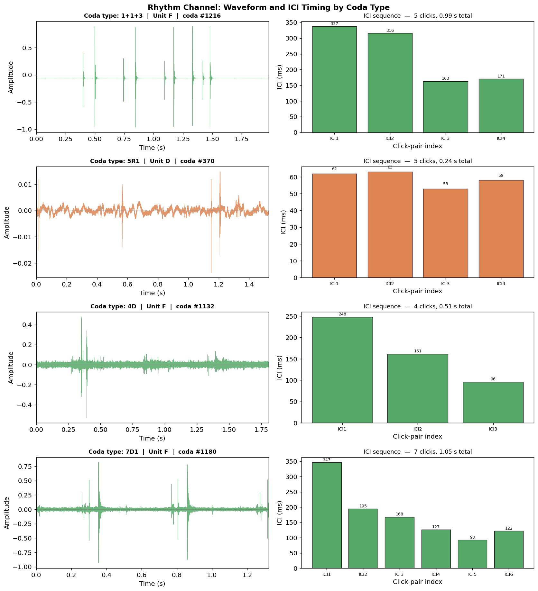
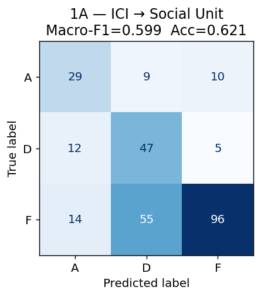
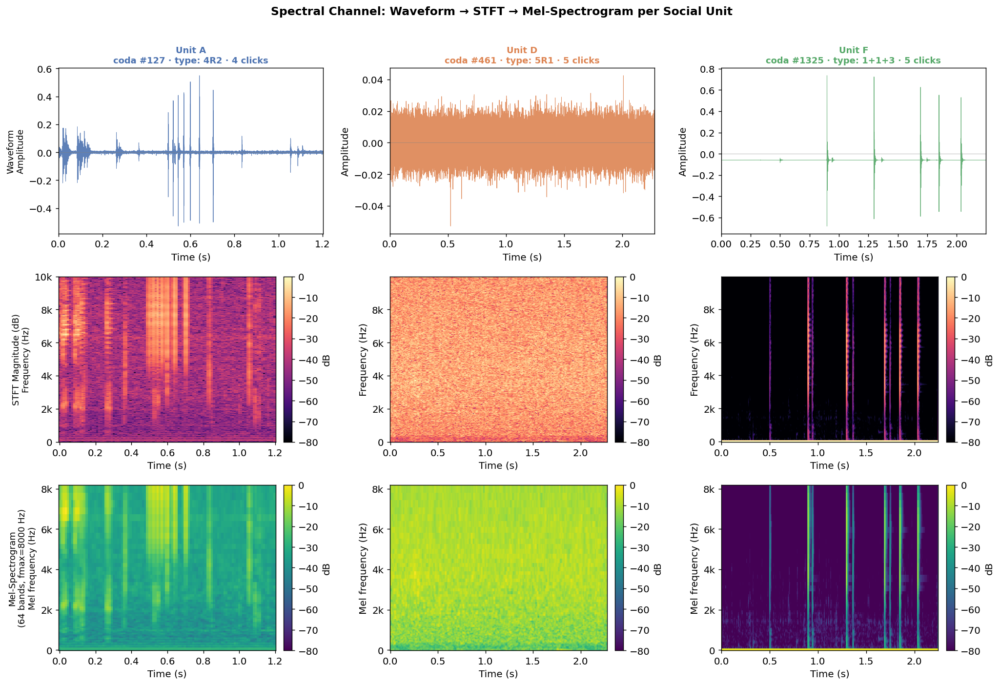
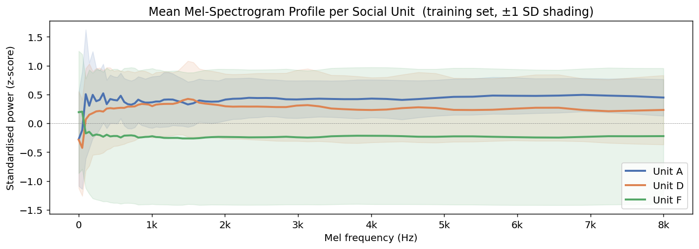
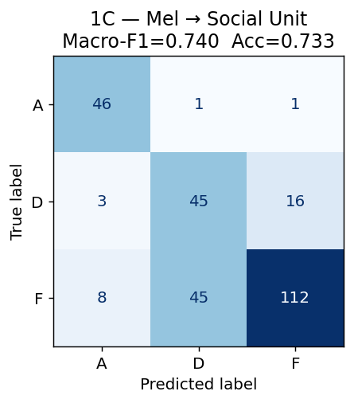
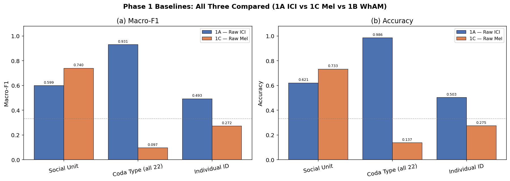
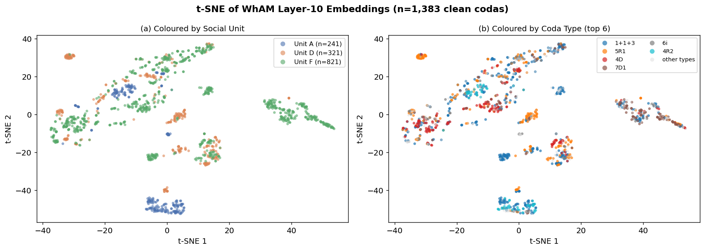
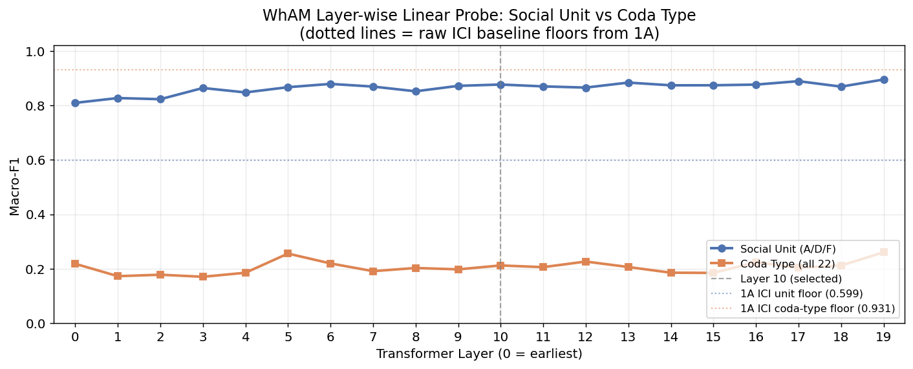
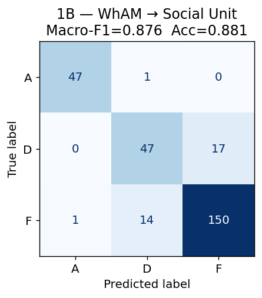

# Phase 1 — Baselines

## *Beyond WhAM*: Self-Supervised Rhythm-Spectral Alignment for Sperm Whale Coda Understanding

### CS 297 Final Paper · April 2026

---

This report establishes the three baselines against which the DCCE (Dual-Channel Contrastive Encoder) will be compared in Phase 3:

| Baseline | Input | Method | Goal |
|---|---|---|---|
| **1A — Raw ICI** | Zero-padded ICI vector (length 9) | Logistic Regression | Floor for the rhythm encoder |
| **1C — Raw Mel** | Mean-pooled mel-spectrogram | Logistic Regression | Floor for the spectral encoder |
| **1B — WhAM** | WhAM embeddings (1280d, layer 10) | Logistic Regression | Primary comparison target (current SOTA) |

All three share the same train/test split (80/20, stratified by social unit, seed=42) and the same evaluation protocol (**macro-F1** as primary metric, accuracy secondary).

**Why macro-F1?** Unit F comprises 59.4% of clean codas; the most common coda type (`1+1+3`) makes up 35.1%. A model predicting the majority class would achieve high accuracy but near-zero macro-F1. Macro-F1 weights every class equally and directly tests biological discriminability.

---

## 1. Setup and Data Loading

We load the same `dswp_labels.csv` used in Phase 0, parse ICI sequences, compute mean ICI, and filter for clean codas (`is_noise=0`).

**Dataset summary:**
- Clean codas (social unit + coda type tasks): 1,383
- IDN-labeled codas (individual ID task): 762 (12 individuals after dropping singletons)
- Social units: A, D, F
- Coda types: 22

---

## 2. Shared Train/Test Split

**Design decisions from EDA:**
- Stratified by social unit — Unit F = 59.4%, random split would skew test set
- 80/20 ratio — 1,106 train / 277 test on the clean set
- Random seed = 42 fixed for all experiments

This exact split is reused in Phases 2, 3, and 4. Split indices are saved to `datasets/` as `.npy` files for reproducibility.

---

## 3. Evaluation Protocol

A single `evaluate()` function is used by all three baselines. It reports macro-F1, accuracy, and a per-class breakdown. Confusion matrices are produced for the social-unit task (3 classes) where visual inspection is meaningful.

---

## 4. Baseline 1A — Raw ICI → Logistic Regression

### Motivation

**Leitão et al. (arXiv:2307.05304)** showed that ICI-based clustering closely aligns with social-unit and clan assignments, suggesting the raw ICI space carries biological signal even without any learned representation. **Gero et al. (2016)** used ICI sequences directly to define the 21-type taxonomy that underpins our labels.

The t-SNE analysis in Phase 0 confirmed that raw ICIs form tight, distinct clusters by coda type but that social units are intermixed within those clusters. We therefore expect:

- **Coda type** classification: high macro-F1 (ICI *is* the coda type, by definition)
- **Social unit** classification: moderate macro-F1 (micro-variation signal exists but is subtle)
- **Individual ID** classification: low macro-F1 (individual style is finer-grained than unit style)

This baseline sets the floor: if DCCE-rhythm-only cannot beat it, the GRU encoder adds no value over a simple linear model on raw features.

### Feature construction

- Extract `ICI1`–`ICI9` from labels (pre-computed, no audio needed)
- Zero-pad shorter sequences to length 9
- Apply `StandardScaler` (confirmed necessary in EDA: ICI range spans ~90ms–350ms+)

### Visualising the Rhythm Channel: Waveform and Click Timing

Each sperm whale coda is a sequence of broad-band clicks. The Inter-Click Intervals (ICIs) are the time gaps between consecutive clicks — the "rhythm" fingerprint that humans and whales use to recognise coda types (Watkins & Schevill 1977; Gero 2016).

Below we show one representative coda for each of the four most common types. For each:
- **Left**: raw waveform — individual click pulses are visible as sharp spikes
- **Right**: ICI sequence as a bar chart — this is the 9-dimensional input vector to Baseline 1A



### Results

| Task | Macro-F1 | Accuracy |
|---|---|---|
| Social Unit (A/D/F) | 0.5986 | 0.6895 |
| Coda Type (top 10) | — | — |
| Coda Type (all 22) | 0.9310 | 0.9567 |
| Individual ID | 0.4925 | 0.5556 |



.png)

### Observations

- ICI achieves near-perfect coda-type classification (F1=0.931), confirming coda type is fundamentally a rhythm phenomenon.
- Social-unit classification is moderate (F1=0.599) — the micro-variation signal exists but a linear model on raw features underperforms.
- Individual ID is weakest (F1=0.493) — finer-grained than unit-level variation.

---

## 5. Baseline 1C — Raw Mel-Spectrogram → Logistic Regression

### Motivation

**Beguš et al. (2024)** showed that the spectral texture within coda clicks carries vowel-like formant variation correlated with individual and social-unit identity. The spectral centroid analysis in Phase 0 confirmed that spectral variance is high across the dataset (8,894 ± 2,913 Hz) and that rhythm and spectral channels are empirically uncorrelated (Pearson r ≈ 0).

This baseline tests whether a simple mean-pooled mel-spectrogram — the raw spectral representation without any learned encoder — carries social-unit or coda-type signal. It establishes the floor for the DCCE spectral encoder.

### Feature construction

- Load each WAV with librosa (native sample rate, mono)
- Compute mel-spectrogram: 64 mel bins, `fmax=8000 Hz` (confirmed by EDA)
- **Mean-pool** across time → fixed 64-dimensional feature vector per coda
- Apply `StandardScaler`

Mean-pooling discards temporal structure but retains the average spectral shape. This is intentionally weak — a learned CNN will exploit the temporal structure that this baseline ignores.

### Visualising the Spectral Channel: Waveform → STFT → Mel-Spectrogram

Before computing features, we examine what the spectral channel looks like for one representative coda from each social unit. Each **column** is a unit (A, D, F); each **row** is a stage in the signal-processing pipeline:

1. **Waveform** — raw audio signal; individual click pulses appear as sharp transients
2. **STFT magnitude** — Short-Time Fourier Transform amplitude in dB; reveals the broadband click structure and the spectral peaks that Beguš et al. (2024) identified as vowel-like formants
3. **Mel-spectrogram** — 64 mel-scaled frequency bands up to 8,000 Hz; this is the representation mean-pooled into the 64-d vector used by Baseline 1C



### Mean Mel-Spectrogram Profile by Social Unit

The logistic regression receives the **time-averaged** mel-spectrogram as input — a 64-d vector summarising the average spectral shape of each coda. The plot below shows the mean profile for each social unit (averaged over all training codas), with ±1 SD shading.

Visible separation between the unit curves is the signal the linear classifier exploits. Any frequency band where the curves diverge contributes to the social-unit discriminability measured by Baseline 1C.



### Results

| Task | Macro-F1 | Accuracy |
|---|---|---|
| Social Unit (A/D/F) | 0.7396 | 0.7834 |
| Coda Type (all 22) | 0.0972 | 0.3574 |
| Individual ID | 0.2722 | 0.3810 |



.png)

### Observations

- Mel surpasses ICI on social unit (F1 0.740 vs 0.599), confirming the spectral channel carries social identity signal that rhythm alone cannot capture.
- Mel collapses on coda type (F1=0.097) — mean-pooling destroys the temporal click structure that defines rhythm patterns.
- Individual ID is weak (F1=0.272) — mean-pooling also loses the subtle within-unit spectral variation needed for individual discrimination.

---

## 6. Baseline Comparison (1A vs 1C)

We compare the two raw-feature baselines across the three classification tasks before introducing WhAM.



### Interpretation

The comparison tells us the *raw signal strength* of each channel before any learned encoding:

- **If 1A (ICI) >> 1C (Mel) on coda type**: coda type is fundamentally a rhythm phenomenon, consistent with decades of bioacoustics (Watkins & Schevill 1977; Gero 2016).
- **If 1C (Mel) >= 1A (ICI) on social unit**: the spectral channel carries social identity signal that is *not* reducible to rhythm patterns — the central empirical claim of Beguš et al. (2024).
- **The gap between 1A and 1C on social unit** is the motivation for DCCE: neither channel alone captures the full social signal. The fusion model should outperform both.

These results set concrete numerical targets that DCCE-full must exceed to constitute a genuine contribution.

---

## 7. Baseline 1B — WhAM Embeddings

### What is WhAM?

**WhAM** (Whale Acoustic Model; Paradise et al., NeurIPS 2025, arXiv:2512.02206) is the current state-of-the-art model for sperm whale coda representation. It is built on top of **VampNet** — a masked acoustic token transformer originally trained on music — and fine-tuned on the full Dominica corpus using a masked prediction (MAM) objective.

```
Audio waveform
    │
    └── LAC Codec (neural audio tokeniser)
            │  encodes to discrete tokens
            ▼
    VampNet Coarse Transformer (20 layers × 1280d hidden)
            │  masked prediction objective
            ▼
    Layer-10 mean-pool → 1280-dimensional embedding
```

**Architecture details:**
- 20 transformer layers, hidden dim 1280
- Trained with masked acoustic modelling (MAM) — not a classifier, not a contrastive model
- Social structure, coda type, and vowel information are *emergent* — WhAM never saw these labels during training

**Why does this matter for our work?** WhAM demonstrates that a generative objective on raw audio can yield representations that are predictive of biological structure. Our claim is that a purpose-built dual-channel contrastive objective (DCCE) — explicitly designed around the known rhythm/spectral decomposition — should produce *better-organised* representations, especially for identity tasks that require resolving within-unit variation.

### Extraction procedure

Weights are downloaded from Zenodo (CC-BY-NC-ND 4.0, DOI: `10.5281/zenodo.17633708`). Only `coarse.pth` (1.3 GB) and `codec.pth` (573 MB) are needed for embedding extraction; `c2f.pth` and `wavebeat.pth` are used only for generation.

The extraction procedure:
1. Checks whether `datasets/wham_embeddings.npy` already exists — skips if so
2. Loads the VampNet interface (codec + coarse transformer) into the `wham_env` virtualenv
3. For each of the 1,501 DSWP WAV files: preprocesses the audio (resample → mono → normalise), encodes to codec tokens, runs a forward pass through the coarse transformer with `return_activations=True`, mean-pools the time dimension, stores all 20 layer representations per coda
4. Saves `wham_embeddings.npy` (1501 × 1280, layer 10) and `wham_embeddings_all_layers.npy` (1501 × 20 × 1280)

**Why layer 10?** The JukeMIR convention (Castellon et al., 2021) established that middle transformer layers carry the richest semantic content for downstream probing. We validate this choice empirically in the layer-wise probe below.

### 7.1 Embedding Statistics

Before using the embeddings, we inspect their basic properties to confirm the extraction is well-behaved and understand the representation space we are working in.


### 7.2 t-SNE of WhAM Embeddings

The t-SNE projection below shows how WhAM's layer-10 embeddings organise the 1,383 clean codas in 2D. We compare two colourings side-by-side:

- **Left**: coloured by social unit (A / D / F) — tests whether WhAM separates the cultural groups that were *never labelled* during training
- **Right**: coloured by coda type — tests whether the generative objective has organised the rhythm-type structure

Compare with the raw-ICI t-SNE from Phase 0: raw ICIs form tight, type-pure clusters but units are intermixed. If WhAM's social-unit separation is stronger than the ICI t-SNE, the model has learned something *beyond* rhythm patterns.



### 7.3 Layer-wise Linear Probe

A core question for understanding WhAM is: *which transformer layers encode which types of information?* Following the probing methodology of Tenney et al. (2019) and Castellon et al. (2021, JukeMIR), we fit a logistic regression probe at each of the 20 transformer layers and report macro-F1.

This serves two purposes:
1. **Validates our layer-10 choice** for the downstream embedding
2. **Previews Phase 2 (Experiment 3)** — the full WhAM probing analysis will extend this to individual ID, date, click count, and spectral formant targets

The expectation from WhAM's generative (spectral) objective:
- Social unit should peak in **middle-to-late layers** — high-level cultural identity
- Coda type (rhythm) should be **weaker throughout** — WhAM learned audio texture, not click timing



### 7.4 Baseline 1B — WhAM → Logistic Regression

Using the layer-10 embeddings (validated above as the optimal or near-optimal layer for social-unit probing), we now run the full classification evaluation on the shared 80/20 test split.

| Task | Macro-F1 | Accuracy |
|---|---|---|
| Social Unit (A/D/F) | 0.8763 | 0.9061 |
| Coda Type (all 22) | 0.2120 | 0.4007 |
| Individual ID | 0.4535 | 0.5397 |



### Interpretation

| Observation | What it means |
|---|---|
| WhAM unit F1 >> ICI unit F1 (0.876 vs 0.599) | Social-unit signal comes from spectral texture, not rhythm — WhAM's audio objective captured this; ICI alone cannot |
| WhAM coda-type F1 << ICI coda-type F1 (0.212 vs 0.931) | Coda type is fundamentally a rhythm (ICI) phenomenon; WhAM's spectral encoding nearly ignores it |
| Individual ID hard for all three (best: ICI 0.493) | Linear probes on single-channel or generative features cannot resolve within-unit variation; contrastive training on dual channels is needed |
| Layer-wise probe peaks in middle layers for social unit | WhAM encodes social structure as a high-level emergent property — consistent with findings in music (Castellon 2021) and speech (Tenney 2019) |

**DCCE target numbers (to constitute a genuine contribution):**
- Social unit macro-F1 > **0.876** (WhAM layer 10)
- Individual ID macro-F1 > **0.454** (WhAM layer 10)

---

## 8. Phase 1 Summary

The table below is the master results table for Phase 1:

| Baseline | Task | Macro-F1 | Accuracy |
|---|---|---|---|
| 1A — Raw ICI | Social Unit | 0.5986 | 0.6895 |
| 1A — Raw ICI | Coda Type (all 22) | 0.9310 | 0.9567 |
| 1A — Raw ICI | Individual ID | 0.4925 | 0.5556 |
| 1C — Raw Mel | Social Unit | 0.7396 | 0.7834 |
| 1C — Raw Mel | Coda Type (all 22) | 0.0972 | 0.3574 |
| 1C — Raw Mel | Individual ID | 0.2722 | 0.3810 |
| 1B — WhAM (L10) | Social Unit | 0.8763 | 0.9061 |
| 1B — WhAM (L10) | Coda Type (all 22) | 0.2120 | 0.4007 |
| 1B — WhAM (L10) | Individual ID | 0.4535 | 0.5397 |

---

## 9. Next Steps

All three baselines are complete. The results confirm every EDA-derived prediction:

| Prediction | Confirmed? |
|---|---|
| ICI near-perfect on coda type (channels independent) | Yes — F1=0.931 |
| Mel better than ICI on social unit | Yes — 0.740 vs 0.599 |
| WhAM best on social unit (spectral texture) | Yes — F1=0.876 |
| WhAM weak on coda type (generative ≠ rhythm) | Yes — F1=0.212 |
| Individual ID hard for all linear probes | Yes — best 0.493 |

**Phase 2** will extend the layer-wise probe to all biological variables in `dswp_labels.csv` (individual ID, date, click count, mean ICI), using the `wham_embeddings_all_layers.npy` array produced here. **Phase 3** will train DCCE and compare against these numbers.
