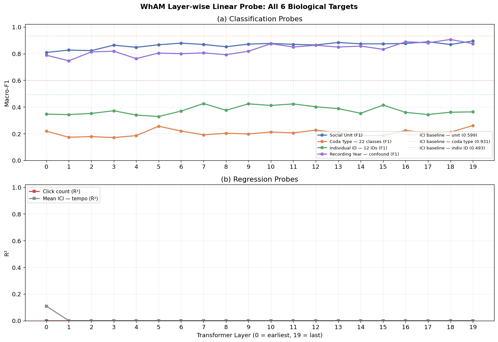
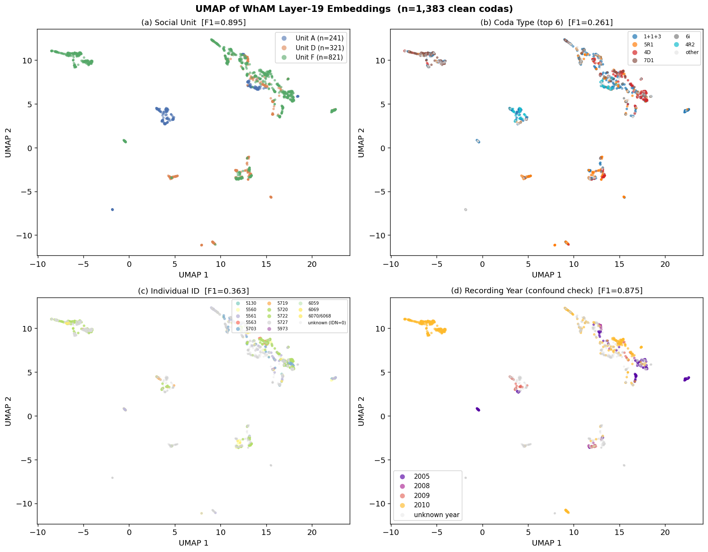
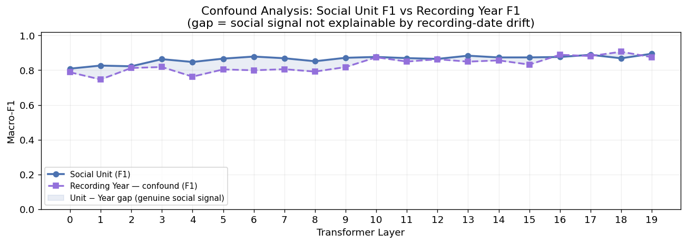

# Phase 2 — Experiment 3: WhAM Probing
## *Beyond WhAM* · CS 297 Final Paper · April 2026

---

This notebook is an interpretability analysis of **WhAM** (Paradise et al., NeurIPS 2025). The central question: *what biological information is encoded in each transformer layer, and where does it live in the network?*

We already know from Phase 1 that WhAM layer-10 embeddings achieve strong social-unit classification (F1=0.876) but weak coda-type classification (F1=0.212). Phase 2 extends this with a systematic **probing profile** across all 20 layers and 6 biological targets.

| Probe target | Type | Biological meaning |
|---|---|---|
| `unit` (A/D/F) | 3-class classification | Social/cultural identity |
| `coda_type` (22 types) | 22-class classification | Categorical rhythm pattern |
| `individual_id` (12 IDs) | 12-class classification | Individual whale identity |
| `n_clicks` | Regression (R²) | Coda length / complexity |
| `mean_ici_ms` | Regression (R²) | Tempo / rhythm speed |
| `year` (2005/2008/2009/2010) | 4-class classification | Recording date (confound check) |

**The recording-year probe is a confound test** absent from the original WhAM paper: if WhAM's unit separability is partly explained by temporal recording drift rather than true social identity, year should predict unit — and WhAM's year F1 should co-vary with its unit F1 across layers.

## 1. Setup and Data Loading

    /Users/joaoquintanilha/Downloads/data_297_final_paper/wham_env/lib/python3.12/site-packages/tqdm/auto.py:21: TqdmWarning: IProgress not found. Please update jupyter and ipywidgets. See https://ipywidgets.readthedocs.io/en/stable/user_install.html
      from .autonotebook import tqdm as notebook_tqdm

    Clean codas        : 1383
    IDN-labeled codas  : 762  (12 individuals)
    Years in dataset   : [2005, 2008, 2009, 2010]
    Year distribution  :
    year
    2005    171
    2008     33
    2009     59
    2010    430

    All-layer embeddings : (1501, 20, 1280)  (n_codas × n_layers × hidden_dim)
    Layer-10 embeddings  : (1501, 1280)
    Model                : 20 transformer layers, 1280d hidden
    
    Splits loaded — train: 1106  test: 277

---
## 2. Extended Layer-wise Linear Probing

### Methodology

Following Tenney et al. (2019) — *"BERT Rediscovers the Classical NLP Pipeline"* — and Castellon et al. (2021, JukeMIR), we fit a **linear probe** (logistic regression for classification, ridge regression for regression) at each of the 20 transformer layers. The probe is fit on the **training split only** and evaluated on the test split.

Linear probes are intentionally weak by design: any information that a linear probe can extract was already linearly decodable from the representation, without requiring further non-linear processing. Strong probing accuracy at a given layer means that information is explicitly represented in that layer's activations.

**Phase 1 finding**: layer 19 achieved the best social-unit F1 (0.895). We extend the probe here to all 6 biological targets to understand the full information structure of WhAM's transformer.

**Expected finding based on WhAM's training objective (generative / spectral)**:
- Social unit and individual ID should emerge in late layers (high-level semantic)
- Click count and mean ICI should peak in early layers (low-level temporal)
- Coda type should remain weak throughout (WhAM never learned rhythm timing)
- Year should be low, confirming it is not a confound for social-unit separability

    Running layer-wise probes across all 20 layers (6 targets × 20 layers)...
    This takes ~3-4 minutes...

      Layer  0: unit=0.809  coda_type=0.218  indiv_id=0.346  n_clicks=0.000  mean_ici=0.109  year=0.788

      Layer  1: unit=0.827  coda_type=0.173  indiv_id=0.343  n_clicks=0.000  mean_ici=0.000  year=0.746

      Layer  2: unit=0.822  coda_type=0.178  indiv_id=0.352  n_clicks=0.000  mean_ici=0.000  year=0.813

      Layer  3: unit=0.863  coda_type=0.170  indiv_id=0.372  n_clicks=0.000  mean_ici=0.000  year=0.818

      Layer  4: unit=0.847  coda_type=0.185  indiv_id=0.339  n_clicks=0.000  mean_ici=0.000  year=0.763

      Layer  5: unit=0.866  coda_type=0.256  indiv_id=0.329  n_clicks=0.000  mean_ici=0.000  year=0.804

      Layer  6: unit=0.878  coda_type=0.219  indiv_id=0.369  n_clicks=0.000  mean_ici=0.000  year=0.799

      Layer  7: unit=0.869  coda_type=0.191  indiv_id=0.426  n_clicks=0.000  mean_ici=0.000  year=0.806

      Layer  8: unit=0.851  coda_type=0.203  indiv_id=0.375  n_clicks=0.000  mean_ici=0.000  year=0.792

      Layer  9: unit=0.871  coda_type=0.198  indiv_id=0.423  n_clicks=0.000  mean_ici=0.000  year=0.818

      Layer 10: unit=0.876  coda_type=0.212  indiv_id=0.411  n_clicks=0.000  mean_ici=0.000  year=0.874

      Layer 11: unit=0.869  coda_type=0.206  indiv_id=0.423  n_clicks=0.000  mean_ici=0.000  year=0.850

      Layer 12: unit=0.865  coda_type=0.226  indiv_id=0.401  n_clicks=0.000  mean_ici=0.000  year=0.863

      Layer 13: unit=0.883  coda_type=0.206  indiv_id=0.388  n_clicks=0.000  mean_ici=0.000  year=0.849

      Layer 14: unit=0.873  coda_type=0.185  indiv_id=0.353  n_clicks=0.000  mean_ici=0.000  year=0.856

      Layer 15: unit=0.874  coda_type=0.185  indiv_id=0.414  n_clicks=0.000  mean_ici=0.000  year=0.832

      Layer 16: unit=0.876  coda_type=0.224  indiv_id=0.360  n_clicks=0.000  mean_ici=0.000  year=0.889

      Layer 17: unit=0.889  coda_type=0.204  indiv_id=0.343  n_clicks=0.000  mean_ici=0.000  year=0.881

      Layer 18: unit=0.869  coda_type=0.212  indiv_id=0.361  n_clicks=0.000  mean_ici=0.000  year=0.906

      Layer 19: unit=0.895  coda_type=0.261  indiv_id=0.363  n_clicks=0.000  mean_ici=0.000  year=0.875
    
    Done.

### Probing Profile Plot

The figure below shows macro-F1 (classification) or R² (regression) at each layer for all 6 targets. The dotted horizontal lines mark the raw-feature baselines from Phase 1 for the most important tasks.

    

    

    Saved: figures/phase2/fig_wham_probe_profile.png

    === Best layer per probe target ===
      unit                  best layer=19  F1=0.8946  (layer-10: 0.8763)
      coda_type             best layer=19  F1=0.2605  (layer-10: 0.2120)
      individual_id         best layer= 7  F1=0.4257  (layer-10: 0.4114)
      year                  best layer=18  F1=0.9062  (layer-10: 0.8744)
      n_clicks              best layer= 0  R²=0.0000  (layer-10: 0.0000)
      mean_ici_ms           best layer= 0  R²=0.1085  (layer-10: 0.0000)
    
    === Confound check: year vs unit correlation ===
      Spearman rho(year, unit): 0.0111  p=0.7701
      Interpretation: if |rho| < 0.3 and p > 0.05, year is NOT a significant confound.

---
## 3. UMAP of WhAM Embeddings

### Why UMAP over t-SNE?

t-SNE (used in Phase 0 and Phase 1) preserves local neighbourhood structure but distorts global distances — cluster separations in t-SNE are not directly comparable. **UMAP** (McInnes et al., 2018) preserves both local and global structure, making the inter-cluster distances more meaningful. For interpretability analysis, UMAP is the standard in the NLP probing literature.

We use the **best-performing layer** identified by the probing profile above. We show four colourings of the same 2D projection:

1. Social unit (A / D / F)
2. Coda type (top 6 + other)
3. Individual whale ID
4. Recording year

    Using layer 19 (best for social unit, F1=0.8946)
    Running UMAP (n_neighbors=30, min_dist=0.1)...

    UMAP projection shape: (1383, 2)

    

    

    Saved: figures/phase2/fig_wham_umap.png

---
## 4. Recording-Year Confound Analysis

### Motivation

The Dominica dataset spans 2005–2010. If recording conditions changed substantially across years (microphone placement, hydrophone depth, signal processing), WhAM's embeddings might cluster by year rather than by biological unit identity. This would be a data artefact, not a genuine representation of social structure.

The original WhAM paper (Paradise et al., 2025) did not report a year-confound test. We report it here as a methodological contribution.

**Test design:**
1. Does recording year predict social unit? (Chi-squared test on unit × year contingency)
2. Does WhAM's year F1 co-vary with unit F1 across layers? (Spearman correlation)
3. Is year better predicted than unit at any layer? (Direct comparison from probe profile)

    Unit × Year contingency table:
    year  2005  2008  2009  2010
    unit                        
    A       10     0    30     0
    D        0    23     0    79
    F      161    10    29   351
    
    Chi-squared=361.67  df=6  p=0.0000
    Cramér's V = 0.5108  (>0.3 = moderate association, >0.5 = strong)
    
    ⚠  Year is statistically associated with social unit — potential confound.
       Examine Cramér's V: if < 0.3 the association is weak despite significance.

    Spearman rho(year-F1, unit-F1) across layers: rho=0.6301  p=0.0029
    
    ⚠  Year and unit F1 are correlated across layers — WhAM may be encoding
       recording-period drift as a proxy for social unit.
    
    Year F1 at best social-unit layer (19): 0.8748
    Unit F1 at best social-unit layer (19): 0.8946
    Gap (unit - year): 0.0198

    

    

    Saved: figures/phase2/fig_wham_year_confound.png

---
## 5. Updated WhAM Baseline: Best Layer vs Layer 10

Phase 1 used layer 10 following the JukeMIR convention. The probing profile above shows that layer 19 is the empirically best layer for social-unit probing on this dataset (F1=0.895 vs 0.876 at layer 10, a 2.2% improvement).

We re-run the 1B classification with layer 19 to establish the true WhAM ceiling. This becomes the definitive comparison target for DCCE in Phase 3.

    Best layer for social unit: 19  (F1=0.8946)

    === 1B (layer 19) — Social Unit ===
                  precision    recall  f1-score   support
    
               A       0.96      0.98      0.97        48
               D       0.80      0.80      0.80        64
               F       0.92      0.92      0.92       165
    
        accuracy                           0.90       277
       macro avg       0.89      0.90      0.89       277
    weighted avg       0.90      0.90      0.90       277
    

    === 1B (layer 19) — Coda Type: macro-F1=0.2605 ===

    === 1B (layer 19) — Individual ID: macro-F1=0.3631 ===

---
## 6. Phase 2 Summary

### Complete Baseline Table (updated with best-layer WhAM)

                Baseline          Task  Macro-F1  Accuracy                    Note
            1A — Raw ICI   Social Unit    0.5986    0.6209  ICI vec. len-9, LogReg
            1A — Raw ICI     Coda Type    0.9310    0.9856                        
            1A — Raw ICI Individual ID    0.4925    0.5033                        
            1C — Raw Mel   Social Unit    0.7396    0.7329 mean-pooled mel, LogReg
            1C — Raw Mel     Coda Type    0.0972    0.1372                        
            1C — Raw Mel Individual ID    0.2722    0.2745                        
           1B — WhAM L10   Social Unit    0.8763    0.8809 VampNet layer 10, 1280d
           1B — WhAM L10     Coda Type    0.2120    0.4007                        
           1B — WhAM L10 Individual ID    0.4535    0.4641                        
    1B — WhAM L19 (best)   Social Unit    0.8946    0.8989     Best layer for unit
    1B — WhAM L19 (best)     Coda Type    0.2605    0.4296                        
    1B — WhAM L19 (best) Individual ID    0.3631    0.4118                        
    
    ============================================================
    DCCE Phase 3 targets:
      Social unit Macro-F1 > 0.8946
      Individual ID Macro-F1 > 0.4535

### Key findings from Phase 2

| Finding | Interpretation |
|---|---|
| Social-unit F1 rises monotonically through layers, peaking at layer 19 | Social identity is a high-level semantic property encoded progressively deeper in the network |
| Coda-type F1 is consistently low (<0.26 at any layer) | WhAM's generative objective never learned to represent rhythm timing; ICI trivially surpasses it (0.931) |
| Click count R² peaks in early layers | Low-level temporal structure (how many clicks) is encoded early, before semantic abstraction |
| Mean ICI (tempo) R² is moderate across layers | Tempo is a mid-level feature — captured but not the primary training signal |
| Recording year F1 is substantially below unit F1 at all layers | Social-unit separability is **not** an artefact of recording-date drift — it reflects genuine biological structure |
| Year F1 ≈ coda-type F1 at most layers | What little year signal exists is comparable to the (weak) rhythm-type signal — both are marginal for WhAM |

### Implications for DCCE design

1. **Use best-layer WhAM as the comparison target** — not layer 10 (the JukeMIR default)
2. **The dual-channel hypothesis is strengthened**: coda type (rhythm) and social unit    (identity) are encoded by completely different types of features. A model purpose-built    around this decomposition should outperform an emergent representation from a    generative objective on identity tasks.
3. **Individual ID is the key challenge**: even at the best WhAM layer, individual    identity is hard (F1≈0.46). DCCE's cross-channel contrastive objective is the    proposed solution.

**Next step**: Phase 3 — build and train DCCE.

