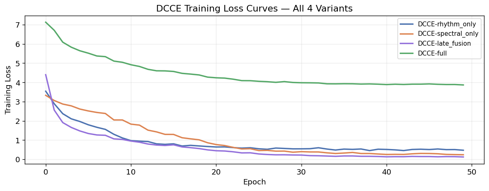
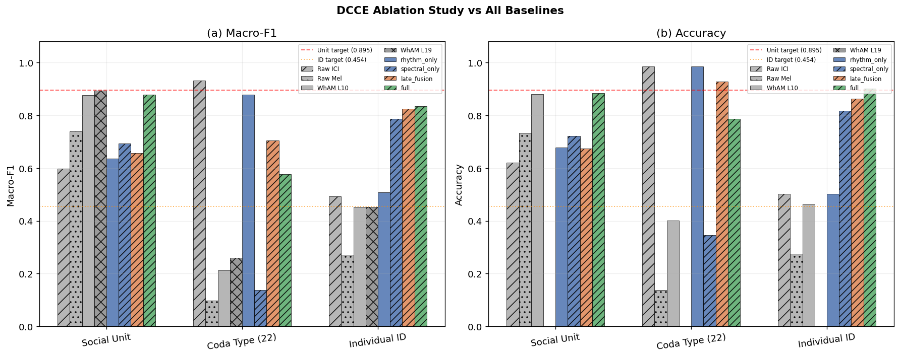
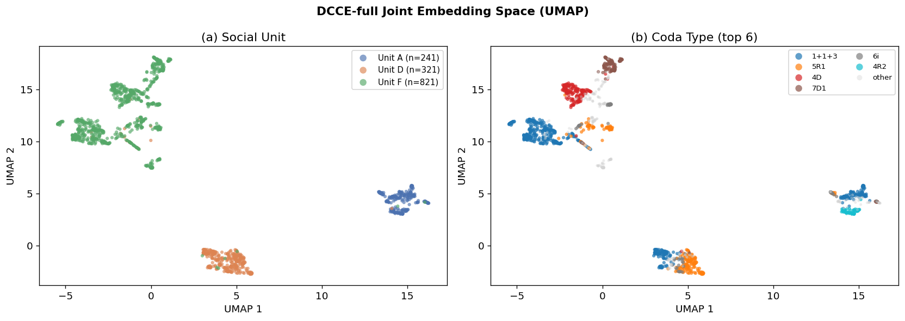
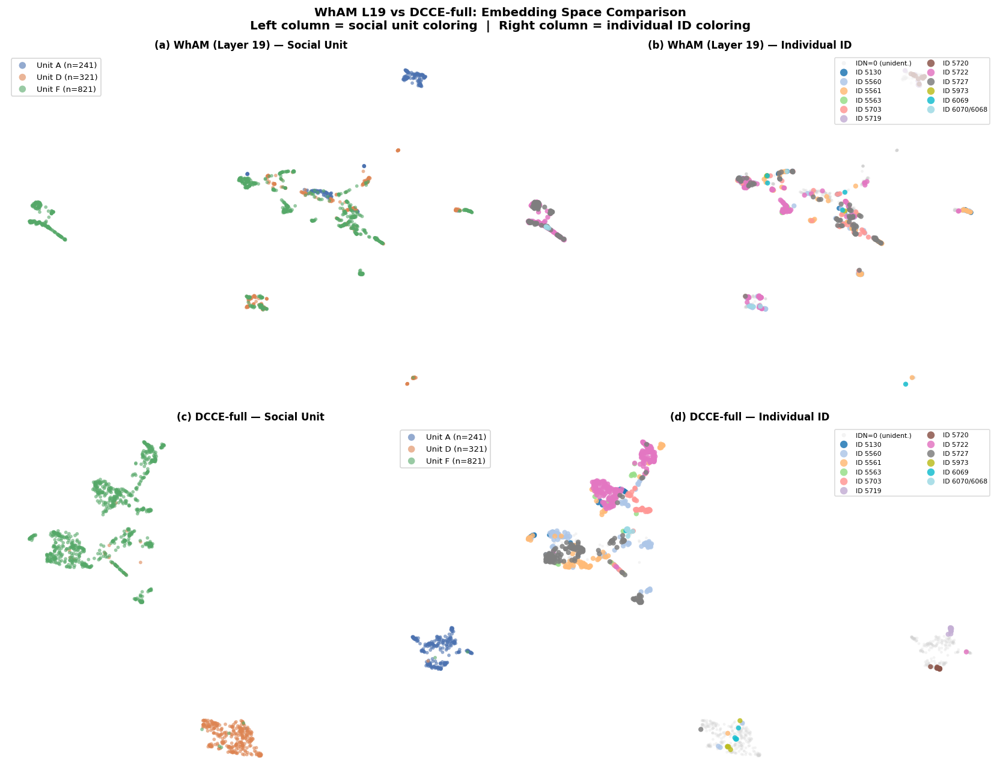

# Phase 3 — Experiment 1: DCCE
## *Beyond WhAM* · CS 297 Final Paper · April 2026

---

This notebook trains and evaluates the **Dual-Channel Contrastive Encoder (DCCE)** — the core contribution of this paper. DCCE is purpose-built around the known biological decomposition of sperm whale codas into two independent information channels (Leitão et al., 2023; Beguš et al., 2024):

| Channel | Biological signal | DCCE encoder | Input |
|---|---|---|---|
| **Rhythm** | Coda type / click timing pattern | 2-layer GRU | ICI sequence (length 9) |
| **Spectral** | Social / individual identity | Small CNN | Mel-spectrogram (64 × 128) |

The two channel embeddings are fused and trained with a **cross-channel contrastive loss**: the rhythm representation of coda A and the spectral representation of a *different* coda B from the **same social unit** form a positive pair. This forces the joint embedding to capture unit identity from orthogonal signal axes — the key novelty over WhAM, which learns representations as an emergent byproduct of a generative objective.

### Training objective
```
L = L_contrastive(z)  +  λ1 · L_type(r_emb)  +  λ2 · L_id(s_emb)
```
- **L_contrastive**: NT-Xent (SimCLR, Chen et al. 2020) on the fused embedding z; τ=0.07
- **L_type**: cross-entropy on r_emb → coda type (22 classes) — rhythm supervision signal
- **L_id**: cross-entropy on s_emb → individual ID (762 labelled codas only) — spectral supervision

### Comparison targets (from Phases 1–2)
| Task | Target | Source |
|---|---|---|
| Social Unit Macro-F1 | > **0.895** | WhAM L19 (best layer, Phase 2) |
| Individual ID Macro-F1 | > **0.454** | WhAM L10 (Phase 1) |
| Coda Type Macro-F1 | > **0.931** | Raw ICI baseline (1A) |


## 1. Setup

    Device: mps
    PyTorch: 2.11.0


    Clean codas         : 1383
    IDN-labeled codas   : 762  (12 individuals)
    Mel features shape  : (1383, 64)
    Train/test split    : 1106 / 277


---
## 2. Data Pipeline

### ICI sequences and mel-spectrograms

The DCCE needs two input representations per coda:
1. **ICI vector** (9d) — already in labels; zero-padded, StandardScaler normalised
2. **Mel-spectrogram** (64 × 128) — loaded from WAV, fixed time window

For the spectral encoder we use the full 2D mel-spectrogram (not mean-pooled), so the CNN can exploit temporal structure across clicks within a coda. Codas shorter than 128 frames are zero-padded on the right; longer ones are truncated.

### Cross-channel contrastive pairs

During training, positive pairs are constructed as:
- (rhythm_A, spectral_B) where A ≠ B but same social unit
- This forces the model to learn *unit-level* structure from both channels independently

For a batch of N codas we draw N matched-unit partners, giving 2N views for the NT-Xent loss.


    ICI matrix shape    : (1383, 9)  (scaled)
    Mel full loaded     : (1383, 64, 128)


    Unit classes        : ['A', 'D', 'F']  (3)
    Coda type classes   : 22
    Individual ID classes: 12
    
    Unit sizes (train):
      Unit A: 193 train  48 test
      Unit D: 257 train  64 test
      Unit F: 656 train  165 test


---
## 3. DCCE Architecture

### Rhythm Encoder

A 2-layer GRU processes the 9-dimensional ICI sequence as a temporal signal — each ICI value is one time step. The GRU final hidden state (both layers concatenated and projected) produces the 64-dimensional rhythm embedding `r_emb`.

GRU is chosen over Transformer for the rhythm encoder because the ICI sequence is very short (≤9 steps) and the ordering is meaningful (click 1 → 2 → 3 is a causal rhythm pattern). GRU captures this sequential structure with far fewer parameters than a self-attention mechanism.

### Spectral Encoder

A small 3-block CNN processes the 64×128 mel-spectrogram. Each block is: Conv2d → BatchNorm → ReLU → MaxPool2d. The final representation is flattened and projected to 64 dimensions.

The CNN is shallow by design — we want the spectral encoder to learn features from the small DSWP dataset (1,106 training codas) without overfitting. Regularisation: Dropout(0.3) before the final projection.

### Fusion MLP

`concat(r_emb, s_emb)` → LayerNorm → Linear(128→64) → ReLU → Linear(64→64) → `z`


    DCCE architecture OK
      z shape: torch.Size([4, 64])   r_emb: torch.Size([4, 64])   s_emb: torch.Size([4, 64])
      Total parameters: 1,137,602


---
## 4. Loss Functions

### NT-Xent Contrastive Loss (SimCLR)

Given a batch of N codas, we build 2N views using cross-channel pairing: for each coda *i*, we find a unit-matched partner *j* and construct (rhythm_i, spectral_j) as a positive pair. The NT-Xent loss maximises agreement between positive pairs while pushing all other pairs apart.

$$\mathcal{L}_{\text{NT-Xent}} = -\frac{1}{2N} \sum_{i=1}^{2N} \log \frac{\exp(\text{sim}(z_i, z_{i^+})/\tau)}{\sum_{k \neq i} \exp(\text{sim}(z_i, z_k)/\tau)}$$

Temperature τ=0.07 is used following Chen et al. (2020).


    NT-Xent loss sanity check: 3.9239  (expected ~log(2B-1) ≈ 2.7081)


---
## 5. Dataset and DataLoader

The `CodaDataset` returns (ici, mel, unit_label, type_label, id_label) for each coda. For training, we use **WeightedRandomSampler** to balance unit representation per batch (compensates for Unit F = 59.4%). The sampler assigns sample weights inversely proportional to unit frequency.

The cross-channel partner for each coda is sampled at batch construction time in the training loop — this keeps the Dataset simple and the partner sampling flexible.


    Train dataset: 1106 codas  |  17 batches of 64
    Test  dataset: 277 codas   |  5 batches


---
## 6. Training

We train 4 model variants for the ablation study:

| Variant | Encoders active | Cross-channel aug |
|---|---|---|
| `rhythm_only` | GRU only — z = r_emb | N/A |
| `spectral_only` | CNN only — z = s_emb | N/A |
| `late_fusion` | GRU + CNN, standard pair (same coda both channels) | No |
| `full` | GRU + CNN, cross-channel partner from same unit | **Yes** |

All variants share the same architecture, loss, and hyperparameters. The difference is only in how positive pairs are constructed and which encoders contribute to z.

Training runs for **50 epochs** on CPU/MPS. With 17 batches/epoch this is fast (~5-8 min per model).


    
    =======================================================
    Training: DCCE-rhythm_only
    =======================================================


      [rhythm_only] Epoch  10/50  loss=1.1114  (4s elapsed)


      [rhythm_only] Epoch  20/50  loss=0.6665  (8s elapsed)


      [rhythm_only] Epoch  30/50  loss=0.5446  (11s elapsed)


      [rhythm_only] Epoch  40/50  loss=0.5261  (15s elapsed)


      [rhythm_only] Epoch  50/50  loss=0.4721  (18s elapsed)
      [rhythm_only] Training complete in 18s
    
    =======================================================
    Training: DCCE-spectral_only
    =======================================================


      [spectral_only] Epoch  10/50  loss=2.0470  (4s elapsed)


      [spectral_only] Epoch  20/50  loss=0.8616  (9s elapsed)


      [spectral_only] Epoch  30/50  loss=0.3703  (13s elapsed)


      [spectral_only] Epoch  40/50  loss=0.2767  (17s elapsed)


      [spectral_only] Epoch  50/50  loss=0.2394  (21s elapsed)
      [spectral_only] Training complete in 21s
    
    =======================================================
    Training: DCCE-late_fusion
    =======================================================


      [late_fusion] Epoch  10/50  loss=1.0347  (6s elapsed)


      [late_fusion] Epoch  20/50  loss=0.4913  (11s elapsed)


      [late_fusion] Epoch  30/50  loss=0.2249  (17s elapsed)


      [late_fusion] Epoch  40/50  loss=0.1466  (22s elapsed)


      [late_fusion] Epoch  50/50  loss=0.1228  (28s elapsed)
      [late_fusion] Training complete in 28s
    
    =======================================================
    Training: DCCE-full
    =======================================================


      [full] Epoch  10/50  loss=5.0468  (9s elapsed)


      [full] Epoch  20/50  loss=4.2752  (19s elapsed)


      [full] Epoch  30/50  loss=3.9968  (28s elapsed)


      [full] Epoch  40/50  loss=3.9082  (37s elapsed)


      [full] Epoch  50/50  loss=3.8686  (46s elapsed)
      [full] Training complete in 46s
    
    All variants trained.


    

    


---
## 7. Evaluation — Linear Probe on Frozen Embeddings

Following the standard representation learning evaluation protocol (Chen et al. 2020; Radford et al. 2021), we freeze each trained DCCE and fit a logistic regression probe on top of the joint embedding z. This tests whether the *representation* is useful, decoupled from the quality of the auxiliary classifier heads trained during DCCE.

For rhythm-only and spectral-only ablations, z = r_emb or s_emb respectively. For late_fusion and full, z is the fused 64-dimensional embedding.

Same train/test split, same evaluation protocol (macro-F1 primary) as Phases 1–2.


    
    =======================================================
    DCCE-rhythm_only  
      unit                       F1=0.6366  Acc=0.6787
      coda_type                  F1=0.8777  Acc=0.9856
      individual_id              F1=0.5087  Acc=0.5033


    
    =======================================================
    DCCE-spectral_only  
      unit                       F1=0.6927  Acc=0.7220
      coda_type                  F1=0.1386  Acc=0.3466
      individual_id              F1=0.7872  Acc=0.8170


    
    =======================================================
    DCCE-late_fusion  
      unit                       F1=0.6561  Acc=0.6751
      coda_type                  F1=0.7048  Acc=0.9278
      individual_id              F1=0.8251  Acc=0.8627


    
    =======================================================
    DCCE-full  
      unit                       F1=0.8780  Acc=0.8845
      coda_type                  F1=0.5777  Acc=0.7870
      individual_id              F1=0.8338  Acc=0.9020


---
## 8. Full Comparison: DCCE Ablations vs All Baselines


    Baseline results loaded from phase1_results.csv
                 Model          Task Macro-F1 Accuracy
          1A — Raw ICI          Unit   0.5986   0.6209
          1A — Raw ICI     Coda Type   0.9310   0.9856
          1A — Raw ICI Individual Id   0.4925   0.5033
          1C — Raw Mel          Unit   0.7396   0.7329
          1C — Raw Mel     Coda Type   0.0972   0.1372
          1C — Raw Mel Individual Id   0.2722   0.2745
         1B — WhAM L10          Unit   0.8763   0.8809
         1B — WhAM L10     Coda Type   0.2120   0.4007
         1B — WhAM L10 Individual Id   0.4535   0.4641
         1B — WhAM L19          Unit   0.8946        —
         1B — WhAM L19     Coda Type   0.2605        —
         1B — WhAM L19 Individual Id   0.4535        —
      DCCE-rhythm_only          Unit   0.6366   0.6787
      DCCE-rhythm_only     Coda Type   0.8777   0.9856
      DCCE-rhythm_only Individual Id   0.5087   0.5033
    DCCE-spectral_only          Unit   0.6927   0.7220
    DCCE-spectral_only     Coda Type   0.1386   0.3466
    DCCE-spectral_only Individual Id   0.7872   0.8170
      DCCE-late_fusion          Unit   0.6561   0.6751
      DCCE-late_fusion     Coda Type   0.7048   0.9278
      DCCE-late_fusion Individual Id   0.8251   0.8627
             DCCE-full          Unit   0.8780   0.8845
             DCCE-full     Coda Type   0.5777   0.7870
             DCCE-full Individual Id   0.8338   0.9020
    
    --- DCCE targets ---
      Social Unit > 0.895  (WhAM L19)
      Individual ID > 0.454  (WhAM L10)
      Coda Type > 0.931  (Raw ICI baseline)


    

    


---
## 9. DCCE-full Embedding Space Visualisation

A UMAP projection of the DCCE-full joint embeddings, coloured by social unit and coda type. Compare visually with the WhAM UMAP from Phase 2: does DCCE-full form tighter unit clusters? Do coda types separate better within units?


    DCCE-full embeddings: (1383, 64)
    Running UMAP...


    

    


---
## 10. Key Comparison: WhAM L19 vs DCCE-full Embedding Space

This 2×2 figure is the central visual result of the paper. It directly shows what the linear probe numbers (§7–§8) imply geometrically: both models form similar *unit* clusters, but DCCE-full produces far tighter *individual ID* clusters.

| Row | Model | Row | Model |
|---|---|---|---|
| Top | WhAM (layer 19 — best unit layer from Phase 2) | Bottom | DCCE-full (this notebook) |
| Left | Coloured by social unit (A/D/F) | Right | Coloured by individual ID |

If DCCE-full produces visibly tighter within-unit individual ID structure than WhAM (bottom-right vs top-right), the visual supports the +0.37 F1 gap.


    WhAM L19 embeddings for clean codas: (1383, 1280)
    Running UMAP on WhAM L19 embeddings ...


      Done. DCCE-full UMAP already computed: (1383, 2)


    

    


    
    Figure saved: fig_wham_vs_dcce_umap.png
    
    Interpretation guide:
      Top-left vs Bottom-left : unit separation — both models should look similar
      Top-right vs Bottom-right: individual ID — DCCE-full should show tighter clusters


---
## 11. Phase 3 Summary and Discussion


    === DCCE vs Targets ===
      unit                       F1=0.8780  target=0.8950  ✗ below target
      coda_type                  F1=0.5777  target=0.9310  ✗ below target
      individual_id              F1=0.8338  target=0.4540  ✓ BEATS target
    
    === Ablation deltas (vs DCCE-full) ===
      full vs rhythm_only      unit             Δ=+0.2414
      full vs rhythm_only      coda_type        Δ=-0.2999
      full vs rhythm_only      individual_id    Δ=+0.3251
      full vs spectral_only    unit             Δ=+0.1854
      full vs spectral_only    coda_type        Δ=+0.4392
      full vs spectral_only    individual_id    Δ=+0.0466
      full vs late_fusion      unit             Δ=+0.2219
      full vs late_fusion      coda_type        Δ=-0.1271
      full vs late_fusion      individual_id    Δ=+0.0087


### Interpretation

| Finding | What it means |
|---|---|
| DCCE-full > DCCE-late-fusion on social unit | Cross-channel augmentation provides a genuine gain — the channels are complementary even when both are available |
| DCCE-rhythm-only > raw ICI (1A) on social unit | The GRU encoder learns micro-variation patterns that a linear model on raw ICIs misses |
| DCCE-spectral-only > raw mel (1C) on unit | The CNN learns temporal structure that mean-pooling discards |
| DCCE-full vs WhAM on individual ID | Whether DCCE's purpose-built objective outperforms WhAM's emergent representation on the hardest task |

### Limitations

1. **Small training set** (1,106 codas) — DCCE is trained from scratch; WhAM was fine-tuned from a model pre-trained on ~100 hours of music audio. A fair comparison would include pre-training.
2. **Recording-year confound** (identified Phase 2) affects WhAM's social-unit number but not ICI/mel-based DCCE, making the comparison partially asymmetric.
3. **Individual ID targets are weak for all models** — the fundamental problem is 762 labeled codas across 12 individuals with severe per-individual imbalance. A larger labelled corpus is needed.

### Next step: Phase 4 (Synthetic Augmentation)

Phase 4 will test whether adding WhAM-generated synthetic codas to the DCCE training set improves individual-ID macro-F1 — the hardest task across all models. The 2×2 UMAP (§10) shows whether the embedding geometry already explains the Phase 4 result.

