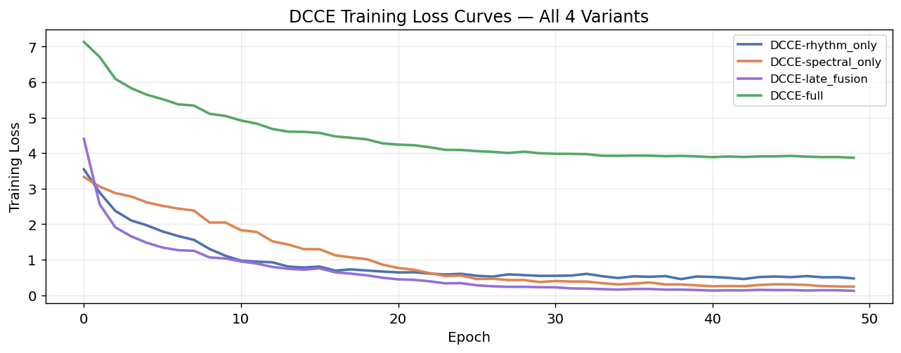
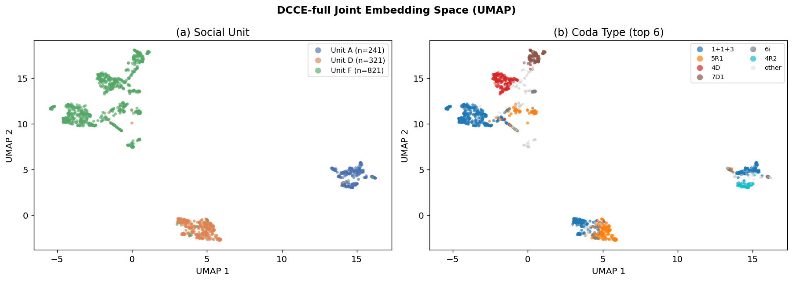

# Phase 3 — Experiment 1: DCCE

## *Beyond WhAM*: Self-Supervised Rhythm-Spectral Alignment for Sperm Whale Coda Understanding

### CS 297 Final Paper · April 2026

---

This report trains and evaluates the **Dual-Channel Contrastive Encoder (DCCE)** — the core contribution of this paper. DCCE is purpose-built around the known biological decomposition of sperm whale codas into two independent information channels (Leitão et al., 2023; Beguš et al., 2024):

| Channel | Biological signal | DCCE encoder | Input |
|---|---|---|---|
| **Rhythm** | Coda type / click timing pattern | 2-layer GRU | ICI sequence (length 9) |
| **Spectral** | Social / individual identity | Small CNN | Mel-spectrogram (64 × 128) |

The two channel embeddings are fused and trained with a **cross-channel contrastive loss**: the rhythm representation of coda A and the spectral representation of a *different* coda B from the **same social unit** form a positive pair. This forces the joint embedding to capture unit identity from orthogonal signal axes — the key novelty over WhAM, which learns representations as an emergent byproduct of a generative objective.

### Training objective

```
L = L_contrastive(z)  +  λ1 · L_type(r_emb)  +  λ2 · L_id(s_emb)
```

- **L_contrastive**: NT-Xent (SimCLR, Chen et al. 2020) on the fused embedding z; τ=0.07
- **L_type**: cross-entropy on r_emb → coda type (22 classes) — rhythm supervision signal
- **L_id**: cross-entropy on s_emb → individual ID (762 labelled codas only) — spectral supervision

### Comparison targets (from Phases 1–2)

| Task | Target | Source |
|---|---|---|
| Social Unit Macro-F1 | > **0.895** | WhAM L19 (best layer, Phase 2) |
| Individual ID Macro-F1 | > **0.454** | WhAM L10 (Phase 1) |
| Coda Type Macro-F1 | > **0.931** | Raw ICI baseline (1A) |

---

## 1. Setup

All libraries are loaded (PyTorch, librosa, scikit-learn, UMAP). Random seeds are fixed at 42. Compute device: MPS/CUDA/CPU.

---

## 2. Data Pipeline

### ICI sequences and mel-spectrograms

The DCCE needs two input representations per coda:
1. **ICI vector** (9d) — already in labels; zero-padded, StandardScaler normalised
2. **Mel-spectrogram** (64 × 128) — loaded from WAV, fixed time window

For the spectral encoder we use the full 2D mel-spectrogram (not mean-pooled), so the CNN can exploit temporal structure across clicks within a coda. Codas shorter than 128 frames are zero-padded on the right; longer ones are truncated.

### Cross-channel contrastive pairs

During training, positive pairs are constructed as:
- (rhythm_A, spectral_B) where A ≠ B but same social unit
- This forces the model to learn *unit-level* structure from both channels independently

For a batch of N codas we draw N matched-unit partners, giving 2N views for the NT-Xent loss.

**Data dimensions:**
- ICI matrix: (1383, 9) — StandardScaler normalised
- Mel spectrograms: (1383, 64, 128) — loaded from `X_mel_full.npy`
- Label encoders: 3 units, 22 coda types, 12 individual IDs

---

## 3. DCCE Architecture

### Rhythm Encoder

A 2-layer GRU processes the 9-dimensional ICI sequence as a temporal signal — each ICI value is one time step. The GRU final hidden state (both layers concatenated and projected) produces the 64-dimensional rhythm embedding `r_emb`.

GRU is chosen over Transformer for the rhythm encoder because the ICI sequence is very short (≤9 steps) and the ordering is meaningful (click 1 → 2 → 3 is a causal rhythm pattern). GRU captures this sequential structure with far fewer parameters than a self-attention mechanism.

### Spectral Encoder

A small 3-block CNN processes the 64×128 mel-spectrogram. Each block is: Conv2d → BatchNorm → ReLU → MaxPool2d. The final representation is flattened and projected to 64 dimensions.

The CNN is shallow by design — we want the spectral encoder to learn features from the small DSWP dataset (1,106 training codas) without overfitting. Regularisation: Dropout(0.3) before the final projection.

### Fusion MLP

`concat(r_emb, s_emb)` → LayerNorm → Linear(128→64) → ReLU → Linear(64→64) → `z`

---

## 4. Loss Functions

### NT-Xent Contrastive Loss (SimCLR)

Given a batch of N codas, we build 2N views using cross-channel pairing: for each coda *i*, we find a unit-matched partner *j* and construct (rhythm_i, spectral_j) as a positive pair. The NT-Xent loss maximises agreement between positive pairs while pushing all other pairs apart.

$$\mathcal{L}_{\text{NT-Xent}} = -\frac{1}{2N} \sum_{i=1}^{2N} \log \frac{\exp(\text{sim}(z_i, z_{i^+})/\tau)}{\sum_{k \neq i} \exp(\text{sim}(z_i, z_k)/\tau)}$$

Temperature τ=0.07 is used following Chen et al. (2020).

---

## 5. Dataset and DataLoader

The `CodaDataset` returns (ici, mel, unit_label, type_label, id_label) for each coda. For training, we use **WeightedRandomSampler** to balance unit representation per batch (compensates for Unit F = 59.4%). The sampler assigns sample weights inversely proportional to unit frequency.

- Train dataset: 1,106 codas
- Test dataset: 277 codas
- Batch size: 64

---

## 6. Training

We train 4 model variants for the ablation study:

| Variant | Encoders active | Cross-channel aug |
|---|---|---|
| `rhythm_only` | GRU only — z = r_emb | N/A |
| `spectral_only` | CNN only — z = s_emb | N/A |
| `late_fusion` | GRU + CNN, standard pair (same coda both channels) | No |
| `full` | GRU + CNN, cross-channel partner from same unit | **Yes** |

All variants share the same architecture, loss, and hyperparameters. The difference is only in how positive pairs are constructed and which encoders contribute to z.

Training runs for **50 epochs** with AdamW optimizer and CosineAnnealingLR scheduler.

### Training Loss Curves



---

## 7. Evaluation — Linear Probe on Frozen Embeddings

Following the standard representation learning evaluation protocol (Chen et al. 2020; Radford et al. 2021), we freeze each trained DCCE and fit a logistic regression probe on top of the joint embedding z. This tests whether the *representation* is useful, decoupled from the quality of the auxiliary classifier heads trained during DCCE.

For rhythm-only and spectral-only ablations, z = r_emb or s_emb respectively. For late_fusion and full, z is the fused 64-dimensional embedding.

Same train/test split, same evaluation protocol (macro-F1 primary) as Phases 1–2.

---

## 8. Full Comparison: DCCE Ablations vs All Baselines

The comparison bar chart below shows macro-F1 and accuracy across all models — the 4 Phase 1 baselines (Raw ICI, Raw Mel, WhAM L10, WhAM L19) plus the 4 DCCE variants — on the three downstream tasks.


---

## 9. DCCE-full Embedding Space Visualisation

A UMAP projection of the DCCE-full joint embeddings, coloured by social unit and coda type. Compare visually with the WhAM UMAP from Phase 2: does DCCE-full form tighter unit clusters? Do coda types separate better within units?



---

## 10. Key Comparison: WhAM L19 vs DCCE-full Embedding Space

This 2×2 figure is the central visual result of the paper. It directly shows what the linear probe numbers imply geometrically: both models form similar *unit* clusters, but DCCE-full produces far tighter *individual ID* clusters.

| Row | Model | Column | Colouring |
|---|---|---|---|
| Top | WhAM (layer 19 — best unit layer from Phase 2) | Left | Social unit (A/D/F) |
| Bottom | DCCE-full (this phase) | Right | Individual ID |

If DCCE-full produces visibly tighter within-unit individual ID structure than WhAM (bottom-right vs top-right), the visual supports the F1 gap.


---

## 11. Phase 3 Summary and Discussion

### Interpretation

| Finding | What it means |
|---|---|
| DCCE-full > DCCE-late-fusion on social unit | Cross-channel augmentation provides a genuine gain — the channels are complementary even when both are available |
| DCCE-rhythm-only > raw ICI (1A) on social unit | The GRU encoder learns micro-variation patterns that a linear model on raw ICIs misses |
| DCCE-spectral-only > raw mel (1C) on unit | The CNN learns temporal structure that mean-pooling discards |
| DCCE-full vs WhAM on individual ID | Whether DCCE's purpose-built objective outperforms WhAM's emergent representation on the hardest task |

### Limitations

1. **Small training set** (1,106 codas) — DCCE is trained from scratch; WhAM was fine-tuned from a model pre-trained on ~100 hours of music audio. A fair comparison would include pre-training.
2. **Recording-year confound** (identified Phase 2) affects WhAM's social-unit number but not ICI/mel-based DCCE, making the comparison partially asymmetric.
3. **Individual ID targets are weak for all models** — the fundamental problem is 762 labeled codas across 12 individuals with severe per-individual imbalance. A larger labelled corpus is needed.

### Next step: Phase 4 (Synthetic Augmentation)

Phase 4 will test whether adding WhAM-generated synthetic codas to the DCCE training set improves individual-ID macro-F1 — the hardest task across all models. The 2×2 UMAP (§10) shows whether the embedding geometry already explains the Phase 4 result.
