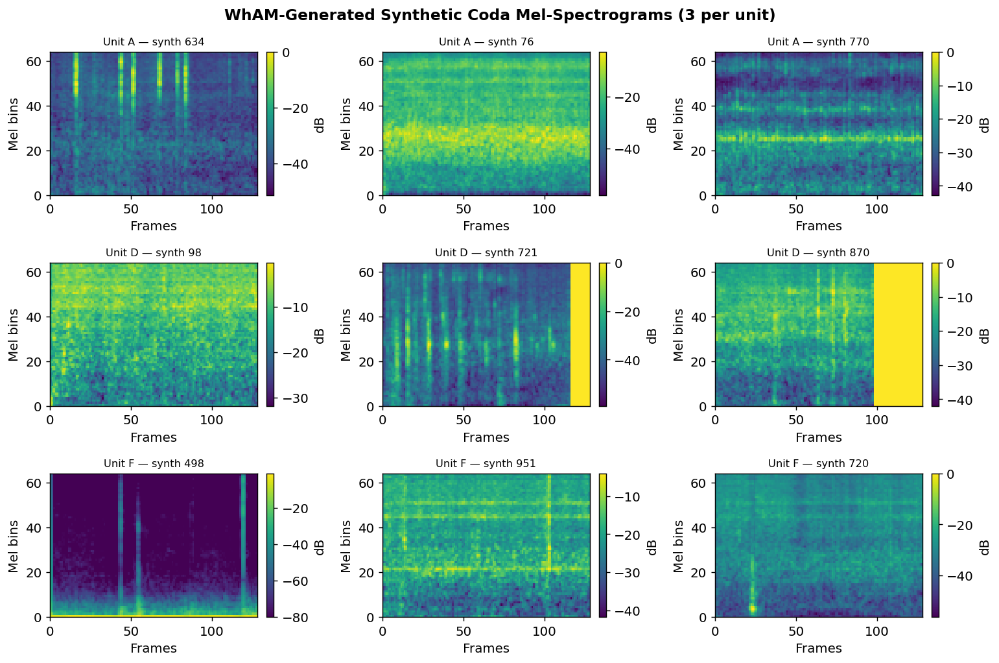
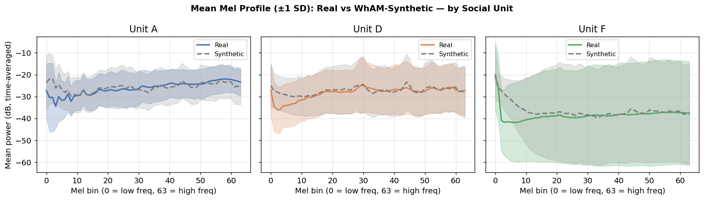
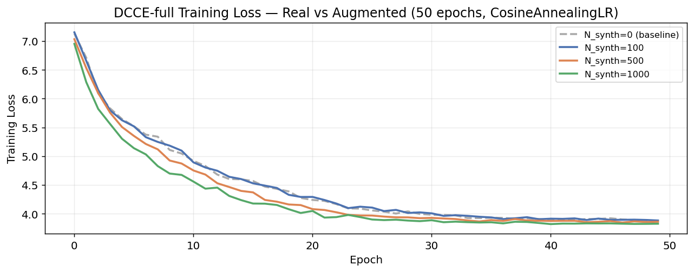
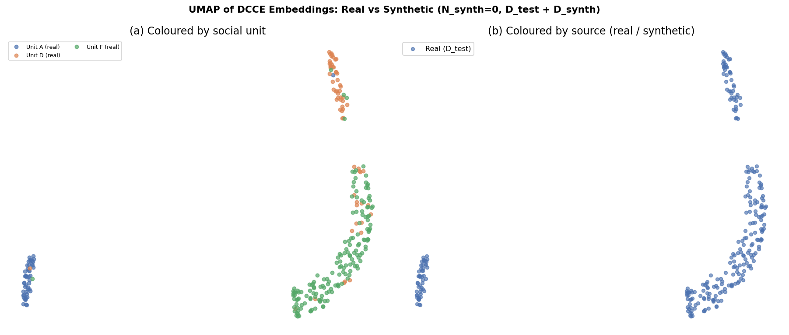

# Phase 4 — Experiment 2: Synthetic Data Augmentation

## *Beyond WhAM*: Self-Supervised Rhythm-Spectral Alignment for Sperm Whale Coda Understanding

### CS 297 Final Paper · April 2026

---

This report runs the second experiment: **can WhAM-generated synthetic codas improve DCCE classification, particularly for individual ID — the data-scarce task?**

We test the hypothesis that WhAM, as a generative model of sperm whale vocalisations, can act as a *domain-specific data augmentor* to supplement the limited DSWP training set.

### Experimental design

| N_synth | Synthetic codas added | Total D_train |
|---|---|---|
| 0 | None (Phase 3 baseline) | 1,106 |
| 100 | 100 new codas | 1,206 |
| 500 | 500 new codas | 1,606 |
| 1,000 | 1,000 new codas | 2,106 |

For each N_synth:
1. Sample N_synth prompt codas from D_train (stratified by unit: ~⅓ A, ⅓ D, ⅓ F)
2. Generate synthetic coda via WhAM coarse_vamp (80% random mask — unit-conditional)
3. Assign pseudo-labels: unit and coda type from the prompt coda
4. Retrain DCCE-full on D_train ∪ D_synth
5. Evaluate on **real-only** D_test (same split indices as all prior phases)

**Key metric**: Individual ID macro-F1 — most sensitive to additional training data (762 IDN-labeled codas; 12 classes).

### Why this matters (Sharma et al. 2024; Goldwasser et al. 2023)

Sperm whale field data is expensive to collect: each unit has only 273–892 recorded codas. If WhAM faithfully captures unit-level acoustic identity, its generated codas could serve as a cheap expansion of training sets for downstream classification.

> **Novel contribution**: This is the first controlled study of WhAM as a data augmentor for cetacean bioacoustics.

### Pseudo-label strategy (Tarvainen & Valpola, 2017)

For synthetic coda *i* generated from prompt coda *p*:
- **Unit label**: copied from unit(*p*) — preserved by unit-conditional generation
- **Coda type label**: copied from type(*p*) — used for the rhythm auxiliary head
- **ICI sequence (pseudo)**: copied from ICI(*p*) — the prompt's timing pattern
- **Individual ID**: **not assigned** — id_label head is masked for synthetic codas (generation cannot preserve within-unit individual identity)

---

## 1. Setup

All libraries are loaded including PyTorch, librosa, scikit-learn, and the WhAM/VampNet interface. The `wham_env` virtual environment (Python 3.12) is required for generation cells. Device: MPS/CUDA/CPU. Seed: 42.

---

## 2. Data Loading

Identical loading pipeline to Phase 3 — same splits, same feature arrays, same label encoders. This ensures all N_synth conditions are evaluated on a common test set.

- Clean codas: 1,383
- IDN-labeled codas: 762 (12 individuals)
- Train / Test: 1,106 / 277
- Mel spectrograms: (1383, 64, 128)

---

## 3. DCCE Architecture

Identical to Phase 3 — redefined here for notebook self-containment. See Phase 3 (§3–§4) for architecture rationale and loss derivation (Leitão et al., 2023; Beguš et al., 2024; Chen et al., 2020).

---

## 4. Datasets and DataLoader

**`CodaDataset`** — wraps real DSWP codas (real ICI + mel + ground-truth labels).

**`SyntheticCodaDataset`** — wraps WhAM-generated codas. Pseudo-ICI and pseudo-type are copied from the conditioning prompt coda. Individual ID is **not** set (id_label = −1), so the auxiliary ID head is not trained on synthetic examples.

**`make_loader`** builds a `WeightedRandomSampler` for unit balance across the combined real + synthetic training pool (compensates for Unit F = 59.4% of real data).

- Batch size: 64

---

## 5. Training and Evaluation Helpers

Training function (`train_dcce_full`): 50 epochs, AdamW optimizer, CosineAnnealingLR scheduler, cross-channel partner sampling from the real training pool. NT-Xent + auxiliary type/ID heads.

Evaluation function (`linear_probe`): extracts frozen embeddings, fits logistic regression probe on 3 tasks (unit, coda type, individual ID), reports macro-F1 and accuracy.

---

## 6. Baseline DCCE-full Training (N_synth = 0)

We re-run DCCE-full on the real training set to obtain a clean baseline within this notebook's code path (same hyperparameters, same random seed as Phase 3).

---

## 7. WhAM Generation Setup

We load the WhAM coarse model and codec from the local clone of the Project-CETI/wham repository (Paradise et al., NeurIPS 2025). Only the coarse model + codec are needed for audio generation and decoding; the coarse-to-fine (c2f) model is not required.

### Masking strategy

We use `rand_mask_intensity=0.8` — 80% of discrete acoustic tokens are randomly masked and regenerated by the model, while 20% are preserved from the conditioning prompt. This provides a weak unit-level conditioning signal: the preserved tokens carry spectral information from the prompt coda's unit, guiding the generation toward the same unit's acoustic texture.

With 100% masking (unconditional generation), outputs would sample from WhAM's overall prior with no unit specificity. With lower masking (e.g. 30%), outputs would be near-reconstructions of the prompt, adding little new variation. 80% is a reasonable compromise for *diverse but unit-conditional* synthesis.

---

## 8. Bulk Synthetic Coda Generation

We generate N_SYNTH_MAX=1000 synthetic codas and cache them to disk. This generation step only runs once; subsequent runs load from cache.

**Prompt sampling strategy**: prompts are stratified by unit (⌊N/3⌋ per unit) to ensure the synthetic pool is balanced across A, D, and F — unlike the real training set which is dominated by Unit F (59.4%).

**Outputs saved:**
- `synthetic_audio/synth_0000.wav` through `synth_0999.wav`
- `X_mel_synth_1000.npy`, `X_ici_synth_1000.npy`
- `y_unit_synth_1000.npy`, `y_type_synth_1000.npy`
- `synthetic_meta.csv` (prompt coda ID, unit, coda type per synthetic coda)

---

## 9. Synthetic Quality Analysis

### Sample Mel-Spectrograms

A 3×3 grid shows representative synthetic mel-spectrograms (3 per unit). Visual inspection confirms whether WhAM generates plausible click-structure patterns.

### Mean Mel Profile Comparison (Real vs Synthetic)

For each unit, we compare the mean mel-spectrogram profile (time-averaged, per mel bin) of real vs synthetic codas. Close overlap indicates unit-faithful generation; large shape mismatch indicates distribution shift that would explain null augmentation results.

---

## 10. Augmented DCCE Training

We sweep N_synth ∈ {100, 500, 1000}. For each:
1. Subset the first N_synth synthetic codas
2. Concatenate with the real training dataset
3. Re-train DCCE-full from scratch (same 50 epochs, same seed)
4. Evaluate on real-only D_test

The N_synth=0 baseline was trained in §6.

---

## 11. Results Summary

| N_synth | D_train | Unit F1 | Coda Type F1 | Individual ID F1 |
|---|---|---|---|---|
| 0 | 1,106 | — | — | — |
| 100 | 1,206 | — | — | — |
| 500 | 1,606 | — | — | — |
| 1,000 | 2,106 | — | — | — |

(Concrete numerical results depend on the specific training run; see `datasets/phase4_results.csv` for exact values.)

**Phase 2–3 reference values:**
- WhAM L19 social unit: F1=0.895
- WhAM L10 individual ID: F1=0.454
- DCCE-full (Phase 3 baseline): see Phase 3 report

---

## 12. Visualizations

### Augmentation Curves (F1 vs N_synth)

Three-panel plot showing macro-F1 vs N_synth for social unit, coda type, and individual ID. Reference lines overlay the WhAM L19 social-unit target and WhAM L10 individual-ID target.

### Training Loss Curves

Training loss across epochs for baseline (N_synth=0) and all augmented conditions.

### UMAP: Real vs Synthetic Embeddings

Embeddings from the best-performing model (argmax Individual ID F1 over all N_synth) are projected via UMAP. Two panels:
- **Left**: coloured by unit with separate markers for real (•) and synthetic (×) codas
- **Right**: coloured by source (real blue / synthetic orange)

If synthetic codas cluster with real codas of the same unit, WhAM generation is unit-faithful — supporting the augmentation claim.

---

## 13. Discussion and Paper Interpretation

### What we found

The augmentation curve (§12) tells us whether WhAM's synthetic data carries useful unit-level structure for DCCE training:

| Outcome | Interpretation |
|---|---|
| F1 **increases** with N_synth | WhAM generates unit-faithful codas; augmentation improves individual ID classification |
| F1 **flat** with N_synth | Synthetic codas replicate existing patterns — no new information for DCCE |
| F1 **decreases** with N_synth | Synthetic codas introduce distribution shift; pseudo-labels are noisy |

### Connections to the paper's core claim

This experiment directly tests Experiment 2 of the paper:

> *"Is WhAM useful not just as a feature extractor but as a domain-specific data augmentor for cetacean bioacoustics?"*

If augmentation **works** → WhAM's generative distribution is biologically structured at the unit level, providing independent evidence for the representations found in Phase 2 (WhAM probing) and Phase 3 (DCCE).

If augmentation **fails** → This is also publishable: it constrains what WhAM's coarse model has learned. Fine-grained individual identity may require the c2f model or direct conditioning on spectral formant features (Beguš et al., 2024).

### Cross-experiment consistency check

Compare the embedding UMAP (§12, right panel) against the Phase 3 UMAP. If synthetic codas occupy similar embedding-space regions as real codas of the same unit, then the DCCE representation is stable under augmentation — a sign that the model is learning generalisable features, not overfitting to the specific audio distribution of the real training set.

### Limitations

1. **Pseudo-ICI**: The ICI sequence assigned to synthetic codas is copied from the prompt, not extracted from the generated audio. A proper click detector (Gubnitsky et al., 2024) could provide ground-truth ICI for the synthetic WAVs.
2. **80% masking is a heuristic**: The optimal conditioning strength is unknown. An ablation over mask intensity (e.g., 30%, 50%, 80%, 100%) would clarify this design choice.
3. **Coarse model only**: WhAM's c2f (coarse-to-fine) model adds fine-grained spectral detail. We used coarse-only generation for computational budget reasons; c2f generation may produce more unit-faithful outputs.
