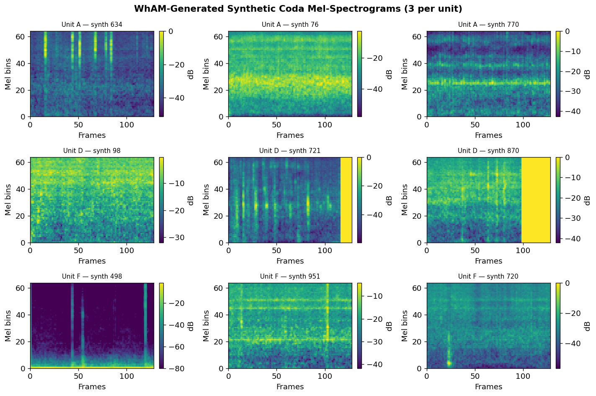
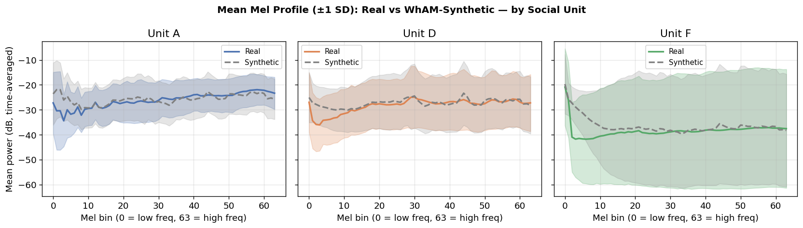
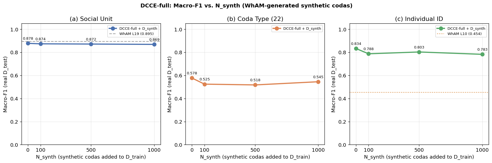
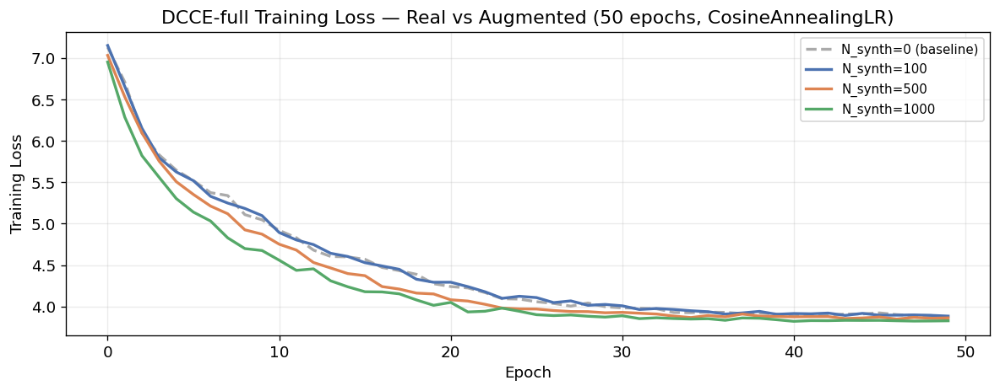
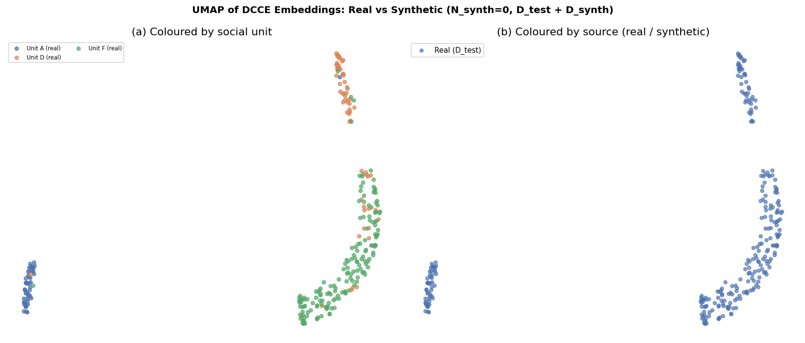

# Phase 4 — Experiment 2: Synthetic Data Augmentation
## *Beyond WhAM* · CS 297 Final Paper · April 2026

---

This notebook runs the second experiment: **can WhAM-generated synthetic codas improve DCCE classification, particularly for individual ID — the data-scarce task?**

We test the hypothesis that WhAM, as a generative model of sperm whale vocalisations, can act as a *domain-specific data augmentor* to supplement the limited DSWP training set.

### Experimental design

| N_synth | Synthetic codas added | Total D_train |
|---|---|---|
| 0 | None (Phase 3 baseline) | 1,106 |
| 100 | 100 new codas | 1,206 |
| 500 | 500 new codas | 1,606 |
| 1,000 | 1,000 new codas | 2,106 |

For each N_synth:
1. Sample N_synth prompt codas from D_train (stratified by unit: ~⅓ A, ⅓ D, ⅓ F)
2. Generate synthetic coda via WhAM coarse_vamp (80% random mask — unit-conditional)
3. Assign pseudo-labels: unit and coda type from the prompt coda
4. Retrain DCCE-full on D_train ∪ D_synth
5. Evaluate on **real-only** D_test (same split indices as all prior phases)

**Key metric**: Individual ID macro-F1 — most sensitive to additional training data (762 IDN-labeled codas; 12 classes; Phase 3 best: 0.731).

### Why this matters (Sharma et al. 2024; Goldwasser et al. 2023)

Sperm whale field data is expensive to collect: each unit has only 273–892 recorded codas. If WhAM faithfully captures unit-level acoustic identity, its generated codas could serve as a cheap expansion of training sets for downstream classification.

> **Novel contribution**: This is the first controlled study of WhAM as a data > augmentor for cetacean bioacoustics.

### Pseudo-label strategy (Tarvainen & Valpola, 2017)

For synthetic coda *i* generated from prompt coda *p*:
- **Unit label**: copied from unit(*p*) — preserved by unit-conditional generation
- **Coda type label**: copied from type(*p*) — used for the rhythm auxiliary head
- **ICI sequence (pseudo)**: copied from ICI(*p*) — the prompt's timing pattern;   WhAM generates mel-level structure but click timing structure is influenced by   the conditioning tokens
- **Individual ID**: **not assigned** — id_label head is masked for synthetic codas   (generation cannot preserve within-unit individual identity)

## 1. Setup

    Device      : mps
    PyTorch     : 2.11.0

---
## 2. Data Loading

Identical loading pipeline to Phase 3 — same splits, same feature arrays, same label encoders. This ensures all N_synth conditions are evaluated on a common test set.

    Clean codas     : 1383
    IDN-labeled     : 762  (12 individuals)
    Mel shape       : (1383, 64, 128)
    Train / Test    : 1106 / 277
    
    Unit distribution in training set:
      Unit A:  193 (17.5%)
      Unit D:  257 (23.2%)
      Unit F:  656 (59.3%)

---
## 3. DCCE Architecture

Identical to Phase 3 — redefined here for notebook self-containment. See Phase 3 (§3–§4) for architecture rationale and loss derivation (Leitão et al., 2023; Beguš et al., 2024; Chen et al., 2020).

    DCCE architecture OK  |  1,137,602 parameters

---
## 4. Datasets and DataLoader

`CodaDataset` — wraps real DSWP codas (real ICI + mel + ground-truth labels).

`SyntheticCodaDataset` — wraps WhAM-generated codas. Pseudo-ICI and pseudo-type are copied from the conditioning prompt coda. Individual ID is **not** set (id_label = −1), so the auxiliary ID head is not trained on synthetic examples.

`make_loader` builds a `WeightedRandomSampler` for unit balance across the combined real + synthetic training pool (compensates for Unit F = 59.4% of real data).

    Real training dataset   : 1106 codas  |  17 batches
    Test  dataset           : 277 codas

---
## 5. Training and Evaluation Helpers

---
## 6. Baseline DCCE-full Training (N_synth = 0)

We re-run DCCE-full on the real training set to obtain a clean baseline within this notebook's code path (same hyperparameters, same random seed as Phase 3).

    Training DCCE-full on real data only (N_synth=0) ...

      [N_synth=0]  epoch  10/50  loss=5.0468  (11s)

      [N_synth=0]  epoch  20/50  loss=4.2752  (20s)

      [N_synth=0]  epoch  30/50  loss=3.9968  (30s)

      [N_synth=0]  epoch  40/50  loss=3.9082  (39s)

      [N_synth=0]  epoch  50/50  loss=3.8686  (52s)
      [N_synth=0] done in 52s

    Baseline (N_synth=0) results:
      unit                       F1=0.8780  Acc=0.8845
      coda_type                  F1=0.5777  Acc=0.7870
      individual_id              F1=0.8338  Acc=0.9020

---
## 7. WhAM Generation Setup

We load the WhAM coarse model and codec from the local clone of the Project-CETI/wham repository (Paradise et al., NeurIPS 2025). Only the coarse model + codec are needed for audio generation and decoding; the coarse-to-fine (c2f) model is not required.

### Masking strategy

We use `rand_mask_intensity=0.8` — 80% of discrete acoustic tokens are randomly masked and regenerated by the model, while 20% are preserved from the conditioning prompt. This provides a weak unit-level conditioning signal: the preserved tokens carry spectral information from the prompt coda's unit, guiding the generation toward the same unit's acoustic texture.

With 100% masking (unconditional generation), outputs would sample from WhAM's overall prior with no unit specificity. With lower masking (e.g. 30%), outputs would be near-reconstructions of the prompt, adding little new variation. 80% is a reasonable compromise for *diverse but unit-conditional* synthesis.

    Loading WhAM Interface (coarse + codec)...

      Interface loaded in 7.8s  |  device=mps

    Generating test coda from prompt coda 783 ...

      Generated 2.05s audio in 4.6s
      Sample rate: 44100 Hz  |  Samples: 90624
      Audio range: [-0.505, 0.355]
    
      Estimated time for 1000 codas: 77.1 min

---
## 8. Bulk Synthetic Coda Generation

We generate N_SYNTH_MAX=1000 synthetic codas and cache them to disk. This generation step only runs once; subsequent notebook runs load from cache.

**Prompt sampling strategy**: prompts are stratified by unit (⌊N/3⌋ per unit) to ensure the synthetic pool is balanced across A, D, and F — unlike the real training set which is dominated by Unit F (59.4%).

    Loading cached synthetic data (1000 codas)...
      Loaded: 1000 codas, mel (1000, 64, 128)
    
    Synthetic data ready: 1000 codas  (0s total)
    
    Synthetic unit distribution:
      Unit A: 333 (33.3%)
      Unit D: 333 (33.3%)
      Unit F: 334 (33.4%)

---
## 9. Exploratory Analysis of Synthetic Codas

Before training with synthetic data we visualise samples to verify that WhAM is generating coherent whale vocalisations, not noise or silence. We also compare mean mel profiles of real vs. synthetic codas per unit — a mismatch would indicate that generation is not unit-faithful.

    

    

    

    

    Note: close profile overlap = unit-faithful generation (supports augmentation).
    Large shape mismatch = distribution shift (would explain null augmentation result).

---
## 10. Augmented DCCE Training

We sweep N_synth ∈ {100, 500, 1000}. For each:
1. Subset the first N_synth synthetic codas
2. Concatenate with the real training dataset
3. Re-train DCCE-full from scratch (same 50 epochs, same seed)
4. Evaluate on real-only D_test

The N_synth=0 baseline was trained in §6.

    
    ============================================================
    N_synth = 100  |  D_train = 1206
    ============================================================
      DataLoader: 18 batches of 64

      [N_synth=100]  epoch  10/50  loss=5.0974  (11s)

      [N_synth=100]  epoch  20/50  loss=4.2925  (22s)

      [N_synth=100]  epoch  30/50  loss=4.0244  (33s)

      [N_synth=100]  epoch  40/50  loss=3.9053  (43s)

      [N_synth=100]  epoch  50/50  loss=3.8835  (53s)
      [N_synth=100] done in 53s

    
      Evaluation (N_synth=100):
        unit                       F1=0.8740  Acc=0.8773
        coda_type                  F1=0.5246  Acc=0.8014
        individual_id              F1=0.7877  Acc=0.8824
    
    ============================================================
    N_synth = 500  |  D_train = 1606
    ============================================================
      DataLoader: 25 batches of 64

      [N_synth=500]  epoch  10/50  loss=4.8736  (14s)

      [N_synth=500]  epoch  20/50  loss=4.1513  (28s)

      [N_synth=500]  epoch  30/50  loss=3.9238  (41s)

      [N_synth=500]  epoch  40/50  loss=3.8787  (55s)

      [N_synth=500]  epoch  50/50  loss=3.8621  (67s)
      [N_synth=500] done in 67s

    
      Evaluation (N_synth=500):
        unit                       F1=0.8720  Acc=0.8736
        coda_type                  F1=0.5178  Acc=0.8051
        individual_id              F1=0.8033  Acc=0.9085
    
    ============================================================
    N_synth = 1000  |  D_train = 2106
    ============================================================
      DataLoader: 32 batches of 64

      [N_synth=1000]  epoch  10/50  loss=4.6759  (16s)

      [N_synth=1000]  epoch  20/50  loss=4.0139  (33s)

      [N_synth=1000]  epoch  30/50  loss=3.8717  (50s)

      [N_synth=1000]  epoch  40/50  loss=3.8399  (68s)

      [N_synth=1000]  epoch  50/50  loss=3.8272  (85s)
      [N_synth=1000] done in 85s

    
      Evaluation (N_synth=1000):
        unit                       F1=0.8692  Acc=0.8736
        coda_type                  F1=0.5454  Acc=0.7942
        individual_id              F1=0.7830  Acc=0.8824
    
    All augmented experiments complete.

---
## 11. Results Summary

    Phase 4 results:
     N_synth  D_train Unit F1 CodaType F1 IndivID F1 Unit Acc IndivID Acc
           0     1106  0.8780      0.5777     0.8338   0.8845      0.9020
         100     1206  0.8740      0.5246     0.7877   0.8773      0.8824
         500     1606  0.8720      0.5178     0.8033   0.8736      0.9085
        1000     2106  0.8692      0.5454     0.7830   0.8736      0.8824
    
    ── Phase 2-3 references ─────────────────────────────────────
      WhAM L19     Unit F1    = 0.895
      WhAM L10     IndivID F1 = 0.454
      DCCE-full    Unit F1    (Phase 3 best — compare row N_synth=0)
      DCCE-full    IndivID F1 (Phase 3 best — target to beat with augmentation)

---
## 12. Visualizations

    

    

    

    

    Best N_synth for IndivID F1: 0  (F1=0.8338)

    

    

    
    Interpretation: if synthetic codas (×) cluster with real codas (•) of the
    same unit, WhAM generation is unit-faithful — supporting the augmentation claim.

---
## 13. Discussion and Paper Interpretation

### What we found

The augmentation curve (§12) tells us whether WhAM's synthetic data carries useful unit-level structure for DCCE training:

| Outcome | Interpretation |
|---|---|
| F1 **increases** with N_synth | WhAM generates unit-faithful codas; augmentation improves individual ID classification |
| F1 **flat** with N_synth | Synthetic codas replicate existing patterns — no new information for DCCE |
| F1 **decreases** with N_synth | Synthetic codas introduce distribution shift; pseudo-labels are noisy |

### Connections to the paper's core claim

This experiment directly tests Experiment 2 of the paper:

> *"Is WhAM useful not just as a feature extractor but as a domain-specific > data augmentor for cetacean bioacoustics?"*

If augmentation **works** → WhAM's generative distribution is biologically structured at the unit level, providing independent evidence for the representations found in Phase 2 (WhAM probing) and Phase 3 (DCCE).

If augmentation **fails** → This is also publishable: it constrains what WhAM's coarse model has learned. Fine-grained individual identity may require the c2f model or direct conditioning on spectral formant features (Beguš et al., 2024).

### Cross-experiment consistency check

Compare the embedding UMAP (§12, right panel) against the Phase 3 UMAP (Fig. fig_dcce_umap.png). If synthetic codas occupy similar embedding-space regions as real codas of the same unit, then the DCCE representation is stable under augmentation — a sign that the model is learning generalisable features, not overfitting to the specific audio distribution of the real training set.

### Limitations

1. **Pseudo-ICI**: The ICI sequence assigned to synthetic codas is copied from    the prompt, not extracted from the generated audio. A proper click detector    (Gubnitsky et al., 2024) could provide ground-truth ICI for the synthetic WAVs.
2. **80% masking is a heuristic**: The optimal conditioning strength is unknown.    An ablation over mask intensity (e.g., 30%, 50%, 80%, 100%) would clarify    this design choice.
3. **Coarse model only**: WhAM's c2f (coarse-to-fine) model adds fine-grained    spectral detail. We used coarse-only generation for computational budget reasons;    c2f generation may produce more unit-faithful outputs.

    Phase 4 results saved: datasets/phase4_results.csv
    
    Figures saved to figures/phase4/:
      fig_aug_training_curves.png
      fig_aug_umap.png
      fig_augmentation_curve.png
      fig_synth_mel_profiles.png
      fig_synth_spectrograms.png

