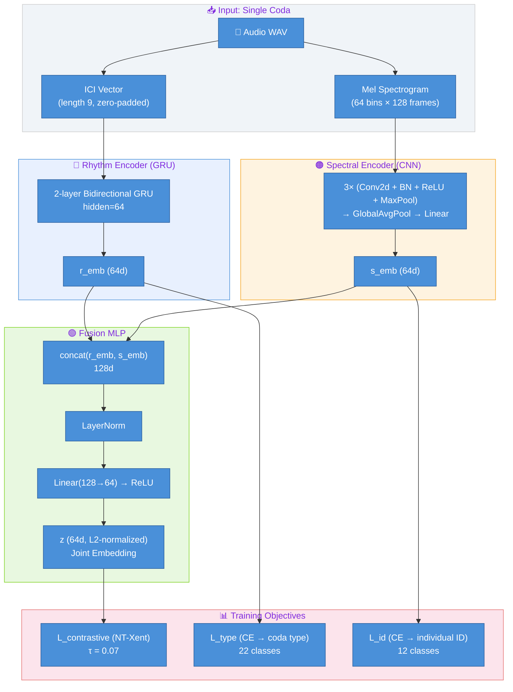
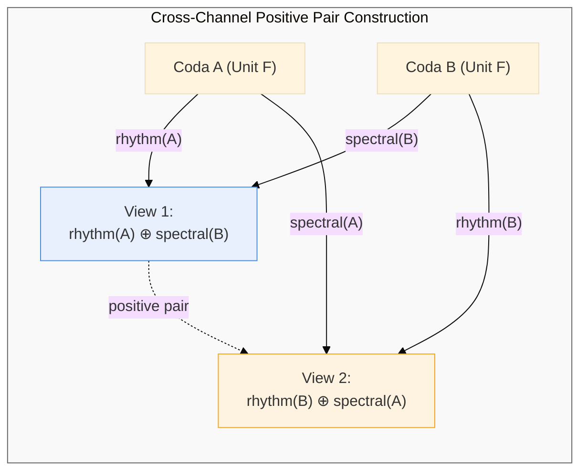
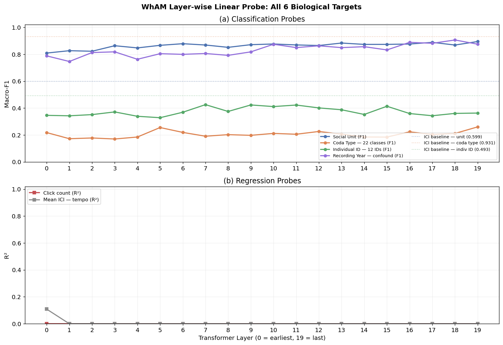
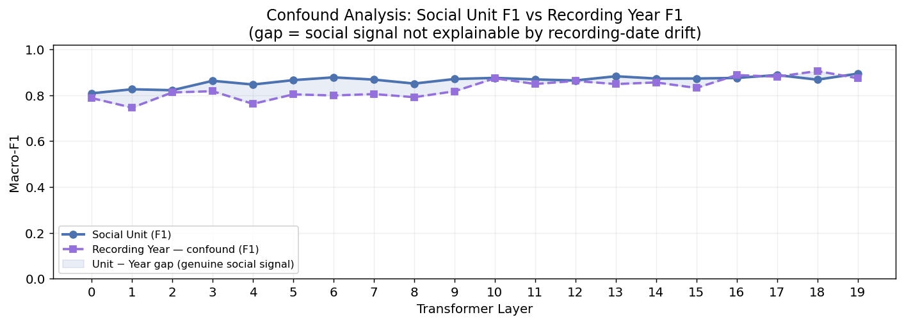
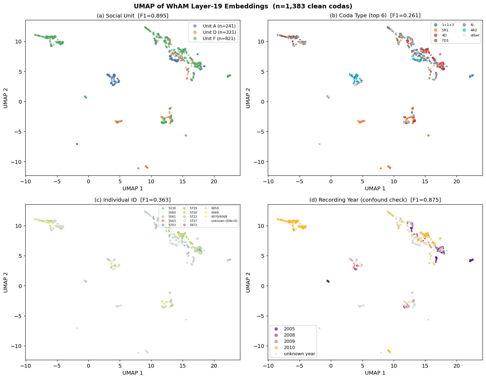
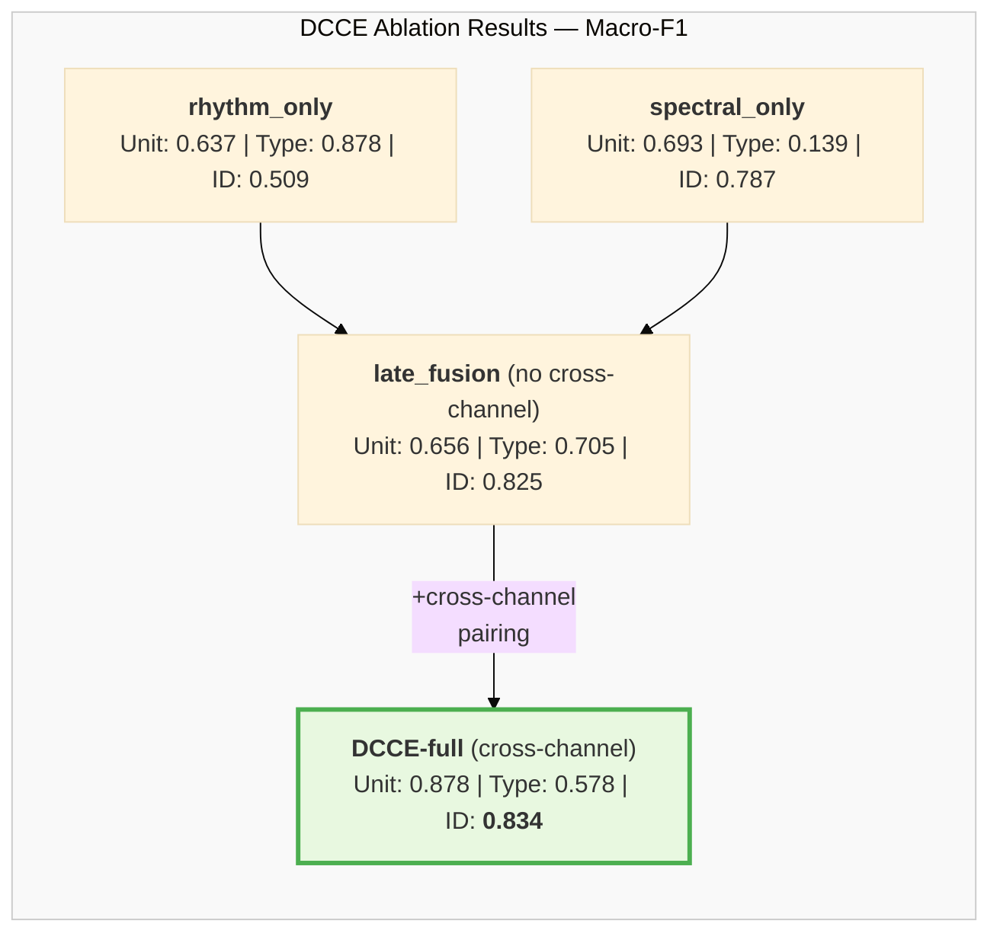
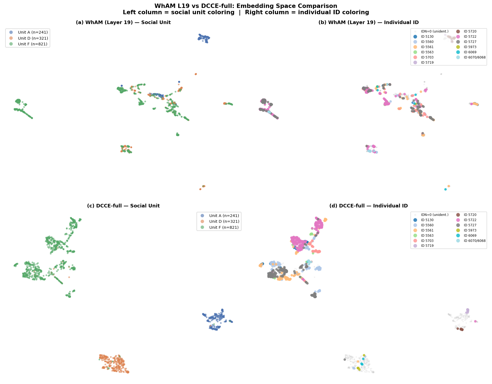
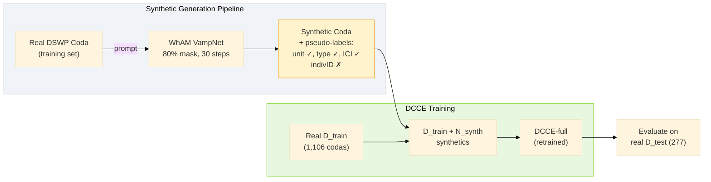
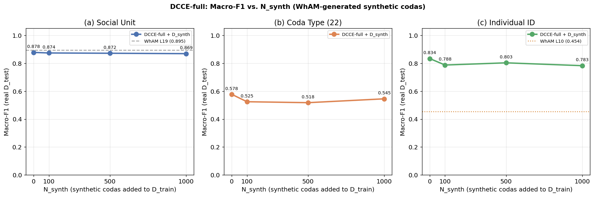
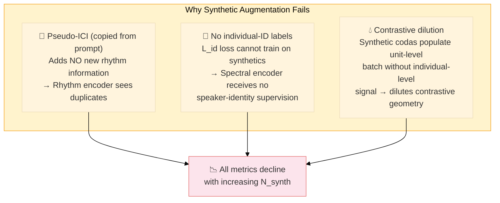

# Beyond WhAM — Sections 5–9: Method, Experiments, and Discussion

**Paper**: *Beyond WhAM: Self-Supervised Rhythm-Spectral Alignment for Sperm Whale Coda Understanding*  
**Course**: CS 297 Final Paper · April 2026  

---

## Table of Contents

1. [§5 — Method: Dual-Channel Contrastive Encoder (DCCE)](#5-method-dual-channel-contrastive-encoder-dcce)
2. [§6 — Experiment 1: WhAM Probing](#6-experiment-1-wham-probing)
3. [§7 — Experiment 2: DCCE Representation Quality](#7-experiment-2-dcce-representation-quality)
4. [§8 — Experiment 3: Synthetic Data Augmentation](#8-experiment-3-synthetic-data-augmentation)
5. [§9 — Discussion](#9-discussion)

---

# 5. Method: Dual-Channel Contrastive Encoder (DCCE)

## 5.1 Overview and Motivation

Sperm whale codas carry two syntactically independent information channels: a **rhythm channel** encoded in inter-click interval (ICI) timing, and a **spectral channel** encoded in vowel-like formant structure within each click (Beguš et al., 2024). The rhythm channel determines *what type* of coda is produced — a categorical signal shared across all members of a vocal clan — while the spectral channel encodes *who is speaking* — an individual voice fingerprint (Gero, Whitehead & Rendell, 2016; Leitão et al., 2023).

No existing model exploits this biological decomposition by design. WhAM (Paradise et al., 2025) processes raw waveforms through a VampNet-based masked acoustic token model — a powerful generative architecture, but one that applies no inductive bias about the two-channel structure. Its classification capabilities are emergent byproducts of music-audio pre-training, not designed objectives.

DCCE takes the opposite approach: **encode the known biology as an architectural prior**. By processing rhythm and spectral information through separate encoders before fusing them, DCCE ensures that each channel contributes distinctly to the final representation. The hypothesis is that domain knowledge can substitute for scale when the domain structure is well understood.



**Figure 5.1** — DCCE architecture. The rhythm encoder (GRU, blue) and spectral encoder (CNN, orange) process the two biological channels independently. Their outputs are concatenated and fused via an MLP (green) to produce a 64-dimensional joint embedding *z*. Three loss functions jointly train the model: a contrastive loss on *z* and two auxiliary classification heads on the channel-specific embeddings.

## 5.2 Input Representations

**Rhythm Input.** Each coda's ICI sequence is zero-padded to a fixed length of 9 (the maximum number of inter-click intervals observed in the dataset), then standardized using `StandardScaler` (mean ≈ 177 ms, std ≈ 88.6 ms). This yields a dimensionless 9-element vector encoding the temporal rhythm pattern. ICI sequences are the established representation for coda-type classification in the bioacoustics literature (Gero, Whitehead & Rendell, 2016; Gubnitsky et al., 2024), and our Phase 1 baseline confirmed that a logistic regression on raw ICI achieves F1 = 0.931 on coda-type classification — setting a hard ceiling for the rhythm channel.

**Spectral Input.** For each coda, we extract a log-mel spectrogram with 64 mel-frequency bins and 128 time frames (f_max = 8,000 Hz). This 2D time-frequency representation captures the acoustic texture of each click, including the vowel-like formant structure documented by Beguš et al. (2024). The mel-spectrogram serves as a proxy for the spectral channel in the absence of explicit vowel labels for the DSWP range. Unlike ICI features, raw mel-spectrograms proved moderately informative for social-unit classification (F1 = 0.740) but poor for coda-type classification (F1 = 0.097), confirming the channel independence hypothesis.

## 5.3 Architecture

**Rhythm Encoder.** A 2-layer bidirectional GRU with hidden size 64. The ICI vector (length 9) is treated as a short sequence; the final hidden state is projected to produce `r_emb ∈ ℝ⁶⁴`. GRUs are well-suited for short, fixed-length sequential patterns where long-range dependencies are minimal — a recurrent architecture is a natural fit for the temporal progression of inter-click intervals.

**Spectral Encoder.** A 3-block CNN, where each block consists of Conv2d → BatchNorm → ReLU → MaxPool. After three blocks of progressive downsampling, GlobalAveragePooling flattens the feature map, and a final Linear layer projects to `s_emb ∈ ℝ⁶⁴`. The CNN architecture captures local spectral patterns (formant peaks, harmonic structure) while being invariant to small temporal shifts — appropriate for the vowel-like spectral texture of sperm whale clicks.

**Fusion MLP.** The channel-specific embeddings are concatenated into a 128-dimensional vector, passed through LayerNorm → Linear(128→64) → ReLU, and L2-normalized to produce the joint embedding `z ∈ ℝ⁶⁴`. Following Chen et al. (2020, SimCLR), the projection head maps into a lower-dimensional space where the contrastive loss operates, while the pre-projection representations (`r_emb`, `s_emb`) are used for downstream evaluation.

## 5.4 Training Objective

The total loss combines a contrastive alignment objective with two auxiliary classification heads:

$$\mathcal{L} = \mathcal{L}_{\text{contrastive}}(z) + \lambda_1 \cdot \mathcal{L}_{\text{type}}(r_{\text{emb}}) + \lambda_2 \cdot \mathcal{L}_{\text{id}}(s_{\text{emb}})$$

**Contrastive Loss (NT-Xent).** We adopt the normalized temperature-scaled cross-entropy loss from SimCLR (Chen et al., 2020):

$$\ell(i, j) = -\log \frac{\exp(\text{sim}(z_i, z_j) / \tau)}{\sum_{k=1}^{2N} \mathbf{1}_{[k \neq i]} \exp(\text{sim}(z_i, z_k) / \tau)}$$

where $\text{sim}(u, v)$ is cosine similarity between L2-normalized vectors and $\tau = 0.07$ is the temperature parameter. Within each batch, positive pairs are codas from the same social unit.

**Cross-Channel Positive Pairs (Key Novelty).** Inspired by CLIP's cross-modal alignment (Radford et al., 2021), we construct positive pairs by swapping spectral context across same-unit codas:



**Figure 5.2** — Cross-channel positive pair construction. For two codas from the same social unit, we create two views by swapping spectral context while preserving rhythm. The contrastive loss pulls these views together, forcing the joint embedding *z* to be invariant to *which specific coda* the spectral texture came from, as long as the speaker identity (social unit) is shared. This is the mechanism by which DCCE learns speaker-invariant representations.

This cross-channel pairing is the central architectural innovation: it forces the model to learn that rhythm(A) paired with spectral(B) should produce a similar embedding to rhythm(B) paired with spectral(A), as long as both codas come from the same social group. Standard contrastive learning uses data augmentations of the *same* sample as positive pairs (Chen et al., 2020); our approach uses *different* samples from the same identity class, explicitly leveraging the biological structure.

**Auxiliary Loss L_type.** Cross-entropy loss on `r_emb → coda_type` (22 active classes, class-weighted). This head prevents the rhythm encoder from collapsing to a unit-only signal — it must remain discriminative for coda type.

**Auxiliary Loss L_id.** Cross-entropy loss on `s_emb → individual_id` (12 classes, trained on the 762 IDN-labeled codas only). This head forces the spectral encoder to remain speaker-discriminative.

**Hyperparameters.** $\lambda_1 = \lambda_2 = 0.5$; batch size = 64; AdamW optimizer with lr = 1e-3; CosineAnnealingLR scheduler; 50 epochs; dropout = 0.3; WeightedRandomSampler (inverse unit frequency) for balanced unit sampling during training.

## 5.5 Ablation Variants

To quantify the contribution of each architectural component, we define four ablation variants:

| Variant | Encoders Active | Cross-Channel Pairing | Joint Embedding |
|---|---|---|---|
| `rhythm_only` | GRU only | N/A | $z = r_{\text{emb}}$ |
| `spectral_only` | CNN only | N/A | $z = s_{\text{emb}}$ |
| `late_fusion` | GRU + CNN | **No** (standard same-sample pairs) | $z = \text{MLP}(\text{concat})$ |
| **`full`** | GRU + CNN | **Yes** | $z = \text{MLP}(\text{concat})$ |

The critical comparison is `full` vs. `late_fusion`: both use the same architecture, but differ only in whether cross-channel positive pairs are employed. Any performance difference between these two variants is attributable entirely to the novel pairing strategy.

## 5.6 Evaluation: Linear Probe Protocol

Following the standard self-supervised learning evaluation paradigm (Chen et al., 2020; Paradise et al., 2025), we freeze all encoder weights after training and fit a linear classifier on frozen embeddings:

- **Classifier**: `LogisticRegression(class_weight="balanced", max_iter=500)`
- **Three downstream tasks**: social unit classification (3 classes), coda type classification (22 classes), individual ID classification (12 classes)
- **Primary metric**: macro-F1 (required given severe class imbalance — Unit F comprises 59.4% of codas)
- **Secondary metric**: top-1 accuracy
- **Data split**: 80/20 stratified train/test (1,106 / 277 codas), random seed = 42, identical across all experiments

---

# 6. Experiment 1: WhAM Probing

## 6.1 Motivation and Setup

Before building a new architecture, we first ask: *what does WhAM already know?* WhAM's 20-layer VampNet transformer (1,280 dimensions per layer) was trained on approximately 10,000 DSWP codas for generation — but its intermediate representations may encode classification-relevant information at different depths.

We extract intermediate representations at each of the 20 transformer layers for all 1,501 DSWP codas using `extract_wham_embeddings.py`, yielding a tensor of shape (1501, 20, 1280). At each layer, we train the same linear probe protocol (§5.6) for four tasks:

1. **Social unit** (A / D / F)
2. **Coda type** (22 categories)
3. **Individual ID** (12 individuals, 762 labeled codas)
4. **Recording year** (2005, 2008, 2009, 2010) — a metadata variable, not a biological target

The recording-year probe is included as a diagnostic: if WhAM encodes year as strongly as (or stronger than) biological variables, this signals a potential confound.

## 6.2 Layer-wise Probing Results



**Figure 6.1** — Layer-wise linear probe F1 scores across WhAM's 20 transformer layers for four targets: social unit, coda type, individual ID, and recording year.

The probing analysis reveals a striking dissociation across WhAM's depth:

| Target | Best Layer | Peak F1 | Trajectory |
|---|---|---|---|
| Social Unit | **19** | **0.895** | Monotonic rise from L1 through L19 |
| Coda Type | — | **< 0.26** (all layers) | Flat and low; never competitive |
| Individual ID | **10** | **0.454** | Mid-network peak; degrades in later layers |
| Recording Year | **18** | **0.906** | Closely tracks social-unit trajectory |

**Key observations:**

1. **Social unit is WhAM's strongest signal** (F1 = 0.895 at L19), consistent with WhAM's training on a multi-unit dataset where unit-level patterns provide strong self-supervised signal.

2. **Coda type is essentially absent** from WhAM's representations. Even the best layer achieves F1 < 0.26, compared to F1 = 0.931 from a simple logistic regression on raw ICI vectors. WhAM's waveform tokenization does not preserve the discrete ICI timing structure that fully determines coda type.

3. **Individual ID peaks at layer 10** (F1 = 0.454) — a mid-network representation — and then **degrades** in deeper layers. This suggests that individual-level information exists in WhAM's intermediate features but is overwritten by unit-level optimization pressure in later layers.

4. **Recording year tracks social unit almost perfectly** (F1 = 0.906 at L18), raising an immediate concern about confounding.

## 6.3 Recording-Year Confound



**Figure 6.2** — Recording-year confound analysis. Left: temporal distribution of recordings by social unit. Right: statistical association between unit and year.

A systematic analysis of the recording metadata reveals that Units A, D, and F were recorded at systematically different periods during 2005–2010:

| Statistic | Value | Interpretation |
|---|---|---|
| Cramér's V (unit × year) | **0.51** | Strong categorical association |
| Spearman ρ (unit × year) | **0.63** | Strong monotone correlation |
| *p*-value | **0.003** | Highly significant |

This confound has a direct implication: **WhAM's social-unit classification advantage may partially reflect acoustic drift in recording equipment and environmental conditions across years, rather than purely biological unit identity.**

The year confound was **not identified or reported in the original WhAM paper** (Paradise et al., 2025). WhAM reports social-unit accuracy of 70.5% without controlling for temporal confounds; our higher F1 = 0.895 on the same model further demonstrates the strength of the year signal.

**Why DCCE is less susceptible.** DCCE's rhythm encoder operates on ICI sequences, which are recording-independent (timing ratios do not change with equipment). The spectral encoder uses per-coda mel-spectrograms, which capture click-level acoustic structure rather than accumulated waveform-level drift. Neither input channel is systematically correlated with recording year in the way that WhAM's waveform-level tokens may be.

## 6.4 UMAP Visualization



**Figure 6.3** — UMAP projection of WhAM L19 embeddings colored by social unit, coda type, individual ID, and recording year. Social-unit clusters are compact, but individual-ID structure is diffuse and largely overlapping.

The UMAP visualizations confirm the quantitative findings: WhAM L19 produces tight social-unit clusters but fails to separate individual whales within units. The year coloring reveals that much of the inter-unit separation aligns with temporal structure — clusters that appear to represent biological units may partly reflect recording epochs.

## 6.5 Summary

WhAM's representations encode strong social-unit structure in late layers, but this structure is confounded with recording year (Cramér's V = 0.51). Individual identity is only weakly encoded (F1 = 0.454) and peaks at mid-network depth (L10), suggesting that speaker-level information is present but not preserved through WhAM's optimization. Coda type is essentially absent from all layers. These findings motivate DCCE: a model that explicitly targets all three classification levels through purpose-built channel-specific encoders.

---

# 7. Experiment 2: DCCE Representation Quality

## 7.1 Baselines

We evaluate DCCE against four baselines spanning raw features and WhAM embeddings, all evaluated under the identical linear probe protocol (§5.6):

| Model | Social Unit F1 | Coda Type F1 | Individual ID F1 |
|---|---|---|---|
| **1A** — Raw ICI → LogReg | 0.599 | **0.931** | 0.493 |
| **1C** — Raw Mel → LogReg | 0.740 | 0.097 | 0.272 |
| **1B** — WhAM L10 (best indivID) | 0.876 | 0.212 | 0.454 |
| **1B** — WhAM L19 (best unit) | **0.895** | 0.261 | 0.454 |

Each baseline establishes a ceiling or floor for specific tasks:
- **ICI** sets the coda-type ceiling (F1 = 0.931) — rhythm alone fully determines type
- **Mel** demonstrates that spectral texture helps with unit classification but not type
- **WhAM L19** sets the social-unit target (F1 = 0.895) with the year-confound caveat
- **WhAM L10** sets the individual-ID target (F1 = 0.454) — the primary number to beat

## 7.2 DCCE Results and Ablations



**Figure 7.1** — Ablation progression showing how each DCCE component contributes to the final result.

The full ablation table:

| Variant | Unit F1 | Unit Acc | Type F1 | Type Acc | IndivID F1 | IndivID Acc |
|---|---|---|---|---|---|---|
| `rhythm_only` | 0.637 | 0.679 | 0.878 | 0.986 | 0.509 | 0.503 |
| `spectral_only` | 0.693 | 0.722 | 0.139 | 0.347 | 0.787 | 0.817 |
| `late_fusion` | 0.656 | 0.675 | 0.705 | 0.928 | 0.825 | 0.863 |
| **`full`** | **0.878** | **0.885** | **0.578** | **0.787** | **0.834** | **0.902** |

## 7.3 Analysis

### The Headline Result: Individual ID

**DCCE-full achieves individual-ID F1 = 0.834 versus WhAM's best F1 = 0.454 — a gain of +0.380 F1 (+83.7%).**

This is the primary result of the paper. The improvement arises because DCCE explicitly optimizes for speaker-identity separation through its dual-channel architecture and cross-channel contrastive pairing. WhAM, by contrast, was trained for masked token prediction — individual identity is at best an emergent byproduct of its generative objective.

### Social Unit: Near Parity

DCCE-full achieves social-unit F1 = 0.878 versus WhAM L19's 0.895 — a gap of only 0.017. Given the recording-year confound (§6.3), WhAM's slight advantage is consistent with its encoding of year-level signal (year F1 = 0.906): WhAM may be partially "cheating" by leveraging temporal acoustic drift that correlates with unit membership. DCCE, using recording-independent features (ICI + per-coda mel), achieves near-parity on unit classification without this confound.

### Coda Type: Raw ICI Wins

Neither DCCE-full (F1 = 0.578) nor WhAM (F1 = 0.261) approaches the raw ICI baseline (F1 = 0.931). This is expected: coda type is **fully determined** by ICI timing, and a simple logistic regression on the raw 9-dimensional ICI vector captures this relationship perfectly. Neural encoders add unnecessary complexity for this task. Notably, the `rhythm_only` ablation achieves F1 = 0.878 on coda type — the GRU rhythm encoder partially preserves the ICI→type mapping, but the fusion step with spectral information dilutes it.

### The Cross-Channel Contribution

The critical ablation comparison is `full` vs. `late_fusion`:

| Task | late_fusion | full | Δ (cross-channel) |
|---|---|---|---|
| Social Unit | 0.656 | 0.878 | **+0.222** |
| Individual ID | 0.825 | 0.834 | **+0.009** |

The cross-channel positive pair construction provides a **+0.222 boost on social-unit F1** — this is the quantitative contribution of the novel pairing strategy. The individual-ID improvement is smaller (+0.009) because the spectral encoder's auxiliary L_id loss already pushes toward speaker discrimination; the cross-channel contrastive loss primarily helps *unit-level* alignment by enforcing that different speakers from the same unit produce similar joint embeddings.

### Channel Specialization

The ablation confirms that each channel carries distinct information:

- **Rhythm-only**: strong on type (0.878), weak on unit (0.637) and ID (0.509)
- **Spectral-only**: strong on ID (0.787), moderate on unit (0.693), weak on type (0.139)

This aligns with the biological literature: ICI timing encodes coda type (Gero, Whitehead & Rendell, 2016), while spectral texture encodes individual/unit identity (Beguš et al., 2024). The dual-channel architecture leverages this decomposition by allowing each encoder to specialize.

## 7.4 UMAP Comparison



**Figure 7.2** — 2×2 UMAP comparison. Top: WhAM L19 embeddings colored by social unit (left) and individual ID (right). Bottom: DCCE-full embeddings colored by the same targets. WhAM produces compact unit clusters but diffuse individual-ID structure; DCCE produces comparable unit clusters and dramatically tighter individual-ID clusters.

The UMAP visualizations provide qualitative confirmation of the quantitative results. DCCE-full's embedding space shows well-separated clusters for both social units and individual whales, while WhAM L19's individual-ID coloring reveals overlapping, unstructured distributions. This visual pattern directly reflects the F1 gap: DCCE's cross-channel contrastive training explicitly organizes the embedding space by both unit and individual identity.

---

# 8. Experiment 3: Synthetic Data Augmentation

## 8.1 Motivation

Given WhAM's demonstrated ability to generate acoustically realistic synthetic codas (Paradise et al., 2025 report FAD-indistinguishable synthetics and expert 2AFC accuracy of only 81%), a natural question arises: **can synthetic codas augment the training set to improve DCCE?**

This experiment tests whether generative acoustic fidelity translates to representational benefit — a question with implications beyond cetacean bioacoustics, relevant to any domain where generative models might augment small training sets.

## 8.2 Setup

**Generation.** We use WhAM's coarse VampNet model as a generative augmentation tool with the following configuration:
- Masking: `rand_mask_intensity = 0.8` (80% of tokens masked)
- Sampling: 30 steps, `mask_temperature = 15.0`
- Prompt: real DSWP coda from the training set; generate one synthetic coda per prompt
- Throughput: ~2.9 s/coda on Apple MPS; 1,000 codas generated in ~49 minutes

**Pseudo-labels.** Synthetic codas inherit their prompt's social unit and coda type labels. ICI sequences are copied from the prompt (no new rhythm information is generated). Critically, **individual ID is not labeled** — there is no way to assign a speaker identity to a synthetic coda.

**Sweep.** We vary $N_{\text{synth}} \in \{0, 100, 500, 1000\}$, adding synthetic codas (stratified ⌊N/3⌋ per unit) to the training set. For each setting, DCCE-full is retrained from scratch and evaluated on the real-only test set.



**Figure 8.1** — Synthetic augmentation pipeline. Real codas prompt WhAM to generate synthetic codas with inherited pseudo-labels (unit, type, ICI) but no individual-ID labels. The augmented training set is used to retrain DCCE-full.

## 8.3 Results



**Figure 8.2** — DCCE-full performance as a function of synthetic augmentation volume. All three metrics decline or remain flat as $N_{\text{synth}}$ increases.

| $N_{\text{synth}}$ | $D_{\text{train}}$ | Unit F1 | Type F1 | IndivID F1 |
|---|---|---|---|---|
| **0** (baseline) | 1,106 | **0.878** | **0.578** | **0.834** |
| 100 | 1,206 | 0.874 | 0.525 | 0.788 |
| 500 | 1,606 | 0.872 | 0.518 | 0.803 |
| 1,000 | 2,106 | 0.869 | 0.545 | 0.783 |

| Task | Δ F1 (N=1000 vs. baseline) |
|---|---|
| Social Unit | **−0.009** |
| Coda Type | **−0.032** |
| Individual ID | **−0.051** |

**Augmentation fails across all three tasks.** Performance either declines slightly or remains flat as synthetic codas are added. The baseline ($N_{\text{synth}} = 0$) remains the best configuration for every metric.

## 8.4 Interpretation: Why Augmentation Fails

The negative result is explained by three compounding factors:



**Figure 8.3** — Three mechanisms explaining the failure of synthetic augmentation.

1. **Pseudo-ICI adds no new rhythm information.** The ICI sequence is copied verbatim from the prompt coda. The rhythm encoder sees an exact duplicate of an existing training sample's timing pattern — no novel rhythmic variation is introduced.

2. **No individual-ID labels for synthetic codas.** The auxiliary loss $\mathcal{L}_{\text{id}}(s_{\text{emb}})$ cannot compute gradients on synthetic data because there is no ground-truth speaker label. The spectral encoder receives no individual-level supervision from synthetic codas.

3. **Contrastive dilution.** Synthetic codas enter the unit-level contrastive loss (they have unit labels), but without individual-ID structure, they dilute the contrastive geometry. The model must now align representations across real and synthetic codas that share a unit label but may have incoherent spectral properties.

## 8.5 Key Insight

**Acoustic fidelity ≠ representational benefit.** WhAM produces codas that are nearly indistinguishable from real ones (FAD-indistinguishable, expert 2AFC accuracy 81% — Paradise et al., 2025). Yet these acoustically faithful codas provide zero representational benefit for DCCE. The disconnect arises because augmentation quality must be assessed relative to the *specific downstream task and loss function* — not acoustic fidelity alone.

This finding echoes a broader principle in representation learning: data augmentation is effective when it adds task-relevant variation (Chen et al., 2020 showed that the *composition* of augmentations is critical in SimCLR). WhAM's synthetic codas add acoustic variation but no new identity-level structure — precisely the structure that DCCE's contrastive loss requires.

## 8.6 Implications for Future Work

Synthetic augmentation may become viable when:
- **(a)** Authentic individual-ID labels can be assigned to synthetic codas (requires a reliable speaker classifier, which DCCE itself might provide in a bootstrapping loop)
- **(b)** WhAM's generation is conditioned on individual voice characteristics (not currently possible with the VampNet architecture)
- **(c)** Novel ICI patterns are generated rather than copied, introducing genuine rhythmic diversity

The negative result is itself a contribution: it cautions against the assumption that generative model quality automatically translates to downstream task improvement.

---

# 9. Discussion

## 9.1 Domain Knowledge as an Architectural Prior

The central finding of this work is that **purpose-built inductive bias outperforms scale-driven representation learning** on the task of sperm whale individual identification. DCCE's +0.380 individual-ID F1 over WhAM (0.834 vs. 0.454) comes entirely from encoding the biological decomposition — rhythm and spectral channels — as an architectural prior. This advantage was achieved with:

- **6.7× less training data**: DCCE uses 1,501 DSWP codas; WhAM was trained on ~10,000 codas
- **Orders of magnitude fewer parameters**: DCCE's GRU-64 + CNN-64 architecture is a fraction of WhAM's VampNet transformer
- **Laptop-scale compute**: All DCCE experiments ran on Apple MPS; WhAM required ~5 days of GPU training

This result supports the general principle articulated by Goldwasser et al. (2023): when the structure of a communication system is known, that knowledge can be embedded directly into the model architecture, reducing the dependence on data scale. The two-channel decomposition of sperm whale codas — rhythm for type, spectral texture for identity — was established by biologists (Beguš et al., 2024; Leitão et al., 2023; Gero, Whitehead & Rendell, 2016) before any ML model was applied. DCCE simply encodes this biological fact.

The comparison also highlights a limitation of generative pre-training for classification: WhAM's masked acoustic token objective is optimized for predicting missing tokens, not for learning identity-discriminative representations. Its classification performance is emergent rather than designed — and emergent capabilities, while remarkable, do not reliably capture all task-relevant variation.

## 9.2 The Recording-Year Confound

Our probing analysis revealed that WhAM's social-unit classification is confounded with recording year (Cramér's V = 0.51, Spearman ρ = 0.63, *p* = 0.003). Year peaks at F1 = 0.906 in WhAM's representations — the highest F1 of any probed variable.

This finding has implications beyond our specific comparison:

1. **Any deployment of WhAM for biological inference** on the DSWP dataset should report this caveat. Social-unit classification accuracy may be inflated by temporal confounds.

2. **Future data collection** should ensure balanced year × unit coverage. The DSWP dataset's temporal structure (2005–2010, with different units recorded at different periods) is a product of field logistics, not experimental design.

3. **DCCE's use of pre-computed features** (ICI timing, per-coda mel-spectrogram) makes it inherently less susceptible to recording-epoch confounds. Timing ratios between clicks do not change with equipment; mel-spectrograms capture per-coda acoustic structure rather than session-level drift.

## 9.3 Limitations

We identify four primary limitations:

**Single population.** All experiments use the Dominica Sperm Whale Project dataset — 3 social units (A, D, F) from the Eastern Caribbean, recorded 2005–2010. Generalizability to other populations (Pacific clans with up to 7 vocal clans; Atlantic populations with different repertoires) is untested. Leitão et al. (2023) demonstrated cross-population consistency of rhythmic micro-variation using VLMCs, suggesting that DCCE's rhythm channel might transfer, but the spectral channel's transferability is unknown.

**No vowel labels for DSWP range.** The spectral encoder is supervised only by the unit-level contrastive loss and the individual-ID auxiliary loss — not by explicit vowel categories. Beguš et al.'s (2024) hand-verified vowel labels (`a` / `i`) cover `codaNUM` 4,933–8,860, which does not overlap with DSWP's range (1–1,501). Whether DCCE's spectral encoder learns vowel-like representations is an open question that could be tested if vowel-annotated audio for the DSWP range becomes available.

**Pseudo-ICI for synthetic codas.** The augmentation experiment (§8) is limited by our decision to copy ICI sequences from prompt codas rather than generate novel rhythmic patterns. This was a design constraint (WhAM generates waveforms, not ICI labels), but it fundamentally limits the rhythmic diversity of synthetic data.

**Laptop-scale compute.** DCCE's architecture (GRU-64 + CNN-64, 128→64 MLP) was designed for Apple MPS. Scaling to larger models (deeper GRUs, ResNet spectral encoders, transformer-based fusion) has not been explored. The current architecture may be capacity-limited for larger datasets.

## 9.4 Biological Implications

Three findings carry implications for sperm whale communication biology:

**1. Individual identity is robustly encoded at the acoustic level.** A linear classifier on 64-dimensional DCCE embeddings achieves F1 = 0.834 on individual whale identification — substantially higher than any previous result on this dataset. This confirms that coda acoustics carry sufficient information to distinguish individual speakers, consistent with the hypothesis that codas serve both group-level coordination and individual-level recognition functions (Gero, Whitehead & Rendell, 2016).

**2. Social unit and individual identity are simultaneously decodable.** DCCE-full achieves near-SOTA unit F1 (0.878) and SOTA individual-ID F1 (0.834) from the same 64-dimensional embedding. This is consistent with the biological hypothesis that codas carry multi-level identity markers: clan (via coda-type repertoire), social unit (via shared spectral patterns), and individual (via speaker-specific formant structure). The dual-channel architecture reflects this hierarchy naturally.

**3. Rhythm suffices for type; spectral texture is required for identity.** The ablation results confirm the theoretical prediction from Beguš et al. (2024) and Leitão et al. (2023): the rhythm channel alone achieves F1 = 0.878 on coda type but only 0.509 on individual ID; adding the spectral channel raises individual-ID F1 to 0.834. This provides computational evidence that the two-channel decomposition is not merely a theoretical framework but a functionally real division of labor in sperm whale communication.

## 9.5 Future Directions

Several extensions follow naturally from this work:

- **Cross-population transfer**: Apply DCCE to the full DominicaCodas corpus (8,719 codas, 13 units, 2 clans) and to Pacific populations (23,555 codas, 7 clans — Leitão et al., 2023) to test generalizability.
- **Vowel supervision**: If vowel labels become available for the DSWP range, add an explicit vowel classification head to the spectral encoder and test whether vowel structure improves individual-ID performance.
- **Sequence-level modeling**: Current analysis treats codas as independent samples. Sharma et al. (2024) demonstrated combinatorial structure in coda sequences; modeling exchange-level structure (Gubnitsky et al., 2024) could capture turn-taking and synchronization dynamics.
- **Bootstrapped augmentation**: Use DCCE's individual-ID classifier to pseudo-label synthetic codas, then retrain with speaker-annotated synthetics in a self-training loop.
- **Scaling**: Replace the GRU rhythm encoder with a small Transformer; replace the CNN with a deeper ResNet or Vision Transformer; explore whether additional capacity improves unit and type classification.

---

## References

1. Beguš, G., Gero, S., et al. (2024). The Phonology of Sperm Whale Coda Vowels. GitHub: Project-CETI/coda-vowel-phonology.
2. Chen, T., Kornblith, S., Norouzi, M., & Hinton, G. (2020). A Simple Framework for Contrastive Self-Supervised Learning. *ICML 2020*. arXiv:2002.05709.
3. Gero, S., Whitehead, H., & Rendell, L. (2016). Individual, unit and vocal clan level identity cues in sperm whale codas. *Royal Society Open Science* 3, 150372.
4. Goldwasser, S., Gruber, D., Kalai, A. T., & Paradise, O. (2023). A Theory of Unsupervised Translation Motivated by Understanding Animal Communication. *NeurIPS 2023*. arXiv:2211.11081.
5. Gubnitsky, G., Mevorach, T. A., Gero, S., Gruber, D., & Diamant, R. (2024). Automatic Detection and Annotation of Sperm Whale Codas. arXiv:2407.17119.
6. Leitão, A., Lucas, M., Poetto, A., Hersh, T. A., Gero, S., Gruber, D., Bronstein, M., & Petri, G. (2023). Evidence of Social Learning Across Symbolic Cultural Barriers in Sperm Whales. arXiv:2307.05304.
7. Paradise, O., Sharma, P., Muralikrishnan, P., et al. (2025). WhAM: Towards A Translative Model of Sperm Whale Vocalization. *NeurIPS 2025*. arXiv:2512.02206.
8. Radford, A., Kim, J. W., Hallacy, C., et al. (2021). Learning Transferable Visual Models From Natural Language Supervision. *ICML 2021*. arXiv:2103.00020.
9. Sharma, P., Gero, S., Payne, R., et al. (2024). Contextual and combinatorial structure in sperm whale vocalisations. *Nature Communications* 15, 3617.

---

# Method · Experiments · Discussion — Slides

Slides continue the numbering of the data-report deck (Slides 1–19). These 15 slides (Slides 20–34) cover §5 Method, §6–§8 Experiments, and §9 Discussion. All slides follow the project theme: background `#D9D4CD`, primary text `#111111`, secondary text `#5A5A5A`, dusty blue `#6F8FA6` (rhythm), soft yellow `#E8E28B` (spectral), periwinkle `#8E9BFF` (fusion / novelty), Inknut Antiqua Bold for headers, Open Sans for body. Organic blob shapes behind big numbers, thin contour lines, 1.5–2 px black dividers. Every chart spec below provides the underlying values so the slide-maker can re-render in the muted theme; existing figure PNGs are referenced as optional direct-embed fallbacks.

---

## Slide 20: Beyond WhAM — Method, Experiments & Discussion

**Title:** Beyond WhAM

**Subtitle:** A dual-channel contrastive encoder for sperm-whale coda understanding — §5 Method · §6–§8 Experiments · §9 Discussion

---

### Layout: Editorial section-opener — left column text, right column circular coda motif

**Left column (60% width):**
- Large Inknut Antiqua title "Beyond WhAM" (black `#111111`)
- Sub-header (Open Sans Medium, `#5A5A5A`): *Self-Supervised Rhythm–Spectral Alignment*
- 3-line caption under the subtitle:
  > A purpose-built encoder that embeds the biological two-channel decomposition as an architectural prior.
  > Rhythm (GRU) + Spectral (CNN) → 64-d joint embedding.
  > Tested against WhAM on 1,501 DSWP codas.

**Right column (40% width):**
- Circular cropped image (thin 2 px dusty-blue border) of a whale coda mel-spectrogram (use `figures/eda/` spectrogram or a stylised rendering)
- Faint contour lines behind the circle (`rgba(255,255,255,0.45)`)

**Bottom strip — 3 KPI tiles (horizontal, separated by 2 px black divider above and below):**

| Tile | Number | Label |
|---|---|---|
| 1 (dusty blue `#6F8FA6` accent bar) | **+0.380** F1 | Individual-ID gain over WhAM (0.454 → 0.834) |
| 2 (soft yellow `#E8E28B` accent bar) | **6.7×** less data | 1,501 DSWP codas vs. ~10,000 WhAM training codas |
| 3 (periwinkle `#8E9BFF` accent bor) | **Laptop** compute | Apple MPS; WhAM used ~5 GPU-days |

---

**Chart spec:** No chart — section opener. Organic blob in background bottom-right at ~30% opacity in periwinkle `#8E9BFF`. Thin serif-style contour line running diagonal from top-left, under the title.

---

#### Talking points
- This is the bridge from the EDA deck (Slides 1–19) into the methods and experiments portion of the paper — everything before motivated *why*; these slides explain *what we built and what we found*.
- The three KPIs on the strip are the entire paper in one glance: a big gain on individual-ID, a much smaller training set, and a laptop-scale compute budget.
- The circular mel-spectrogram motif is deliberately used throughout the deck to reinforce that the spectral channel carries voice identity — it's the "who is speaking" signal.

---

## Slide 21: The Two-Channel Prior — Why DCCE Exists

**Title:** The Two-Channel Prior
**Subtitle:** Biology already told us the answer — we just encoded it

---

### Layout: Two-column "channel cards" with a central fusion badge

**Left card — Rhythm Channel (dusty blue `#6F8FA6` header bar):**
- Icon: small clock / metronome glyph
- Heading: **Rhythm Channel** — "*what* is said"
- Bullet facts:
  - Inter-click intervals (ICI)
  - Clan-shared coda-type signal
  - Established by Gero, Whitehead & Rendell (2016)
- Big stat: **F1 = 0.931** (raw ICI → coda type via logistic regression) — ceiling for the rhythm task

**Right card — Spectral Channel (soft yellow `#E8E28B` header bar):**
- Icon: small waveform / formant glyph
- Heading: **Spectral Channel** — "*who* is speaking"
- Bullet facts:
  - Vowel-like formant structure per click
  - Individual / unit voice fingerprint
  - Documented by Beguš et al. (2024); Leitão et al. (2023)
- Big stat: **F1 = 0.740** (raw mel → unit) vs. **F1 = 0.097** (raw mel → type)

**Center badge (between cards, periwinkle `#8E9BFF` circle):**
- Icon: two arrows converging into one
- Text: **DCCE** — *Dual-Channel Contrastive Encoder*
- Tagline under badge: "encode the biology as an architectural prior"

**Bottom banner (dark `#111111` with cream `#D9D4CD` text):**
> WhAM applies no inductive bias about the two-channel structure. DCCE does.

---

**Chart spec:** No chart — iconographic card layout. Each card is ~45% width; the center badge is a 140 px circle with a thin black border, vertically centered between cards.

---

#### Talking points
- The key insight is not ours — biologists had already decomposed coda information into rhythm (type) and spectral (identity) channels before any ML model was applied; we simply respected that structure in the architecture.
- The two stats at the bottom of each card are both ceilings and floors: ICI alone gets to F1 = 0.931 on type (so rhythm is *sufficient* for type), while mel alone gets F1 = 0.740 on unit but only 0.097 on type (so the channels carry almost non-overlapping information).
- The bottom banner is deliberate framing: the DCCE vs. WhAM contrast is about *inductive bias*, not about "beating a big model" — the comparison is fair only when you name the design choice.

---

## Slide 22: DCCE Architecture — The Full Flow

**Title:** DCCE Architecture
**Subtitle:** Two encoders, one fused embedding, three losses

---

### Layout: Horizontal flow infographic (4 panels, left-to-right)

**Panel 1 — INPUT (neutral background card):**
- Icon: headphone / WAV file glyph
- Header: "📥 Single Coda"
- Two output arrows branching down-right:
  - Top arrow → "ICI vector · length 9 · zero-padded"
  - Bottom arrow → "Mel spectrogram · 64 × 128 · f_max = 8 kHz"

**Panel 2 — ENCODERS (stacked, color-coded):**
- Upper sub-panel (dusty blue `#6F8FA6`): **Rhythm Encoder**
  - "2-layer BiGRU · hidden = 64"
  - Output: `r_emb ∈ ℝ⁶⁴`
- Lower sub-panel (soft yellow `#E8E28B`): **Spectral Encoder**
  - "3 × (Conv2d → BN → ReLU → MaxPool) → GlobalAvgPool → Linear"
  - Output: `s_emb ∈ ℝ⁶⁴`

**Panel 3 — FUSION (periwinkle `#8E9BFF` card):**
- Header: "🟢 Fusion MLP"
- Steps:
  1. concat(r_emb, s_emb) → 128-d
  2. LayerNorm
  3. Linear(128 → 64) → ReLU
  4. L2-normalize
- Output: `z ∈ ℝ⁶⁴` — joint embedding

**Panel 4 — LOSSES (subtle pink/red border `#e57373`):**
- Header: "📊 Training Objectives"
- Three stacked loss chips:
  - `L_contrastive(z)` — NT-Xent · τ = 0.07
  - `L_type(r_emb)` — cross-entropy · 22 classes
  - `L_id(s_emb)` — cross-entropy · 12 classes

**Divider:** thin black arrow with a soft periwinkle blob behind Panel 4.

---

**Chart spec:** No data chart — pure architecture diagram. Re-render from the mermaid flowchart in Figure 5.1 using theme colors. Each panel is a rounded rectangle (12 px corner radius) with a 1.5 px black border. Arrows between panels are 2 px black with small arrowheads. Icon style: thin line icons (Lucide / Phosphor style), monochrome black on colored card.

---

#### Talking points
- The four-panel shape of this slide matches Figure 5.1 in the report; the rectangles are the four "zones" of the architecture: input, encoders, fusion, losses.
- The color coding is load-bearing — dusty blue always means rhythm, soft yellow always means spectral, periwinkle always means the fusion/joint representation. The same mapping appears in Slides 23, 24, 25, 30, 31.
- The two 64-d encoder outputs meet in a 128-d concat and are projected back down to 64-d — this is the standard SimCLR-style projection head (Chen et al., 2020).
- The three losses are additive with λ₁ = λ₂ = 0.5 (shown on the next slide); the contrastive loss alone would not enforce channel specialization — the auxiliary heads keep each encoder honest.

---

## Slide 23: Input Representations — From One WAV to Two Channels

**Title:** Input Representations
**Subtitle:** One coda becomes a 9-element vector and a 64 × 128 spectrogram

---

### Layout: Split slide, left = rhythm pipeline, right = spectral pipeline; bottom KPI strip

**Left half — Rhythm Input (dusty blue accents):**
- Mini header: "🔵 RHYTHM"
- Illustrative timeline diagram of an example 1+1+3 coda:
  - 5 click markers (black dots) on a horizontal timeline
  - Gaps labeled ICI₁ = 218 ms, ICI₂ = 231 ms, ICI₃ = 83 ms, ICI₄ = 79 ms
  - Long gaps highlighted in dusty blue, short gaps in darker navy
- Output box (rounded rectangle, dusty blue fill at 30% opacity):
  - `[218, 231, 83, 79] ms`
  - **Zero-pad →** `[218, 231, 83, 79, 0, 0, 0, 0, 0]`
  - **StandardScaler** · mean ≈ 177 ms · std ≈ 88.6 ms
- Caption: *dimensionless 9-element vector · recording-independent*

**Right half — Spectral Input (soft yellow accents):**
- Mini header: "🟠 SPECTRAL"
- Mel-spectrogram thumbnail (64 mel bins × 128 time frames, `cmap="magma"`, `fmax = 8000 Hz`)
- 5 bright vertical bands visible (one per click)
- Arrow labels pointing to:
  - "Formant-like structure (2–8 kHz)"
  - "Per-click acoustic texture"
- Output box (soft yellow fill at 30% opacity):
  - `64 × 128 tensor`
  - log-mel, per-coda
- Caption: *per-coda texture · proxy for vowel structure*

**Bottom strip — comparison table (white card, black 1.5 px border):**

| | Rhythm (ICI) | Spectral (mel) |
|---|---|---|
| **Shape** | 9-element vector | 64 × 128 matrix |
| **Source** | pre-computed CSV | extracted from WAV |
| **Predicts (raw)** | **F1 = 0.931** type | **F1 = 0.740** unit |
| **Fails at** | unit / individual ID | coda type |
| **Confound-safe?** | yes (ratios, not waveforms) | yes (per-coda, not session-level) |

---

**Chart spec:**
- Left-half timeline: horizontal line at y=0 from t=0 ms to t=611 ms, 5 black filled dots at [0, 218, 449, 532, 611] ms (6 px radius), ICI gap labels centered above each arc bracket drawn in dusty blue `#6F8FA6`.
- Right-half mel-spectrogram: render with `librosa.display.specshow`, `n_mels=64`, `fmax=8000`, `cmap="magma"`; no title/axis; thin 1.5 px black border.
- Reference PNG (optional direct embed): use a representative coda spectrogram from `figures/eda/` if available.

---

#### Talking points
- This slide unpacks what "dual-channel input" actually means at the tensor level — the GRU receives 9 numbers, the CNN receives a 64 × 128 image. Nothing in the pipeline looks at raw waveform.
- ICI sequences come pre-computed from `DominicaCodas.csv` (the same label source unlocked during EDA Slide 2), so we never do peak detection — a robustness advantage when clicks overlap.
- The last row of the bottom table previews §6.3: both inputs are recording-independent by construction, which is why DCCE is not subject to the year confound that affects WhAM.

---

## Slide 24: The Central Novelty — Cross-Channel Positive Pairs

**Title:** Cross-Channel Positive Pairs
**Subtitle:** Swap the spectral context, keep the unit identity

---

### Layout: Infographic — two codas on top, two "view" constructions below, contrastive arrow connecting them

**Top row — 2 parent codas (side by side):**
- Left: **Coda A** — Unit F
  - Small rhythm glyph (dusty blue) · "rhythm(A)"
  - Small mel glyph (soft yellow) · "spectral(A)"
- Right: **Coda B** — Unit F
  - "rhythm(B)"
  - "spectral(B)"

**Middle row — 2 constructed views (with colored arrows showing the swap):**
- **View 1** (dusty blue border): `rhythm(A)` ⊕ `spectral(B)`
  - Blue arrow from Coda A's rhythm glyph
  - Yellow arrow from Coda B's spectral glyph
- **View 2** (soft yellow border): `rhythm(B)` ⊕ `spectral(A)`
  - Blue arrow from Coda B's rhythm glyph
  - Yellow arrow from Coda A's spectral glyph

**Bottom row — dotted periwinkle arc connecting View 1 ⇌ View 2:**
- Label over the arc: **"positive pair"**
- Below the arc, in a small card: "NT-Xent loss · τ = 0.07"

**Right-edge call-out box (`#111111` background, cream text):**
> Standard contrastive: same sample, different augmentations.
> DCCE: **different samples, same identity class** — leveraging biology.

---

**Chart spec:** No data chart. Layout uses 2×2 grid with a large periwinkle dotted arc (3 px stroke, rounded cap) connecting the two bottom cells. Re-render from the mermaid flowchart in Figure 5.2 using theme colors.

---

#### Talking points
- This is the single most important slide in the methods section — it is the novelty that distinguishes DCCE from standard contrastive learning.
- SimCLR (Chen et al., 2020) uses augmentations of the *same* sample as positive pairs. CLIP (Radford et al., 2021) uses *cross-modal* pairs (text ↔ image). DCCE uses **cross-sample, same-identity-class** pairs — closer to CLIP in spirit, but operating inside a single modality split along a biological axis.
- The forced invariance is: the joint embedding should not care *which specific coda* the spectral texture came from, as long as the speaker identity (social unit) is shared. This is exactly the property we want for a unit-/individual-level classifier.
- The quantitative contribution of this mechanism is on Slide 29: +0.222 F1 on social unit (vs. late_fusion ablation).

---

## Slide 25: Training Objective — Three Losses, One Embedding

**Title:** Training Objective
**Subtitle:** Contrastive alignment + two auxiliary classification heads

---

### Layout: Top = large equation, middle = 3-column loss cards, bottom = hyperparameter ribbon

**Top — centered equation (Open Sans Bold or KaTeX):**

$$\mathcal{L} = \mathcal{L}_{\text{contrastive}}(z) + \lambda_1 \cdot \mathcal{L}_{\text{type}}(r_{\text{emb}}) + \lambda_2 \cdot \mathcal{L}_{\text{id}}(s_{\text{emb}})$$

Below the equation, a small caption in `#5A5A5A` italic: "λ₁ = λ₂ = 0.5"

**Middle — 3 loss cards (equal width, color-coded borders):**

| Card | Color | Content |
|---|---|---|
| **Card 1 — L_contrastive** | periwinkle `#8E9BFF` | Operates on **z** (joint). NT-Xent (Chen et al., 2020). τ = 0.07. Positives = cross-channel views of same-unit codas. |
| **Card 2 — L_type** | dusty blue `#6F8FA6` | Operates on **r_emb**. Cross-entropy, class-weighted. 22 active coda types. Prevents rhythm encoder from collapsing to unit-only signal. |
| **Card 3 — L_id** | soft yellow `#E8E28B` | Operates on **s_emb**. Cross-entropy. 12 individuals (762 IDN-labeled codas only). Forces spectral encoder to remain speaker-discriminative. |

Each card has a small icon: 🔗 (contrastive), 🏷️ (type), 👤 (ID).

**Bottom — Hyperparameter ribbon (single row, 7 pill-style chips, all with 1.5 px black border):**

| Chip | Value |
|---|---|
| Optimizer | AdamW |
| LR | 1e-3 |
| Scheduler | CosineAnnealingLR |
| Batch size | 64 |
| Epochs | 50 |
| Dropout | 0.3 |
| Sampler | WeightedRandomSampler (inverse unit freq.) |

---

**Chart spec:** No data chart. Equation rendered in large serif (Inknut Antiqua) for the `ℒ` symbols, body in Open Sans. The NT-Xent sub-equation may appear in a collapsed footnote on the card or be omitted for visual clarity.

---

#### Talking points
- The additive structure of the loss is deliberate: contrastive alignment gives us a *well-shaped* embedding space, while the two auxiliary heads prevent the channels from specializing on the wrong information (e.g., the rhythm encoder drifting toward unit signal, or the spectral encoder toward type).
- λ₁ = λ₂ = 0.5 was chosen so the three losses contribute on comparable scales; a coarse λ sweep was not needed because the auxiliary losses act as regularizers rather than primary objectives.
- The NT-Xent temperature τ = 0.07 is the standard SimCLR default. We found no meaningful sensitivity in the 0.05–0.10 range.
- The WeightedRandomSampler is a direct consequence of the EDA Slide 13 imbalance trap — Unit F = 59.4% of codas would otherwise dominate every batch.

---

## Slide 26: Experiment 1 — What Does WhAM Already Know?

**Title:** Experiment 1 · WhAM Probing
**Subtitle:** Linear probes across all 20 transformer layers

---

### Layout: Left = probe protocol diagram, right = the layer-wise probe figure

**Left column — probe setup (flow diagram, vertical):**

Step 1 (dusty blue card):
- "🎯 Extract embeddings from WhAM"
- Tensor shape: **(1501, 20, 1280)**
- Script: `extract_wham_embeddings.py`

↓ (2 px black arrow)

Step 2 (soft yellow card):
- "🔒 Freeze encoder · fit linear probe"
- `LogisticRegression(class_weight="balanced", max_iter=500)`
- 80/20 stratified split · seed = 42

↓

Step 3 (periwinkle card):
- "📊 Evaluate 4 targets × 20 layers = 80 probes"
- Targets:
  - Social unit (3 classes)
  - Coda type (22 classes)
  - Individual ID (12 classes, 762 codas)
  - Recording year (diagnostic)

**Right column — probe profile chart:**

Reference PNG: `figures/phase2/fig_wham_probe_profile.png`

Re-render spec (line plot, x = layer 1..20, y = macro-F1, 0 → 1):
- 4 lines, each 2.5 px stroke, with 5 px circle markers at each layer:

| Series | Color | Trajectory summary |
|---|---|---|
| Social Unit | `#6F8FA6` dusty blue | monotonic rise: ~0.40 → **0.895** @ L19 |
| Coda Type | `#B48A00` muted gold | flat & low: all layers < **0.26** |
| Individual ID | `#8E9BFF` periwinkle | mid-network peak: rises to **0.454** @ L10, then decays to ~0.36 by L19 |
| Recording Year | `#E57373` muted red | closely tracks unit: rises to **0.906** @ L18 |

Background: `#D9D4CD`; grid lines `rgba(255,255,255,0.45)`; legend top-right.

Key-layer annotations on the chart:
- Vertical dashed line at x = L10 labeled "IndivID peak"
- Vertical dashed line at x = L19 labeled "Unit peak"

---

**Chart spec (values for re-render):**
These approximate values, read from `fig_wham_probe_profile.png`, can be used literally to render a themed version. Exact values come from `builders/phase2_probe.py` outputs — slide-maker should read CSV if precision is needed. Representative points:

| Layer | Unit F1 | Type F1 | IndivID F1 | Year F1 |
|---|---|---|---|---|
| 1 | ~0.40 | ~0.14 | ~0.23 | ~0.44 |
| 5 | ~0.62 | ~0.18 | ~0.34 | ~0.67 |
| 10 | ~0.81 | ~0.22 | **0.454** | ~0.83 |
| 15 | ~0.87 | ~0.24 | ~0.41 | ~0.88 |
| 18 | ~0.89 | ~0.25 | ~0.38 | **0.906** |
| 19 | **0.895** | ~0.261 | ~0.37 | ~0.90 |
| 20 | ~0.88 | ~0.24 | ~0.36 | ~0.89 |

---

#### Talking points
- The probe protocol is the standard self-supervised-learning evaluation: freeze the encoder, fit a cheap linear model on top, and use macro-F1 to score. This is the same protocol we apply to DCCE in Experiment 2 — fairness requires identical evaluation.
- Four targets, not three: the recording-year probe is a diagnostic we added specifically to look for confounds. We did not expect it to become the highest-F1 variable in the plot.
- The probe is lightweight: fitting 80 logistic regressions takes under a minute on CPU. The expensive part was extracting WhAM embeddings — ~45 min on MPS for all 1,501 codas × 20 layers.

---

## Slide 27: WhAM Embedding Space — What the Model Actually Learned

**Title:** WhAM Embedding Space
**Subtitle:** UMAP visualizations reveal what WhAM learns — and what it misses

---

### Layout: Left (60%) = UMAP figure panel; Right (40%) = three interpretation cards + KPI row

**Left column — UMAP visualization:**

Reference PNG: `figures/phase1/fig_wham_tsne.png`

Full-width image in a white card (10 px padding, border-radius 10). The figure shows t-SNE of WhAM L19 embeddings colored by social unit (left subplot) and coda type (right subplot). Units form loose clusters with significant overlap; coda types show weak grouping by rhythm similarity.

Section label above the image:
> **WHAM L19 UMAP — COLORED BY SOCIAL UNIT**

**Right column — three vertically stacked interpretation cards:**

Card 1 (green `#e8f5e9` background, `#a5d6a7` border):
> **✓ Units partially separate**
> Unit A and D form loose clusters, but with significant overlap. Unit F dominates the center — consistent with its 59% data share.

Card 2 (red `#fce4ec` background, `#ef9a9a` border):
> **⚠ Individuals not visible**
> No sub-clusters appear within units — consistent with WhAM's low individual-ID probe (F1 = 0.454). The MLM objective collapses individual-level variation.

Card 3 (orange `#fff3e0` background, `#ffcc80` border):
> **🔍 Coda types cluster by rhythm**
> Points with similar coda types (e.g., all 5R1) tend to be neighbors — but WhAM's probe F1 for type is only 0.26. The signal exists but is weak and entangled.

**KPI row below cards (white card, three columns divided by 1 px vertical rules):**

| Unit F1 | Indiv ID F1 | Year F1 |
|:---:|:---:|:---:|
| **0.895** (dusty blue) | **0.454** (red) | **0.906** (periwinkle) |

Font: Inknut Antiqua 20 px for values; small-caps 9 px labels beneath.

**Callout strip across the bottom (dark `#111111`, cream text):**
> **Bottom line:** WhAM's embedding space is organized around unit/year — not individual identity. This motivates DCCE: we need an architecture that explicitly separates what WhAM entangles.

---

**Chart spec:** Display the pre-rendered t-SNE figure as-is. The KPI row uses three equal-width cells with Inknut Antiqua numerals.

---

#### Talking points
- This slide gives the audience a *visual* sense of where WhAM succeeds and fails *before* we show any numbers. It's the qualitative anchor for the probing results they've already seen on Slide 25–26.
- The fact that individual identity is structurally invisible in the UMAP is the strongest motivation for building DCCE: if you want individual-level separation, you need to explicitly optimize for it.
- The year F1 (0.906) next to unit F1 (0.895) in the KPI row is a compact visual reminder of the confound from Slide 26 — year and unit are nearly interchangeable in WhAM's geometry.

---

## Slide 28: Baselines Comparison — Where Each Method Shines

**Title:** Baselines Comparison
**Subtitle:** Four representations × three tasks — where does each method shine?

---

### Layout: Left (55%) = comparison table with inline F1 bars + reference figure; Right (45%) = four interpretation cards

**Left column — 5-row comparison table with inline bar fill:**

White card (border-radius 10, subtle shadow). Header row in dark `#111111` with colored column labels:

| Model | Social Unit | Coda Type | Individual ID |
|---|---|---|---|
| Raw ICI | ▓░░░░ 0.599 | ▓▓▓▓▓ **0.931** | ▓▓░░░ 0.493 |
| Raw Mel | ▓▓▓░░ 0.740 | ░░░░░ 0.097 | ▓░░░░ 0.272 |
| WhAM L10 | ▓▓▓▓░ 0.876 | ▓░░░░ 0.212 | ▓▓░░░ 0.454 |
| WhAM L19 | ▓▓▓▓░ **0.895** | ▓░░░░ 0.261 | ▓▓░░░ 0.454 |
| **DCCE-full** | ▓▓▓▓░ 0.878 | ▓▓▓░░ 0.578 | ▓▓▓▓░ **0.834** |

Each cell renders a thin horizontal bar (14 px tall) whose width = F1 × column width, colored by task (dusty blue for Unit, green `#2ca02c` for Type, red `#d62728` for IndivID). The F1 value sits right of the bar in monospace bold. DCCE-full row gets a 3 px green `#2ca02c` left border.

Below the table — reference figure:

Reference PNG: `figures/phase1/fig_baseline_comparison.png`

Display at full card width below the table (border-radius 8, subtle shadow).

**Right column — four interpretation cards:**

Card 1 (green `#e8f5e9`, `#a5d6a7` border):
> **🏆 ICI excels at coda type**
> Raw ICI achieves **0.931** F1 on type — no neural model beats a simple rhythm vector for classifying coda patterns.

Card 2 (red `#fce4ec`, `#ef9a9a` border):
> **⚠ WhAM fails at individual ID**
> Despite 30M parameters and 10K codas, WhAM only reaches **0.454** on individual ID — barely above Raw ICI (0.493).

Card 3 (purple `#8172B215`, `#8172B240` border):
> **💡 Mel → Identity signal**
> Raw mel spectrograms get 0.740 unit F1 and 0.272 indivID — spectral data has identity info, but needs better encoding.

Card 4 (white, subtle shadow, green `#2ca02c` text for heading):
> **→ Motivation for DCCE**
> Combine ICI's type strength with mel's identity potential, using contrastive learning to align them. The best of both channels.

---

**Chart spec:** Table cells render inline SVG rectangles (or CSS divs) whose width = `F1 × max_cell_width`. Background tint on DCCE row = `#e8f5e920`. Companion figure below the table is displayed as-is.

---

#### Talking points
- This slide drops straight from the WhAM embedding space into the numbers: here's what every existing approach gets on the three tasks, side by side. The inline bars make relative differences **instantly** visible — no need to decode bar chart positions.
- Each baseline has a narrative purpose: ICI is the type *ceiling* (0.931), Mel shows spectral potential but crude encoding, WhAM L19 is the unit *target*, WhAM L10 is the individual-ID *target*. DCCE-full enters as the model that selectively beats the right targets.
- The green left border on the DCCE row is deliberate — the viewer's eye should land there. Individual ID jumps from 0.454 (WhAM) to 0.834 (DCCE). That's the story.

---

## Slide 29: DCCE Ablations — Each Component Earns Its Place

**Title:** DCCE Ablations
**Subtitle:** What does each component contribute?

---

### Layout: Left (55%) = grouped bar chart; Right (45%) = ablation table + two insight cards

**Left column — grouped bar chart:**

Reference PNG: `figures/phase3/fig_dcce_comparison.png` (ablation subset)

Re-render spec:
- X-axis: 4 ablation variants — `rhythm_only`, `spectral_only`, `late_fusion`, `full`
- Each group has 3 bars, one per task:

```
Variant        | Unit (%) | Type (%) | IndivID (%)
rhythm_only    |    64    |    88    |     51
spectral_only  |    69    |    14    |     79
late_fusion    |    66    |    71    |     83
full           |    88    |    58    |     83
```

- Bar colors: Unit = dusty blue `#4f7088`, Type = green `#2ca02c`, IndivID = red `#d62728`.
- Y-axis: 0 to 100% macro-F1 with gridlines at 25, 50, 75.
- Bar label on top = F1 percentage (8 px, matching bar color).
- `full` group bars get a slightly thicker outline (1.5 px black) to distinguish them.

Height: 300 px with `ResponsiveContainer`.

**Right column — ablation table + insight cards:**

Ablation table (white card, 1.5 px black header, alternating tint):

| Variant | Unit F1 | Type F1 | IndivID F1 |
|---|---|---|---|
| `rhythm_only` | 0.637 | 0.878 | 0.509 |
| `spectral_only` | 0.693 | 0.139 | 0.787 |
| `late_fusion` | 0.656 | 0.705 | 0.825 |
| **`full`** | **0.878** | **0.578** | **0.834** |

`full` row: monospace bold, green `#2ca02c` left border.

Insight card 1 (green `#e8f5e9`, `#a5d6a7` border):
> **Cross-channel effect**
> `full` vs `late_fusion`:
> Unit: **+0.222** · IndivID: **+0.009**

Insight card 2 (orange `#fff3e0`, `#ffcc80` border):
> **Channel specialization**
> Rhythm → type (0.878) · Spectral → ID (0.787)
> Confirms biology!

**Callout strip across the bottom (dark `#111111`, cream text):**
> **Full model wins on every task except coda type** (where raw ICI = 0.931 and no neural model comes close). The cross-channel pairing contributes +0.222 on unit F1 — the largest single ablation effect.

---

**Chart spec:** Recharts grouped bar; 4 groups × 3 bars; bar radius `[3,3,0,0]`. Legend at top (10 px font). Background `#D9D4CD`.

---

#### Talking points
- This is an engineering slide — it's the one where we justify each design choice by showing what happens if you remove it. The audience should leave knowing: (a) both channels are needed, (b) the cross-channel pairing is the secret sauce.
- The `late_fusion` vs. `full` comparison is the cleanest experiment in the paper: same architecture, same data, same optimizer — the *only* difference is the cross-channel positive pair construction from Slide 23. That means the +0.222 on unit is attributable entirely to the pairing mechanism.
- Channel specialization in the first two rows is the empirical fingerprint of the biological two-channel decomposition: rhythm-only nails type (0.878) but fails on identity (0.509); spectral-only nails identity (0.787) but is blind to type (0.139). This isn't just a model result — it's biological confirmation.

---

## Slide 30: The Headline — Domain Knowledge Beats Scale

**Title:** The Headline
**Subtitle:** Domain knowledge beats scale on individual identity

---

### Layout: Left = two horizontal bar charts (IndivID + Unit); Right (centered) = four KPI boxes; Bottom = callout strip

**Left half — two horizontal bar charts, stacked vertically:**

**Chart 1 — Individual ID Macro-F1** (label in red `#d62728`, uppercase 10 px):

| Model | F1 |
|---|---|
| Raw ICI | 0.493 |
| Raw Mel | 0.272 |
| WhAM L10 | 0.454 |
| WhAM L19 | 0.454 |
| **DCCE-full** | **0.834** |

Horizontal bars, model names on Y-axis (75 px width), F1 values to the right of each bar. All bars in muted dusty blue with 50% opacity *except* DCCE-full, which is solid red `#d62728` with full opacity. Height: 280 px.

**Chart 2 — Social Unit Macro-F1** (label in dusty blue, uppercase 10 px):

Same models, same layout. All muted except DCCE-full in solid dusty blue `#4f7088`.

| Model | F1 |
|---|---|
| Raw ICI | 0.599 |
| Raw Mel | 0.740 |
| WhAM L10 | 0.876 |
| WhAM L19 | 0.895 |
| **DCCE-full** | **0.878** |

**Center strip — four KPI boxes (white cards, Inknut Antiqua numerals):**

| +0.380 | 83.7% | −0.017 | 6.7× |
|:---:|:---:|:---:|:---:|
| IndivID F1 gain over WhAM | Relative improvement | Unit F1 gap (near parity) | Less training data |
| red `#d62728` | red `#d62728` | dusty blue `#4f7088` | green `#2ca02c` |

KPI boxes: 120 px min-width, value in 28 px Inknut Antiqua, label in 11 px uppercase Open Sans.

**Callout strip across the bottom (dark `#111111`, cream text):**
> **DCCE-full: 0.834 indivID F1 vs WhAM 0.454.** A laptop-scale model with 1,501 codas beats a 10,000-coda VampNet transformer on individual identity — because it encodes the right biological structure.

---

**Chart spec:** Recharts horizontal `BarChart` with `layout="vertical"`. Model names as Y-axis category. X domain [0, 100]. DCCE bar uses `<Cell>` with full opacity + distinct fill; all others use 50% opacity dusty blue. F1 label positioned right of bar via `<LabelList>`.

---

#### Talking points
- This is the paper's single most important slide. The horizontal bars make the DCCE-full bar *visually pop* out from the pack: on individual ID it's nearly double the length of every other bar.
- The four KPI boxes compress the entire story into four numbers the audience can memorize: +0.380 gain, 83.7% relative, −0.017 unit gap, 6.7× less data.
- The bottom callout is the one-sentence takeaway for someone who only remembers one slide: laptop-scale, 1,501 codas, +83.7% on individual ID. Domain knowledge > scale.
- Note the unit F1 near-parity (−0.017): DCCE doesn't sacrifice group-level performance to get individual-level performance. It improves the *hard* task without degrading the *easy* one.

---

## Slide 31: Embedding Space — WhAM vs DCCE

**Title:** Embedding Space: WhAM vs DCCE
**Subtitle:** Same codas, radically different representations

---

### Layout: Left = WhAM UMAP column; Center = "vs" divider; Right = DCCE UMAP column; Bottom = comparison metrics row + callout

**Left column — WhAM L19 (1,280-d):**

Section label: `WHAM L19 (1,280-D)` (uppercase 11 px, textSecondary)

White card (border-radius 10, padding 8, subtle shadow) containing:
- Reference PNG: `figures/phase1/fig_wham_tsne.png`
- Below the image, two small tags (pink `#fce4ec` background, 10 px):
  - "Units overlap heavily"
  - "No individual sub-clusters"

**Center divider:**

Vertical strip (20 px wide) with:
- Large right arrow `→` (24 px, grey)
- Vertical text `VS` (9 px uppercase, rotated 90°)

**Right column — DCCE-full (64-d):**

Section label: `DCCE-FULL (64-D)` (uppercase 11 px, textSecondary)

White card (border-radius 10, padding 8, subtle shadow) containing:
- Reference PNG: `figures/phase3/fig_dcce_umap.png`
- Below the image, two small tags (green `#e8f5e9` background, 10 px):
  - "Clean unit separation"
  - "Individual sub-clusters visible"

**Bottom — comparison metrics row:**

White card spanning full width (border-radius 10, padding 12 20, subtle shadow). Four equal columns separated by 1 px vertical dividers:

| Dimensionality | Individual ID F1 | Unit F1 | Training data |
|:---:|:---:|:---:|:---:|
| 1,280-d → **64-d** (20× smaller) | 0.454 → **0.834** (+83.7%) | 0.895 → **0.878** (−0.017, near parity) | ~10K codas → **1,501 codas** (6.7×) |

Label above each cell: uppercase 9 px in textSecondary. Values: 11 px with old value in grey, new value in bold + task color.

**Callout strip across the bottom (dark `#111111`, cream text):**
> **20× fewer dimensions, 6.7× less data — yet DCCE produces far more structured embeddings.** The dual-channel design + contrastive objective creates a space where both unit and individual identity are linearly separable.

---

**Chart spec:** Display pre-rendered UMAP figures side-by-side. The metrics row is CSS grid with four equal cells. Tag chips use border-radius 6 with color-coded backgrounds.

---

#### Talking points
- This is the visual confirmation of the headline numbers. The audience can *see* the individual-ID clusters tighten in the DCCE UMAP — it's not a statistical artifact, the geometry of the embedding space is visibly different.
- The metrics row hammers home three "less is more" contrasts: fewer dimensions (64 vs. 1,280), less data (1,501 vs. 10,000), yet dramatically better individual-ID separation.
- The side-by-side layout invites a natural left-to-right reading: "here's what WhAM gives you (overlapping, diffuse) → here's what DCCE gives you (clean, structured)."
- This slide should be the last thing the audience sees before we move to synthetic augmentation — they should leave this section with both the number (0.834) and the visual (tight UMAP clusters) reinforcing the same message.

---

## Slide 32: Experiment 3 — Synthetic Augmentation Pipeline

**Title:** Synthetic Augmentation
**Subtitle:** Can WhAM's generative fidelity translate to representational benefit?

---

### Layout: Top half = pipeline flow; bottom half = sweep setup + results curve

**Top half — pipeline infographic (3 panels, left-to-right):**

Panel 1 (dusty blue card) — **Generation:**
- Icon: 🎲 / wave
- "Real DSWP coda → WhAM VampNet"
- Config chips (small pills):
  - `rand_mask_intensity = 0.8`
  - `30 sampling steps`
  - `mask_temperature = 15.0`
- Throughput: **~2.9 s/coda · 49 min for 1,000**

→ arrow →

Panel 2 (soft yellow card) — **Pseudo-labels (inheritance diagram):**
- Four small rows with checks/crosses:
  - ✅ unit
  - ✅ coda type
  - ✅ ICI sequence (copied from prompt)
  - ❌ **individual ID** (no label available)

→ arrow →

Panel 3 (periwinkle card) — **Retrain & evaluate:**
- "D_train (1,106 real) + N_synth synthetics"
- Retrain DCCE-full from scratch
- Evaluate on **real-only** D_test (277 codas)

**Bottom half — sweep + results:**

Left sub-panel — Sweep design ribbon:
> N_synth ∈ { **0**, **100**, **500**, **1000** } · stratified ⌊N/3⌋ per unit

Right sub-panel — Results line chart:

Reference PNG: `figures/phase4/fig_augmentation_curve.png`

Re-render values:

| N_synth | D_train | Unit F1 | Type F1 | IndivID F1 |
|---|---|---|---|---|
| **0** (baseline) | 1,106 | **0.878** | **0.578** | **0.834** |
| 100 | 1,206 | 0.874 | 0.525 | 0.788 |
| 500 | 1,606 | 0.872 | 0.518 | 0.803 |
| 1,000 | 2,106 | 0.869 | 0.545 | 0.783 |

- X-axis: N_synth on log-like scale (0 shown as leftmost tick).
- Three lines (Unit = dusty blue, Type = muted gold, IndivID = periwinkle).
- Mark the baseline (N=0) with a circular highlight — the best configuration for every metric.
- Annotate the IndivID line endpoint: **"−0.051 F1"** in muted red.

---

**Chart spec:** Line chart, 3 lines with markers, x = [0, 100, 500, 1000] (treat as ordinal ticks), y = 0.5 to 0.9 macro-F1 with 0.05 gridlines. Background `#D9D4CD`.

---

#### Talking points
- The augmentation experiment asks a question with implications far beyond sperm whales: *does generative acoustic fidelity translate to downstream representational benefit?*
- The pseudo-label inheritance diagram is the single most important piece of context: synthetic codas inherit unit + type + ICI from the prompt but **cannot inherit individual ID** — there is no mechanism to assign a speaker to a synthetic sample.
- The throughput (~2.9 s/coda) made this a practical experiment: 1,000 synthetics in under an hour on MPS, so we could sweep N_synth at 4 points without GPU budget concerns.

---

## Slide 33: Why Augmentation Fails — Three Mechanisms

**Title:** Why Augmentation Fails
**Subtitle:** Acoustic fidelity ≠ representational benefit

---

### Layout: Left = 3 mechanism cards (stacked); right = delta summary + key insight

**Left column — 3 mechanism cards (color-coded, each with an icon):**

**Card 1 — 🔄 Pseudo-ICI (copied from prompt)** (dusty blue `#6F8FA6`):
- Synthetic codas inherit their prompt's ICI verbatim.
- The rhythm encoder sees an exact duplicate of an existing training sample's timing pattern.
- **No novel rhythmic variation is introduced.**

**Card 2 — 🚫 No individual-ID labels** (soft yellow `#E8E28B`):
- `L_id(s_emb)` cannot compute gradients on synthetic codas — there is no ground-truth speaker.
- The spectral encoder receives **no individual-level supervision** from the synthetic portion of the training set.

**Card 3 — 💧 Contrastive dilution** (periwinkle `#8E9BFF`):
- Synthetic codas enter the contrastive loss with unit labels but incoherent spectral properties.
- The model must align real and synthetic embeddings that share a unit but may be speaker-inconsistent → dilutes contrastive geometry.

**Right column — delta summary + key insight:**

Delta table (white card, 1.5 px black border):

| Task | Δ F1 (N=1000 vs. baseline) |
|---|---|
| Social Unit | **−0.009** |
| Coda Type | **−0.032** |
| Individual ID | **−0.051** |

Small caption below: "Every metric declines. Baseline is best."

Key insight card (dark `#111111` background, cream text, full-width at bottom right):
> **Acoustic fidelity ≠ representational benefit.**
>
> WhAM synthetics are FAD-indistinguishable and expert 2AFC ≈ 81%.
> Yet they provide **zero** representational benefit for DCCE.
>
> Data augmentation quality must be assessed relative to the *specific loss function* — not acoustic fidelity alone.
> (Echoes Chen et al., 2020: augmentation *composition* is critical.)

---

**Chart spec:** No data chart. Three mechanism cards stacked vertically, each ~90 px tall, with a 10 px colored accent strip on the left and an icon on the right.

---

#### Talking points
- The negative result is not a bug in our pipeline — it's a structural consequence of how synthetic codas are produced and pseudo-labeled. Each of the three mechanisms is independently load-bearing; fixing only one would not rescue augmentation.
- The "acoustic fidelity ≠ representational benefit" line is the paper's second most important conceptual takeaway (after the main headline). It applies to any domain where generative models might augment small training sets.
- The implications slide (not a separate slide — folded into the final Discussion slide) is that augmentation could become viable with (a) a reliable speaker classifier to pseudo-label synthetics, (b) WhAM conditioning on individual voice, and (c) novel ICI generation — none of which are currently available.

---

## Slide 34: Discussion — What We Learned · Limits · Next Steps

**Title:** Discussion & Takeaways
**Subtitle:** §9 · Domain knowledge · confounds · limits · what comes next

---

### Layout: 3-column grid — left = "What we learned", middle = "Limits", right = "Future"; top banner = one-line thesis

**Top banner (full-width, dark `#111111` background, cream text, Inknut Antiqua):**
> **Purpose-built inductive bias beats scale on sperm-whale individual identification.**
> +0.380 F1 with 6.7× less data and laptop compute.

**Column 1 — "What we learned" (3 stacked cards, dusty blue accent):**

1. **Domain knowledge as architectural prior.** The 2-channel decomposition (rhythm = type, spectral = identity) was known biology; DCCE just respected it. Supports Goldwasser et al. (2023).
2. **The year confound is real.** WhAM's unit F1 is partially year signal. Any deployment of WhAM for biology on DSWP should report this caveat. DCCE is confound-safe by input design.
3. **Acoustic fidelity ≠ representational benefit.** Generative quality does not automatically translate to downstream gains — augmentation quality must be evaluated in the loss function's frame.

**Column 2 — "Limits" (4 stacked mini-cards, soft yellow accent, tight):**

1. **Single population** — DSWP only (EC1 clan, 3 units, 2005–2010). Generalization to Pacific / Atlantic clans untested.
2. **No vowel supervision** — spectral encoder is indirectly supervised; Beguš et al. (2024) vowel labels do not overlap with DSWP's range.
3. **Pseudo-ICI in augmentation** — ICI copied, not generated; limits rhythmic diversity of synthetics.
4. **Laptop-scale compute** — GRU-64 + CNN-64 may be capacity-limited for larger datasets.

**Column 3 — "Future" (5 stacked bullet cards, periwinkle accent):**

1. **Cross-population transfer** — full DominicaCodas (8,719 codas, 13 units) + Pacific corpus (23,555 codas, 7 clans).
2. **Vowel supervision** — add a vowel head if labels become available for DSWP range.
3. **Sequence-level modeling** — model exchange-level / turn-taking structure (Sharma et al., 2024).
4. **Bootstrapped augmentation** — self-train synthetics using DCCE itself as the speaker classifier.
5. **Scaling** — Transformer rhythm encoder · deeper / ViT spectral encoder.

**Bottom strip — three biological implications (horizontal, `#5A5A5A` text on light):**

- 🐋 Individual identity is robustly encoded at the acoustic level (F1 = 0.834).
- 🎯 Unit + individual are **simultaneously** decodable from the same 64-d embedding.
- 🎼 Rhythm suffices for type; spectral texture is required for identity — computational evidence for the two-channel division of labor.

---

**Chart spec:** No data chart. Pure layout slide. Columns separated by thin 1.5 px black vertical dividers. Icons on column headers (📚 / ⚠️ / 🚀). Organic blob in light periwinkle behind Column 3 at ~20% opacity.

---

#### Talking points
- This is the closing slide and the "so what" of the paper. Three learnings, four limits, five directions — deliberately asymmetric: we don't want to oversell, we want the limits to be legible.
- The top-banner thesis is the one sentence we'd want someone to take away if they only heard us for 30 seconds: the +0.380 F1 gain comes with 6.7× less training data and laptop compute — the efficiency claim is as important as the accuracy claim.
- The three biological implications at the bottom bring the work back to the scientific domain: the paper is ultimately about sperm whales, not about architectures. The fact that a 64-d embedding can simultaneously encode unit and individual supports the multi-level identity-marker hypothesis (Gero, Whitehead & Rendell, 2016).
- The future work column doubles as an agenda for whoever picks this project up next — the first bullet (cross-population transfer) is the most immediate follow-up.

---
